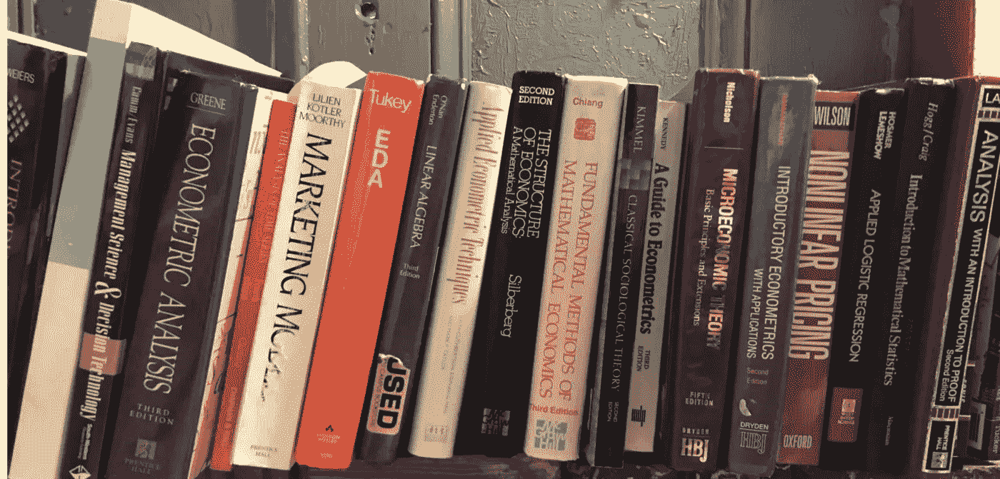

# 人工智能拥有拯救世界或毁灭世界的力量。

> 原文：<https://medium.com/geekculture/ai-has-the-power-to-save-the-world-or-destroy-it-efeb59f287e?source=collection_archive---------16----------------------->

## 作为数据科学家，我们必须确保我们首先创造的人工智能不会造成伤害。

人工智能每天都在影响着现代生活。申请贷款，联系你的公用事业公司，或者驾驶更新型号的汽车都意味着与 AI 进行交互。每一天，人工智能都在改变我们的生活方式和互动方式。