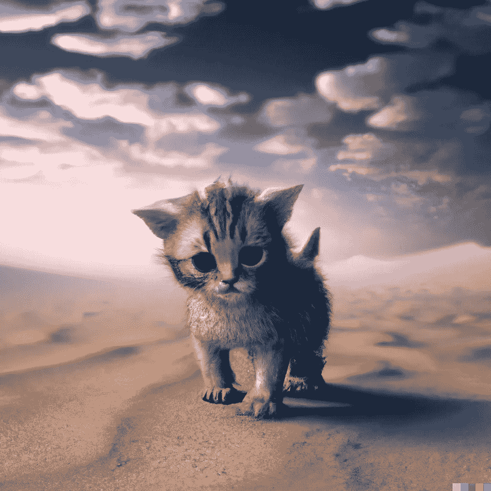

# 人工智能图像生成:创造性工作的终结？

> 原文：<https://medium.com/geekculture/ai-image-generation-the-end-of-creative-jobs-ca120ab2f64a?source=collection_archive---------8----------------------->

DALL-E 是自互联网以来对创意产业最大的颠覆

DALL-E is able to generate four high-quality images based on a specific text

## 什么是 DALL-E 2？

Prompt used: “A cute kitten looking confused in a wide dessert alone, digital art”

达尔 **E** 2 是一个新的人工智能系统，它可以从一个…