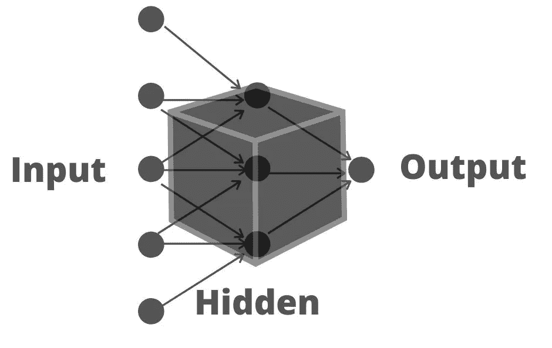
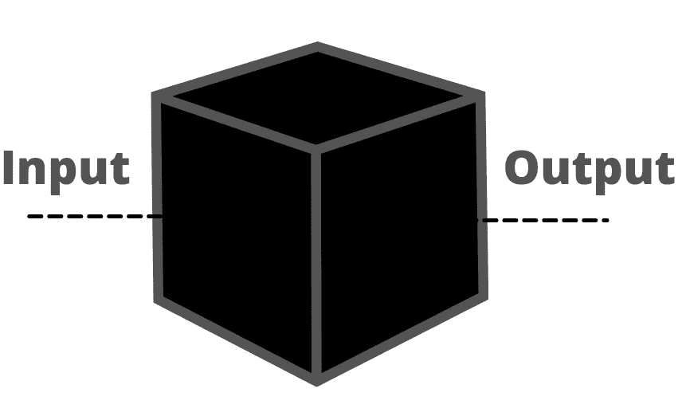
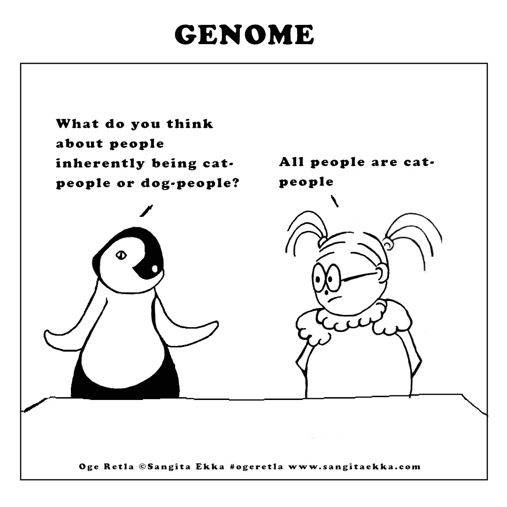
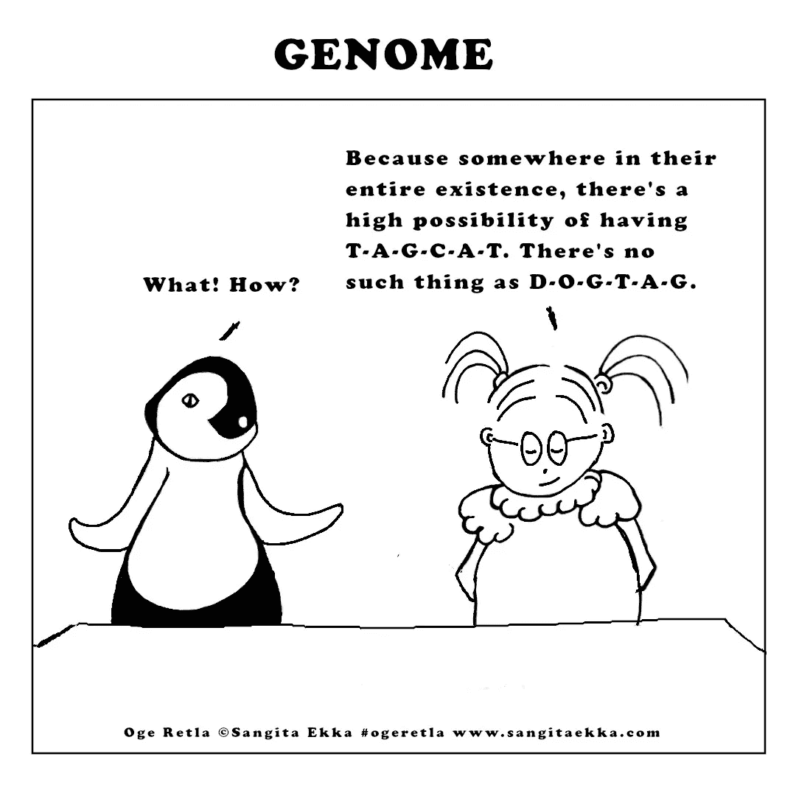

# 人工智能通俗易懂—第 1/2 部分

> 原文：<https://medium.com/geekculture/ai-in-laymans-terms-part-1-423c5c91901a?source=collection_archive---------40----------------------->

Created with Canva

在一个互联网、电子设备和信息一触即达的时代，某项技术的症结往往被认为是理所当然的。

关于这一点，在任何一天，如果你随机要求人们不用计算器来计算 9871 和 345 的相加，大多数人会花一些时间来回答一个近似值。在几秒钟内给出准确的答案是罕见的。计算器本身就是一台简单的计算机，它会立即给出答案。

人类在计算方面的这一缺陷是最初引入计算机的原因，目的是通过在相对较短的时间内完成复杂的计算来帮助我们。与涉及 3-4 位数的心算进行斗争的人类大脑，可以在对话中轻松地切换语言，识别和辨别面孔，一生中学习各种各样的东西，并经常可以根据过去的经验进行预测；“聪明”是有用的。

计算机虽然速度惊人，但直到最近才变得如此“智能”。这形成了人工智能的基础，将计算机从单纯的复杂计算机器提升到可以在更接近人类的水平上学习和行为的东西。

***

人工智能，这是今天的热门词汇，并不完全是新的。艾伦·图灵(Alan Turing)在 1950 年提出了一项对思维机器的测试，在这项测试中，一个人被屏蔽在真实的人类和机器之间，必须根据自然对话等人类参数来区分这两者。如果这个人不能区分人和机器，那么机器就会通过图灵测试，这是今天人工智能产品仍在寻找的基础。

今天如此流行的聊天机器人实际上可以追溯到 20 世纪 60 年代，当时第一次试图与计算机对话的想法在麻省理工学院实验室实现，并被命名为[伊莱扎。游戏人工智能也是如此，就像建造象棋引擎一样。这也是“人工智能”一词首次被创造出来的时代。](https://en.wikipedia.org/wiki/ELIZA)

思考机器的思考是在半个世纪前完成的，但我们今天能够实现它们，是因为当时没有先进的计算能力。电子元件的计算能力有自己的进化之路。

现在回到未来，让我们剥离 AI 带来的概念、用法、可能性和伦理难题。

# #1 人工智能与通常的“编码”有什么区别？

让我们假设下面的代码块代表一段简单的数学运算——加法。

不管用什么语言编写这个简单的操作，输出总是相同的——数字的总和。这里没有“智能”工作，没有学习，没有识别输入中的任何模式；代码每次都按照指示执行。

现在让我们扩展这个想法来适应一个可以有更多输入参数的更大的对象。为了熟悉起见，这是一个电子商务网站。虽然比简单的计算器复杂得多，但电子商务网站可以被认为是一个具有多个输入参数的黑盒——登录数据、访问电子商务网站的设备、操作系统、位置、浏览的项目、浏览项目的元数据，等等。类似地，输出以一种非常简化的方式可以被认为是完成的事务。

一个实现人工智能的电子商务网站根据购买或浏览向每个用户推荐商品。该算法已经根据购买或浏览的商品或希望列出的商品“学习”了特定用户的口味和爱好。同样的类比也适用于社交媒体平台——YouTube 推荐就是一个例子，简单的谷歌搜索查询也是如此。

人工智能平台有专门的运行算法，称为模型，负责预测。有许多人工智能模型，决定使用哪一个需要技术上的勤奋。

**提示:**营销人员和销售团队通常可能没有技术背景，建议他们花大量时间与技术团队在一起，并询问一些基本问题。理解人工智能产品需要时间，技术人员有诀窍为他们的受众简化事情。

# #2 人工智能和术语的类型

人工智能是一个总括术语，人工智能模型处理和学习的数据类型在很大程度上取决于行业和目的。在深入研究机器学习或数据科学这些如今非常流行的术语之前，有必要了解一些基础知识，最终有助于更好地理解这两个术语。

# 2.1 阿尼 vs AGI

ANI——人工狭义智能 vs AGI——人工广义智能。

ANI 就是我们今天看到的，试图将单词和句子从一种语言翻译成另一种语言，或者让一个系统处理语音输入以达到目的，或者识别一种语言的字符。简而言之，ANI 通常指的是我们试图教给机器的一项简单的人类任务。

另一方面，AGI 是一台能像人一样运作的机器。换句话说，AGI 可以被解释为多任务机器，它擅长人类擅长的多种事情，并且可以轻松完成。我们在电影中看到的终结者或决策机器人是 AGI 的很好的例子，但这种东西在今天并不存在。

# 2.2 监督学习与非监督学习

这种理解正是 AI 产品的症结所在。人工智能需要大量的数据。如前所述，人工智能试图让机器学习对人类来说容易的东西，因此当输入输入到机器时，人工智能工程师就知道正确的输出。当输出不理想时，调整黑盒以使输出接近预期结果。这是监督学习，因为需要人工干预来使输出更加准确。

另一方面，无监督学习让机器自己学习和寻找模式。在某种程度上，这个过程更复杂，不需要手把手，而且结果往往很有见地。

# 2.3 机器学习(ML) vs 数据科学(DS)

这就是我想讨论人工神经网络的地方，人工神经网络是从人类大脑中神经元的工作方式得到的模糊灵感。它是一个让机器学习的框架，由隐藏在输入和输出之间的多层节点组成。

在人工智能领域，像机器学习和数据科学这样的术语经常被使用，而且经常不太清楚，主要是由商业的非技术方面的人使用。

简单来说，机器学习和数据科学都在人工智能的保护伞下执行特定的任务。虽然机器学习涉及用数据训练神经网络，同时知道输入是什么和输出应该是什么，但另一方面，数据科学研究相同的数据，并产生更多可以用于改善业务或产品本身的见解。

# 2.4 结构化数据与非结构化数据

因为术语“数据”本身已经超越了文本，所以有必要了解数据的格式以及它如何将结构化数据与非结构化数据分离开来。

文本数据是数字媒体上存在的最简单的格式，当保存在电子表格或。xml 文件。因此，这些数据是结构化数据。

比纯文本数据复杂的基于图像、音频或视频的数据在 ML/DS 空间中被视为非结构化数据。

# #3 人工智能和应用

人工智能处理大量和各种各样的数据，如何处理生成的数据在很大程度上是一个商业案例，因此可能有许多人工智能应用。以下是几个流行的列表:

# 3.1 机器人技术

由于好莱坞电影中终结者可以进行时间旅行，追捕人，甚至说“再见”，机器人经常被视为人工智能，而事实上它们是复杂的黑匣子，做着非常专业的运动，经常在工厂设置中执行特定的指令。

话虽如此，人工智能确实作为实时障碍检测或寻路等附加功能进入了机器人领域。

# 3.2 机器翻译

机器翻译可能是人工智能领域广泛追逐的问题，因为人类语言的机器学习是一个复杂的问题。神经机器翻译(NMT)需要依赖来自各种来源的大量数据，以便机器学习和预测单词序列。时至今日，鉴于人类语言、语言差异和数据可用性的多样性，它仍然是最难解决的问题之一。

# 3.3 计算机视觉

NMT 处理文本数据，而计算机视觉处理数字图像或视频。计算机视觉有广泛的应用，但最广为人知的是面部识别或 ocr——印刷或手写文本的光学字符识别。

# 3.4 语音识别

顾名思义，语音识别对音频数据起作用。你的手机或 Alexa 等设备中基于语音的应用程序可以触发单词，执行语音识别，意图识别，然后执行特定的任务，这些都是具有音频数据的人工智能的例子。

# 3.5 工业 4.0

工业 4.0 通常被称为工业革命的下一阶段。顾名思义，这个行业处理的数据是来自制造单位的工厂传感器，并且因公司而异。基本的 AI/DS 概念保持不变，区别仅在于获取和处理的数据。

# 3.6 遗传学

人工智能还通过预测 3D 蛋白质结构来帮助研究人类基因组或药物的发现和开发。

厚脸皮地插入一幅我制作的关于诺贝尔化学奖获得者的漫画，该漫画被授予两位科学家——Emmanuelle Charpentier 和 Jennifer A. Doudna，以表彰他们使用 CRISPR 工具编辑基因组的工作。

Oge Rela Comics is on Instagram: [https://www.instagram.com/ogeretla_se/](https://www.instagram.com/ogeretla_se/)

这就结束了我想介绍的关于人工智能的第一部分。在下一部分，我将讲述偏见、人工智能的量子边缘、伦理难题，以及一些电影和系列建议，以更好地理解人工智能。

敬请关注。

*最初发表于*[*【https://www.linkedin.com】*](https://www.linkedin.com/pulse/ai-laymans-terms-part-1-sangita-ekka/)*。*

编辑:这里可以看第二部分:[https://medium . com/geek culture/ai-in-laymans-terms-part-2-2-6 ef 1 AC 8 b 0504](/geekculture/ai-in-laymans-terms-part-2-2-6ef1ac8b0504)

*如果你喜欢我的工作，想支持它，* [*请我喝杯啤酒*](https://www.buymeacoffee.com/SangitaEkka) *！你可以在这里查看我的其他作品:*[*https://linktr.ee/SangitaEkka*](https://linktr.ee/SangitaEkka)