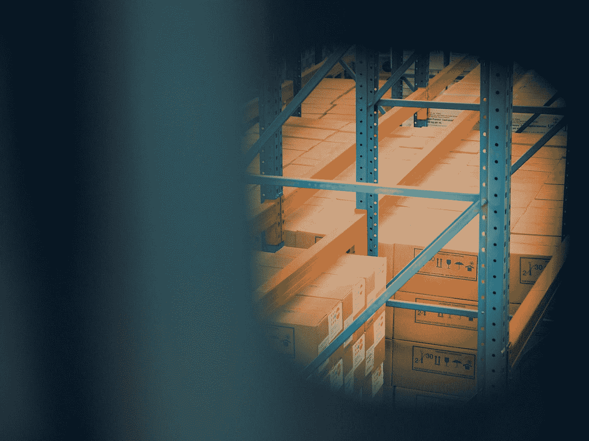
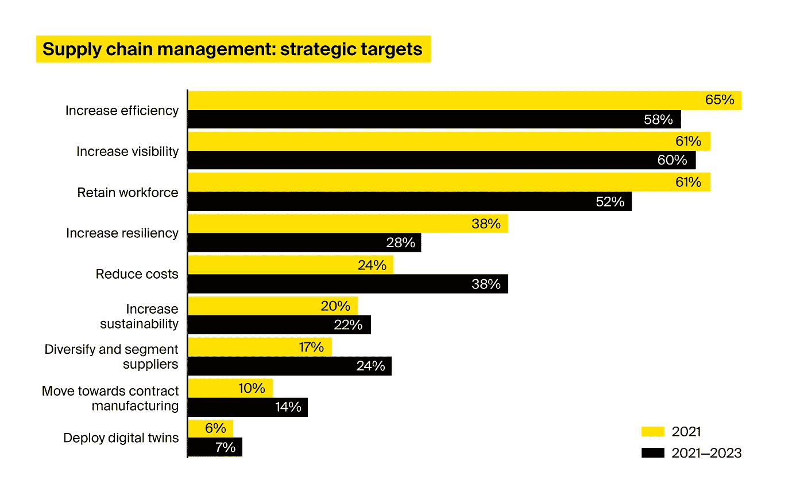
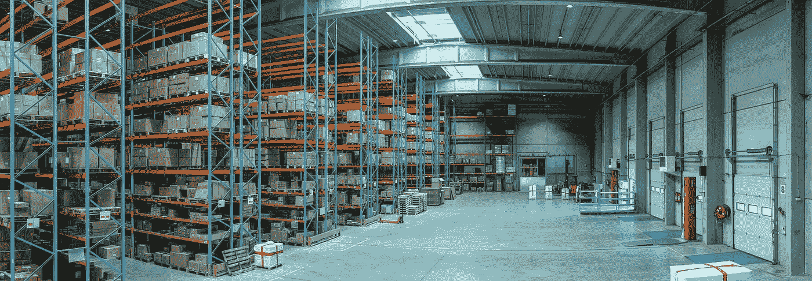

# 供应链中的人工智能:用例与实施路线图

> 原文：<https://medium.com/geekculture/ai-in-the-supply-chain-use-cases-implementation-roadmap-c74f60f6bf87?source=collection_archive---------17----------------------->

让我们都同意:疫情重塑了全球供应链。多次封锁加上临时贸易限制和劳动力短缺暴露了供应链中以前看不到的漏洞。

形势的急剧变化迫使供应链管理人员提升他们的战略管理水平。为此，他们中的一些人转向了创新技术，供应链人工智能在这场比赛中领先。

事实上，尽管在经济不确定时期，企业推迟数字化转型项目是一种标准做法，但新冠肺炎危机并没有阻止供应链决策者转向人工智能解决方案提供商。[一项研究表明](https://www.ey.com/en_us/supply-chain/how-covid-19-impacted-supply-chains-and-what-comes-next)92%的被调查高管继续他们的投资。推理呢？AI 在供应链中的积极价值。

下面，我们看看人工智能如何帮助供应链有效运行，调查人工智能在供应链中可以产生的结果，并分享以无风险的方式跳上数字供应链潮流的技巧。

# 供应链中的人工智能:它如何帮助实现战略管理目标

2021 年初，安永对 200 名供应链高管进行了调查，以揭示他们未来 12 至 36 个月的首要任务。以下是他们的发现:

*   供应链决策者的首要战略目标是提高供应链效率
*   他们希望实现的第二个目标是更好地了解他们的供应链
*   全球供应链议程上的其他目标是提高弹性和优化供应链管理成本

Source: [Ernst & Young: How COVID-19 impacted supply chains and what comes next](https://www.ey.com/en_us/supply-chain/how-covid-19-impacted-supply-chains-and-what-comes-next)

人工智能对于实现这些战略转型变得至关重要。事实上，95%表现最佳的组织[将人工智能视为其供应链成功的基石](https://www.ibm.com/thought-leadership/institute-business-value/report/cognitivesupplychain)。

这里更详细地看看人工智能在供应链中的用例，它们有助于实现上述目标。

# 提高运营效率的供应链管理中的人工智能用例

## 请求预报

理解需求的来源从未如此具有挑战性。随着客户期望的快速变化和变得更加多样化，企业现在依赖人工智能驱动的供应链工具来收集更多与需求相关的见解，并相应地调整他们的生产策略。

整合供应链内每个流程的可用数据(甚至是实时信息)，并通过人工智能算法运行这些数据，可以帮助企业建立统一的需求视图，并做出更周到的决策。用于分析的数据可以从内部来源(如订单和销售)或外部来源(如宏观经济因素、品牌情绪和新冠肺炎案例数量)收集。

作为这种规划的结果，AI 能够返回按客户和位置级别细分的潜在消耗量的详细报告。有了详细的需求数据，企业可以优化生产量，降低库存水平，在离客户更近的地方储存更多商品，并减少不必要的发货。

## 规划最佳送货路线

在供应链管理中利用人工智能还可以帮助设计更好的交付路线，优化车队利用率。考虑到供应商和制造地点、储存地点、机器的潜在磨损和燃料使用等标准，基于人工智能的供应链解决方案提出了一条最佳路线，并提供了沿供应链更快的商品流动。

## 最后一英里的送货和无人驾驶汽车

无人驾驶汽车和最后一英里送货机器人(也依赖人工智能)有机会通过减少对人类司机的依赖和优化送货路线来改变供应链。

尽管如此，据波士顿咨询公司称，到 2030 年，可能只有 10%的卡车会自动驾驶。反过来，送货无人机和机器人已经赢得了极大的欢迎。它们越来越多地被用于较短距离的运送或运送到地面运输不安全、不可靠或不可持续的地方。

结合送货车和无人机的混合解决方案最近也出现了。例如，亚马逊开发了一个系统，货车将物品送到目的地附近，然后派出一架人工智能控制的无人机进行最后的卸货。

# 人工智能在供应链管理中的用例提供了更好的可见性

## 存货管理

在供应链管理中采用人工智能可以帮助揭示各种渠道和卖家的库存表现，并识别异常情况，如延迟或低库存水平。有了详细的库存数据，企业可以调整库存策略，从而更高效地运营。

## 订单管理

人工智能驱动的供应链平台有助于订单管理，并有助于将参与该流程的多个供应链参与者聚集在一起。例如，ITRex 帮助开发的基于[人工智能的货物管理平台](https://itrexgroup.com/case-studies/ai-driven-iot-logistics-platform-predicts-and-manages-order/)可以根据多达 60 个参数预测订单运输成本，处理客户请求以消除重复订单并建议更好的承运人匹配选项，并跟踪从调度到交付的货运。

# 提高弹性的供应链管理中的人工智能用例

## 风险管理的预测分析

疫情已经将风险管理推到了每个公司议事日程的首位。麦肯锡报告称，在过去的一年中，59%的企业采用了新的供应链风险管理方法。

在供应链中应用人工智能推进风险管理的一个典型例子是优化供应商评估，将供应商标记为低、中或高风险。为此，人工智能解决方案可以衡量一些指标，如如果某个特定来源丢失，企业可能面临的收入影响，特定供应商从中断中恢复所需的时间，替代来源的可用性以及其他数据。

将人工智能用于供应链的另一种方式是预测供应链中断。通过历史运营数据，人工智能可以帮助实时识别和纠正运营效率低下的问题，深入了解供应链的绩效、机遇和风险。这样做可以让供应链管理人员在不牺牲效率的情况下以更低的成本运营。事实上，根据麦肯锡的数据，采用人工智能的组织报告运营费用减少了 44%。

## 数字双胞胎

进一步扩大供应链对人工智能的依赖，企业可以创建所谓的数字双胞胎——所有企业资产、仓库、路线、材料和产品流的虚拟模拟。数字双胞胎有助于设计更有弹性和更有效的供应链，并允许测试供应链性能和预见风险。

# 供应链中的人工智能:五个真实世界的例子

让我们看看已经采用人工智能进行供应链管理的公司的例子。

# 亚马孙

这家电子商务巨头使用基于人工智能的预测分析来为其供应链提供动力，并在采购和备货之前预测产品需求。该公司表示，预测分析已经成为其供应链战略的支柱。人工智能驱动的需求预测“启动供应链”，并帮助公司决定购买哪些产品以及每种产品的数量。

# 不间断电源

该公司使用人工智能来管理包裹的流动。该公司的员工可以鸟瞰递送网络中的包裹数量、途中货物量的预期峰值以及潜在的中断。基于人工智能的供应链解决方案依赖于历史和实时信息，包括天气和交通数据，以设计最快和最安全的方式交付包裹。

# 敦豪速递公司(DalseyˌHillblom and Lynn 是一家国际快递公司)

该公司采用了一种基于人工智能的工具来预测空运延误。该解决方案分析了 58 个数据点，并提前一周预测延迟或加速。该工具还指示路线可能发生变化的原因。

# 联邦快递

送货服务使用 Roxo——一种依靠人工智能自动完成最后一英里送货的机器人。该机器人被设计用于半径三到五英里的储存设施。它帮助该公司更好地满足了客户的需求，并提高了业绩基准。

# 回声全球物流

这家运输管理公司利用人工智能快速、安全、经济地运送货物。该公司采用人工智能的领域是多方面的——从优化运输采购到承运人管理，再到智能货运跟踪。

# 踏上人工智能驱动的供应链转型之旅

在供应链管理中，大约 60%的人工智能项目要么延迟交付，要么超出预算。我们已经制定了人工智能采用路线图，以帮助您克服人工智能实施挑战，并缓解您的供应链转型之旅。

# 第一步。制定一个商业案例，并思考人工智能采用的战略方面

引入人工智能驱动的转型的公司中，只有三分之一在推出该技术之前进行了诊断性审计。为了确保你不会错过人工智能的机会，我们建议通过确定和优先考虑所有供应链环节(从采购到制造到运输)的价值创造可能性来启动你的数字化项目。进行全面评估后，确定供应链数字化战略，并确保其反映调查结果。从数字化供应链中最具价值创造潜力的部分开始是有意义的，这样可以更快地提高投资回报率。一旦基础解决方案推出，你可以进一步发展，无论是纵向，扩大可用功能的列表，还是横向，将人工智能的能力扩展到其他供应链部分。

# 第二步。寻找一家最佳供应商来实现您的解决方案

由于供应链的复杂性和多面性，单个供应商很难满足您的所有期望。因此，不要害怕研究供应链技术市场所能提供的东西，并将最佳产品集成到一个解决方案中，以满足您的特定需求。另一条建议是采用独立于供应商的集成商，这样可以防止技术和解决方案的锁定。

# 第三步。监督解决方案的开发和集成

根据麦肯锡的调查，只有 15%参与供应链管理的企业感觉他们的目标与供应商的一致。为了防止这种情况并确保顺利推出，将开发流程映射到最初的供应链数字化战略，并牢记您打算挖掘的关键价值。优先考虑价值创造机会，并根据设定的优先级将开发过程分成增量，可能有助于导航端到端的人工智能实施。

# 第四步。确保解决方案的顺利采用，并扩展实施的功能

用人工智能驱动供应链是一项复杂的工作，不仅仅是推出技术。供应链的数字化还需要全面的变革管理和技能更新。因此，在你投身人工智能潮流之前，我们建议制定一个变革管理计划来帮助你处理技能差距和文化转变。从向员工解释人工智能的价值开始，教育他们如何接受新的工作方式。

# 最后一点

在过去的几年里，人工智能已经成为弹性供应链的一个重要元素。基于人工智能的供应链管理工具正在帮助组织加快材料和成品的流动，降低运营成本，并有效地应对变化。

> 如果你正在寻求利用人工智能的变革力量，并将你的供应链数字化，以获得更好的可见性、弹性和响应能力，[放弃 ITRex a line](https://itrexgroup.com/contact-us/) 。他们的专家将回答您的问题，并帮助您在几乎没有风险的情况下完成转型过程。

*原载于 2022 年 2 月 21 日*[*【https://itrexgroup.com】*](https://itrexgroup.com/blog/ai-in-supply-chain-use-cases-implementation-roadmap/)*。*