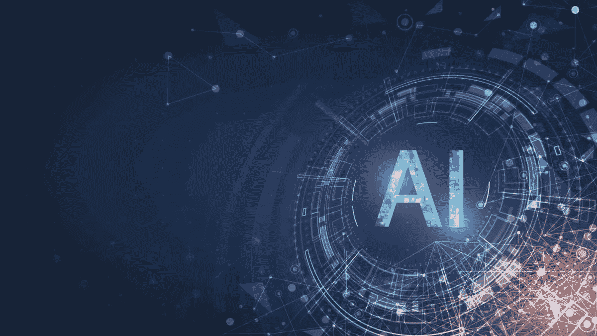

# 人工智能是 21 世纪最大的技术突破

> 原文：<https://medium.com/geekculture/ai-is-the-biggest-technological-breakthrough-of-the-21st-century-6a6f78a823f8?source=collection_archive---------7----------------------->

不管你知不知道，人工智能已经在我们的日常生活中冲击着你我。

它已经成为当今社会的一个主要组成部分，从在网上查找一些东西，到与虚拟助理交谈，到玩视频游戏和与聊天机器人交谈，仅举几例。