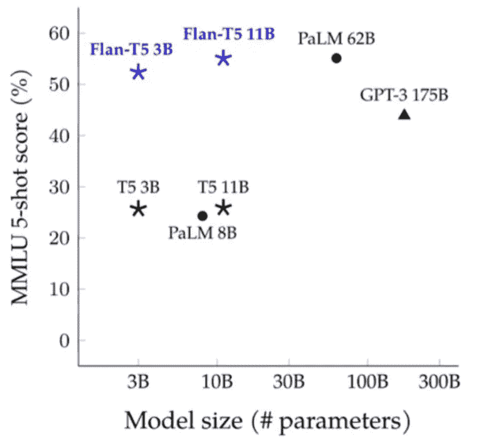
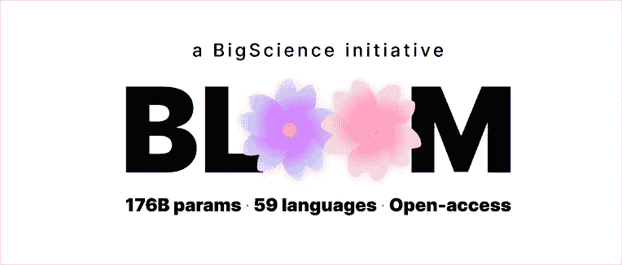
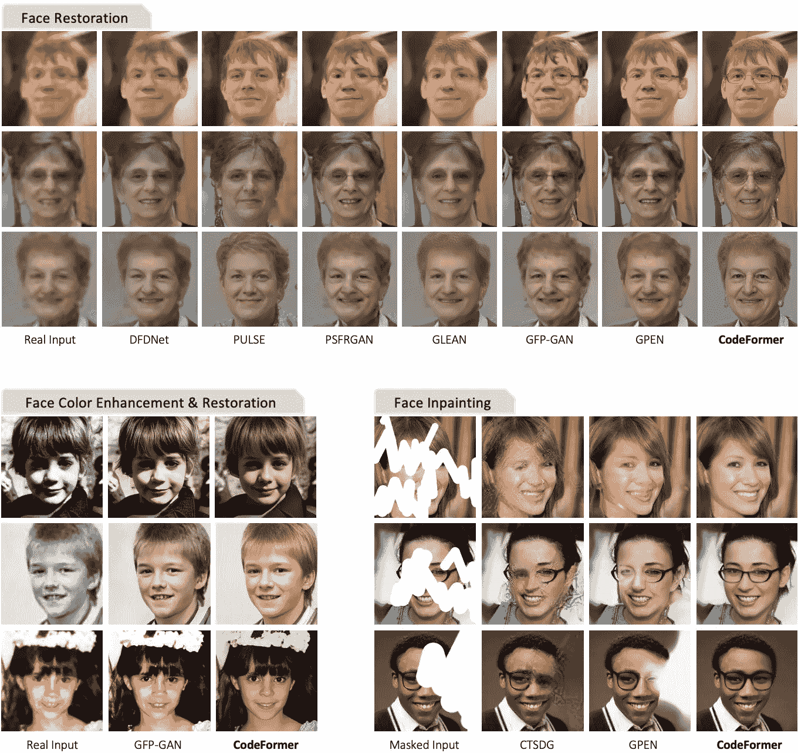

# 艾杀了钢琴明星

> 原文：<https://medium.com/geekculture/ai-killed-the-piano-star-447b10faa77c?source=collection_archive---------1----------------------->

## 加:如何以 1%的成本击败 GPT-3 的性能。

欢迎来到 [**《风口浪尖**](https://nicksaraev.com/#/portal/signup) :用简单的英语解释的前沿 AI 新闻(及其含义)。

在本周的杂志中:

*   新:人工智能生成的钢琴覆盖了**与人类创造的无法区分的**
*   瞬间将 60 年代、70 年代或 80 年代的任何视频向上采样 10 倍以上。
*   微调*如何影响语言模型性能中的*参数大小

让我们开始吧。

# 用人工智能在几秒钟内制作逼真的钢琴盖

Pop2Piano 是一个令人印象深刻的新模型，它可以生成流行歌曲的逼真钢琴翻唱，与人类演奏的录音没有什么区别。

该模型是在大约 300 小时的源文件和钢琴盖的数据集上训练的。通过将源音频与钢琴版本并排放置，该模型学会了将流行歌曲的旋律和节奏映射到 MIDI 钢琴乐谱上。

我应该注意到:模型的输出是一个 MIDI 轨道(各种各样的音符)。所以从技术上来说，你可以将这些输出映射到任何声音上，比如钢琴、吉他、T21 等等。

# 怎么才能利用呢？

钢琴封面在社交媒体上很受欢迎。像[这种](https://www.youtube.com/watch?v=n1yS7WdYLZ8)的歌曲一般都有上千万的浏览量。

到目前为止，你需要非常熟练——在 5 年以上的经验中——才能创作出活页乐谱，更不用说高质量、令人愉快的钢琴封面了。

但是有了 Pop2Piano，你只需要源音频文件，一个 [Colab](https://colab.research.google.com/drive/1rBAs2TkryDnnQOhcM-mtlrgtL2h3ekml?usp=sharing) ，几分钟。

另外:鉴于该实验室的知名度远不如大多数人工智能研究小组，这可能至少在几个月内不会成为头条新闻。

从现在到那时，您可以:

*   获得排名前 5000 的流行歌曲列表，
*   为每个生成钢琴盖，
*   将 MIDI 输出到像 [KeyScape](https://www.youtube.com/watch?v=jQ0WOuYy7Dc) 这样的高端钢琴 VST 中，给你的音轨带来真实的音色、混响等(你可能会赢得音乐奖！)
*   使用类似 [SeeMusic](https://www.visualmusicdesign.com/) 的东西创建程序视频
*   每天在 YouTube/抖音上发布几十个视频，在 Spotify 上发布封面，并利用该关键词的有机流量
*   **奖励**:使用类似 [MIDI 活页乐谱](http://midisheetmusic.com/)的服务制作活页乐谱，并在类似 [ArrangeMe](https://www.arrangeme.com/) 的网站上出售

几年后，在一个由合成内容主导的世界中排名的机会将会变得少之又少。但先行者可以在平台改变算法以适应这种情况之前占据优势。

# 微调可以粉碎 LLM 中的参数大小

越大越好，对吗？

不对。

当 GPT 3 号问世时，人们对它的体积惊叹不已。语言模型的 175B 参数在当时是闻所未闻的。

数学家和工程师开始根据参数计数推断性能。想法通常是:*“如果 175 b*这个*有用，那么 400B 的型号会有多大用处？”*

虽然大小对性能很重要，但它远没有你如何微调重要。结果不言自明。

对于那些不知道的人来说:[**MMLU**](https://arxiv.org/abs/2009.03300)**(海量多任务语言理解)是衡量模型性能的基准。它类似于高中考试，因为它充满了测试阅读理解和逻辑的问题。**

**与 GPT-3 175B 相比，**谷歌的 Flan-T5 11B** 体积不到 1/16，性能却提升了 10%。**

**两者的区别？GPT-3 175B 没有微调。**

**这两个模型都是在大规模通用文本数据语料库上训练的。但是 **Flan-T5 11B** 走得更远一点，他们将训练周期的最后几个百分点用于高度相关的、有目的格式化的例子，这些例子与 MMLU 的问题集相匹配。**

# **怎么才能利用呢？**

**很明显，微调可以提高性能。这不是这里的启示。**

**重要的一点是:**微调使性能变得非常容易获得**。**

**由于高昂的计算成本(通常为 100 美元 2M 以上)，大多数个人和公司都不可能从头到尾训练一名法律硕士。**

**但是微调一个已经存在的模型？简单。你的成本可能只是总模型费用的 1%。**

**鉴于你在这方面的投入获得了如此不成比例的结果，对于任何希望将人工智能的灵活性与自己系统的程序严谨性结合起来的大公司来说，这都是显而易见的。**

****

**例如，您的公司只需几名 ML 工程师和适度的计算预算就可以完成以下工作:**

*   **下载 [BLOOM](https://huggingface.co/bigscience/bloom) ，相当于 GPT-3 的开源 176B，**
*   **准备一个 1M 以上记录的数据集(其中每个记录都包括一个提示，提示您正在尝试解决的问题，并按照内部规范格式填写正确答案)，**
*   **为<1% of the total compute cost of BLOOM (which was estimated at ~$7M)**

**With a 176B parameter size model that’s sufficiently fine-tuned, you can achieve more or less anything you set your mind to. For instance, you could:**

*   **Flexibly classify tens of thousands of incoming queries per hour to the correct department without human intervention.**
*   **Intelligently enrich contact data when a new entry is made to your CRM.**
*   **Describe commit history in simple English to non-technical project managers.**

**You could instantly double the value of ingoing/outgoing communications, create relevant company documentation in seconds… the list goes on. Imagine the value to an enterprise institution like [微软](https://microsoft.com/)或者像 [HubSpot](https://www.hubspot.com/) 这样的 CRM 公司培养一个更有能力的模型。**

**作为一个在日常工作中使用人工智能的人，这是我最兴奋的事情。**

# **瞬间将 90 年代以前的视频向上采样 10 倍以上**

**当南洋理工大学的人工智能实验室 [S-Lab](https://shangchenzhou.com/projects/CodeFormer/) 将他们的 **CodeFormer** 模型应用于 20 世纪 60 年代的视频剪辑时，结果令人震惊。**

**没有办法量化精确的上采样比率，因为 CodeFormer 主要在人脸上工作。例如，领口周围的像素不太可能改变。**

**但如果我不得不估计，CodeFormer 可能会将整个视频的感知分辨率提高至少 4 倍，面部区域(最明显的是眼睛和嘴巴)接近 10 倍。**

# **怎么才能利用呢？**

**CodeFormer 于今年早些时候发布。但是它和它未来的兄弟姐妹将会对旧的数字媒体产生巨大的影响。**

****

**2000 年以前，简单的有损压缩技术被广泛用于补偿网络间的慢速视频传输。**

**例如，如果你想看一个舞蹈表演的现场剪辑，你肯定会收到一个比摄像机拍摄的质量低 3-4 倍的剪辑。这还没有考虑到相机技术的差异。**

**正因为如此，互联网上有成千上万的低质量视频等待挑选。要利用它们，您可以:**

*   **向上采样成千上万的剪辑——[广告](https://www.youtube.com/watch?v=6L8LjQRk9w4)、[新闻片段](https://www.youtube.com/watch?v=ARQXL8ZyzpY)、[喜剧节目](https://www.youtube.com/watch?v=KBv_MPe0zts)等，并在社交媒体(YouTube、抖音)上发布**
*   **创建一个类似 CodeFormer 的服务，专门针对旧的家庭视频。安格尔:“看到你母亲的微笑，这意味着被看到。”**

**它的搜索空间是存在的。“家庭视频”是一个相对陈旧的术语，它确保你的目标人群是 40 多岁和 50 多岁的人(他们觉得这种东西比年轻一代更令人印象深刻)。**

**这是一个总结！**

**喜欢这个吗？考虑和你认识的人分享。如果你读这篇文章是因为你认识的某个人给你发了这封信，请点击[在这里注册](https://nicksaraev.com/#/portal/signup)获取下一期时事通讯。**

**下周见。**

**尼克**