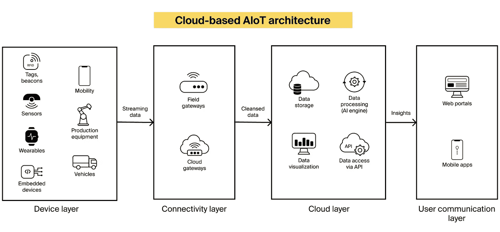
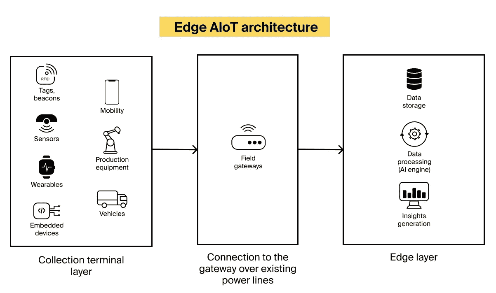

# AI 遇上 IoT:什么是物的人工智能

> 原文：<https://medium.com/geekculture/ai-meets-iot-what-is-the-artificial-intelligence-of-things-3e3db6be7d66?source=collection_archive---------21----------------------->


```
TL;DR: Insights, summarized:
```

*   60%到 73%的企业数据未用于分析。
*   一个普通的公司[会因为错过数据分析机会而损失 12%的收入](https://hellonimbly.com/the-real-cost-of-poor-data-quality/)。
*   结合[人工智能](https://itrexgroup.com/services/artificial-intelligence/)和[物联网解决方案](https://itrexgroup.com/services/iot-development-consulting/)，企业可以利用他们的数据，收集以前无法获得的见解。
*   AIoT 是人工智能和物联网的混合体。将两种技术结合起来，可以创建更高效的解决方案，从而提高投资回报率。
*   AIoT 在医疗保健、制造、运输和其他行业得到了更广泛的应用。

最初只限于电信行业的机器对机器通信，现在物联网无处不在。据 Statista 称，到 2025 年，连接到互联网的设备数量[将超过 380 亿。](https://techinformed.com/internet-of-things-key-stats-for-2022/)

不过，这个数字是有争议的，因为很难界定物联网设备到底是什么。因此，其他报告提出了更为保守的数字。想想看:到 2025 年，大约有 160 亿台设备在使用。

物联网设备数量的激增将不可避免地导致数据收集量的增加。IDC 报告称，到 2025 年，全球生成的物联网数据量将[达到 73zb](https://embeddedcomputing.com/technology/storage/dont-let-storage-be-an-afterthought-in-designing-for-iot-the-metaverse-and-automotive)。这就是问题所在。需要对收集的信息进行处理和分析，以创造价值。然而，大多数企业未能利用数据，60%到 73%的数据没有用于分析。

好消息是，通过利用人工智能和物联网的联合力量，企业可以将更多生成的数据转化为商业见解。

在本文中，我们已经涵盖了您需要了解的关于这种强大组合的一切，通常被称为人工智能事物，或 AIoT。因此，如果你正在考虑加入物联网发展的行列，请继续阅读。

# AIoT 到底是什么？

人工智能物联网(AIoT)系统由两部分组成:物联网(IoT)和人工智能(AI)。

在这种强大的组合中，物联网的作用是积累结构化和[非结构化数据](https://itrexgroup.com/blog/your-unstructured-data/)，并实现连接的事物和用户之间的通信。

当用人工智能(可以在大量数据中找到复杂的相互依赖关系，并基于此描述、预测和指定特定行动的算法)放大时，物联网系统可以获得类似人类的智能，并可以应用于解决更广泛的任务。这些可以跨越“理解”自然语言，预测用户的需求并相应地调整连接设备的行为，等等。

AIoT 市场目前正处于上升趋势。最近的研究估计，到 2026 年，T2 将达到 1022 亿美元。原因非常清楚:人工智能通过改善决策为物联网增加价值，而物联网为人工智能提供了一个平台，通过连接和无缝数据交换来驱动价值。

# 物的人工智能是如何工作的？

AIoT 系统可以通过两种方式实现:

*   如[云系统](https://itrexgroup.com/services/cloud-consulting/)
*   作为在连接设备上运行的边缘系统。

AIoT 系统的架构将根据实施策略而变化。

## 基于云的 AIoT

使用基于云的方法，AIoT 解决方案的基本架构如下所示:



*   ***设备层:*** *各种硬件设备(移动性、标签/信标、传感器、健康和健身设备、车辆、生产设备、嵌入式设备)*
*   ***连接层:*** *字段和云网关*
*   ***云端:*** *数据存储、数据处理(AI 引擎)、数据可视化、分析、通过 API 访问数据*
*   ***用户通信层*** *:门户网站和移动应用*

## 边缘 AIoT

借助 edge analytics，收集到的数据将在更靠近数据源的地方进行处理，无论是在互联设备上还是在现场网关上。



*   ***采集终端层:*** *通过现有电力线连接到网关的各种硬件设备(移动性、标签/信标、传感器、健康和健身设备、车辆、生产设备、嵌入式设备*
*   ***边缘层:*** *用于数据存储、数据处理(AI 引擎)、见解生成的设施*

但是，以边缘为中心的实现并不排除云的存在。例如，基于云的数据存储可以用于收集关于系统性能的元数据或训练或再训练边缘人工智能所需的上下文信息(想想:一种用于制作涉及云和边缘的人工智能工作流的范式，后者由云外更接近物理事物的设备组成。)

# AIoT 在不同领域的主要应用

在诸多因素的推动下，如新软件工具的可用性、简化的人工智能解决方案的开发、人工智能向[遗留系统](https://itrexgroup.com/services/legacy-application-modernization/)的注入，以及支持人工智能算法的硬件的进步，人工智能正在许多行业蔓延。这里列出了已经利用 AIoT 提供的机会的行业，重点介绍了最有前途的用例。

# 卫生保健

## 诊断帮助


AIoT 可以帮助医疗保健提供者做出更精确的诊断决策。智能医疗保健物联网解决方案从各种来源(从诊断设备到可穿戴设备到电子健康记录)获取患者数据，并交叉分析这些数据，以帮助医生正确诊断患者。

[基于人工智能的医疗解决方案](https://itrexgroup.com/services/ai-for-healthcare/)已经在几个诊断领域超越了人类医疗保健专业人员。全球的放射科医生都在依靠 [AI 的协助进行癌症筛查](https://itrexgroup.com/blog/ai-in-cancer-detection-treatment-applications-benefits-challenges/)。

在《自然医学》发表的一项研究中， [AI 在确定病人是否患有肺癌方面胜过了六名放射科医生](https://www.nature.com/articles/s41591-019-0447-x)。该算法对来自美国国立卫生研究院(National Institute of Health)临床试验数据记录的 42，000 例患者扫描进行了训练，检测到的癌症病例比人类多 5%，假阳性数量减少了 11%。值得一提的是，假阳性在肺癌诊断中提出了一个特殊的问题: [JAMA Internal Medicine 对 2100 名患者的研究](https://www.jwatch.org/fw112499/2017/01/31/lung-cancer-screening-real-world-has-high-false-positive)表明假阳性率为 97.5%。因此，人工智能有助于解决一个关键的诊断问题。

AIoT 系统在诊断[乳腺癌](https://academic.oup.com/jnci/article/111/9/916/5307077)、[皮肤病和皮肤癌](https://www.nature.com/articles/nature21056)时表现同样出色。但是智能互联系统的可能性远不止于此。

最近的研究表明，AI 可以[检测儿童的罕见遗传疾病](https://www.nature.com/articles/s41436-019-0566-2)、[婴儿的遗传疾病](https://www.science.org/doi/10.1126/scitranslmed.aat6177)、[升高胆固醇的遗传疾病](https://www.nature.com/articles/s41746-019-0101-5)、[神经退行性疾病](https://www.nature.com/articles/s41374-019-0202-4)、[预测导致患上老年痴呆症的认知下降](https://journals.plos.org/ploscompbiol/article?id=10.1371/journal.pcbi.1006376)。

## 改进治疗策略并跟踪康复过程

遵循与诊断患者相同的原则，AIoT 系统可以帮助开发更好的治疗策略，并根据患者的需求进行调整。

智能算法结合来自治疗协议、患者病史的数据以及来自互联设备和可穿戴设备的实时患者信息，可以建议剂量调整，排除患者出现过敏的可能性，并避免不适当或过度治疗。AIoT 促进治疗的一些重要领域包括:

*   更有效的新冠肺炎治疗

通过记录患者生命体征的 AIoT 驱动的可穿戴设备监测被诊断患有新冠肺炎的患者，医生可以向患者提供适当的建议，从而提供更有效的门诊护理。

*   治疗伴随血液凝固的疾病

连接的凝血设备有助于测量血凝块形成的速度，从而帮助患者确保测量值在他们的治疗范围内，并减少去办公室的次数，因为测量值可以远程实时传输给医疗保健提供商。

*   更好的哮喘和慢性阻塞性肺病管理

慢性呼吸系统疾病(COPDs)影响全球约 5 亿患者。为了减轻这些情况的严重性，患者必须坚持彻底的常规，使用吸入器是其中的一个重要部分。尽管如此，许多患者未能坚持推荐的治疗计划。与移动应用程序绑定的 AIoT 功能吸入器有助于避免这种情况，记录每次使用的时间、日期和位置。收集的数据可用于为下次使用设置自动提醒，预测哮喘发作，并识别触发因素。

*   优化的糖尿病管理

仅在美国，就有 3000 万人患有糖尿病。对他们来说，定期测量血糖一直是一个问题。AIoT 支持的无线植入式血糖仪通过[通知患者](https://itrexgroup.com/case-studies/diabetes-management-system-for-medical-device-company/#challenge)和医生患者血糖水平的变化来缓解这些担忧。

## 优化医院工作流程

AIoT 可以改变医院的运营方式，改善以下关键领域的日常工作流程:

*   减少等待时间

由 AIoT 支持的自动病床跟踪系统可以通过通知急诊病人何时有空床来帮助他们尽快接收急诊病人。早期采用者(如纽约州西奈山医疗中心)的经验证明，该技术可以帮助[减少 50%](https://www.beckershospitalreview.com/healthcare-information-technology/how-bed-tracking-technology-allowed-mt-sinai-medical-center-to-reduce-admission-wait-times.html) 急诊患者的等待时间。

*   识别危重患者

识别需要立即关注的患者对于提供优质护理至关重要。为了做出正确的决定，医生需要在巨大的压力下分析大量信息。AIoT 可以帮助医务人员确定工作的优先顺序。互联系统可以分析患者的生命体征，并提醒医生患者的病情正在恶化。

几个类似的系统在重症监护室进行了测试。例如，旧金山大学试行了一种人工智能解决方案，能够检测败血症的早期迹象，这是一种致命的血液感染。研究结果显示，接受人工智能治疗的患者发生感染的可能性[低 58%；死亡率降低了 12%。](https://bmjopenrespres.bmj.com/content/4/1/e000234)

*   跟踪医疗设备

借助支持 AIoT 的设备跟踪，医院可以降低丢失关键医疗设备的风险，并做出更明智的设备管理决策，从而每年每张病床节省 12，000 美元。关键医疗设备可以通过 RFID 或 GPS 系统在医院内外进行跟踪，而医疗和管理人员可以使用 web 和移动应用程序快速找到所需的设备。

# 制造业

## 实现预测性维护


通过配备 AIoT 传感器的机器测量各种参数，包括温度、压力、振动、转速等，制造商可以实时了解其资产的健康状况，并根据实际需要安排维护。

虽然基本分析通常足以检测到接近临界操作阈值的设备，但人工智能可以根据历史维护和维修数据提前预测异常。根据普华永道的一份报告，由于预测性维护，制造商可以将设备正常运行时间提高 9%，将成本降低 12%，将安全风险降低 14%，并将资产寿命延长 20%。

## 改善资产绩效管理

有了 AIoT 系统，制造商可以定期了解他们的资产表现如何，并深入了解性能变化的原因。大多数基于物联网的资产性能管理系统允许在设备偏离设定的 KPI 时获得自动警报。

反过来，人工智能引擎[帮助挖掘性能恶化的原因](https://itrexgroup.com/blog/ai-in-manufacturing-applications-implementation-tips/)，如果有的话，并识别在每个单独的设置中测量的 KPI 是否是合理的。使用性能管理软件，制造商可以优化设备利用率，提高设备的整体效率。

## 利用数字双胞胎促进生产计划

据 Gartner 称，数字双胞胎可以帮助制造商[在生产效率上获得至少 10%的提高](https://www.gartner.com/en/documents/3647717)。一个资产、系统或流程的数字副本，一个支持 AIoT 的工业数字双胞胎可以帮助制造商获得对车间运营的端到端可见性，并帮助及时发现甚至预测效率低下的情况。

使用 digital twins 的制造企业表示，他们[可以实现持久的改进](https://www.ge.com/digital/blog/industrial-digital-twins-real-products-driving-1b-loss-avoidance)，包括在两年内将可靠性从 93%提高到 99.49%，减少 40%的接收维护，并在预测停电后节省 36 万美元。

## 通过工业机器人实现车间作业自动化

工业机器人长期以来一直是车间的一部分。随着[制造物联网解决方案](https://itrexgroup.com/blog/iot-in-manufacturing/)变得更加容易获得，机器人变得更加智能和独立。工业机器人配备了传感器并依靠人工智能，现在能够在旅途中做出明智的生产决策，从而提高制造单位的效率。

# 汽车和运输

## 交通管理


AIoT 可以用来缓解交通拥堵，提高运输质量。例如，台北市利用 AIoT 监控 25 个路口的信号设备。在这个系统中，智能传感器和摄像机收集关于交通和人流以及道路占用率的实时数据，而人工智能算法分析这些数据并应用适当的控制逻辑。

这种方法有助于城市管理部门优化交通流量，确保安全平稳的驾驶体验。

## 自动驾驶车辆

自动驾驶汽车和高级驾驶辅助系统(ADAS)是[人工智能算法](https://itrexgroup.com/blog/ai-types-subsets-use-cases/)解释和处理实时物联网数据的显著例子。

自动驾驶汽车根据来自各种传感器的数据创建周围环境的地图。例如，雷达传感器监测附近车辆的位置；摄像机检测交通灯、路标、其他车辆和行人；激光雷达传感器测量距离，检测道路边缘，并识别车道标志。

然后，人工智能软件处理传感器数据，绘制最佳路径，并向汽车的执行器发送指令，这些执行器控制加速，制动和转向。硬编码规则、避障算法、预测建模和[物体识别](https://itrexgroup.com/services/computer-vision/)帮助软件遵循交通规则并穿越障碍。

# AIoT 实施的主要挑战，以及如何解决这些挑战

在全球实施的所有物联网项目中， [76%失败](https://newsroom.cisco.com/c/r/newsroom/en/us/a/y2017/m05/cisco-survey-reveals-close-to-three-fourths-of-iot-projects-are-failing.html)，其中 30%早在概念验证阶段就失败了。为了避免将投资导向注定失败的计划，测试 AIoT waters 的公司应该意识到可能阻碍其 AIoT 实施的常见挑战。企业最常遇到的障碍包括:

*   **开始 AIoT 之旅，心中没有明确的目标**。启动 AIoT 项目时，组织可能会被新奇的事物所吸引，无法评估他们想法的可行性。反过来，这可能导致开发后期不受控制的成本攀升，并最终导致利益相关者的不满。为了避免这种情况，我们建议从发现阶段开始您的 AIoT 项目，在这个阶段，可以根据设定的业务目标、客户期望和组织能力对想法进行审查和权衡。
*   **苦苦选择最优实施策略**。如前所述，AIoT 解决方案可以实现为云、边缘或混合系统。在起草实施策略时，请仔细权衡未来解决方案的带宽、延迟和速度要求，并根据设定的成本进行规划。经验法则是，对于跨大量设备的时间关键型系统，边缘部署是可行的，并且在最小延迟和高带宽不太重要的情况下，依赖于云。
*   **部署周期长，成本难以估计**。AIoT 项目需要长期的承诺。根据特定的用例，实施过程可能需要几个月到几年的时间。随着技术环境的快速变化，解决方案有可能在完全投入运营时过时，并失去对实施成本的控制。为了防止这种情况，企业需要足够敏捷，以便能够在过程中引入变化。
*   **连接高度异构和复杂系统的需求**。根据您未来解决方案的规模和您所处的行业，您可能需要将高度异构的遗留设备连接到 AIoT。这通常是一项难以完成的任务，它需要计划和理解可用的选项。例如，您可以选择将传感器连接到传统机器，通过网关连接它们，甚至完全替换它们。无论采用哪种方法，都要确保尽早起草可行的数字化方案。
*   没有足够的数据来训练人工智能算法。为了产生可靠的见解，人工智能算法需要对大量数据进行训练。如果没有足够数量的可用数据(或者可用但由于隐私原因无法使用)，您将不得不使用其他策略来弥补数据的不足。常见的方法包括迁移学习(想想:使用已经训练好的解决类似问题的神经网络)、数据扩充(修改现有样本以获得新的数据条目)或求助于合成数据。
*   **努力实现 AIoT 系统的足够性能**。AIoT 系统的性能取决于一系列因素，包括硬件能力、数据负载、系统架构、实施方法等等。为了避免操作中的性能问题，请提前计划好潜在的数据负载，并相应地调整实现策略。
*   **解决软件和固件漏洞**。许多 AIoT 项目失败是因为在规划阶段没有考虑数据、设备、服务器和通信网络的安全性。如果您要处理高度敏感的数据，可以考虑混合部署，在混合部署中，数据在更靠近数据源的地方被处理，因此数据在传输过程中或云中被破坏的风险被降至最低。

> *如果你有关于人工智能的问题没有得到解答，或者已经在考虑开始 AIoT 的实施之旅，* [*联系我们的专家*](https://itrexgroup.com/contact-us/) *。*

*原载于 2022 年 8 月 30 日 https://itrexgroup.com*[](https://itrexgroup.com/blog/artificial-intelligence-of-things-aiot/)**。**