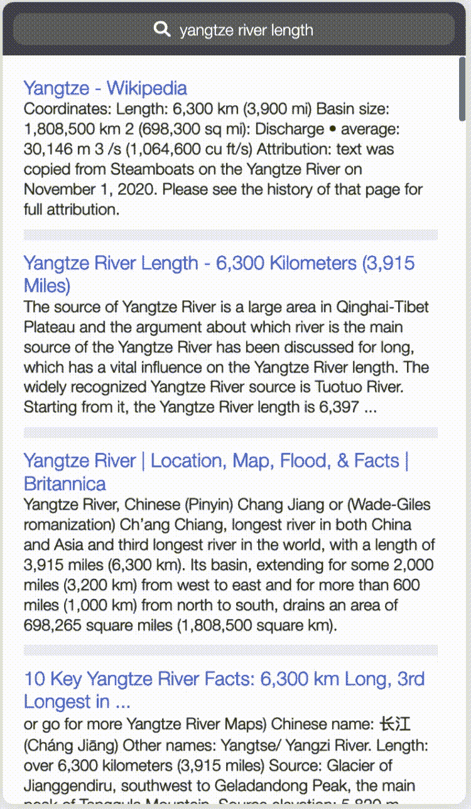
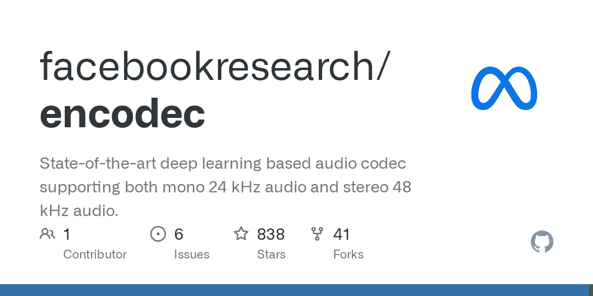
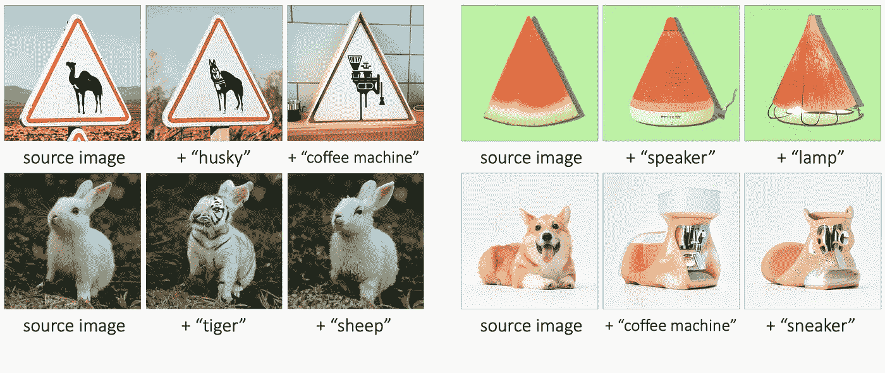

# 人工智能模型现在可以上网了

> 原文：<https://medium.com/geekculture/ai-models-can-now-surf-the-internet-cb1d55ecdc90?source=collection_archive---------0----------------------->

## 加:AWS 即将受到怎样的打击——*重创*。

Welcome to[风口浪尖](http://nicksaraev.com/) :前沿 AI 新闻(及其含义)用简单的英语讲解。

在本周的杂志中:

*   AI 模型现在可以帮你上网*。*
*   将音频压缩 10 倍而不损失质量？AWS 即将遭受重创。
*   新:**语义混合**和几乎无限的方式人工智能可以像我们添加数字一样轻松地添加概念。

让我们开始吧。

# 人工智能模型现在可以上网了

在过去的两年里，人工智能在语言和图像生成方面取得了令人难以置信的进步。

但是模型仍然在努力使信息**真实**和**相关**。例如，GPT-3 以在任何话题上产生令人印象深刻的段落而闻名——直到你意识到其中大部分完全是胡说八道。

这就是 WebGPT 的用武之地。

[WebGPT](https://openai.com/blog/webgpt/) 是一个对话接口，它搜索互联网，在内部处理之前为您找到真实世界的信息。它可以提供以下相关结果:

*   在 2022 年，一种产品的功能与另一种产品相比如何
*   沃尔玛商品或服务的平均价格
*   给定位置的当前天气

其实技术上是 OpenAI 在 2021 年做的[。但是 Twitter 做了自己的事情，上周](https://openai.com/blog/webgpt/)[使用高级提示重新创建了它。](https://twitter.com/dust4ai/status/1587104029712203778)

到目前为止，现实世界的相关性一直是人工智能聊天机器人的头号挑战。WebGPT 和类似的方法为人工智能工具开启了一个新的可能性世界，它们将颠覆经济。

# 它是如何工作的？

比你想象的简单。WebGPT 采用两个原则:

1.  语言模型在总结信息方面非常出色
2.  谷歌是世界上最大的信息库(通常会以某种方式检查其准确性)

首先，WebGPT 在互联网上搜索您所询问主题的结果。然后，它使用 GPT-3 将这些结果总结成一个有凝聚力的答案。

多个提示链可以使用基于共识的方法来提炼答案，以确保上下文相关性和准确性。

# 为什么这是一件大事？

这是一个巨大的发展，原因有三:

1.  它让聊天机器人和数字助理能够访问真实世界的数据:一种记忆
2.  它让模型的*智能*独立于模型中的*信息*而存在
3.  你现在可以自己实现它，而不需要等待大公司同意

此外，这意味着主要的人工智能公司不再需要担心在数十亿仿真陈述和数据点(如 GPT 3 或侏罗纪 1)上训练他们的语言模型。

只要你给他们一个问题，他们就能完全靠自己找到答案。鉴于模型在参数大小和数据可用性方面已经[达到了一个上限](https://www.lesswrong.com/posts/midXmMb2Xg37F2Kgn/new-scaling-laws-for-large-language-models)，这改变了一切。

# 我们如何利用这一点呢？

最妙的是:您也可以在内部使用这种方法。

迄今为止，对话模型仅限于他们在培训中读到的信息。例如，GPT-3 实际上只适用于 2021 年中期。

想写一些后来发生的事情，比如新冠肺炎？你的内容几乎肯定是胡言乱语。

但是有了这项新的发展，你可以制造灵活的代理来引用任何数据——包括你公司的数据。

例如，让我们说你正在运行一个电子邮件营销活动。现在，您可以创建一个代理:

1.  从您的 CRM 中获取有关订户的数据。
2.  读取关于用户的事实信息**；爱好、兴趣等。**
3.  生成包含该信息的模板化电子邮件。
4.  要么自动发送，结束循环，要么交给人工代理点击发送。

或者，让我们假设你运行一个公司聊天机器人来帮助最小化客户服务请求。有了这一新的发展，您可以制造一种代理:

1.  搜索您公司的文档以获取相关信息。
2.  用 GPT-3 总结一下。
3.  用自然语言向用户返回答案。

只要你有数据，你现在就可以制作一个聊天机器人，它能够理解数据，并对数据做出相关和准确的响应。

有*所以*更多的应用。我将在此列举其中的几个:

*   即时新闻评论和分析—新事件触发一个工作流，该工作流接收一个主题，在 web 上搜索历史实例和支持信息，然后在几秒钟内起草一篇相关文章以供立即发布。
*   学术论文写作。到目前为止，询问关于事实的复杂逻辑问题经常导致无意义的结果(例如，为什么 X 的作用机制导致 Y？).现在，您可以训练一个辅助模型来对“事实”问题进行分类，使用该模型作为 WebGPT 的触发器，然后在将它们集成到一篇论文中之前返回事实搜索结果。
*   同样，你可以起草很大一部分客服邮件。使用前面提到的二级模型对事实问题进行分类，然后使用 WebGPT 参考您的内部公司数据库来寻找答案。根据需要添加额外的步骤来清理输出。

# 将音频压缩 10 倍而不损失质量？

脸书最近发布了一种新的人工智能音频压缩技术 [Encodec](https://ai.facebook.com/blog/ai-powered-audio-compression-technique/) ，可以将音频文件*压缩 10 倍*(!)而不损失质量。

这个想法类似于我们上周讨论的图像和视频压缩:人工智能识别数据模式并删除冗余。

但是 Encodec 做得更好，实现了**几乎无损的超压缩**。也是实时的。也就是说，该算法可以在发送或接收音频信号时对其进行分析、压缩和解压缩。

# 我们如何利用这一点呢？

任何以语音为主要通信方式的公司(例如，电话、电话会议、VoIP 等)。)现在可以在带宽、存储和处理成本方面节省大量资金。

例如，网飞每年花费[2 . 28 亿美元用于 AWS 转移成本](https://www.contino.io/insights/whos-using-aws)。想象一下他们削减了 90%。现实中的数学要复杂一点，但公司无疑会大幅减少数据支出。

各公司将争相采用这项技术。这种方法的验证意味着更多的超压缩可能即将出现。举例来说，这项技术没有什么根本原因不能应用于视频或 3D 环境。

您可以:

*   在主要支出为数据的[公司中寻找投资机会](https://www.contino.io/insights/whos-using-aws)。 **AWS 的成本(大约)为每 GB 传输 0.12 美元**——随着这样的技术的出现，这种情况将发生巨大变化。必要声明:我不是财务顾问&这不是财务建议。
*   构建实现 [Encodec](https://github.com/facebookresearch/encodec) 或使用类似方法的服务。例如，接收音频文件并返回其压缩版本的简单端点。向中小型流媒体平台推销你的服务，以此来削减 90%的传输成本。

实时无损音频压缩的含义也将对文化和我们的经济产生深远的影响。

例如，假设你是一名在偏远地区的医生，需要咨询专家。大多数 VoIP 连接至少需要 64kbs。但有了 Encodec，你就可以进行几乎没有延迟的高质量通话——即使是 6kbps。

以前因为糟糕的网络服务而成为禁区的地方在未来几年可能会发展成为有吸引力的目的地。卫星在斐济可能只有 30 兆比特/秒…但是当你的电脑自动提升到 300 兆比特/秒时，这有什么关系吗？

# 语义混合

这个很有趣:[语义混合](https://magicmix.github.io/)是最近推出的一种方法，让你添加*概念*就像添加*数字一样容易。*

例如， ***西瓜*** 加上 ***扬声器*** ，产生一个模糊的西瓜切片形状的扬声器。 ***兔子*** 加上 ***老虎*** 看起来就像一个现实的(如果吓人的话)新兔子品种。

它主要用于对象，允许您混合和匹配两个或更多项目的特征。结果通常是非常可信的，并且总是拥有被第二幅图像的风格所修改的源图像的形式。

# 为什么这是一件大事？

语义混合不会改变世界。 [Img2Img](https://huggingface.co/spaces/fffiloni/stable-diffusion-img2img) 已经是一段时间的事情了。

但是，与早期结合图像特征的方法相比，由于增加了一致性，这种方法具有更大的商业潜力。

# 怎么才能利用呢？

因为每个输出都保持源图像的形式，所以您的结果是可预测的。这为电子商务应用打开了无数的大门:产品构思、原型和测试。

*   经营电商品牌？拿一个产品模型(像一件 t 恤)并自动迭代数千种常见的动物、物体和颜色。你也可以为文化或迷因产品做这件事。
*   利用生成的图像在制造前快速确定消费者偏好*。语义混合数百种不同的产品类型，运行极其相似的广告活动，并对结果进行分割测试。*

这是一个总结！

喜欢这个吗？考虑和你认识的人分享。如果你读这篇文章是因为你认识的某个人给你发了这封信，请点击[在这里注册](https://nicksaraev.com/#/portal/signup)获取下一期简讯。

下周见。

尼克