# PortraitPro 21 的 AI 将人像操作提升到新水平

> 原文：<https://medium.com/geekculture/ai-of-portraitpro-21-studio-takes-portrait-manipulation-to-new-level-658b991dfb7a?source=collection_archive---------46----------------------->

英国 Anthropics Technology Ltd .的代表要求我审查 PortraitPro 21 Studio 软件。它使用人工智能和模式识别，给你一种我发现的前所未有的自动操纵人脸图像的能力。

像许多其他人像软件包一样，它使用人工智能和模式识别来自动找到脸，头发，眼睛，鼻子，嘴，头和下巴。

在看到令人印象深刻的前后图像后，我欣然同意写一篇软件评论。我期望我付出更多的努力和艺术才能得到相同或相似的结果。我被它的简单程度和我需要做的事情之少震惊了。

二十多年来，我一直使用 Photoshop 和类似的图像编辑工具，包括专门的滤镜。所以，我认为新功能的门槛相对较高。PortraitPro 21 实现了许多我以前从未遇到过的创新。它还扩展了一些其他应用程序的功能，超出了我的想象。

几个 Instagram 滤镜可以对面部图像进行处理。该软件将这种控制带到了下一个层次。

顾名思义，PortraitPro 21 Studio 是专门为人物的图像(肖像)而设计的。你不需要成为 photoshop 专家或艺术家来使用它。PortraitPro Studio 和 Studio Max 允许您在 Photoshop 和 PortraitPro 之间轻松切换，以实现最大程度的自定义。我目前在这个系统上没有 Photoshop，所以我不测试这个功能。

我尝试的所有功能都是自动完成的，不需要我手动选择任何东西。我没有使用任何标准的图像编辑工具，比如选择器、克隆图章、魔杖。当然，如果你想要的话，这里有。

虽然大多数带有滤镜、克隆工具和魔棒工具的图像编辑软件都采用机器学习或人工智能进行模式识别，但 PortraitPro v. 21 Studio 将其推向了新的高度。

您可以自动操纵包括眼睛、嘴和鼻子以及头发在内的特征。此外，你有各种各样的面部造型，皮肤光滑，皮肤照明和着色的选择。此外，你还可以数字化化妆。

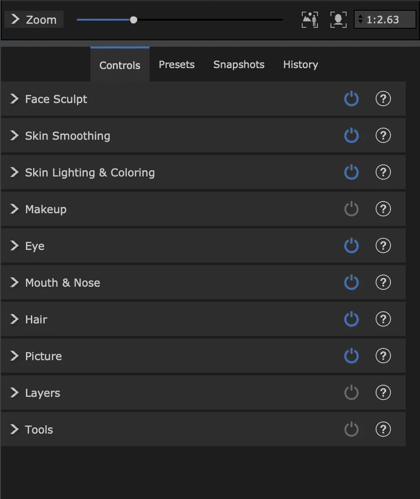

Control panel for facial feature manipulation

同样，其他一些肖像编辑软件包也有类似的功能，但它所实现的定制似乎是前所未有的。

另一个令人印象深刻的功能是，你可以数字操纵照明方向。这样做的结果是微妙但明显的。

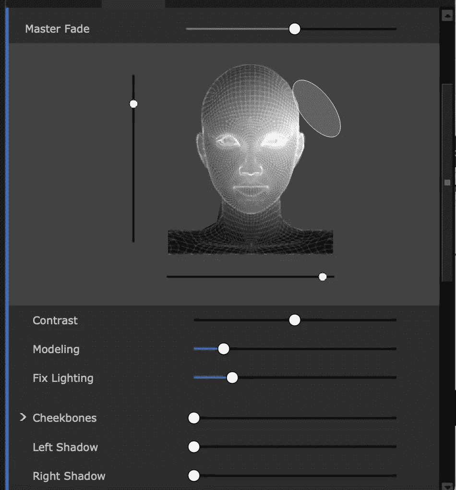

Lighting control panel

为了进行图像处理，我试着使用了一些从 depositphotos.com 获得许可的高分辨率照片。这些图像的分辨率比我能接触到的任何相机都要高。

我从 depositphotos.com 选择了一系列照片，以涵盖我认为人工智能可能难以准确建模的几个边缘情况。

# 使用 PortraitPro 21 改变头发颜色

我做的第一件事是改变我肖像的头发颜色。我想摆脱或减少我的白发。然后，为了好玩，我把头发染成了蓝色。

当你第一次打开一个肖像文件，它会试图找到一张脸。它通常在这方面非常成功。你的脸不需要完全显露，水平对齐，或者对称。它给出了一个最好的猜测，你的眼睛，鼻子，眉毛，嘴唇和下巴在哪里有粗黑线。

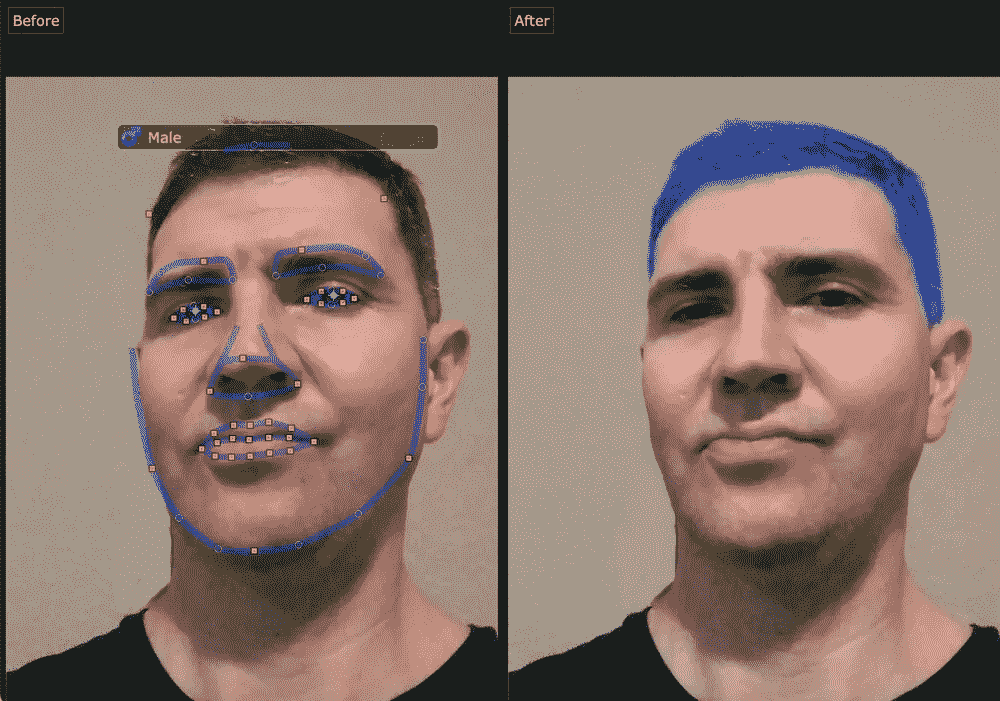

Me with hair color digitally changed

在一个完全出乎意料的功能中，它会猜测你的性别。(我不确定它为什么会这样)。该软件还可以让你看到前后并列，给你一个直接的比较。

许多小方块是显示特征区域的沿线点。如果它没有准确地选择合适的位置，您可以单击并拖动这些点来调整轮廓，以适应肖像的特征。对于大多数图像，我不需要改变任何东西。另一方面，对于其中的一些，我需要做一些小的改变。

它比我见过的任何其他面部操作工具都有更多的点可以移动来纠正面部特征选择。

# 眼睛变宽，嘴唇变丰满，脖子变长

它可以自动进行令人印象深刻的操作。看看下面我尝试的例子，我加长了脖子，使嘴唇更丰满，眼睛更大，每个都有一个滑块。

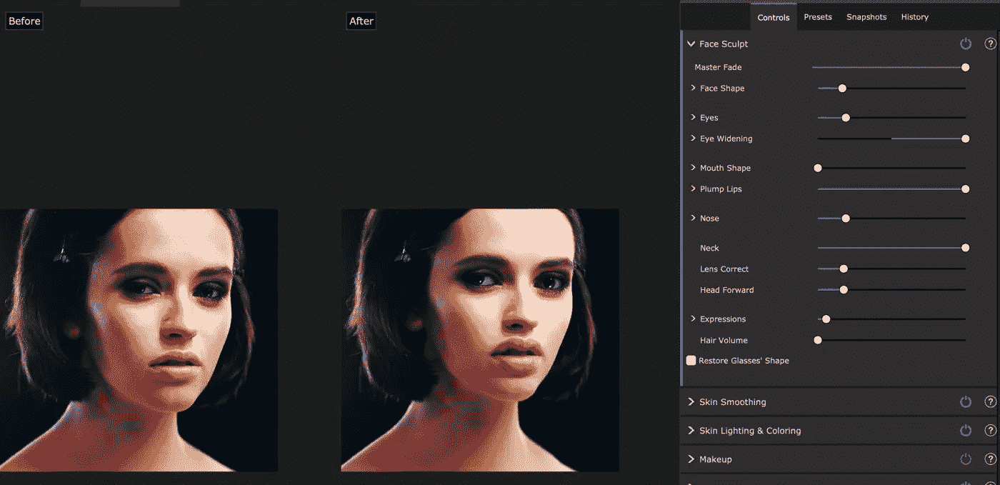

Girl with eyes widened, neck lengthened, and lips plumped. Original Depositphotos_474714516_l-2015.jpg, Copyright: [RostyslavOleksin](https://depositphotos.com/portfolio-19406380.html))

你可以用一个滑动条来改变眼睛的颜色，但是我发现这个功能不太直观。您无法在控制面板上获得关于您选择了哪种眼睛颜色的反馈。因此，当眼睛的颜色在滑块上从一个点变化到另一个点时，你不知道当你滑动滑块时它会变成哪种颜色。

挑选隐形眼镜颜色的功能更加直观，有许多选择。

我确实发现，侧面图像，尤其是面部处于奇怪角度的图像，似乎最不可能导致对特征位置的准确首次猜测。在某些情况下，它甚至可能检测不到人脸。然后，您可能需要手动指向功能区域。

我唯一一次遇到这个问题是在两张脸都是侧面的时候，而且是在闭着眼睛的奇怪角度。然后，我尽最大努力选择特征位置。(见文末附近的天空替换照片)。

# 胡子男人的头发染色

我尝试的一个边缘案例是一张长胡子男人的照片。我想知道当我改变他的头发颜色时，它是否会自动给他的胡子上色。答案是肯定的。我还想知道它会不会给他的眉毛重新上色。确实如此。我把头发颜色换成了午夜黑。我还注意到，脸自动变得苍白。(可能是因为深色或黑色头发的白人往往肤色较浅。)

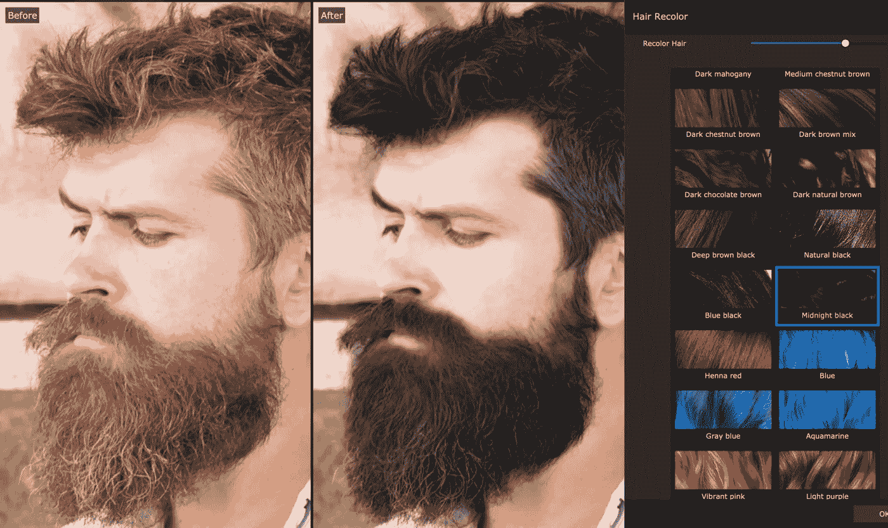

Bearded man with recolored hair. Original image: Depositphotos_239613518_l-2015.jpg, Copyright: [stetsik](https://depositphotos.com/portfolio-2760050.html)

# 头发重新着色女孩举行她的头发在一只手里

如果一个人的头发被分割成独特的形状会怎样？染发会完全奏效吗？

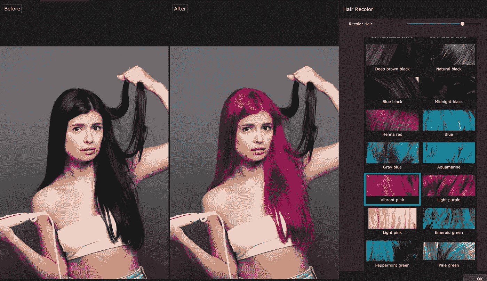

Woman holding some of her hair in one hand with attempt at hair recoloring. Original image: Depositphotos_407686314_l-2015.jpg, Copyright: [VitalikRadko](https://depositphotos.com/portfolio-13194036.html)

正如我所料，没有，至少第一次尝试没有。染发往往与传统发型搭配。您可以更改头发(头发遮罩)将着色的区域。您可以使用“延伸”和“缩减”笔刷来添加或移除头发遮罩的区域。您可以使用该手动颜色区域绘制来对之前没有覆盖的头发部分重新着色。使用这些刷子是一个需要一些艺术性的过程。

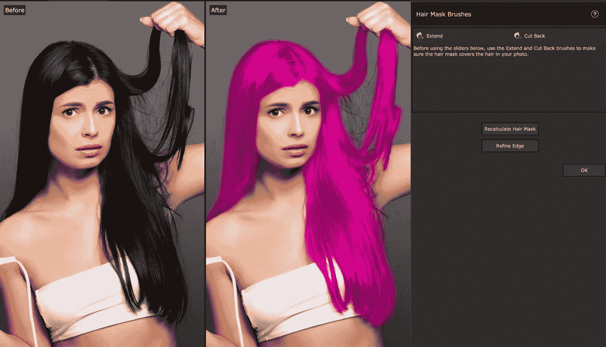

Girl with hair colored digitally. Original image: Depositphotos_407686314_l-2015.jpg, Copyright: [VitalikRadko](https://depositphotos.com/portfolio-13194036.html)

然而，有一种发型，我认为会有问题，一个有着卷曲鬃毛的黑人女性，在图像中重新着色没有问题。

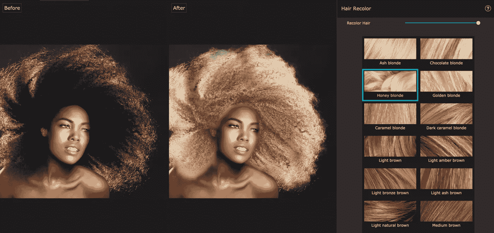

Black woman’s digital hair recoloring. Original: Depositphotos_41293891_l-2015.jpg, Copyright: [tobkatrina](https://depositphotos.com/portfolio-1006739.html)

# 用 PortraitPro 21 数字化消除痤疮

我还研究了皮肤光滑和消除瑕疵。在这个测试中，我使用了一张漂亮女孩的库存照片，她碰巧长了粉刺。我几乎完全消除了图像中的粉刺，只用了一个滑块来最大限度地消除瑕疵。一些轻微的变色仍然存在。

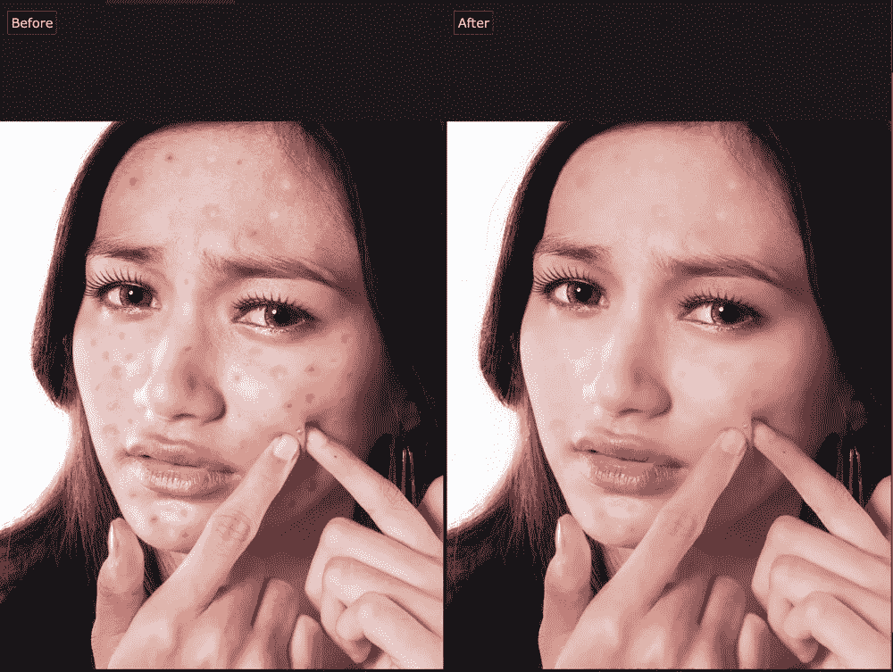

Girl with acne digitally eliminated. Original image: Depositphotos_68192669_l-2015.jpg, Copyright: [realinemedia](https://depositphotos.com/portfolio-1252160.html)

我希望我能做更多的艺术工作来减少粉刺的出现。

# 数字化添加化妆品

PortraitPro 21 Studio 还让你有了补妆的能力。如果你这辈子没接触过化妆，也不用担心。只要你知道什么类型的化妆品有什么作用，它就会为你化妆。

我在 android 和 iPhone 应用上见过这种情况。此外，欧莱雅和美宝莲等化妆品公司也有这方面的应用程序。在这些情况下，颜色仅限于公司销售的产品。

要添加的最突出的妆容是口红。睫毛膏、眼线笔和胭脂往往更微妙。它基于几个滑块和颜色选择器熟练地做到了这一点。这个特性已经存在一段时间了。无限的颜色选择增加了我在其他地方还没有看到的定制。

我试着在一个黑人女性的脸上化妆，效果完美无瑕。我读到过模特界常常缺少黑人代表，所以我有点惊讶。奇怪的是，它确实把这位黑人女性误归类为男性。但是，您可以通过一次单击来修复这种错误分类。

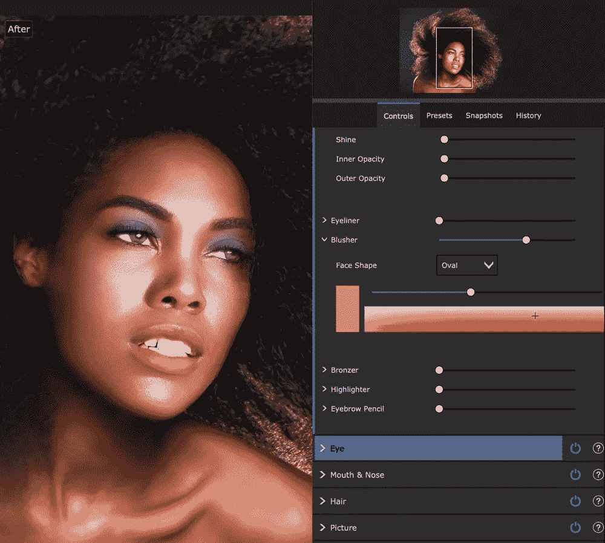

Black woman with digitally added makeup. Original image: Depositphotos_41293891_l-2015.jpg, Copyright: [tobkatrina](https://depositphotos.com/portfolio-1006739.html)

# 天空替换

我在这个版本中尝试了一个新功能，天空替换方法。在我调整了天空应该在的地方的遮罩后，这个天空替换效果相当好。不像头发的蒙版，我只是点了一下这个区域。然后，它能够使用颜色的相似性来很容易地找到合适的区域，而不需要借助画笔。

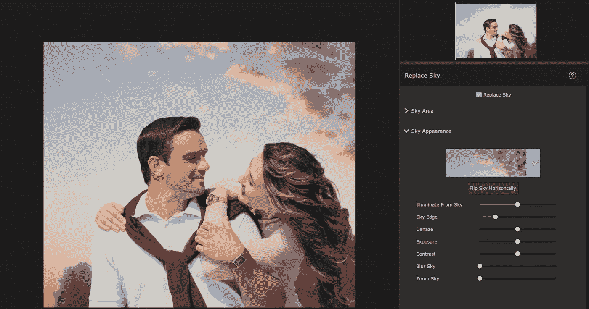

Sky digitally replaced in an image of a couple. Original image: Depositphotos_210829618_l-2015.jpg, top-right, Copyright: [IgorVetushko](https://depositphotos.com/portfolio-12982378.html)

PortraidPro 21 Studio 还可以一次对多个图像进行批处理。我没机会用这个。我可以想象对一部电影的帧进行批处理。

该软件有两个问题，我绝对会在下一次迭代中解决。首先，有时当你试图保存，它保存成功，但退出程序。另一个是给黑人女性贴上男人的标签。

这个标签错误的问题可能是由于训练集中黑人女性太少造成的。这个问题绝不是这个软件独有的。许多人工智能算法倾向于使用公开可用的数据集。这些数据集可能不包括性别、肤色、种族以及其他面部和头发特征的充分代表。我之前在我的博客 datascienceexamples.com 中写过这个。

# 总评

总的来说，我对这个软件及其创新印象深刻。由于其强大的功能，我会给它打八分。

它在选择面部特征和头发或操纵它们方面并不完美。然而，它是我迄今为止使用过的最好的自动面部图像处理工具。