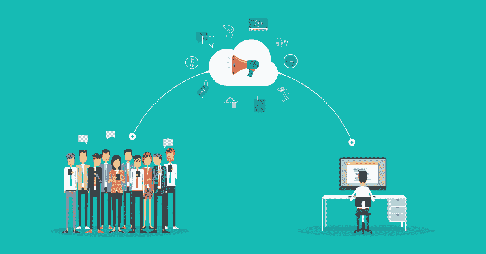

# 人工智能驱动的影响者营销示例

> 原文：<https://medium.com/geekculture/ai-powered-influencer-marketing-by-example-95ef5b25470d?source=collection_archive---------5----------------------->

## 企业家和品牌实用指南。

Authorized Image by [SalesForce.com](https://www.salesforce.com/ca/blog/2017/03/2017-state-of-influencer-marketing.html)

本文旨在说明机器学习对于品牌和企业家的潜力，以了解如何启动影响者营销活动，管理与影响者的关系，并有效地接触他们的受众。