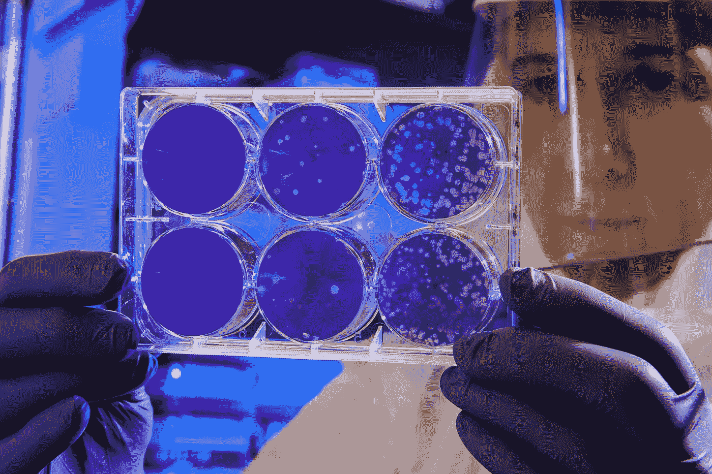

# AI 奋斗 50 年预测 2 亿个蛋白质结构！(AlphaFold)

> 原文：<https://medium.com/geekculture/ai-predicts-200m-protein-structures-after-50-year-struggle-alphafold-cedde7e50389?source=collection_archive---------14----------------------->

Photo by [CDC](https://unsplash.com/@cdc?utm_source=medium&utm_medium=referral) on [Unsplash](https://unsplash.com?utm_source=medium&utm_medium=referral)

***注*** *:如果你想要这篇文章的视觉版本，那么点击下面的视频链接。*

经过 50 年在生物科学领域的艰苦工作，人工智能已经为更快的药物发现、塑料回收和更好的农业实践开辟了道路，仅举几例。这听起来像是科学的圣杯，有些人确实是这么称呼它的。过去需要几年时间和昂贵预算的工作，现在只需几秒钟！难以置信。我们在本文中涉及的人工智能程序是 DeepMind 极具影响力的 AlphaFold。在我们进入它是什么之前，让我们首先为问题打下基础。你从饮食计划中了解蛋白质，但它到底是什么？蛋白质是生命的基石。发生在生物体内的每一个过程，包括你自己的身体，都与蛋白质有关。这些过程包括食物消化、血液携氧以及防御病毒和细菌。它存在于你的骨骼、肌肉、皮肤和身体的每一个部位。简而言之，蛋白质非常非常重要。人体内大约有 20，000 种蛋白质编码基因类型。每种蛋白质都是由一系列称为氨基酸的更小部分组成的，它们按照一定的顺序连接在一起。存在 20 种不同的氨基酸。蛋白质中氨基酸的数量从几十个到几千个不等。然而，蛋白质不会一直保持平坦。它们首先折叠成复杂的三维形状，然后才能在体内发挥作用。例如，蛋白质必须折叠成特定的三维形状，以帮助靶向病毒或在血液中携带氧气。因此，理解蛋白质是如何折叠的，对于理解生物体的功能，更广泛地说，生命本身的功能是至关重要的。1972 年，诺贝尔化学奖获得者克里斯蒂安·安芬森做出了一项历史性的预测，使科学界走上了探索之路。他说，仅仅根据组成蛋白质的一维氨基酸序列就可以确定蛋白质的三维形状。这就是所谓的“蛋白质折叠问题”折叠最困难的地方在于，几乎有无数种可能性可供选择。根据莱文塔尔悖论，大约有 10 个⁰⁰独特的结构。这比可观测的宇宙中的原子还要多。这是一个难以想象的数字。从另一个角度来看，如果从宇宙开始到现在，你必须每秒经历十亿次组合，你仍然不会接近。太令人兴奋了。

然而，不知何故，在所有这些可以想象的构型中，每个蛋白质都自发地折叠成一种特定的形状，并正确地执行其生物学任务。因此，理解蛋白质折叠的物理学对许多不同的科学领域至关重要。

半个世纪以来，人们煞费苦心地分析用于折叠的氨基酸。只有大约 17%的人类蛋白质得到了分析，并且总共产生了数百万个蛋白质折叠中的大约 180，000 个。这是 DeepMind 的戴密斯·哈萨比斯解释蛋白质折叠问题的一个短片。

我们的蛋白质折叠速成班到此结束。我们现在将继续讨论这个问题的令人印象深刻的解决方案，AlphaFold。AlphaFold 是一个人工智能程序，可以非常准确地预测氨基酸序列的 3D 蛋白质模型。该程序以数据库的形式免费发布，用户可以简单地搜索他们正在寻找的蛋白质，并立即收到它的 3D 模型。AlphaFold 的第一个版本模拟了 356，000 个蛋白质，包括几乎整个人类蛋白质组。整个人类花了 50 年的时间，AlphaFold 用了很短的时间就把结果翻倍了。**********

不久之后，这个蛋白质数量增加到了 100 万个蛋白质。这个惊人的数字将之前的方法打得落花流水。但是等等，还有更多。抓紧点，因为你接下来听到的会让你大吃一惊。AlphaFold 将数据库扩展到超过 2 亿个蛋白质结构。杰出的成就。从仅仅 180，000 种蛋白质种类到压倒性的 2 亿种蛋白质种类是不可思议的。简直难以置信。那么这一切意味着什么呢？首先，这将彻底改变几个行业，因为在实验室测试中找到正确的蛋白质类型不需要几个月或几年，并且可以大大加快实验速度。超过 190 个国家的 50 万名研究人员已经使用了 AlphaFold 的数据库。一些人将它用于拯救生命的疾病治疗，包括增强新冠肺炎抗体。其他实验室正在使用该模型开发新型蛋白质，这些蛋白质可以分解塑料，以解决重要的环境问题。你认为哪些行业将从这个人工智能系统中受益匪浅？当然，请在下面的评论中告诉我。一些人宣称蛋白质折叠问题已经解决。然而，其他科学家表示，AlphaFold 要完全解决这个问题还有很长的路要走。该模型约 36%的数据产生了非常高精度的结果，另外 22%的数据具有高精度。某些研究人员表示，人工智能程序必须真正提高其整体准确性，因为蛋白质结构非常敏感。除此之外，AlphaFold 可能会发现预测突变的影响具有挑战性，因为它们不是正常的蛋白质形状。此外，该模型没有被训练来预测蛋白质结构的变化，因为它们与体内的其他蛋白质或分子相互作用。面对所有这些挑战，人工智能项目有更多的事情要做，但不可否认的是，它对各行业的影响是不可否认的。由于这一成就，DeepMind 的戴密斯·哈萨比斯和约翰·跳线被授予今年生命科学的突破奖之一。祝贺德米斯、约翰和 DeepMind 的全体员工所做的非凡工作。我期待未来 AphaFold 的更多更新。

*感谢阅读！*

**资源:**

【T4**https://www . deep mind . com/research/highlighted-research/alpha fold**

[**https://www . deep mind . com/blog/alpha fold-reveals-the-structure-of-the-the-protein-universe**](https://www.deepmind.com/blog/alphafold-reveals-the-structure-of-the-protein-universe)