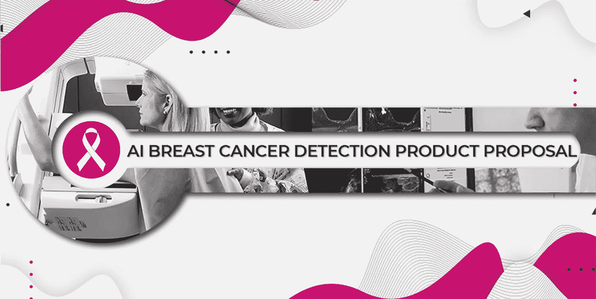
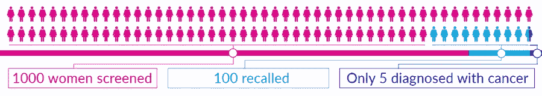
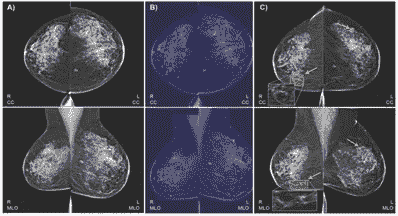
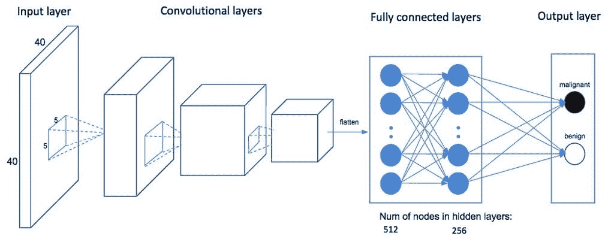
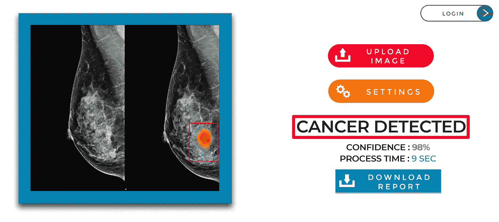

# 人工智能产品商业提案:乳腺癌的早期检测

> 原文：<https://medium.com/geekculture/ai-product-business-proposal-34ee3b5a2fe1?source=collection_archive---------20----------------------->

Cover Photo | Image by Author | Elements by [Unsplash](https://unsplash.com/@nci), [Parentology](https://parentology.com/wp-content/uploads/2019/07/quantx-in-action.jpg) and [Freepik](https://www.freepik.com/pikisuperstar).

乳腺癌早期检测的商业提案样本，包括定义商业目标、成功指标、数据收集、模型选择和最终部署模型。

# 商业目标

Figure 1\. Breast Cancer Screening | [IBM Research Blog](https://www.ibm.com/blogs/research/2020/03/benefits-ai-for-breast-cancer-detection/)

## 商业问题

在巴基斯坦，由于社会因素和放射科医生的可用性，检测乳腺癌变得越来越难，即使这样，这个过程也需要专注和时间，如果你在疫情，这是一种奢侈。放射科医师拍摄乳房 x 光片，然后用肉眼检测肿瘤或癌症，这有时可能很困难，如果你处于压力下，错误率会很高。

在 1000 名女性中，大约有 100 名女性被召回进行额外的诊断成像，在这 100 名女性中，有四五名被诊断患有乳腺癌[(nih.gov)](https://pubmed.ncbi.nlm.nih.gov/27918707/)(见图 1)。这些假阳性检查会导致可预防的伤害，包括患者焦虑、良性活检和不必要的干预或治疗。此外，高假阳性率大大增加了每年 78 亿美元的乳房 x 线摄影筛查费用【oup.com 。这些问题可以通过新兴的基于人工智能(AI)的计算机视觉技术来解决，这将降低假阳性预测率，并提高放射科的效率。

商业解决方案是通过使检测部分平滑来提高放射科医生的效率，以便他们可以专注于提供准确和更快的结果。

## 产品的商业案例

该产品将提高患者的满意度，因为他们不必等待 2 天才能获得报告，即使这样，报告也足够准确，他们不必再去做一次乳房 x 光检查。这将增加客户的信任，并通过客户满意度直接和间接增加医疗实验室和医院的收入。机器学习将减少处理图像和预测它是良性还是恶性的时间。肉眼是很难察觉的。这种产品将帮助医生确定病人是需要立即手术还是需要化疗。

## AI/ML 模型

这可以通过使用深度学习计算机视觉来完成，其中我们将在患癌和未患癌的乳房的 x 光图像上训练我们的模型。机器学习模型的引入将提高每个医院放射科的性能，这将直接改善连续工作的放射科医生的生活。

# 成功指标

Photo by [Peter Boccia](https://unsplash.com/@peterboccia?utm_source=medium&utm_medium=referral) on [Unsplash](https://unsplash.com?utm_source=medium&utm_medium=referral)

成功指标将通过监控放射科的收入增长和客户满意度来衡量。客户包括放射科医生、患者和肿瘤学家。成功度量也可以通过放射科医师或肿瘤学家给出的评级来衡量。我们希望提高癌症检测的准确性，减少观察乳房 x 光片的时间，这将间接帮助肿瘤学家更快地做出决策，即使在疫情疫情爆发时也是如此。

# 数据

Figure 2\. Breast Cancer Datasets | [bekey.io](https://bekey.io/blog/when-ai-works-healthcare-cares-and-thinks)

## 数据的大小和潜在偏差

最初，我们将获得 500 张乳房 x 光照片，并在内部或雇佣第三方进行标记。我们将使用[阿彭](https://client.appen.com/)来监控和改善图像标签。首先，我们将只讨论两个类别。无论有没有癌症，我们都会让它们保持平衡，以避免有偏见的预测。

## 如何获取数据？

我们将从医院和公开可用的数据集收集一些图像，其余的数据我们将购买或与不同的医院签署谅解备忘录，以便我们可以轻松访问来自真实世界的新数据集，作为回报，我们将以折扣价提供服务。

## 数据标志

最初，我们将保持简单，只有两个类别，随着时间的推移，我们将增加到六个类别。我们还计划增加良性、恶性和未知三个子类别。部署和维护两个类别的数据集将变得容易，并且在二进制任务上模型性能也将提高。简单的解决方案是要求放射科医生或肿瘤学家再次检查照片，以确定癌症的类型，然后确定它是良性还是恶性的。

# 模型

Figure 3\. CNN architecture was inspired by the first few layers of AlexNet | [Insightdatascience](https://blog.insightdatascience.com/automating-breast-cancer-detection-with-deep-learning-d8b49da17950)

## 模型将如何构建？

由于隐私问题和数据的敏感性，我们希望保持模型的私密性，并在内部对其进行培训，但由于缺乏资源，我们将被迫在初始阶段使用云服务。我们将在云上训练我们的模型，并在云上创建推理。这将帮助我们推出一个最小的可行产品，但在第二阶段，我们希望将模型和数据集从云迁移到本地。我们将在各种更高层的模型上训练数据集，如 CNN 和 RNN，然后集成它们以获得最佳结果。这个过程是迭代的，随着时间的推移，我们将不断更新我们的模型。

## ML 度量

在癌症检测中，召回率和精确度是最重要的指标，我们希望通过监控 f1 分数来提高整体有效性。准确性将用于营销目的，但对于车型性能，我们将坚持召回和 f1 评分。点击[此处](https://en.wikipedia.org/wiki/Precision_and_recall)了解更多信息。

# 最小可行产品(MVP)

Figure 5\. MVP user interface | By Author | Elements by [Freepik](https://www.freepik.com/freepik) and [Lunit’s AI](https://www.healthcareitnews.com/news/apac/lunit-s-ai-solution-breast-cancer-detection-gets-ce-certification).

## 用户界面

初始界面构建在云上，有一个简单的界面。首先，它会要求您添加一张乳房 x 光照片的图像，然后它会处理该图像，几秒钟后，它会给出该图像是否包含癌症的结果。它还会给出置信度得分和处理时间。

## 用户类型

该界面将是最好的用户友好的，它几乎类似于他们在医疗行业中习惯的用户界面。我们一开始会保持简单，这样他们就不需要参加培训或查阅用户手册。

## 构建和发布产品

我们将从小处着手，在两个类别上训练模型，并通过预处理和模型选择来提高我们的 f1 分数。起初，这将在谷歌云上完成，但随着时间的推移，整个过程将转移到本地基地。在每一个结果的末尾，用户界面会要求用户对我们的结果以及我们得到结果的速度进行评分。这将帮助我们确定成功标准。总体而言，整个产品将在云服务上推出，用户可以连接数据库或单独上传图像。

# MVP 部署后

Figure 4\. Sample MVP User interface | [parentology.com](https://parentology.com/wp-content/uploads/2019/07/quantx-in-action.jpg)

## 长期改进产品

*   我们将监控模型性能指标，并通过在新的一批图像上训练它来尝试改进。
*   我们将监控我们产品的成功指标和客户评价，为他们提供更好的界面和产品性能。
*   我们将增加更多种类的癌症，并进一步增加它是良性还是恶性。
*   我们将继续改进界面，这样只需点击几下鼠标就能得到医生想要的结果。
*   我们还将随着时间的推移提高图像处理的质量，以给我们更好的结果。
*   主动学习将是该产品的主要部分，因为我们将从患者那里获得新的数据。
*   我们将通过在循环中添加诸如放射科医师或肿瘤学家之类的人来提高未知类别的模型性能。

## 监控偏差

为了减少偏见，我们将从各个医院收集数据，并努力保持我们的数据库平衡。这将在主动学习下完成，因此我们的产品可以准确预测一种新类型的肿瘤。我们还将保持一个人在循环中监控我们产品的性能，最有可能是内部肿瘤学家，他将监控未知类别，并尝试标记数据以提高性能。

# 动机

在巴基斯坦，我们有多家人工智能初创公司，特别是在医疗领域，如 [XYLEXA](http://www.xylexa.com/) 正在使用计算机视觉开发产品，如 CADx，它可以以 93%的准确率检测乳腺癌。这些创业公司需要指导方针来进入主流市场并开始销售产品。

其次，巴基斯坦正面临着生物医学人员和合格放射学家的短缺，这在疫情战争期间变得更糟。当找到合格的员工时，他们往往会因“人才流失”而流失。人才外流指的是受过教育的工人从他们的发展中国家移民出去[(nih.gov)](https://pubmed.ncbi.nlm.nih.gov/15375451/)。

# 结论

人工智能正迅速让发展中国家解决关键领域的紧迫挑战，如卫生、能源、农业和金融服务【worldbank.org 。尤其是在巴基斯坦，医疗保健行业需要人工智能技术来提高疾病诊断的有效性，并提供更快的结果，以便专家能够迅速采取行动挽救患者的生命。我们已经介绍了人工智能产品的商业计划样本，它为我们如何在任何公司推出新产品提供了一个清晰的视角。商业目标包括，提议的解决方案的商业利益，数据收集和人工智能模型选择。然后，我们讨论了成功指标和数据收集方法。最后，我们将重点放在模型选择、培训上，然后将它部署为具有简单用户界面的最小可行产品。我们还提供了清晰的方向，说明我们将如何为后期部署版本维护和改进我们的 AI 应用程序。

*我希望这篇文章能帮助你将人工智能应用的想法变成现实。*