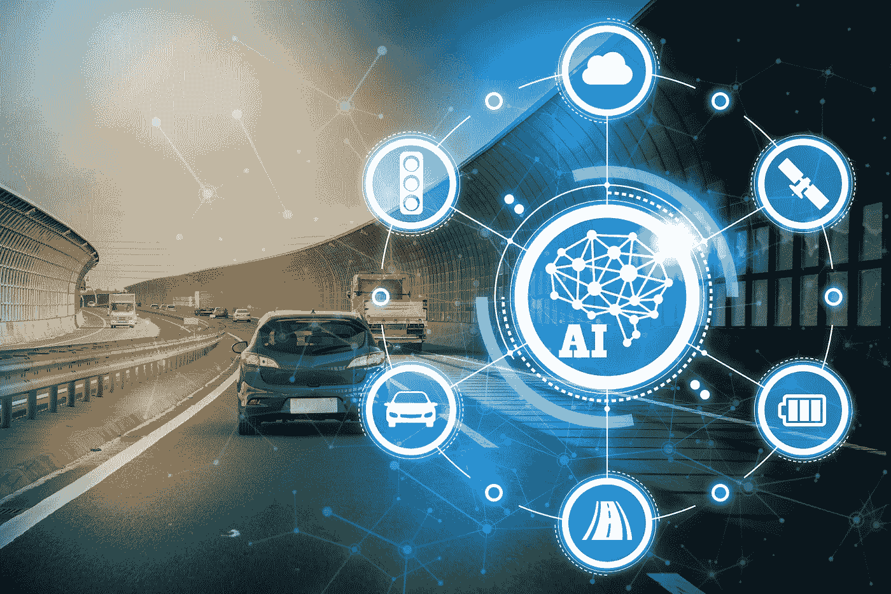
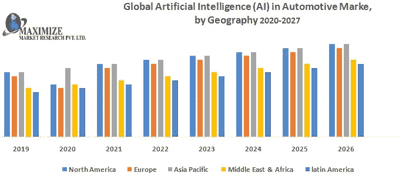
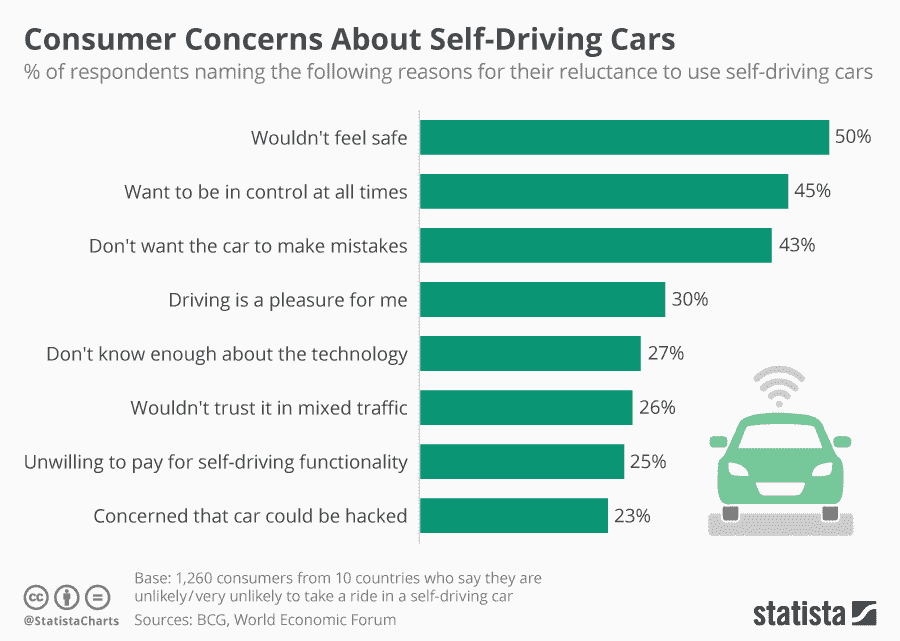

# 自动驾驶汽车中的人工智能传感器:汽车行业正在发生怎样的变化？

> 原文：<https://medium.com/geekculture/ai-sensors-in-self-driving-cars-how-is-the-automobile-industry-changing-e962ca24a371?source=collection_archive---------10----------------------->

[source](https://www.fool.com/investing/2018/03/12/3-ways-ai-will-change-the-automotive-industry.aspx)

无人驾驶汽车是我们这个时代最令人兴奋的创新之一。很难相信，仅仅几年前，这些车辆还只出现在电影和电视屏幕上。现在他们到处开车围着我们转。

这些车辆使用各种传感器，包括人工智能传感器，以便在没有人类帮助的情况下检测周围环境和导航道路。**但是**你知道这个 AI 传感器是怎么流畅工作的吗？

没有吗？这不是其他的人工智能应用程序，而是由人工智能开发公司开发的。这些公司的专业人员能够以更好的方式将技术集成到汽车中。

根据最近的[报告](https://www.maximizemarketresearch.com/market-report/artificial-intelligence-ai-automotive-market/1752/)，到 2027 年，全球汽车市场的人工智能(AI)预计将达到**376.9 亿美元，在预测期间的 CAGR 为 37.6%。**

[source](https://www.maximizemarketresearch.com/market-report/artificial-intelligence-ai-automotive-market/1752/)

此外，汽车工业的未来将严重依赖于这些人工智能传感器；他们可以提供以前不可能研究或测试的见解。

今天，在这篇博客中，我们将探讨自动驾驶汽车中的 AI 传感器如何影响汽车行业，以更好地掌握这项新兴技术。

# 自动驾驶汽车和人工智能传感器:你需要知道的

人工智能传感器可以帮助汽车检测道路上周围的事物。它们帮助自动驾驶汽车在没有任何人类输入的情况下检测周围的不同事物，然后通过采取必要的行动来做出反应。

自动驾驶车辆使用各种类型的人工智能传感器。下面讨论一些主要问题:

*   **激光雷达**

激光雷达代表光探测和测距，这是一种通过用光照射物体来测量物体距离的传感器。大多数自动驾驶汽车大量使用这些，因为它们可以在晚上和你最需要帮助的时候看到。

一个激光系统向物体发出短脉冲，并测量光反射回来需要多长时间。这被称为“测距”它可以以每秒 150 米的速度工作，这使它能够跟踪快速移动的物体。

这些传感器向各个方向发射激光束，然后以更高的速度探测汽车前方可能出现的任何障碍物。

*   **超声波传感器**

超声波传感器用于自动驾驶汽车，测量与其他车辆和障碍物的距离。他们发出一种高频声音，并通过声音反弹回来所需的时间来测量物体的距离。

这些传感器的作用范围有限，就像激光雷达和雷达一样；然而，因为它们发出的是声波，而不是自己传输信号，所以它们无法透过雾或天气条件看到东西。

*   **雷达**

雷达系统与汽车中的超声波传感器非常相似。它们依靠无线电波而不是声音，但它们有几个关键优势，这使它们适用于自动驾驶汽车应用。雷达可以看穿雾、灰尘，甚至金属。

它还可以跟踪拐角处的物体，因为它的信号会被其他物体反射。它也非常适合测量其他汽车的速度，因为它可以通过查看信号返回所需的时间来确定速度。

*   **视觉摄像机**

视觉相机检测环境中的可见光谱，也检测未分类的对象。该传感器用于检测交通标志、车道线等。

摄像机被放置在汽车周围，以便在公路上行驶时捕捉它的所有侧面。像雷达一样，相机捕捉反射光，尽管它们使用像素传感器而不是无线电波。

自动驾驶汽车将使用这些图像来检测行人和障碍物。这些照片然后被发送到计算机进行处理，确定照片中是什么样的物体以及它是如何运动的。

***然而，该行业仍面临一些障碍，需要克服这些障碍才能制造出高效的自动驾驶汽车。***

例如，许多自动驾驶汽车都安装了激光雷达传感器，以帮助区分道路车道、行人和道路上的其他潜在危险。但激光雷达传感器价格昂贵，这在商业模式仍在测试的行业中是一个问题。

因此，汽车制造商已经转向更便宜的自动驾驶汽车替代品，包括上文讨论的雷达和超声波传感器。但是，尽管这些技术在特定环境下可能工作得很好，但它们有时可能难以达到自动驾驶汽车所需的精度水平。

例如，雷达只能检测运动物体(如道路上的汽车)，而激光雷达可以检测运动和静止物体(如标志)。

然而，雷达传感器可以更有效地检测天气状况，如降雨，鉴于计算机视觉的复杂性质，这是自动驾驶汽车的关键挑战之一。

这是因为道路上的水可以为雷达传感器创建更多的反射图像，使这些系统在这样的条件下更有效(和准确)地工作。

**AI 传感器给汽车行业带来重大变革**

*   **提高道路安全性**

根据[研究](https://www.prb.org/resources/road-traffic-accidents-increase-dramatically-worldwide/)，世界上每年发生 120 万起车祸。所有这些都是由于人为错误。据估计，无人驾驶汽车将减少高达 80%的致命交通事故。

无人驾驶汽车旨在通过检测路标、物体或周围的其他车辆来实现高效和安全的驾驶。它们还能探测路上的行人，这样它们就能避免事故的发生。

由于事故在损害、疼痛和痛苦方面给大多数经济体造成了数百万美元的损失，人工智能传感器将把这种损失减少到最低限度或根本没有损失。

人工智能传感器允许汽车在没有任何人类互动的情况下自行移动。传感器监控汽车的速度，并在前方检测到碰撞时降低速度。

它还会在变道时通知其他车辆的存在，并检测招牌以打开或关闭远光灯。

*   **减少交通流量**

道路上的自动驾驶汽车将减少交通流量，因为它们可以以排的形式更紧密地行驶。列队让汽车减少风阻造成的气动阻力，有助于提高车辆的燃油效率，节省能源成本。

*   **提高驾驶舒适性和效率**

人工智能传感器通过在正确的时间做出正确的决定，使汽车能够自动驾驶。传感器系统提醒司机注意事故、交通堵塞、恶劣路况等。

由于停车辅助或车道偏离警告等自动辅助功能，驾驶员也不必一直盯着路面。

[source](https://www.statista.com/chart/5950/concerns-about-self-driving-cars/)

# 4.环境收益

无人驾驶汽车将减少交通污染，因为不再有因人为错误造成的怠速或走走停停的交通。人工智能传感器检测到交通拥挤的情况，并自动关闭发动机，直到可以安全行驶。

这有助于减少汽车空转时排放到大气中的有害气体。

此外，如果它们都连接在一起，就不会有那么多的噪音污染，因为你不会有这么多的引擎同时加速或多人按喇叭。

# 5.省钱

无人驾驶汽车可以用于汽车共享项目，这可以为我们省钱。你可以与其他人共用一辆车，只需支付乘车费用，而不是拥有自己的车。这将降低运输成本，使许多人更加负担得起。

随着更多的自动驾驶汽车上路，这也意味着对人类司机的需求将会减少，这将节省公司的工资和保险费用。

# 6.提高燃油效率

无人驾驶汽车可以相互通信，并在路上调整速度，以避免交通堵塞。这将提高燃料效率，因为他们不会浪费时间在交通中空转，减少了单个司机使用的燃料量。

# 7.降低保险成本

无人驾驶汽车可以感知周围环境，避免事故，驾驶更加平稳，使乘客的生活更加轻松。这也降低了对他们的保险提出任何索赔的可能性，从而降低了想要为自己投保的人的总成本。

# 8.安全

预计自动驾驶汽车中的人工智能传感器将通过深度学习提供全面的安全功能，减少 78%的汽车盗窃。

当其中一辆车感觉到危险时，装有人工智能的车辆可以进行通信并提供警告。此外，汽车公司可以利用人工智能开发服务来提高自动驾驶汽车的安全性。

# 9.更高的生产力

人们可以在无人驾驶汽车中工作，让他们完成更多工作。这意味着人们不会把时间浪费在路上，这往往是最没有成效的，而是将时间花在其他地方。

摩根士丹利的[报告](https://www.investopedia.com/articles/personal-finance/031315/selfdriving-cars-could-change-auto-industry.asp#:~:text=Impact%20on%20the%20Greater%20Economy&text=Morgan%20Stanley's%20report%20estimates%20that,result%20of%20increased%20worker%20productivity.)估计，由于工人生产率的提高，在美国用无人驾驶汽车取代传统汽车可以为经济贡献高达**5070 亿美元**。

# 结果

汽车行业一直在缓慢接受技术变革，但现在他们必须利用自动驾驶技术。

因为自动驾驶汽车是未来的发展方向，谷歌和苹果等科技公司将有可能引领这个行业的发展。

这将使传统汽车公司的利润面临巨大风险，以至于它们可能会彻底破产。

因此，对他们来说，采用人工智能传感器技术开发自动驾驶汽车，给客户带来令人兴奋的体验，并在汽车行业树立声誉，是非常必要的。

此外，人们可以雇佣人工智能开发者来利用最著名的[人工智能开发公司](https://www.valuecoders.com/ai-ml-development-services-company?utm_source=AngN12&utm_medium=medium&utm_id=aidevelopmentcompany)的利益。

仅此而已！