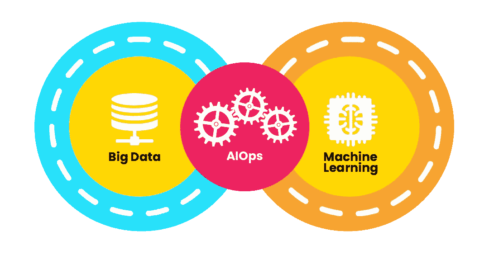
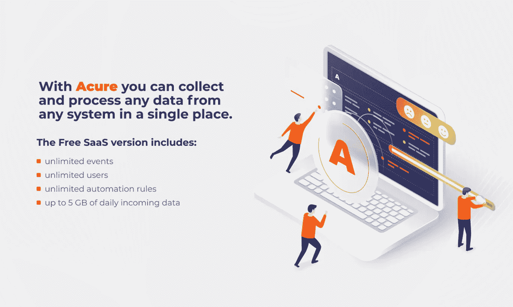
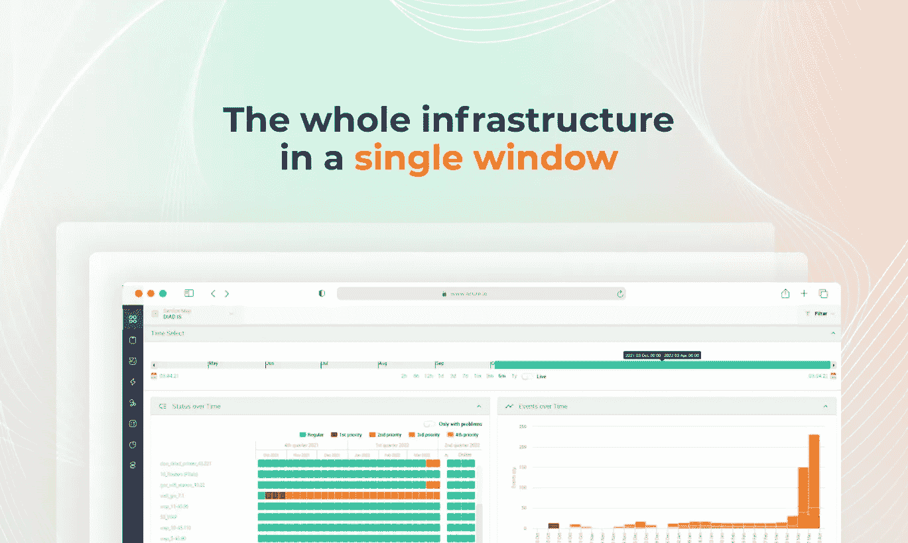
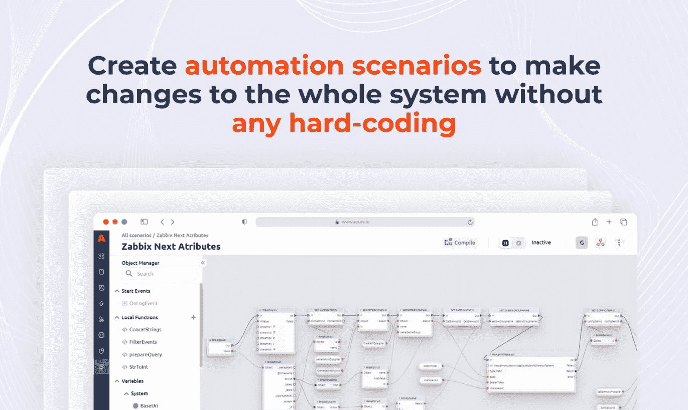
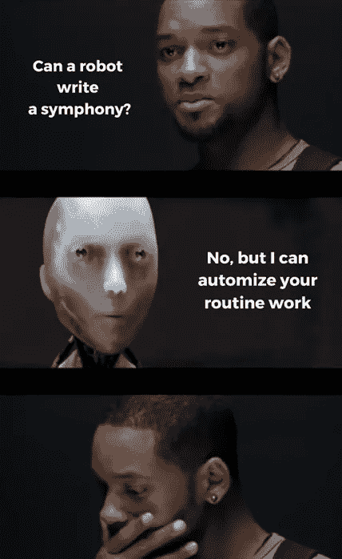

# AI 接管:一个 AIOps 平台的故事

> 原文：<https://medium.com/geekculture/ai-takeover-the-story-of-one-aiops-platform-4276b05cea80?source=collection_archive---------8----------------------->

IT 运营的人工智能—技术越进步，这个术语在大数据监控中出现的次数就越多。在我之前的文章中，我分享了我们的客户的故事，其中 AIOps 帮助提高了生产力和 IT 效率。这次我就稍微自私一点，给大家讲讲我公司的故事——这类系统的开发者。此外，我还将讨论 AIOps，这类平台的关键要素，以及是什么让它们成为 IT 监控的未来。另外，前几天我们[发布了一个云版本](https://www.producthunt.com/posts/acure-io-autonomous-itops)！万岁！有什么比 Acure 作为您的指挥更好的方式来探索 AIOps 的世界呢？但首先，一个简短的历史。

# **我是怎么进入 AIOps 的世界的？**

5 年前，我和我的合作伙伴开始开发一个大数据监控系统。我们理想的客户是那些财务业绩和声誉依赖于稳定高效的 IT 工作的公司。即使在那时，我们知道要在市场上竞争，我们需要创造一些创新和现代的东西。还有什么比自动化和人工智能更现代的呢？同时，有了工程背景，我们明白系统不仅要满足业务方面的客户需求，还要满足那些直接在系统中工作的人的需求。这是数据的清晰可视化和日常任务的自动化。

> **AIOps，即 IT 运营的人工智能，是一个基于人工智能的多层 IT 管理平台，它根据来自 IT 基础设施的实时大数据自动进行处理和决策。因此，AIOps 将 IT 专业人员从监控单个事件的例行任务中解放出来，让他们完全依赖机器学习。**

Source: [https://www.aims.ai/](https://www.aims.ai/)

因此，我们转向 AIOps，开始开发一个对企业和 IT 工程师都适用的解决方案。

# **从云中构思到云解**

2019 年，我们创建了产品公司。我们有一个 MVP，走遍市场，开始向客户提供它。事实证明，客户需要一种机制来聚合来自不同监控系统的数据。银行、电信、电子商务和零售都想创造自己的东西或者从市场上购买现成的东西。我们从一些大客户那里得到了很好的反馈，在他们的帮助下，我们开始开发我们的产品。

2020 年，我们为自己做了一个明确的决定，进入全球市场，与世界上最好的 AIOps 系统竞争。年初，我们完全切换到远程工作模式，再也没有回到办公室。我们受到了 DataDog、Dynatrace、Splunk 和其他公司成功的启发。在这一年中，我们参观了几乎所有世界领先的展览，如 GITEX、网络峰会、亚洲通信展，我们还支付了去 MWC 的门票，但由于 COVID 而取消了。我们与世界各地的工程师进行了 100 多次面试，在创业竞赛中获得了多个奖项，并通过了 3 个大型加速器。

2021 年，我们以风险投资的形式筹集了第一笔资金。

这些年来，我们的解决方案不断发展，功能和许可策略都有了显著的更新，并出现了一个免费版本。

我们看到了社区的巨大兴趣——在社交媒体上发布几条帖子后，数百人下载了该产品。但是，正如我所说的，在改进系统时，我们试图倾听用户的意见，而不仅仅是客户的意见。用户越来越多地问“你什么时候推出 SaaS？”。因为对用户来说，最具挑战性的部分似乎是下载 6+ Gb 的软件并在他们的服务器上安装。所以我们决定快速行动，尽快构建 SaaS 版本，以最用户友好的方式将我们产品的价值带给每一个需要它的工程师，而且完全免费。

我们希望为那些想尝试 AIOps 并开始学习如何使用该技术的人提供一个工具，为他们工作的公司带来价值，同时成为更有价值的专业人士。

# **为什么 Acure 是 AIOps？**

如定义所述，AIOps 由两个主要部分组成:*大数据*和*机器学习*。

## ***大数据在 Acure***

在 Acure 中，您可以在几秒钟内创建一个工作区，将其连接到流行的 it 监控系统，如 Zabbix 或 Prometheus，添加来自虚拟化系统的数据，如 VMware，添加 Azure 或 AWS 云提供商，并连接您的服务的原始日志。您可以从多个 CMDBs 收集数据，并自动发现集成单元的基础，发现新元素，将它们置于自动监控下，并对开发过程中出现的故障做出响应。

在收集数据和关联设置后，您可以在一个屏幕上看到整个 IT 基础架构的状态:所有事件以及为解决和防止将来发生这些事件所做的所有工作。您可以通过状态概览、仪表盘或拓扑图查看和分析信息。

通过探索拓扑“灌木”和配置项之间的连接，您可以执行根本原因分析。它有助于认识到您应该首先做什么来解决事件。你可以在我们的一个用户的文章[中找到这个方法的详细描述。](/geekculture/dont-forget-about-roots-root-cause-analysis-in-data-monitoring-9de10f05d1fc)

## **中的*自动化*中的**

正如我已经提到的，Acure 的目标之一是自动化那些与数据打交道的人的日常任务，并释放他们的资源用于需要人脑的更具创造性的工作。这是通过自动化实现的。在 Acure 中，您可以给机器分配自动发现系统新元素的任务。现在，您不需要手动监控基础架构更新，Acure 本身会添加新单元，并在您平静地喝着咖啡，看着屏幕上的绿灯时，放下它们之间的链接。

Acure 还允许为重复事件设置自动规则和自动操作。例如，系统本身将能够根据定制的模板发送邮件或运行自动修复脚本。

但是在某些情况下，对基础设施指标的监控无法提供给定系统健康状况的完整画面。为此，Acure 提供了自动化测试功能。您可以使用自动测试来设置可以模拟用户操作的检查，并在运行时报告任何异常，即使基础架构监控没有发出问题信号。

# **结论**

传统的 IT 方法不适合当今分散的服务交付模式。混合基础架构也增加了复杂性。

AIOps 是满足进一步自动化和将日常任务转移到机器的需求的解决方案。

另外，在开发系统的时候，应该越来越关注用户的需求。因为公司的底线取决于它的生产力。用户希望接收按需服务，自己订阅，并对系统进行更改，而不需要等待开发人员的响应。这一切都是 Acure 提供的。