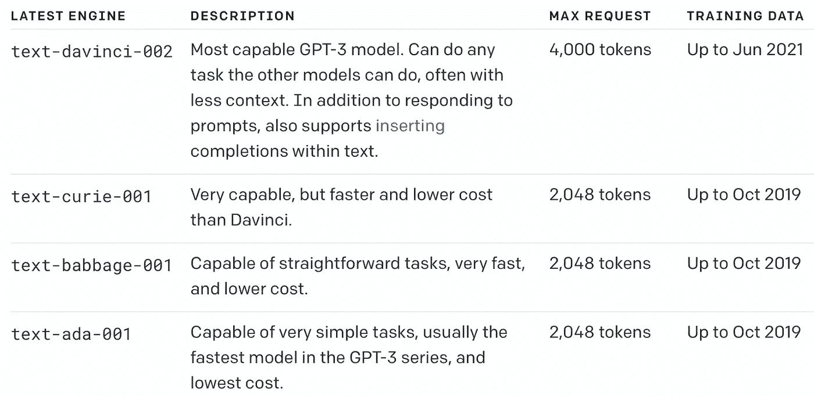
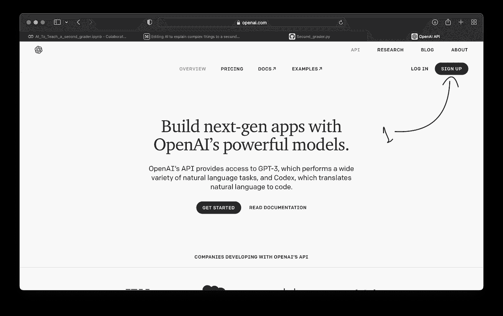
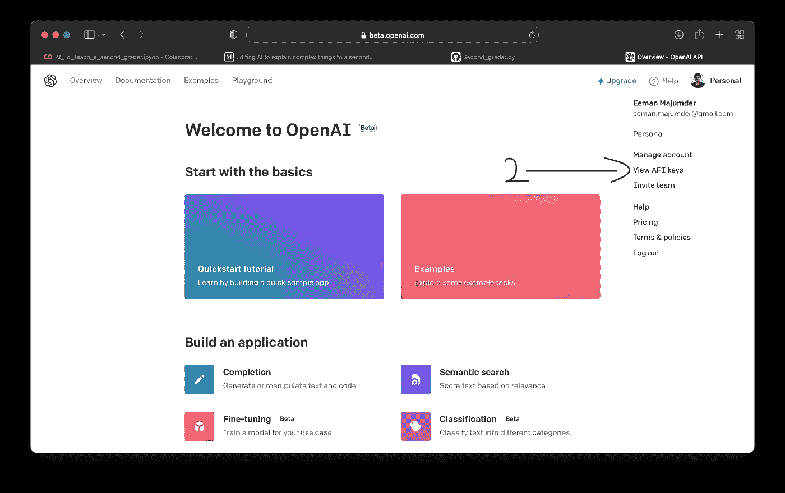
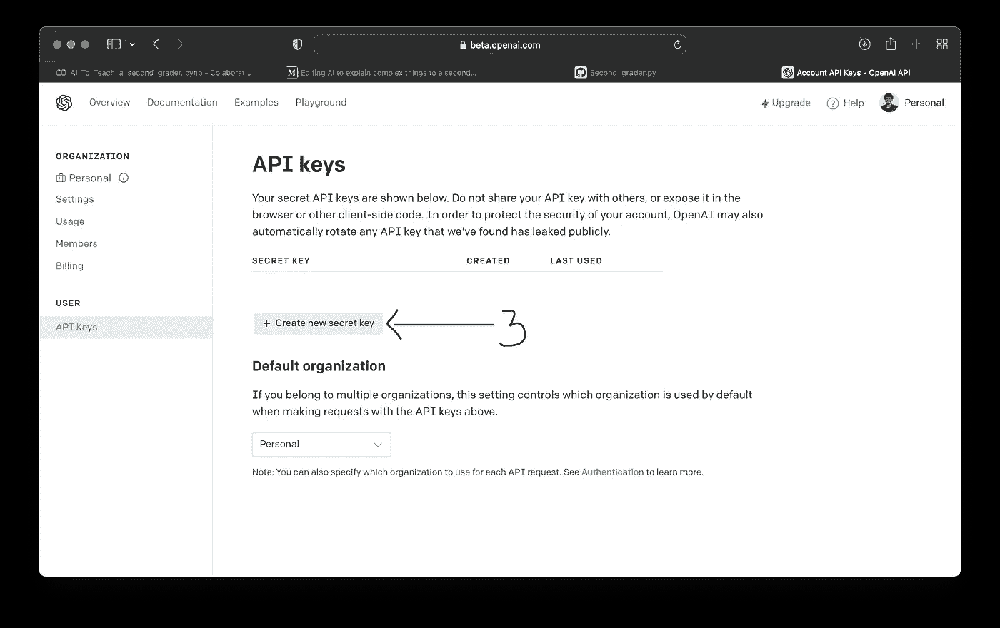
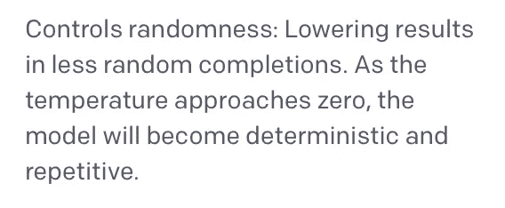
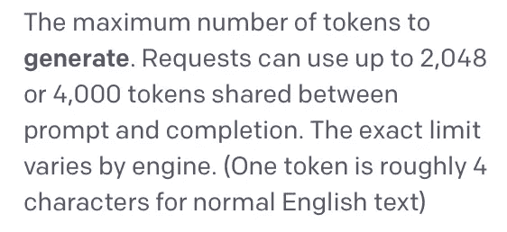
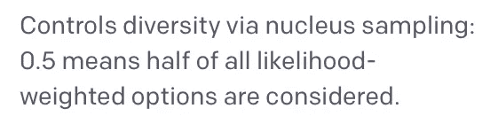
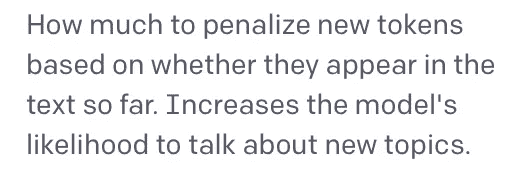
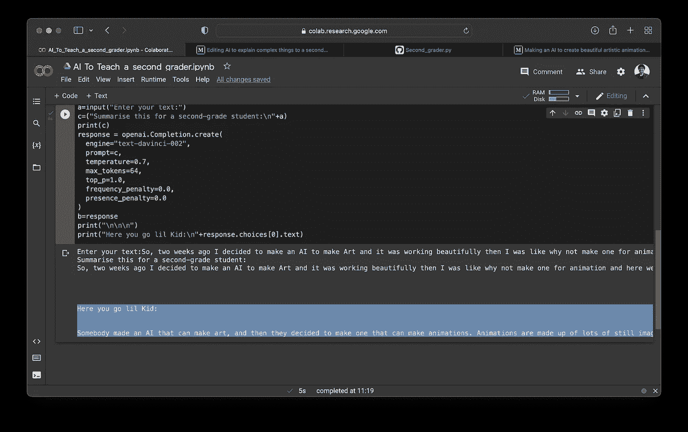
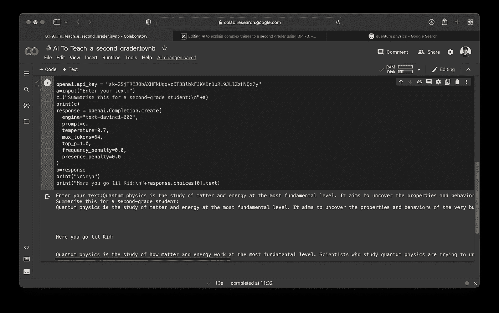

# 人工智能使用 GPT-3 向二年级学生解释复杂的事情。

> 原文：<https://medium.com/geekculture/ai-to-explain-complex-things-to-a-second-grader-using-gpt-3-ab28872bdce9?source=collection_archive---------3----------------------->

所以，我经常在采访中遇到这样的情况，采访者要求用一种孩子能理解的方式来解释困难的话题。所以，我想让我们做一个人工智能，然后我们就在这里了。

那么让我们来了解一下 GPT-3 和文-达芬奇-002 的发动机:

GPT-3 模型可以理解并生成自然语言。有四种主要型号，具有不同的功率等级，适用于不同的任务。达芬奇是最能干的模特，阿达是最快的。

[Link for image](https://beta.openai.com/docs/engines/gpt-3)

虽然达芬奇通常是最有能力的，但其他型号可以以显著的速度或[成本优势](https://openai.com/api/pricing)非常好地执行某些任务。例如，居里夫人可以完成许多与达芬奇相同的任务，但速度更快，成本只有达芬奇的 1/10。

既然我们对 GPT 3 号有所了解。让我们开始吧。

首先安装:

我正在使用 Colab，因此该行将有一个！开始时，如果您使用本地系统，只需将它粘贴到您的终端(win+r，cmd，Enter)中，而不要使用！然后按回车键。

现在，让我们开始导入:

现在让我们从 OpenAI API 站点获取我们的 API 密钥:

第一步:

去 [OpenAI API](https://openai.com/api/) 网站注册

[The Website](https://openai.com/api/)

第二步:

转到查看 API 密钥

第三步:

点击创建新密钥

现在，在创建密钥之后，创建一个. env 文件，并将其放在与代码相同的文件夹中。

现在让我们将隐藏的密钥提取到我们的 python 程序中:

让我们从用户那里获得提示输入，并将其合成，以便在 text-davinci-002 模型中进行完美的输入:

“给二年级学生总结一下:\n”这一部分非常重要，因为 GPT-3 可以理解语言，如果您在提示中指定它的任务，它会工作得更好。

现在，让我们最后设置文本-达芬奇-002 模型:

每个属性的含义都有定义

温度:

最大令牌数:

Top_P:

频率惩罚:

在场惩罚:

现在让我们打印输出:

这样代码就完成了！！

让我们看看一些输出:

因此，让我们总结一下我上一篇文章的全文内容:

所以输入是:

> 所以，两周前我决定制作一个人工智能来制作艺术，它工作得很漂亮，然后我就想为什么不为动画制作一个呢，于是我们就这样了。
> 
> 因此，让我们先了解一下动画是如何工作的。
> 
> 正如你在上面的图片中看到的，动画由许多称为帧的静止图像和称为关键帧的关键变化点组成。
> 
> 现在有了动画的基础知识和图像生成的基础知识，让我们开始学习基本的方法。如果你想了解更多关于图像生成的知识，请阅读我之前的文章:

输出:

> 给你，小家伙:有人制造了一个可以制作艺术的人工智能，然后他们决定制造一个可以制作动画的人工智能。动画由许多称为帧的静止图像组成，并且有一些关键帧是重要的变化点。

让我们试着教孩子们一些量子物理学🤣

输入:

> 量子力学是物理学的一个基本理论，它以原子和亚原子粒子的尺度来描述自然界的物理性质。它是所有量子物理的基础，包括量子化学、量子场论、量子技术和量子信息科学

输出:

> 给你，小子:量子物理是在最基本的水平上研究物质和能量是如何运作的。研究量子物理的科学家们正试图理解大自然的组成部分以及它们是如何运作的。量子物理可以帮助我们理解发生在很小范围内的事情，比如电子和光子，但它也解释了一些事情

AI is so awesome!!!

Quantum Physics

呵呵，自己做一个吧，喜欢向你的小兄弟姐妹们解释复杂的事情。

**如果您喜欢这篇文章，欢迎在媒体上关注😁**

这是 Colab 笔记本:

 [## 教学 _ 小 _ 孩子 _ 复杂 _ 东西 _ 使用 _ 人工智能

### Eeman_Majumder

colab.research.google.com](https://colab.research.google.com/drive/1gM1aogPm8mABxMJz3TjxCIOEQ2LhKpm6?usp=sharing) 

更多信息，请查看我的 GitHub:

 [## Eeman1113 -概述

### 您现在不能执行该操作。您使用另一个选项卡或窗口登录。您在另一个选项卡上注销，或者…

github.com](https://github.com/Eeman1113) 

在推特上关注我的日常 AIML 研究更新:

帮我筹集大学资金(完全可以选择，但非常感谢):

 [## 伊曼正在创造有趣的人工智能|帕特伦

### 立即成为 Eeman 的赞助人:获得世界最大会员的独家内容和体验……

www.patreon.com](https://www.patreon.com/EemanMajumder) 

感谢阅读，下周再见👋🏼