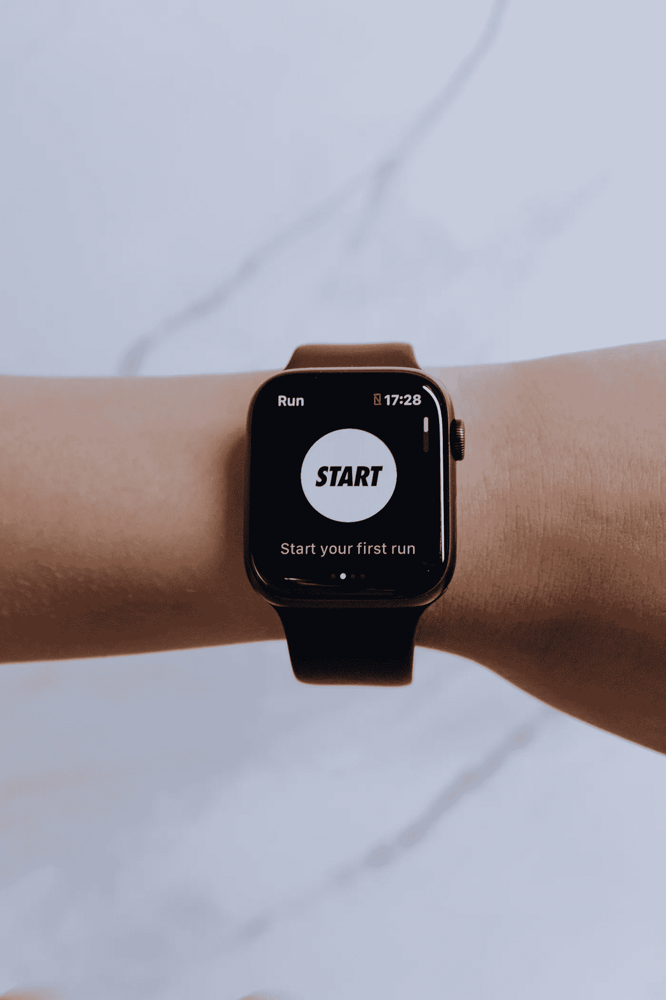

# 可以帮助你监控和改善健康的人工智能工具

> 原文：<https://medium.com/geekculture/ai-tools-that-can-help-you-monitor-and-improve-your-health-88db497ef063?source=collection_archive---------15----------------------->

Photo by [cottonbro](https://www.pexels.com/@cottonbro?utm_content=attributionCopyText&utm_medium=referral&utm_source=pexels) from [Pexels](https://www.pexels.com/photo/black-smartwatch-5081914/?utm_content=attributionCopyText&utm_medium=referral&utm_source=pexels)

技术不断发展，以各种方式帮助我们。我鼓励你现在仔细看看你的健康状况，这样你就能健康长寿。

以下是我个人用来跟踪和监控自己健康状况的一些工具:

# 司文艺、音乐、美术的女神缪斯