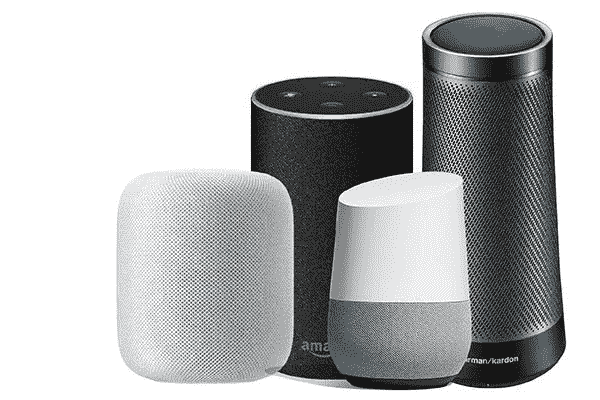
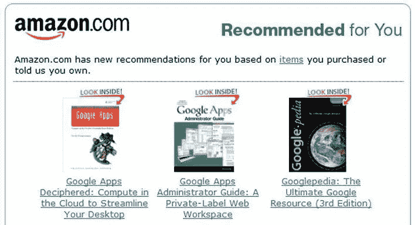
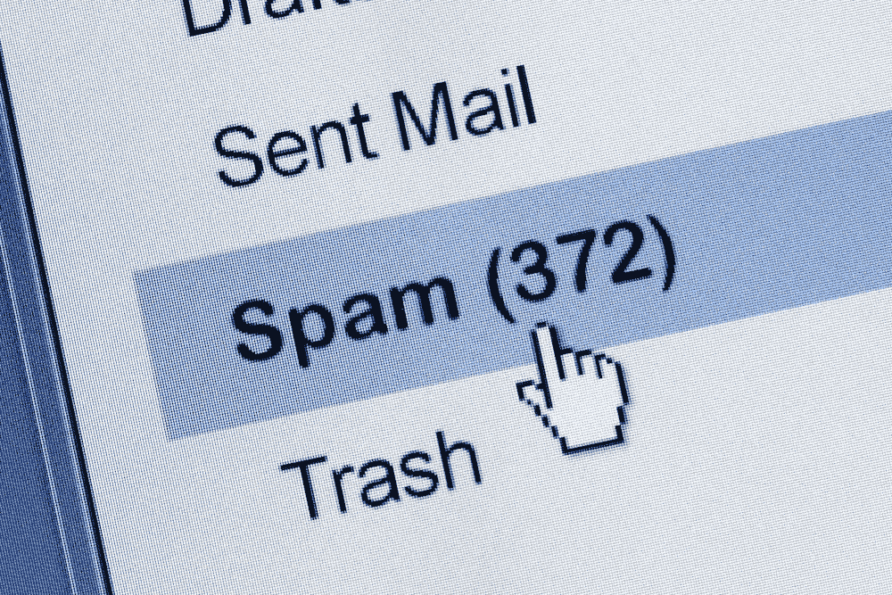

# AI vs ML:有什么区别？

> 原文：<https://medium.com/geekculture/ai-vs-ml-whats-the-difference-2e2e73e98d9c?source=collection_archive---------18----------------------->

## 了解人工智能和机器学习之间的区别

Photo by [Tara Winstead](https://www.pexels.com/@tara-winstead?utm_content=attributionCopyText&utm_medium=referral&utm_source=pexels) from [Pexels](https://www.pexels.com/photo/person-reaching-out-to-a-robot-8386434/?utm_content=attributionCopyText&utm_medium=referral&utm_source=pexels)

今天，人工智能和机器学习是两个流行的术语，经常被交替使用来描述智能软件或系统。即使 AI 和 ML 都是基于统计学和数学，但它们不是一回事。

很多人都被这两个术语搞糊涂了。在本文中，您将通过生动的例子了解人工智能和人工智能之间的区别。

# 什么是 AI(人工智能)？

人工智能或 AI 是计算机或机器模仿或模仿人类智能行为并执行类似人类任务的能力。

人工智能执行需要人类智能的任务，如思考、推理、从经验中学习，最重要的是，做出自己的决定。

> "人工智能是制造智能机器的科学和工程."—约翰·麦卡锡

人工智能可以出色地完成任务，但它们尚未达到在情感层面与人互动的能力。

为了了解更多，让我们来看一些人工智能的例子。

# 机器人学

工业机器人是人工智能的一个很好的例子。工业机器人能够监控自身的精度和性能，感知或检测何时需要维护，以避免代价高昂的停机时间。它还可以在新的或未知的环境中工作。

# 个人助理

人工智能的另一个例子是个人助理工具，这是人与人工智能交互的小工具。最受欢迎的个人助理是谷歌的 Google Home、苹果的 Siri、亚马逊的 Alexa 和微软的 Cortana。

这些个人助理使用户能够查找信息、帮助预订酒店、将事件添加到日历中、回答问题、安排会议、发送消息或电子邮件等等。

要了解更多人工智能的例子，请阅读这篇文章

# 什么是 ML(机器学习)？

机器学习(Machine learning，简称 ML)是人工智能的一个子集，它能够自动从数据中学习，而无需显式编程或领域专业知识的帮助。

**ML 中的**学习是指机器基于数据进行学习的能力，以及 ML 算法训练模型、评估其性能或准确性，然后做出预测的能力。

例如，你可以用随机森林和决策树等有监督的机器学习算法来训练一个系统。

> “机器学习是在没有明确编程的情况下赋予计算机学习能力的研究领域。”——阿瑟·塞缪尔

因此，ML 的意图是使机器能够利用数据进行自我学习，并最终做出准确的预测。

要了解更多，让我们看看机器学习的例子。

# 产品推荐

大多数电子商务网站都有机器学习工具，根据历史数据提供不同产品的推荐。

举个例子，如果你在亚马逊上搜索了机器学习的书籍，过了一段时间再回来就买一本，亚马逊的主页会给你显示一个与机器学习相关的书籍列表。

它还会根据您喜欢或添加到购物车中的内容以及其他相关行为进行推荐。

# 垃圾邮件和恶意软件过滤

垃圾邮件已经成为互联网用户的一个大问题。如今，大多数电子邮件服务提供商使用机器学习工具来自动学习和识别垃圾邮件和钓鱼邮件。

示例 Gmail 和 Yahoo 邮件垃圾邮件过滤器不仅仅使用预先存在的规则检查垃圾邮件。当他们继续进行垃圾邮件过滤操作时，他们会根据所学到的知识自己生成新的规则。

# AI 和 ML 的区别

最后，AI 解决需要人类智能的任务，而 ML 是人工智能的子集，通过从数据中学习并做出预测来解决特定任务。因此，所有的机器学习都是人工智能，但不是所有的人工智能都是机器学习。

恭喜👏👏，你已经做到这篇文章的结尾了！

如果你学到了新的东西或者喜欢阅读这篇文章，请分享给其他人看。在那之前，下期帖子再见！

你也可以在 Twitter 上找到我 [@Davis_McDavid](https://twitter.com/Davis_McDavid?ref=hackernoon.com) 。

*最后一件事:在以下链接中阅读更多类似的文章*

 [## 数据科学项目的 10 个最佳非洲语言数据集

### 许多 NLP 任务的良好的非洲语言数据集。

medium.datadriveninvestor.com](https://medium.datadriveninvestor.com/10-best-african-language-datasets-for-data-science-projects-5d4c5075d8b4)  [## 如何用 FastAPI 构建和部署 NLP 模型:第 1 部分

### 部署 NLP 模型的简单方法。

towardsdatascience.com](https://towardsdatascience.com/how-to-build-and-deploy-an-nlp-model-with-fastapi-part-1-9c1c7030d40)  [## sci kit-学习 0.24:您需要了解的 5 大新功能

### Scikit-learn 仍然是最受欢迎的 Python 开源免费机器学习库之一。的…

medium.com](/geekculture/scikit-learn-0-24-top-5-new-features-you-need-to-know-7af15d8cdeac) 

*本文首发* [*此处*](https://hackernoon.com/ai-vs-ml-whats-the-difference-3pt37h9) *。*