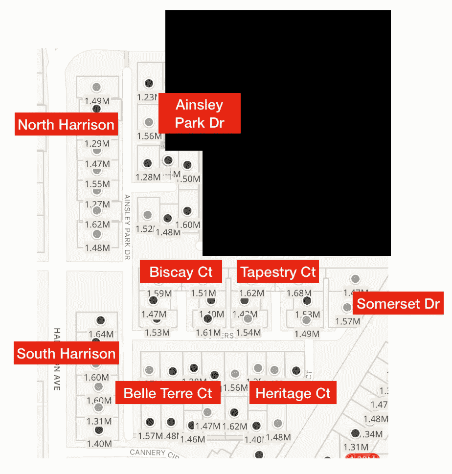
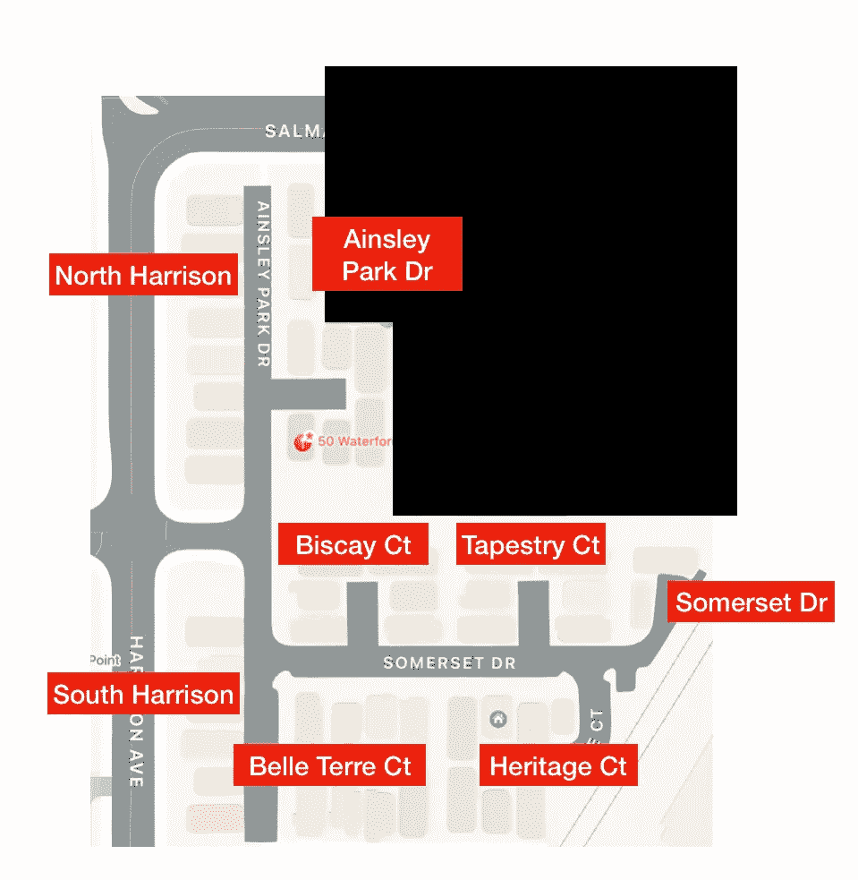
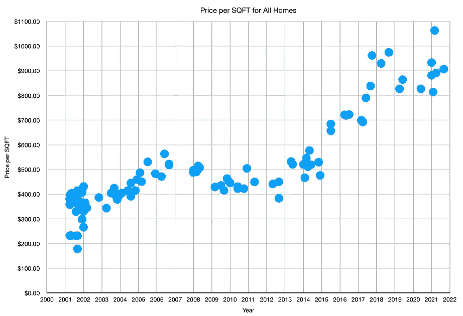
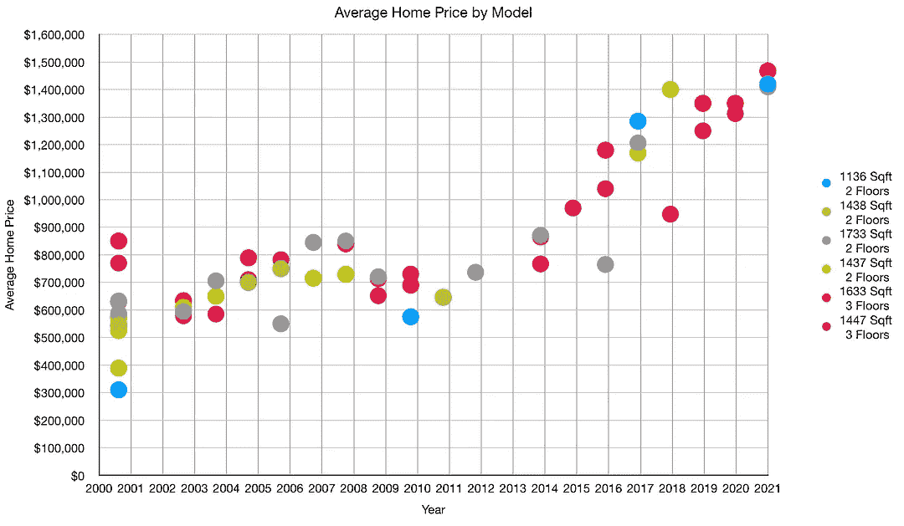
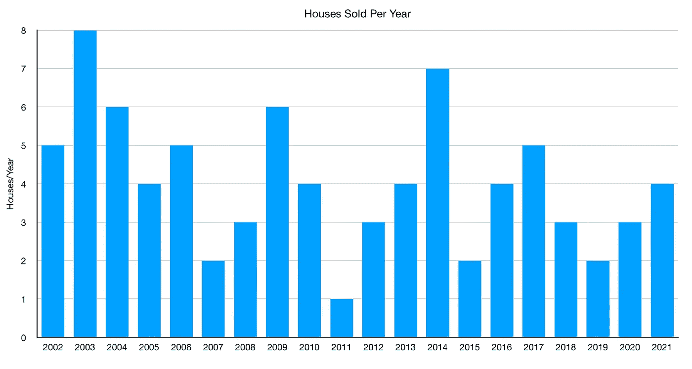
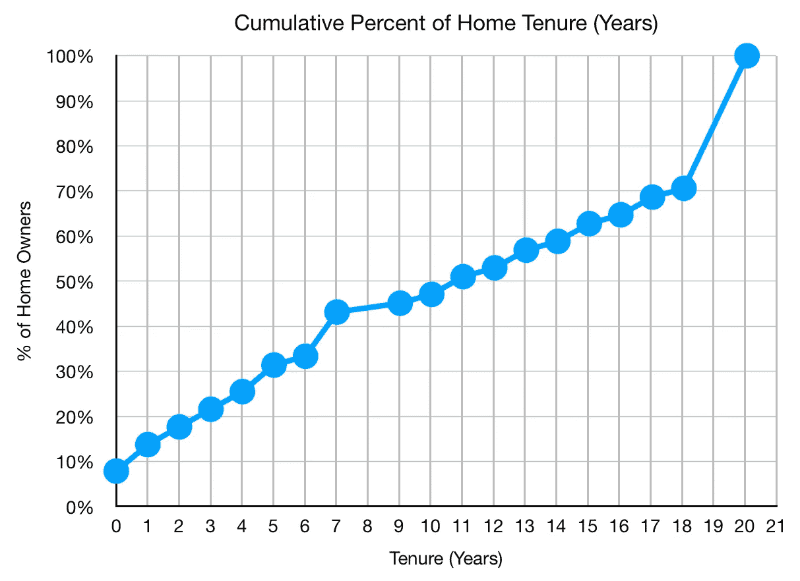
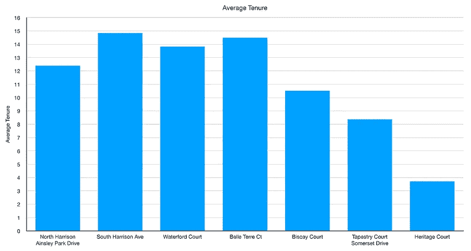
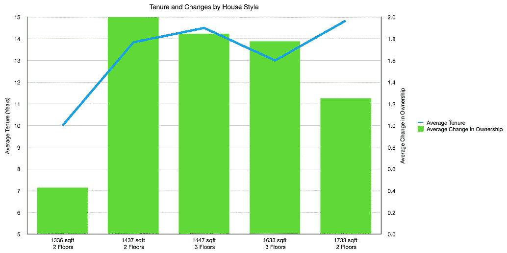

# 房屋成交量是衡量房屋购买的标准

> 原文：<https://medium.com/geekculture/ainsley-square-housing-prices-6ce5748d8dc8?source=collection_archive---------21----------------------->

## 数据科学

## 休闲数据科学

我很好奇我以前租房子的一个街区的房价。我很好奇这里的房屋周转率是多少，以及是否有任何特定的房屋类型或街区与统计平均值不同。我觉得这个小区很有趣，因为规划中只有几种类型的房子。

我从 Zillow 那里调出了住房数据。大多数房子的设计和面积都是标准化的，所以比较是非常直接的。

头两年的年销售量很高，因为那是开发项目建成的时候。自那以后，每年的房屋销售一直相当稳定。

当看一下该社区房屋所有者的百分比和他们的任期(或至少拥有房屋并可能出租)，超过一半的人已经在那里住了十年。

打破这种房屋组的任期，平均是由遗产法院和挂毯法院/萨默塞特驱动器。这些地区的人员流动也最多。

我从未做过社区分析，但有一件事让我印象深刻，那就是营业额。人们会因为各种各样的原因而搬家，但是当他们对自己住的地方感到满意时，他们不会搬家。因此，当你试图判断某栋房子或某个街区是否适合居住，或者它是否表明你在不久的将来将不得不再次搬家时，周转率可能是一个很好的衡量标准。

如果你愿意，可以在 Twitter 和 YouTube 上关注我，我会在那里发布不同机器上的浓缩咖啡视频和浓缩咖啡相关的东西。你也可以在 [LinkedIn](https://www.linkedin.com/in/robert-mckeon-aloe-01581595?source=post_page---------------------------) 上找到我。也可以关注我[中](https://towardsdatascience.com/@rmckeon/follow)和[订阅](https://rmckeon.medium.com/subscribe)。

# [我的进一步阅读](https://rmckeon.medium.com/story-collection-splash-page-e15025710347):

[浓缩咖啡系列文章](https://rmckeon.medium.com/a-collection-of-espresso-articles-de8a3abf9917?postPublishedType=repub)

[工作和学校故事集](https://rmckeon.medium.com/a-collection-of-work-and-school-stories-6b7ca5a58318?source=your_stories_page-------------------------------------)

[个人故事和关注点](https://rmckeon.medium.com/personal-stories-and-concerns-51bd8b3e63e6?source=your_stories_page-------------------------------------)

[乐高故事首页](https://rmckeon.medium.com/lego-story-splash-page-b91ba4f56bc7?source=your_stories_page-------------------------------------)

[摄影飞溅页面](https://rmckeon.medium.com/photography-splash-page-fe93297abc06?source=your_stories_page-------------------------------------)