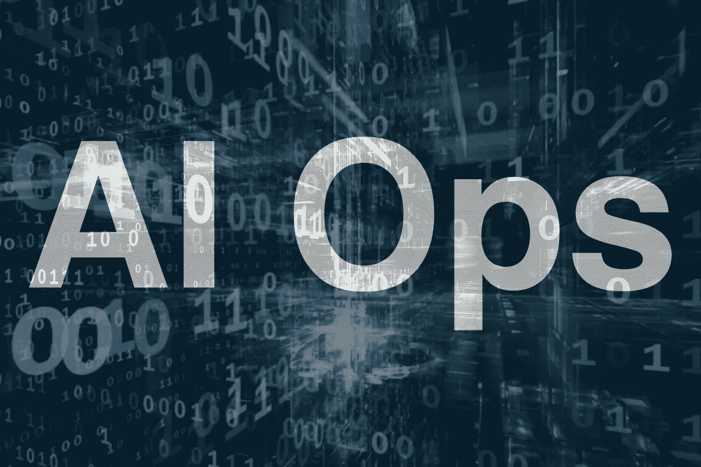
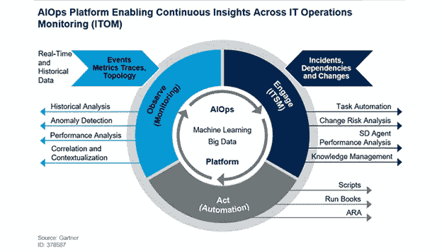

# AIOps

> 原文：<https://medium.com/geekculture/aiops-6e463cbe617a?source=collection_archive---------14----------------------->

Source: Moogsoft

AIOps 使用人工智能来简化 IT 运营管理，并在复杂的现代 IT 环境中加速和自动解决问题。

## 什么是 AIOps？

**AIOps，(IT 运营的人工智能)是人工智能增强 IT 运营的应用。具体来说，AIOps 使用大数据、分析和机器学习功能**来完成以下任务:

*   收集和汇总由多个 IT 基础架构组件、应用程序和性能监控工具生成的大量且不断增长的运营数据。
*   智能地从“噪音”中筛选出“信号”,以识别与系统性能和可用性问题相关的重要事件和模式。
*   诊断根本原因并向 IT 部门报告，以便快速响应和补救，或者在某些情况下，自动解决这些问题，无需人工干预。

通过用一个智能的自动化 IT 运营平台取代多个独立的手动 IT 运营工具，AIOps 使 IT 运营团队能够以更少的工作量更快地(甚至是主动地)应对速度下降和停机。

它弥合了日益多样化、动态且难以监控的 It 环境与用户对应用程序性能和可用性中断很少或没有中断的期望之间的差距。大多数专家认为 AIOps 是 IT 运营管理的未来。

## 为什么我们需要人工智能？

如今，大多数组织正在从由独立、静态的物理系统组成的传统基础架构过渡到由内部部署、托管云、私有云以及公共云环境组成的动态组合，运行在不断扩展和重新配置的虚拟化或软件定义的资源上。

这些环境中的应用程序和系统会产生持续增长的海量数据。

> **事实上，Gartner 估计，一般企业 IT 基础架构每年生成的 IT 运营数据要多两到三倍。**

进入 AI Ops，它提供跨所有环境的性能数据和依赖关系的可见性，分析数据以提取与速度下降或停机相关的重大事件，并自动向 IT 人员、员工发出问题、问题根源和建议解决方案的警报。

## AIOps 是如何工作的？

Source: BMC Software

理解 AIOps 如何工作的最简单方法是回顾每个 AIOps 组件技术(大数据、机器学习和自动化)在该过程中扮演的角色。

AIOps 使用大数据平台将不同的 IT 运营数据聚合在一个地方。

将重大事件警报从“噪音”中分离出来:AIOps 使用规则应用和模式匹配等分析方法来梳理您的 IT 运营数据，并将信号(重大异常事件警报)从噪音中分离出来。

确定根本原因并提出解决方案:通过使用特定于行业或特定于环境的算法，AIOps 可以将异常事件与环境中的其他事件数据相关联，从而找出停机或性能问题的原因并提出补救措施。

自动响应，包括实时主动解决方案:至少，AIOps 可以自动将警报和建议的解决方案发送给适当的 IT 团队，甚至根据问题和解决方案的性质创建响应团队。在许多情况下，它可以处理机器学习的结果，以触发自动系统响应，在用户意识到问题发生之前实时解决问题。

不断学习，以改善对未来问题的处理:基于分析的结果，机器学习能力可以改变算法或创建新的算法，以更早地识别问题，并推荐更有效的解决方案。

> “花在人工智能上的一年时间，足以让人相信上帝。”—艾伦·珀利斯