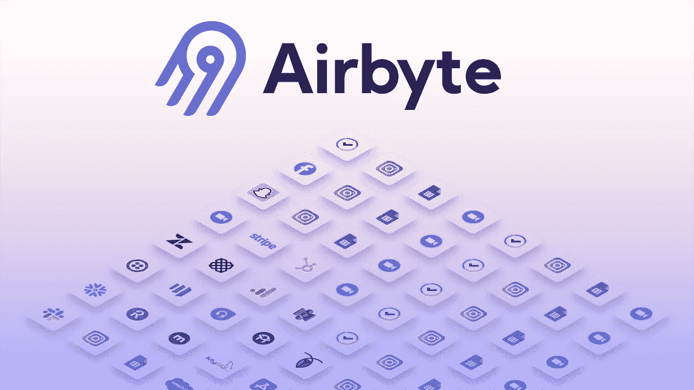

# airbyte——有前途的集成工具

> 原文：<https://medium.com/geekculture/airbyte-promising-integration-tool-6682f34f7711?source=collection_archive---------2----------------------->



关于 Airbyte 的介绍文章

任何数据管道的关键组成部分是数据的提取。一旦数据被提取出来，就需要被加载和转换(ELT)。

[Airbyte](https://airbyte.io/) 是一个开源的数据集成平台，旨在标准化和简化提取和加载的过程。Airbyte 根据 ELT 的原理运行，它简单地提取原始数据并将其加载到目的地，可选地，它允许我们进行转换。变换与 EL 阶段分离。它通过在数据源和目的地之间建立连接器来简化这个过程。这是一个基于插件的系统，你可以使用 [Airbyte CDK](https://docs.airbyte.com/connector-development/cdk-python/) 快速定制你自己的连接器。

# 装置

使用私有或私有 IP 启动新的 EC2 实例后。编辑安全组以允许端口 8000 上的 TCP 连接。

```
sudo yum update -y
sudo yum install -y docker
sudo service docker start
sudo usermod -a -G docker $USER
sudo systemctl enable docker
```

注销并重新登录。

```
sudo wget https://github.com/docker/compose/releases/download/1.26.2/docker-compose-$(uname -s)-$(uname -m) -O /usr/local/bin/docker-compose
sudo chmod +x /usr/local/bin/docker-compose

mkdir airbyte && cd airbyte
wget https://raw.githubusercontent.com/airbytehq/airbyte/master/{.env,docker-compose.yaml}
docker-compose up -d
```

使用 ssh 隧道连接到主机:

```
ssh -i $SSH_KEY -L 8000:localhost:8000 -N -f ec2-user@$INSTANCE_IP
```

现在，在您的浏览器中打开 http://localhost:8000

# 逻辑结构

## 来源

这是要复制的数据的来源。

## 目的地

这是 Airbyte 将复制摄取的数据的地方。

## 关系

连接定义了摄取过程，它有以下组件。除了源和连接之外，连接还具有以下属性:

*   同步计划
*   目标名称空间-目标数据库中的模式
*   同步模式
*   可选转换—可以使用 dbt 添加自定义转换


# 基础设施组件

*   WebApp —用户界面，用户与之交互
*   服务器—为所有 API 供电，并响应奥克塔维亚 cli。
*   临时—充当调度程序
*   Worker —从临时队列中挑选工作，控制作业并行性
*   Minio —对于本地日志记录，也支持 S3
*   作业(源窗格、目标窗格)—实际同步作业
*   Postgres 数据库(可以是 RDS 之类的外部数据库)—存储配置
*   Pod 清扫机—进行清理

# Airbyte 作业步骤

*   **获取规格** —加载连接器细节
*   **检查连接** —验证连接是否正常
*   **发现模式** —获取源的模式
*   **执行同步** —在源和目标之间同步数据，为此它将启动两个 pod，一个用于源，另一个用于目标。这里需要注意的一点是，源和目的地 pod 并不直接相互通信，它们是通过 worker 进行通信的。使用 Socat 容器(命名管道)交换数据。
*   **规范化** —如果启用，Airbyte 会自动转换原始 JSON blob(sync 的输出)以匹配您的目标的格式。

*请注意，以上所有步骤均由单独的 pod 完成。*

## 支持的同步模式

*   完全刷新—覆盖
*   完全刷新—附加
*   增量—追加
*   增量—重复数据删除历史记录

# 空气生物的特征

*   开放源码
*   170 多个连接器和 25 多个目的地
*   支持自定义连接器
*   内置调度程序，允许不同的同步频率
*   与**气流**和 **dbt** 整合
*   在 K8s 平台上提供
*   用于部署的奥克塔维亚 cli 和 YAML 模板
*   支持近实时 CDC

# 限制

*   没有任何稳定的版本，仍然在阿尔法
*   AWS 服务上缺乏 IAM 基于角色的身份验证，目前它需要密钥
*   缺少对普罗米修斯的原生支持，它最近增加了开放遥测。
*   缺乏对用户访问管理的支持
*   在 2k 并发作业后，未经生产实战测试的速度会变慢。
*   不支持重放作业的特定执行实例

感谢阅读！！！