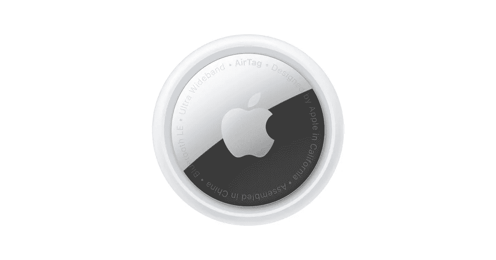
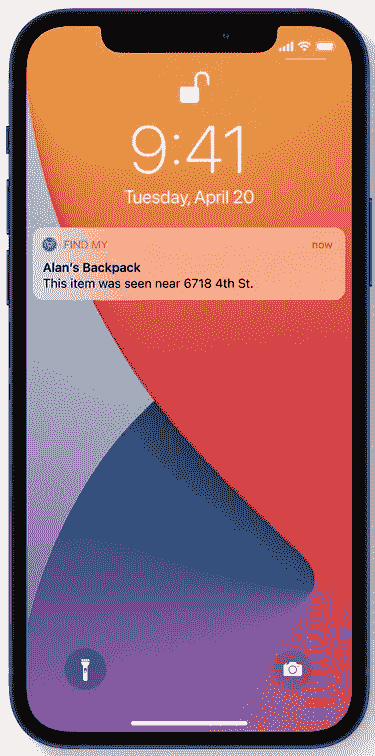
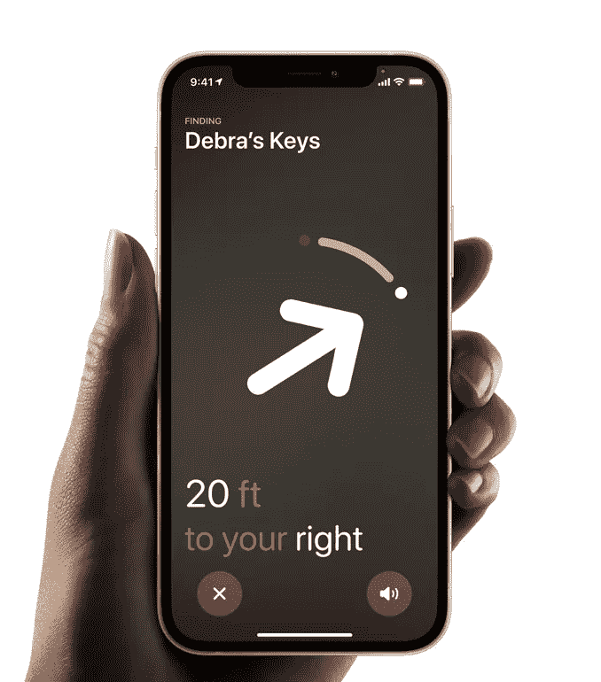

# 航空标签！非常贵，但是非常好。

> 原文：<https://medium.com/geekculture/airtags-crazy-expensive-but-crazy-good-2d50cfe8826d?source=collection_archive---------19----------------------->

空中标签是苹果公司的最新产品之一。随着 2021 年 4 月的发布，这些追踪器已经被吓坏了。今天我们要进入所有的好东西。它们是如何工作的。我对他们的看法。以及是否应该购买它们。

What the AirTag looks like.

# 它是如何工作的？

您的 AirTag 会发出一个安全的蓝牙信号，该信号可以被“查找我的网络”中附近的设备检测到。这些设备可能是 iPhones、iPads、MacBooks 等。这些设备会将您的 AirTag 的位置发送到 iCloud，然后您可以转到“查找我的应用程序”并在地图上查看它。整个过程是匿名和加密的，以保护您的隐私。它非常高效，因此无需担心电池寿命或数据使用情况。这类似于瓷砖的工作原理。唯一的区别是，由于“查找我的网络”上的人比 tile 网络上的人多，因此更容易精确跟踪 AirTags。这是因为 tile 必须找到使用该应用程序的人才能更新位置。因此，如果您居住在一个较小的城镇，这可能不足以有效地更新图块的位置。但是，如果你离你的磁贴很近，它会使用蓝牙连接到你自己的手机来更新位置。

# 迷失模式让寻找东西变得更加容易。

就像你的其他苹果设备一样，AirTag 可以进入丢失模式。我觉得这很奇怪，因为它们能帮你找到东西。无论如何，当它被网络中的设备检测到时，你会自动收到通知。你也可以设置它，这样别人就可以通过用支持 NFC 的智能手机点击你的 AirTag 来获取你的联系信息——这与人们用手机支付东西的技术相同。

Lost Mode.

# 精确跟踪

如果你的 AirTag 碰巧在附近，你的 iPhone 可以通过精确定位直接引导你找到它，这将引导你找到你的 AirTag。这都要归功于超宽带技术。如果你听不到铃声，这是一个很好的功能。

Percision Tracking! **Source: Apple**

# 内置安全性！

AirTag 恰好被设计用来吓唬不必要的跟踪。如果另一个人的 AirTag 出现在你的物品中，你的 iPhone 会注意到它与你同行，并向你发送提醒。过一会儿，如果你仍然没有找到它，AirTag 将开始播放一个空的声音，你知道它在那里。
当然，如果你碰巧和一个有航空标签的朋友在一起，或者在火车上有一大群人陪着航空标签，不要担心。只有当一个标签从它的拥有者那里被释放时，这些警报才会发生。

# **值得吗？**

是的，我会说这是值得的。所有这些功能可以让你准确地跟踪你的东西，如果你被跟踪，它会让你知道。这些东西从各个方面彻底摧毁了瓷砖贴纸。