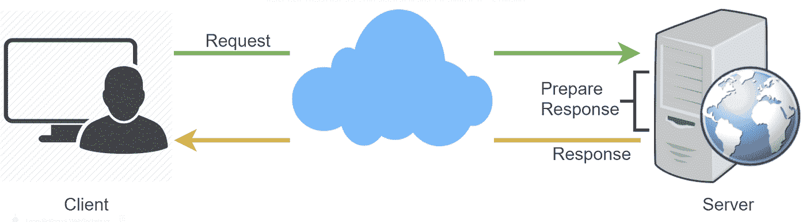
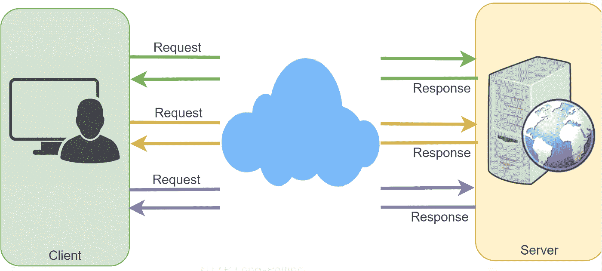
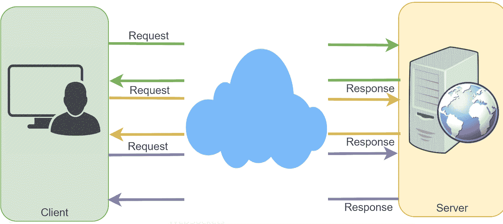
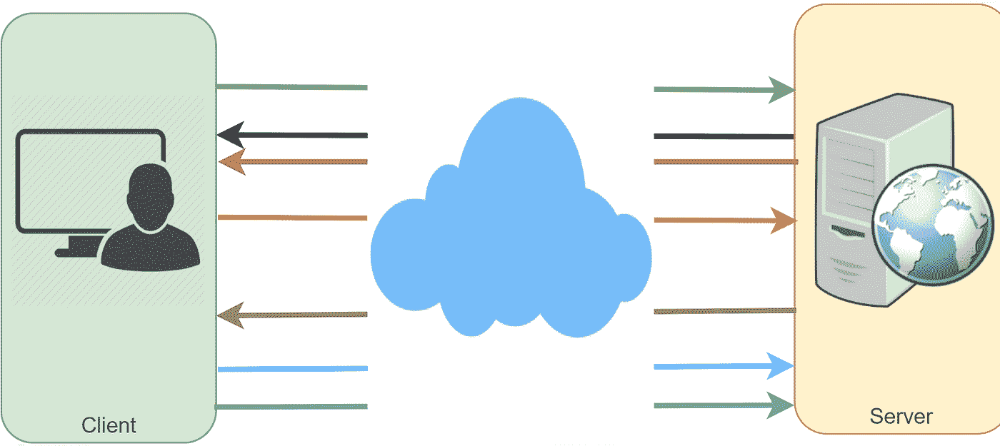

# Ajax 轮询 vs 长轮询 vs WebSockets vs 服务器发送事件

> 原文：<https://medium.com/geekculture/ajax-polling-vs-long-polling-vs-websockets-vs-server-sent-events-e0d65033c9ba?source=collection_archive---------9----------------------->

## Ajax 轮询、长轮询、WebSockets 和服务器发送事件是 web 浏览器和 web 服务器等客户端之间流行的通信协议。

首先，让我们从理解一个标准的 HTTP web 请求开始。以下是常规 HTTP 请求的一系列事件:

1.  客户端打开一个连接并向服务器请求数据。
2.  服务器计算响应。
3.  服务器将打开的请求的响应发送回客户机。

# Ajax 轮询

轮询是绝大多数 AJAX 应用程序使用的标准技术。基本思想是客户端反复轮询(或请求)服务器获取数据。客户端发出请求，等待服务器用数据响应。如果没有可用的数据，则返回一个空响应。

1.  客户端打开一个连接，并使用常规 HTTP 从服务器请求数据。
2.  所请求的网页定期(例如，0.5 秒)向服务器发送请求。
3.  服务器计算响应并将其发送回来，就像常规的 HTTP 流量一样。
4.  客户端定期重复上述三个步骤，从服务器获取更新

轮询的问题是客户端必须不断向服务器请求任何新数据。结果，许多响应都是空的，产生了 HTTP 开销。

# HTTP 长轮询

这种传统轮询技术的变体允许服务器在数据可用时将信息推送到客户机。使用长轮询时，客户机向服务器请求信息，就像常规轮询一样，但是预期服务器可能不会立即响应。这就是为什么这种技术有时被称为“悬挂获取”

*   如果服务器没有任何可供客户端使用的数据，服务器不会发送空响应，而是保留请求并等待，直到有数据可用。
*   一旦数据可用，就会向客户端发送一个完整的响应。然后，客户端立即从服务器重新请求信息，这样服务器几乎总是有一个可用的等待请求，它可以使用该请求来传递数据以响应事件。

使用 HTTP 长轮询的应用程序的基本生命周期如下:

1.  客户端使用常规 HTTP 发出初始请求，然后等待响应。
2.  服务器会延迟其响应，直到有更新可用或发生超时。
3.  当更新可用时，服务器向客户端发送完整的响应。
4.  客户端通常会在收到响应后立即发送新的长轮询请求，或者在暂停一段时间以允许可接受的等待时间后发送。
5.  每个长轮询请求都有超时。因此，在连接因超时而关闭后，客户端必须定期重新连接。

# WebSockets

WebSocket 通过单一 TCP 连接提供[全双工](https://en.wikipedia.org/wiki/Duplex_(telecommunications)#Full_duplex)通信通道。它在客户机和服务器之间提供了一个持久的连接，双方可以随时使用这个连接开始发送数据。客户端通过称为 WebSocket 握手的过程建立 WebSocket 连接。如果该过程成功，那么服务器和客户机可以在任何时候双向交换数据。WebSocket 协议能够以较低的开销实现客户端和服务器之间的通信，有助于服务器之间的实时数据传输。

# 服务器发送事件(SSEs)

在 SSEs 下，客户端与服务器建立持久的长期连接。服务器使用此连接向客户端发送数据。

如果客户端想要向服务器发送数据，则需要另一种技术/协议来完成。

1.  客户端使用常规 HTTP 从服务器请求数据。
2.  请求的网页打开到服务器的连接。
3.  只要有新的信息，服务器就将数据发送给客户机。

当我们需要从服务器到客户端的实时流量时，或者当服务器在循环中生成数据并向客户端发送多个事件时，SSEs 是最佳选择。

