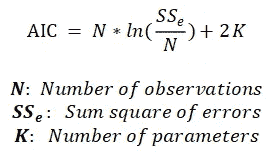
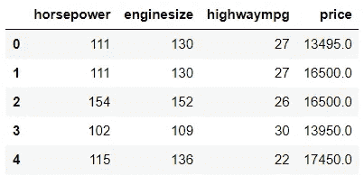
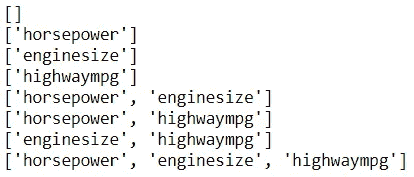
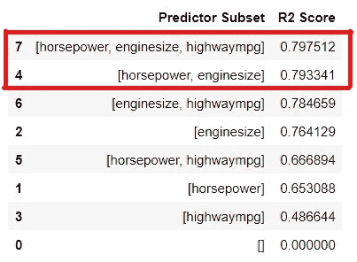
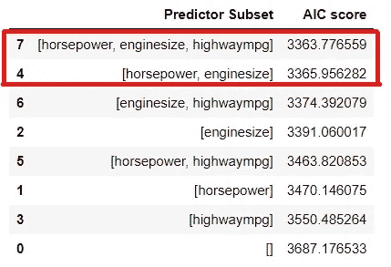
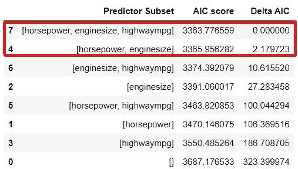

# 赤池信息准则:模型选择

> 原文：<https://medium.com/geekculture/akaike-information-criterion-model-selection-c47df96ee9a8?source=collection_archive---------10----------------------->


阿凯克信息准则或 AIC 是一种用于**模型选择**的统计方法。它帮助你比较**的候选型号**，并从中选出最好的。

候选模型可以是各自包含独立/预测变量的不同子集或组合的模型。

AIC 的目标是选择一个模型，它的**最好的**解释了自变量(参数)数量最少**的因变量的方差。因此，它有助于选择一个**更简单的**模型(参数更少)而不是一个**复杂的**模型(参数更多)。**

但是为什么选择简单的模型而不是复杂的模型呢？

*   为了减少过度拟合:

我们知道模型越复杂，它就越适合。然而，复杂性的增加可能导致过度拟合，即低偏差(高训练精度)和高方差(低测试精度)。因此，AIC 帮助处理简单和复杂模型之间的权衡。

*   减少参数数量(减少维度数量):

添加参数会增加计算成本。此外，不需要的参数可能会导致噪声的增加，从而妨碍模型中的**拟合优度**。AIC 分数有助于确定添加任何给定参数的成本是否合理。

AIC 测量丢失的信息，因此具有较低**AIC 分数的模型表明**更适合**。**

AIC 由两个重要方面组成

*   最大对数似然(衡量给定模型在多大程度上捕捉了因变量的方差)
*   参数数量

它是通过以下公式计算的:



因为更小的 AIC 分数是优选的，基于这个公式，增加更多的参数实际上**惩罚了**分数。因此，如果两个模型同等地解释了给定数据中的方差，则具有较少参数的模型将具有较低的 AIC 分数，并将被选为更好的拟合模型。

什么时候需要 AIC？

*   假设对于一个给定的问题陈述，您已经使用您的领域知识收集或搜集了必要的变量，但是您不确定这些变量是否是该问题的重要指标。
*   您缺少正确测试准确性所需的数据量。

需要注意的重要一点是，AIC 分数本身没有任何意义。必须将**与**另一款车型进行比较。

**让我们用一个例子深入探讨一下**

假设我有一个回归问题，我必须预测汽车的价格。让我给你一个数据框架的概述。

```
df.head()
```



*   自变量: ***马力*** *，* ***发动机尺寸*** *，* ***高速公路 mpg***
*   因变量: ***价格***

有三个参数。所以，

*   K = 3 + 1 = 4(模型中的参数数量+截距)

因此，子集(给定参数的组合)的数量是参数的 2^number = 2 = 8，因此换句话说，有 8 个候选模型。

```
# Print the subsets of parameters
import itertoolsfor i in range(len(all_cols)+1):
    for subset in itertools.combinations(all_cols, i):
        print(list(subset))
```



这里的空集指的是仅截取模型，可能是最简单的模型。

我将使用线性回归来拟合给定的模型。

```
y = df['price']
r2_scores = []
predictor_subsets = []for i in range(len(all_cols)+1):
    for subset in itertools.combinations(all_cols, i):
        model = LinearRegression(n_jobs = -1, normalize=False)

        cols = list(subset)
        predictor_subsets.append(cols) # If intercept-only model
        if len(cols) < 1:
            x = np.full(len(y), 0)
            x = x.reshape(-1, 1)

            model.fit(x, y) ypred = model.predict(x score = model.score(x, y)
            r2_scores.append(score)

        else:     
            x = df[cols] model.fit(x, y) ypred = model.predict(x) score = model.score(x, y)            
            r2_scores.append(score)
```

这些是拟合每个模型后的 R2 分数:

```
results_df = pd.DataFrame({'Predictor Subset': predictor_subsets,
                          'R2 Score': r2_scores})
```



你可以看到得分最高的模型包含所有的参数，而第二个模型包含除了 *highwaympg* 之外的所有参数，但是它们的 R2 得分的差异非常小。那么，R2 分数的这种轻微上升合理吗？

为了找出答案，让我们首先计算每个候选模型的 AIC 分数。

```
# Function to calculate the AIC score
# N: number of obervations
# K: Number of parameters
# mse: Mean squared error (SSe/N)def calculate_aic(N, mse, K):
    aic = N*np.log(mse)+2*K
    return aicy = df['price']
aic_scores = []for i in range(len(all_cols)+1):
    for subset in itertools.combinations(all_cols, i):
        model = LinearRegression(n_jobs = -1, normalize=False)

        cols = list(subset) #If intercept-only model
        if len(cols) < 1:
            x = np.full(len(y), 0)
            x = x.reshape(-1, 1)

            model.fit(x, y) ypred = model.predict(x)

            N = len(y)
            K = len(model.coef_) + 1
            mse = mean_squared_error(y, ypred) aic = calculate_aic(N, mse, K)
            aic_scores.append(aic)            

        else:     
            x = df[cols] model.fit(x, y) ypred = model.predict(x)

            N = len(y)
            K = len(model.coef_) + 1
            mse = mean_squared_error(y, ypred) aic = calculate_aic(N, mse, K)
            aic_scores.append(aic)
```

AIC 的分数是:



正如你所看到的，最佳型号**的 AIC 分数**(AIC 分数**最低的型号**)仅略低于次佳型号。为了证明额外参数的合理性，AIC 分数必须至少低 **2 个单位**。

让我们为每个模型计算**δAIC**。德尔塔 AIC 只是每个模型与最佳模型的 AIC 分数的**差**。所以，最佳模型的德尔塔 AIC 应该是 0。

```
results_df['Delta AIC'] = results_df['AIC score']- min(results_df['AIC score'])
```



您可以看到，最佳模型的 AIC 分数比第二好的模型低 2 个单位以上。由于 AIC 分数的差异足够显著，我们可以得出结论，通过添加 *highwaympg* 来略微增加 R2 分数是合理的。

换句话说，通过添加 *highwaympg* 解释的方差的增加对于添加它来说足够重要。

我们可以更进一步，计算每个模型的**加权 AIC 分数**。加权 AIC 分数给出了给定模型相对于所有其他模型的**预测能力**。

为了首先计算加权 AIC，计算模型的**相对可能性**，其正好是模型的 exp(-0.5 *δAIC)除以所有模型的加权 AIC 分数的总和。

```
results_df['Weighted AIC'] = round(np.exp(-0.5 * results_df['Delta AIC'])/sum(np.exp(-0.5 * results_df['Delta AIC'])), 4)
```


该表显示，与所有候选模型相比，前 2 个模型解释了几乎 100%的差异。

所以最好的模型是包含数据框架中所有独立变量的候选模型。它具有最低的 AIC 分数，包含大约 75%的预测能力，相比之下，第二好的模型包含 25%的预测能力。

基于以上分析，你可以选择由所有自变量组成的给定最佳模型来预测汽车的*价格*。

**总结**

*   Akaike 信息标准帮助您比较和选择最佳候选模型。
*   具有较低 AIC 分数的模型显示出更好的拟合。
*   更喜欢用最少的参数解释最大差异的模型。
*   用更多的参数惩罚模型。
*   与其他模型相比，AIC 分数必须至少低 2 个单位，才能足够显著。
*   加权 AIC 显示了给定模型相对于其他模型的预测能力。
*   AIC 分数本身没有意义。它必须与另一个模型进行比较。

数据:[来源](https://www.kaggle.com/hellbuoy/car-price-prediction)