# 带 Calico 网络策略的 AK

> 原文：<https://medium.com/geekculture/aks-with-calico-network-policies-8cdfa996e6bb?source=collection_archive---------4----------------------->

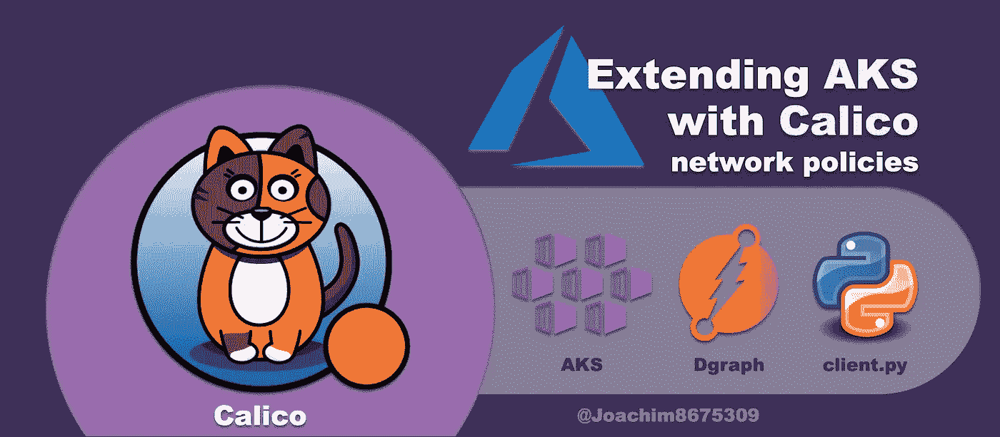

## 将 Calico 网络策略用于 Azure Kubernetes 服务器

[](https://kubernetes.io/docs/concepts/services-networking/network-policies/)**[**中的**](https://kubernetes.io/) 网络策略 Kubernetes** 本质上是针对 pod 的防火墙。默认情况下，可以从任何没有保护的地方访问 pod。如果您喜欢使用 [**网络策略**](https://kubernetes.io/docs/concepts/services-networking/network-policies/) ，您需要安装一个支持此功能的 [**网络插件**](https://kubernetes.io/docs/concepts/extend-kubernetes/compute-storage-net/network-plugins/) 。本文将演示如何在 [**AKS**](https://azure.microsoft.com/services/kubernetes-service/) 上使用 [**Calico**](https://www.tigera.io/project-calico/) 网络插件来使用此功能。

## 默认 Kubenet 网络插件

[**AKS**](https://azure.microsoft.com/services/kubernetes-service/) 以及许多其他 [**Kubernetes**](https://kubernetes.io/) 实现的默认网络插件是[**kubenet**](https://kubernetes.io/docs/concepts/extend-kubernetes/compute-storage-net/network-plugins/#kubenet)**:**

> 一个非常基本、简单的网络插件，仅在 Linux 上。它本身不实现更高级的功能，如跨节点联网或网络策略( [**ref**](https://kubernetes.io/docs/concepts/extend-kubernetes/compute-storage-net/network-plugins/#kubenet) )

虽然 [**kubenet**](https://kubernetes.io/docs/concepts/extend-kubernetes/compute-storage-net/network-plugins/#kubenet) 网络插件有限，但它提供了一些安全性，因为 pod 位于 NAT 后面的覆盖网络上。因此，除非操作员(您)配置一个 [**服务**](https://kubernetes.io/docs/concepts/services-networking/service/) 资源(`NodePort`或`LoadBalancer`)或一个 [**入口**](https://kubernetes.io/docs/concepts/services-networking/ingress/) 资源，否则无法从集群外部访问 pod。

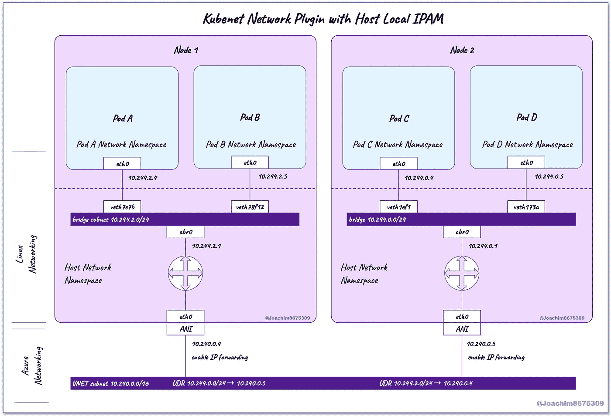

**关于图**:使用 [**kubenet**](https://kubernetes.io/docs/concepts/extend-kubernetes/compute-storage-net/network-plugins/#kubenet) ，向运行在同一个工作者节点上的 pod 前进的流量，然后它将只去本地桥`cbr0`到达目标 pod。如果目的地是另一个工作节点上的 pod，那么流量将通过 IP 转发发送到节点外部，并使用 Azure UDR(用户定义的路由)，将到达正确的工作节点，然后向下发送到该节点的本地桥`cbr0`。

## 保护内部群集流量

> 为什么我们需要对容器之间的网络数据包进行粒度控制？(参考[同事](https://www.linkedin.com/in/eclansky/)

定义网络策略允许您在为多级应用服务时启用类似于 [**深度防御**](https://en.wikipedia.org/wiki/Defense_in_depth_(computing)) 的功能。从本质上讲，您可能希望限制对传统虚拟机服务的访问的任何原因都与您希望限制对运行在容器上的服务的访问是一样的。

如果恶意或错误的实体破坏顶层，例如提供 web 服务的容器， [**网络策略**](https://kubernetes.io/docs/concepts/services-networking/network-policies/) 可以限制可以到达的进一步访问或层。

下面是一些可以使用 [**网络策略**](https://kubernetes.io/docs/concepts/services-networking/network-policies/) 的明显场景:

*   限制后台敏感的或 T2 关键的服务，如数据库、秘密金库、管理等。
*   限制*单个租户*之间的流量，以便包含客户*租户*的服务的 pod 无法与其他客户*租户*通信。
*   限制来自 [**Kubernetes**](https://kubernetes.io/) 集群外部的外部流量，尤其是当网络插件将 pod 与其他虚拟机停放在同一子网上时。
*   在服务不应该与未知服务通信的地方限制出站流量，尤其是在公共互联网上。

## Azure 网络插件

Azure 提供了一个更强大的插件，名为[**Azure CNI**](https://github.com/Azure/azure-container-networking)**，它将把 pod 与虚拟机停放在同一子网中。这对于其他虚拟机在不通过 [**Kubernetes**](https://kubernetes.io/) 服务的情况下访问[**Kubernetes**](https://kubernetes.io/)pods 非常有用。**

**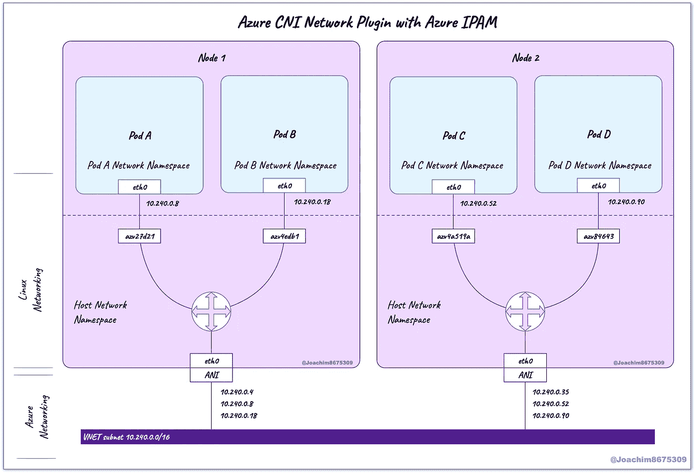**

**这里明显的 ***危险*** 是所有的 pod 现在都暴露在 [**Kubernetes**](https://kubernetes.io/) 集群之外的外部流量中，因此 [**网络策略**](https://kubernetes.io/docs/concepts/services-networking/network-policies/) 在这种情况下肯定变得至关重要。**

****注意**:[**Azure CNI**](https://github.com/Azure/azure-container-networking)网络插件附带了 [**网络策略**](https://kubernetes.io/docs/concepts/services-networking/network-policies/) 功能的有限子集，并依赖于底层 Azure 网络基础设施。使用 [**Calico**](https://www.tigera.io/project-calico/) ，您可以享受全套网络策略功能，而无需依赖 Azure 网络基础设施。**

## **教程概述**

**本文介绍了如何在一个真实的场景中使用网络策略，该场景包含一个敏感且关键的服务:一个名为 d graph 的高性能分布式图形数据库。**

**本文将通过这些测试或步骤来运行:**

1.  **在单独的名称空间中部署分布式图形数据库 [**Dgraph**](https://dgraph.io/) 和 [**Python**](https://www.python.org/) 客户端 pod**
2.  **部署一个 [**网络策略**](https://kubernetes.io/docs/concepts/services-networking/network-policies/) ，阻止所有流量，除了来自相同名称空间内的 pod 或来自具有所需标签的名称空间内的 pod**
3.  **在包含客户机 pod 的名称空间上添加所需的标签，以允许访问数据库服务( [**Dgraph**](https://dgraph.io/) )**

# **系列文章**

**本系列展示了如何保护 gRPC 和 HTTP 流量并对其进行负载平衡。**

1.  **[带 Azure 容器注册表的 AKS](https://joachim8675309.medium.com/aks-with-azure-container-registry-b7ff8a45a8a)**
2.  **[**【AKS】与**](https://joachim8675309.medium.com/aks-with-calico-network-policies-8cdfa996e6bb) (本文)**
3.  **[带 Linkerd 服务网格的 AKS](https://joachim8675309.medium.com/linkerd-service-mesh-on-aks-a75d60ef4f5a)**
4.  **[带 Istio 服务网格的 AKS](https://joachim8675309.medium.com/istio-service-mesh-on-aks-1b6ed16f6890)**

# **前一篇文章**

**在上一篇文章中，我记录了如何构建容器映像并将其推送到 [**Azure 容器注册表**](https://azure.microsoft.com/services/container-registry/) 。本文的部分内容将被重用来演示服务被阻塞时的 [**HTTP**](https://developer.mozilla.org/docs/Web/HTTP) 和 [**gRPC**](https://grpc.io/) 连接。**

**[](https://joachim8675309.medium.com/aks-with-azure-container-registry-b7ff8a45a8a) [## 带有 Azure 容器注册表的 AKS

### 通过 Azure Kubernetes 服务器使用 Azure 容器注册表

joachim8675309.medium.com](https://joachim8675309.medium.com/aks-with-azure-container-registry-b7ff8a45a8a) 

# 要求

要创建 [**Azure**](https://azure.microsoft.com/) 云资源，您需要订阅，以便创建资源。

## 所需工具

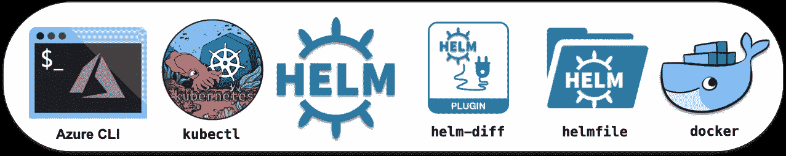

本文需要这些工具:

*   [**Azure CLI 工具**](https://docs.microsoft.com/en-us/cli/azure/install-azure-cli) ( `az`):与 Azure API 交互的命令行工具。
*   [**Kubernetes 客户端工具**](https://kubernetes.io/docs/tasks/tools/) ( `kubectl`):与 Kubernetes API 交互的命令行工具
*   [**Helm**](https://helm.sh/) ( `helm`):命令行工具，用于"*模板化和共享 Kubernetes 清单* " ( [**ref**](https://tanzu.vmware.com/developer/guides/kubernetes/helmfile-what-is/) )，捆绑成 Helm chart 包。
*   [**helm-diff**](https://github.com/databus23/helm-diff) 插件:允许您在应用更改之前查看用`helm`或`helmfile`所做的更改。
*   [**Helm file**](https://github.com/roboll/helmfile)(`helmfile`):命令行工具，使用“*声明性规范在多种环境中部署掌舵图*”([**ref**](https://tanzu.vmware.com/developer/guides/kubernetes/helmfile-what-is/))。
*   [**Docker**](https://docs.docker.com/get-docker/)**(`docker`):构建、测试、推送 Docker 镜像的命令行工具。**

## **可选工具**

****

**由于大多数与 [**gRPC**](https://grpc.io/) 或 [**HTTP**](https://developer.mozilla.org/docs/Web/HTTP) 交互的工具都包含在 [**Docker**](https://www.docker.com/) 镜像中，所以只推荐 shell 来管理环境变量和运行脚本:**

*   **[**POSIX shell**](https://pubs.opengroup.org/onlinepubs/9699919799/utilities/V3_chap02.html)**(`sh`)如 [**GNU Bash**](https://www.gnu.org/software/bash/) ( `bash`)或 [**Zsh**](https://www.zsh.org/) ( `zsh`):本指南中的这些脚本已经在 macOS 和 Ubuntu Linux 上使用这些 shell 中的任何一个进行了测试。****

# ****项目设置****

****下面是本文将使用的文件结构:****

```
**~/azure_calico/
├── env.sh
└── examples
    ├── dgraph
    │   ├── helmfile.yaml
    │   └── network_policy.yaml
    └── pydgraph
        ├── Dockerfile
        ├── Makefile
        ├── helmfile.yaml
        ├── requirements.txt
        ├── load_data.py
        ├── sw.nquads.rdf
        └── sw.schema**
```

****使用 [**Bash**](https://www.gnu.org/software/bash/) 或 [**Zsh**](https://www.zsh.org/) ，您可以使用以下命令创建文件结构:****

```
****mkdir** -p ~/azure_calico/examples/{dgraph,pydgraph}
**cd** ~/azure_calico

**touch** \
 env.sh \
 ./examples/dgraph/network_policy.yaml \
 ./examples/{dgraph,pydgraph}/helmfile.yaml \
 ./examples/pydgraph/{Dockerfile,Makefile,requirements.txt} \
 ./examples/pydgraph/{load_data.py,sw.schema,sw.nquads.rdf}**
```

## ****项目环境变量****

****在下面设置这些环境变量，以便在本文中使用的不同工具之间保持一致的环境。如果您正在使用一个 [**POSIX shell**](https://pubs.opengroup.org/onlinepubs/9699919799/utilities/V3_chap02.html) ，您可以将它们保存到一个脚本中，并在需要时获取该脚本。****

****复制该源脚本并另存为`env.sh`:****

# ****提供 Azure 资源****

****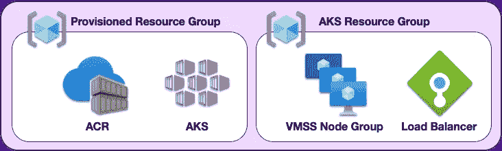****

****Azure Resources****

****[**AKS**](https://azure.microsoft.com/services/kubernetes-service/)**[**Azure CNI**](https://github.com/Azure/azure-container-networking)和 [**Calico**](https://www.tigera.io/project-calico/) 网络策略和 [**ACR**](https://azure.microsoft.com/services/container-registry/) 云资源都可以通过下面脚本中概述的以下步骤进行调配:******

## ****验证 AKS 和 KUBCONFIG****

****通过运行以下命令，验证 [**AKS**](https://azure.microsoft.com/services/kubernetes-service/) 集群是否已创建，以及您是否拥有被授权访问该集群的 **KUBCONFIG** :****

```
****source** env.sh
**kubectl** get all **--all-namespaces****
```

****结果应该类似于以下内容:****

****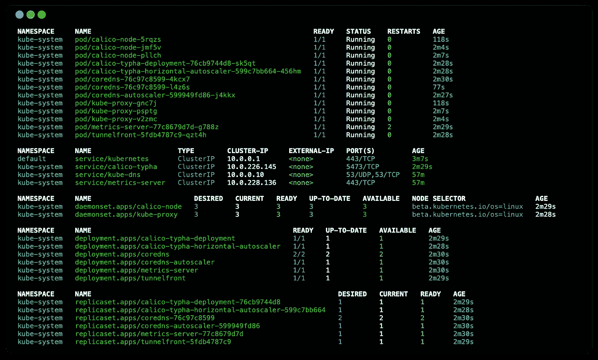****

******AKS with Calico (before 2021-Aug-01)******

******注意**:最近的变化(2021 年 8 月 1 日)已经将 [**印花布**](https://www.tigera.io/project-calico/) 组件移动到它们自己的名称空间中。****

****对于节点本身，您可以闪烁显示信息，如节点名称和 IP 地址:****

```
****JP**='{range .items[*]}{@.metadata.name}{"\t"}{@.status.addresses[?(@.type == "InternalIP")].address}{"\n"}{end}'**kubectl** get nodes **--output** jsonpath="**$JP**"**
```

****这将显示 [**Azure VNET**](https://docs.microsoft.com/azure/virtual-network/virtual-networks-overview) 子网中的工作节点及其 IP 地址:****

```
**aks-nodepool1-56788426-vmss000000       10.240.0.4
aks-nodepool1-56788426-vmss000001       10.240.0.35
aks-nodepool1-56788426-vmss000002       10.240.0.66**
```

# ****数据图表服务****

****[**Dgraph**](https://dgraph.io/) 是一个分布式图形数据库，可通过以下步骤安装。****

****将以下内容另存为`examples/dgraph/helmfile.yaml`:****

****现在运行下面的代码来部署 [**Dgraph**](https://dgraph.io/) 服务:****

```
****source** env.sh
**helmfile --file** examples/dgraph/helmfile.yaml apply**
```

****完成后， [**图**](https://dgraph.io/) 簇准备就绪大约需要 2 分钟。您可以通过以下方式进行检查:****

```
****kubectl** **--namespace** dgraph get all**
```

****这应该会显示如下内容:****

****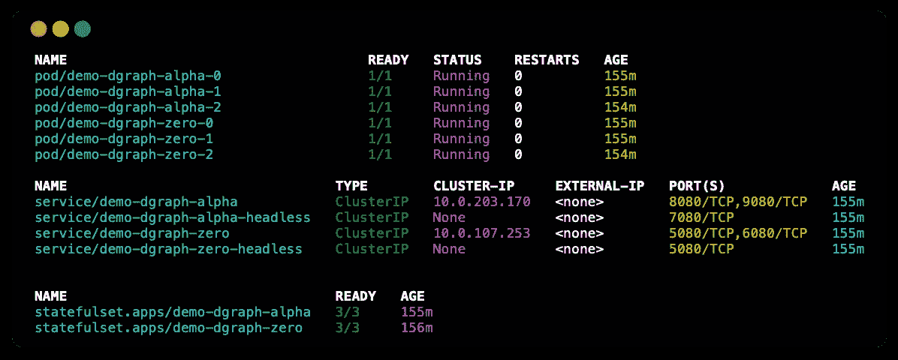****

****Dgraph deployment****

****有趣的是，您可以查看分配给 pod 的 IP 地址，而不是它们是 [**Azure VNET**](https://docs.microsoft.com/azure/virtual-network/virtual-networks-overview) 子网，虚拟机使用的子网与 [**Kubernetes**](https://kubernetes.io/) 工作节点共享的子网相同:****

```
****JP**='{range .items[*]}{@.metadata.name}{"\t"}{@.status.podIP}{"\n"}{end}'**kubectl** get pods **--output** jsonpath="**$JP**"**
```

****在该实现中，这显示了:****

```
**demo-dgraph-alpha-0      10.240.0.74
demo-dgraph-alpha-1      10.240.0.30
demo-dgraph-alpha-2      10.240.0.49
demo-dgraph-zero-0       10.240.0.24
demo-dgraph-zero-1       10.240.0.38
demo-dgraph-zero-2       10.240.0.81**
```

# ****pydgraph 客户端****

****在前一篇博客中，我记录了构建和发布一个`pygraph-client`映像，然后使用该映像部署一个容器的步骤。****

## ****获取构建和部署脚本****

****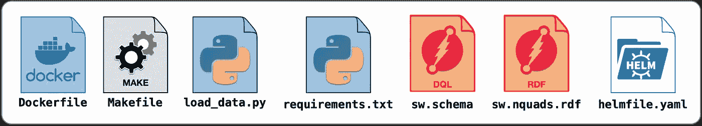****

****下面是一个脚本，您可以使用它来下载 gists，并通过这些步骤填充所需的文件。****

******注**:这些脚本和进一步的细节在上一篇文章中有所涉及(参见[**【AKS with Azure Container Registry**](https://joachim8675309.medium.com/aks-with-azure-container-registry-b7ff8a45a8a)**)**。****

## ****构建、推送和部署 pydgraph 客户端****

****现在所有需要的源文件都可用了，构建映像:****

```
****source** env.sh
**az** acr login **--name** ${AZ_ACR_NAME}
**pushd** ~/azure_calico/examples/pydgraph**make** build && **make** push **helmfile** apply**popd****
```

****运行`kubectl get all -n pydgraph-client`之后，应该会产生如下结果:****

****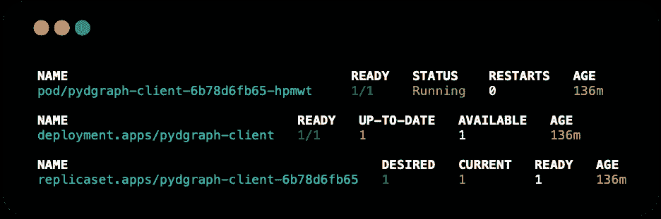****

****pydgraph-client deployment****

## ****登录 pydgraph-client 容器****

****对于接下来的三个测试，您将需要登录到容器中。这可以通过以下方法实现。****

```
****PYDGRAPH_POD**=$(**kubectl** get pods \
  **--namespace** pydgraph-client \
  **--output** name
)**kubectl** exec **-ti --namespace** pydgraph-client **${PYDGRAPH_POD}** -- **bash****
```

# ****测试 0(基线):没有网络策略****

****在对网络策略进行任何测试之前，进行一次基本检查以验证一切正常。****

****在这个健全性检查和继续测试中，将测试 [**HTTP**](https://developer.mozilla.org/en-US/docs/Web/HTTP) (端口`8080`)和 [**gRPC**](https://grpc.io/) (端口`9080`)。****

****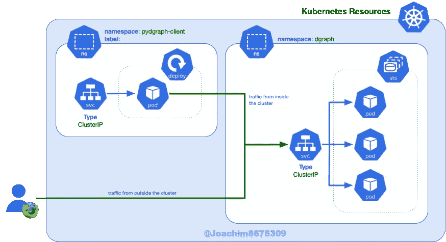****

****No Network Policy****

## ****HTTP 检查(无网络策略)****

****登录到`pydgraph-client`窗格并运行以下命令:****

```
**curl **${DGRAPH_ALPHA_SERVER}**:8080/health | jq**
```

****预期结果应该是 [**图**](https://dgraph.io/) 阿尔法节点之一的健康状态:****

****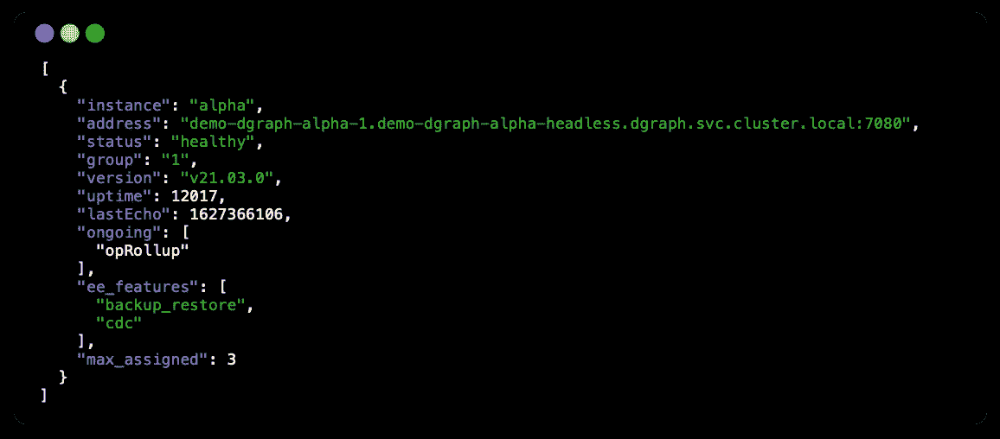****

****/health (HTTP)****

## ****gRPC 检查(无网络策略)****

****登录`pydgraph-client` pod 并运行该命令:****

```
****grpcurl -plaintext -proto** api.proto \
  **${DGRAPH_ALPHA_SERVER}**:9080 \
  api.Dgraph/CheckVersion**
```

****预期结果将是为 [**Dgraph**](https://dgraph.io/) 服务器版本。****

****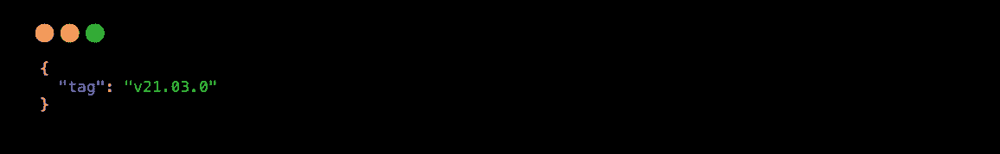****

****api.Dgraph/CheckVersion (gRPC)****

# ****测试 1:应用网络策略****

****在本测试中，您将添加一个拒绝所有流量的网络策略，除非这些数据包来自正确标签的名称空间。此测试的验收标准客户端将无法连接到 Dgraph 服务。****

****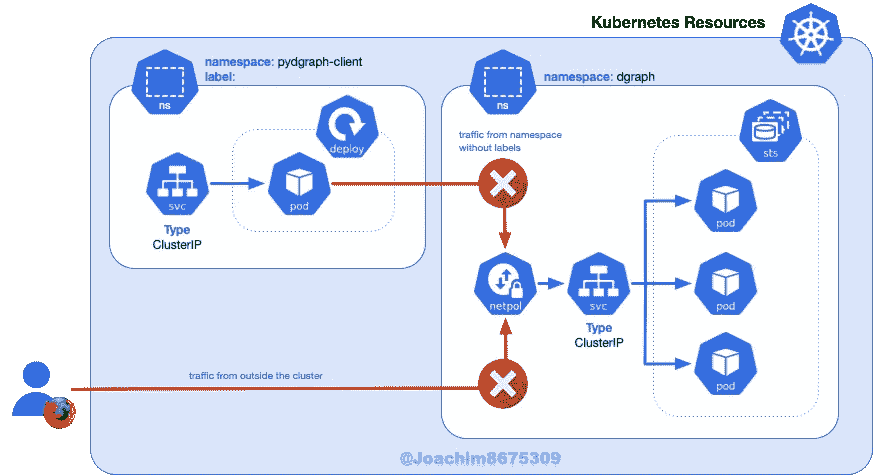****

****Network Policy added****

## ****添加网络策略****

****该策略将拒绝所有到 Dgraph Alpha pods 的流量，除了来自同一名称空间内的流量或来自标签为`app=dgraph-client`和`env=test`的名称空间中的 pod 的流量。****

****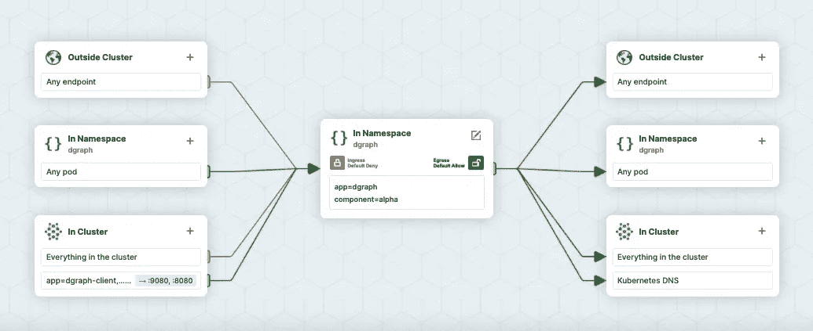****

******Dgraph Network Policy (made with** [https://editor.cilium.io/](https://editor.cilium.io/)**)******

****抄写以下内容，并说为`examples/dgraph/network_policy.yaml`:****

****准备就绪后，将其应用于:****

```
****kubectl --filename** ./examples/dgraph/network_policy.yaml apply**
```

## ****HTTP 检查(应用网络策略)****

****登录到`pydgraph-client` pod，并运行以下命令:****

```
**curl **${DGRAPH_ALPHA_SERVER}**:8080/health**
```

****预期结果在这种情况下，经过很长时间的等待(大约 5 分钟)，结果将是超时:****

********

## ****gRPC 检查(应用网络策略)****

****登录到`pydgraph-client`窗格并运行以下命令:****

```
****grpcurl -plaintext -proto** api.proto \
  **${DGRAPH_ALPHA_SERVER}**:9080 \
  api.Dgraph/CheckVersion**
```

****大约 10 秒后 [**gRPC**](https://grpc.io/) 的预期结果将是:****

****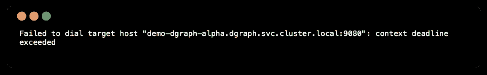****

****api.Dgraph/CheckVersion (gRPC)****

# ****测试 2:允许流量进入服务****

****既然我们已经演示了连接性与访问是隔离的，我们可以向名称空间添加适当的标签，以便允许流量。****

****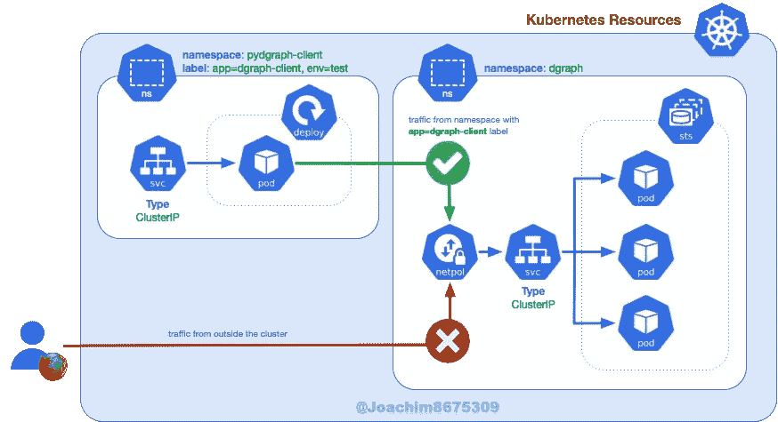****

****Label app=dgraph-client added****

## ****允许客户访问数据图****

```
****kubectl** label namespaces pydgraph-client env=test app=dgraph-client**
```

****执行此命令后，将添加新标签:****

********

******View of namespace labels (Lens tool** [https://k8slens.dev/](https://k8slens.dev/)**)******

## ****HTTP 检查(应用了名称空间标签)****

****登录到`pydgraph-client`窗格，并运行以下命令:****

```
**curl **${DGRAPH_ALPHA_SERVER}**:8080/health | jq**
```

****对此的预期结果是，关于健康的 JSON 数据来自其中一个[**d graph**](https://dgraph.io/)Alpha pod。****

********

****/health (HTTP)****

## ****gRPC 检查(应用了名称空间标签)****

****登录到`pydgraph-client`窗格并运行以下命令:****

```
****grpcurl -plaintext -proto** api.proto \
  **${DGRAPH_ALPHA_SERVER}**:9080 \
  api.Dgraph/CheckVersion**
```

****对此的预期结果是 JSON 详细说明了 [**Dgraph**](https://dgraph.io/) 服务器版本。****

********

****api.Dgraph/CheckVersion (gRPC)****

# ****清除****

****这将删除 [**AKS**](https://azure.microsoft.com/services/kubernetes-service/) 集群以及 [**AKS**](https://azure.microsoft.com/services/kubernetes-service/) 中的任何调配资源，包括通过 [**Dgraph**](https://dgraph.io/) 部署创建的外部卷。****

```
****az** aks delete \
  **--resource-group** **$AZ_RESOURCE_GROUP** \
  **--name** **$AZ_CLUSTER_NAME****
```

# ****资源****

****这些是我在研究这篇文章时在网上找到的一些资源。****

## ****博客源代码****

*   ******拥有 Azure CNI 和 Calico 网络策略的 AKS**:[https://github . com/darkn 3 rd/blog _ tutorials/tree/master/kubernetes/AKS/series _ 2 _ Network _ MGM nt/part _ 2 _ Calico](https://github.com/darkn3rd/blog_tutorials/tree/master/kubernetes/aks/series_2_network_mgmnt/part_2_calico)****

## ****网络策略工具****

*   ******在线图形网政策编辑**:[https://editor.cilium.io/](https://editor.cilium.io/)****

## ****网络策略文章****

*   ******Kubernetes Ingress 网络政策指南**:[https://www . open shift . com/blog/Guide-to-Kubernetes-Ingress-Network-Policies](https://www.openshift.com/blog/guide-to-kubernetes-ingress-network-policies)****
*   ******保护 Kubernetes 集群网络**:[https://ahmet.im/blog/kubernetes-network-policy/](https://ahmet.im/blog/kubernetes-network-policy/)****
*   ******Kubernetes 网络政策入门**:[https://docs . project calico . org/security/Kubernetes-network-policy](https://docs.projectcalico.org/security/kubernetes-network-policy)****

## ****录像****

*   ******Kubernetes 在 Azure 上联网【https://youtu.be/JyLtg_SJ1lo**:****

## ****证明文件****

*   ******网络政策**:[https://kubernetes . io/docs/concepts/services-networking/Network-Policies/](https://kubernetes.io/docs/concepts/services-networking/network-policies/)****
*   ******网络插件**:[https://kubernetes . io/docs/concepts/extend-kubernetes/compute-storage-net/Network-Plugins/](https://kubernetes.io/docs/concepts/extend-kubernetes/compute-storage-net/network-plugins/)****
*   ******集装箱网络接口**:[https://github.com/containernetworking/cni](https://github.com/containernetworking/cni)****

## ****支持网络策略的网络插件****

*   ******印花布**:[https://www.tigera.io/project-calico/](https://www.tigera.io/project-calico/)****
*   ******蔚蓝的 CNI**:[https://github.com/Azure/azure-container-networking](https://github.com/Azure/azure-container-networking)****
*   ******纤毛【https://cilium.io/】:******
*   ******织网**:[https://www.weave.works/docs/net/latest/overview/](https://www.weave.works/docs/net/latest/overview/)****
*   ******胃窦**:[https://antrea.io/](https://antrea.io/)****

# ****结论****

****安全性是基础设施中至关重要且必要的一部分，随着富容器编排平台的引入，安全性并没有消失，因为在平台层( [**Kubernetes**](https://kubernetes.io/) )以及基础设施层( [**Azure**](https://azure.microsoft.com/) )仍然需要安全性。****

****在本教程中，安全性对于后端分布式图形数据库 [**Dgraph**](https://dgraph.io/) 来说很重要。只有管理 [**Dgraph**](https://dgraph.io/) 操作方面的指定客户端和自动化，如 [**备份**](https://dgraph.io/docs/enterprise-features/binary-backups/) 和 [**实时加载**](https://dgraph.io/docs/deploy/fast-data-loading/live-loader/) ，才应被允许访问，而其他所有内容都被拒绝访问。****

## ****超越网络策略****

****除了网络策略限制对[**Kubernetes**](https://kubernetes.io/)pod 的访问，pod 之间的流量应该是安全的，这被称为 [**传输中的加密**](https://www.ncsc.gov.uk/collection/cloud-security/implementing-the-cloud-security-principles/data-in-transit-protection) 。****

****本文是探索面向 [**服务网格**](https://buoyant.io/what-is-a-service-mesh) 的流量安全的重要一步，它可以自动配置 [**相互 TLS**](https://learn.akamai.com/en-us/webhelp/iot/internet-of-things-over-the-air-user-guide/GUID-21EC6B74-28C8-4CE1-980E-D5EE57AD9653.html) 用于短暂的临时 pod。****

****感谢您阅读我的文章。我希望这对你的 [**Kubernetes**](https://kubernetes.io/) 旅程有用，祝你成功。******