# 带证书管理器的 AKS

> 原文：<https://medium.com/geekculture/aks-with-cert-manager-f24786e87b20?source=collection_archive---------0----------------------->


## 将 cert-manager 插件与 AKS 一起使用

本文详细介绍了如何使用 [**TLS**](https://en.wikipedia.org/wiki/Transport_Layer_Security) 和来自可信 [**CA**](https://en.wikipedia.org/wiki/Certificate_authority) 和公共域的证书来保护 web 流量。这就要用到 [**让我们通过一个流行的**](https://letsencrypt.org/)**[**Kubernetes**](https://kubernetes.io/)add-on[**cert-manager**](https://cert-manager.io)。**

在本文中，我们将使用以下组件:

*   Azure 资源: [**AKS**](https://azure.microsoft.com/en-us/services/kubernetes-service/) ，[**Azure DNS**](https://azure.microsoft.com/services/dns/)zone
*   Kubernetes 附加组件: [**证书管理器**](https://cert-manager.io) ， [**外部-dns**](https://github.com/kubernetes-sigs/external-dns) ， [**入口-nginx**](https://github.com/kubernetes/ingress-nginx)
*   应用示例:[**hello-kubernetes**](https://github.com/paulbouwer/hello-kubernetes)，[**Dgraph**](https://dgraph.io/)**([**Dgraph 掌舵图**](https://artifacthub.io/packages/helm/dgraph/dgraph) )**

**⚠️ **警告**:这使用 kublet 身份，一个分配给集群中所有节点的身份或主体，来访问 Azure DNS。这意味着群集上的所有容器都有权读取/写入域的 DNS 记录。虽然这对于有限的测试环境可能没什么问题，但是这种**永远不应该用于生产**。这违反了[最小特权原则](https://en.wikipedia.org/wiki/Principle_of_least_privilege)。配置访问的备选方案是 [**AAD Pod 标识**](https://github.com/Azure/aad-pod-identity) 或更近的 [**工作负载标识**](https://azure.github.io/azure-workload-identity/docs/) 。**

## **证书管理器概述**

**保护 web 应用程序或服务的一个常见场景是使用 [**TLS**](https://en.wikipedia.org/wiki/Transport_Layer_Security) 证书加密流量，加密将在负载平衡器处终止。在 [**Kubernetes**](https://kubernetes.io/) 到来之前， [**nginx**](https://www.nginx.com/) 是这一过程的流行解决方案。**

**在 [**Kubernetes**](https://kubernetes.io/) 平台上， [**ingress**](https://kubernetes.io/docs/concepts/services-networking/ingress/) 资源通过[**ingress-nginx**](https://github.com/kubernetes/ingress-nginx)控制器执行 [**TLS 终止**](https://en.wikipedia.org/wiki/TLS_termination_proxy) 。这允许从用户到端点的安全通信，而端点后面的一切都没有加密，从而允许更容易的配置、监控和调试。**

**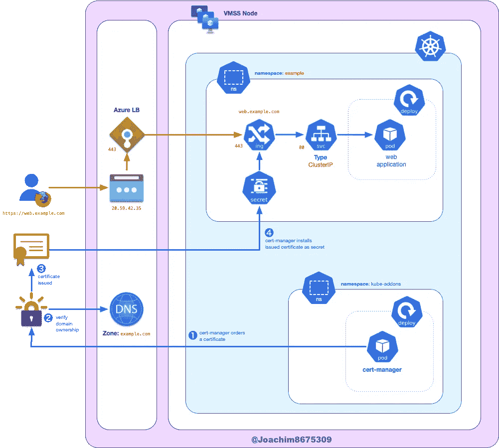**

****cert-manager process****

**[**证书管理器**](https://cert-manager.io) 插件将监控 [**入口**](https://kubernetes.io/docs/concepts/services-networking/ingress/) 事件，然后安装或更新证书以用于网络流量加密。这发生在以下步骤中:**

1.  **[**cert-manager**](https://cert-manager.io) 向由 [**管理的**](https://letsencrypt.org/) **[**ACME**](https://en.wikipedia.org/wiki/Automated_Certificate_Management_Environment) CA 提交订单，让我们加密** 。**
2.  **在 Azure DNS 上进行挑战(`DNS01`)以读取/写入 DNS 记录，从而证明用户拥有该域。**
3.  **当挑战被满足时，由一个 [**ACME**](https://en.wikipedia.org/wiki/Automated_Certificate_Management_Environment) CA 发布一个证书。**
4.  **[**证书管理器**](https://cert-manager.io) 随后将使用证书创建秘密，入口控制器将使用该秘密来保护 web 流量。**

# **系列文章**

**这些文章是系列文章的一部分，下面是系列文章的列表。**

1.  **[带外部 dns 的 AK](https://joachim8675309.medium.com/extending-aks-with-external-dns-3da2703b9d52):`service`带`LoadBalancer`类型**
2.  **[带 ingress-nginx 的 AK](https://joachim8675309.medium.com/aks-with-ingress-nginx-7c51da500f69):`ingress`(HTTP)**
3.  **[**带证书管理器的 AKS**](/geekculture/aks-with-cert-manager-f24786e87b20)**:**`**ingress**`**【HTTPS】****
4.  **[带 GRPC 和 ingress-nginx 的 AK](https://joachim8675309.medium.com/aks-with-grpc-and-ingress-nginx-32481a792a1):`ingress`(GRPC 和 HTTPS)**

## **以前的文章**

*****AKS+ingress-ginx+external-DNS*:**在上一篇文章中我介绍了如何部署[**ingress-nginx**](https://github.com/kubernetes/ingress-nginx)以及 [**external-dns**](https://github.com/kubernetes-sigs/external-dns) :**

**[](https://joachim8675309.medium.com/aks-with-ingress-nginx-7c51da500f69) [## 带入口的 AKS-nginx

### 将 ingress-nginx 插件与 Azure LB 和 AKS 一起使用

joachim8675309.medium.com](https://joachim8675309.medium.com/aks-with-ingress-nginx-7c51da500f69) 

***AKS +外部 dns* :** 在本系列的第一篇文章中，我介绍了如何部署 [**外部 dns**](https://github.com/kubernetes-sigs/external-dns) 以用于`LoadBalancer`类型的服务。

[](https://joachim8675309.medium.com/extending-aks-with-external-dns-3da2703b9d52) [## 带外部 DNS 的 AK

### 将外部 dns 插件与 Azure DNS 和 AKS 一起使用

joachim8675309.medium.com](https://joachim8675309.medium.com/extending-aks-with-external-dns-3da2703b9d52) 

# 要求

本文的一些逻辑和工具需求如下:

## 注册域名

当使用受信任的 [**TLS**](https://en.wikipedia.org/wiki/Transport_Layer_Security) 证书(或者换句话说，由受信任的 [**CA**](https://en.wikipedia.org/wiki/Certificate_authority) 颁发的证书)来保护 web 流量时，您需要拥有一个*公共域名*，它可以从提供商那里购买，每年大约 2 到 20 美元。

将使用一个虚构的域`example.com`作为示例。因此，根据所使用的示例，可能会有`hello.example.com`、`ratel.example.com`和`alpha.example.com`。

## 所需工具

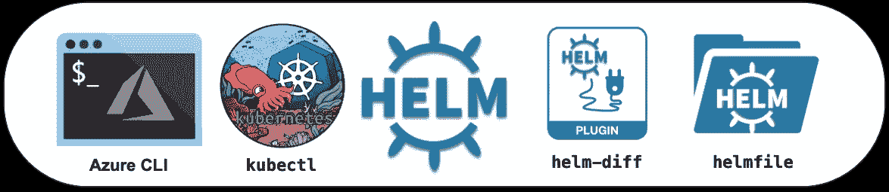

本文需要这些工具:

*   [**Azure CLI 工具**](https://docs.microsoft.com/en-us/cli/azure/install-azure-cli) ( `az`):与 Azure API 交互的命令行工具
*   [**Kubernetes 客户端工具**](https://kubernetes.io/docs/tasks/tools/) ( `kubectl`):与 Kubernetes API 交互的命令行工具
*   [**Helm**](https://helm.sh/) ( `helm`):命令行工具，用于“*模板化和共享 Kubernetes 清单*”，捆绑为 Helm chart 包。
*   [**helm-diff**](https://github.com/databus23/helm-diff) 插件:允许您在应用更改之前查看用`helm`或`helmfile`所做的更改。
*   [**Helm file**](https://github.com/roboll/helmfile)(`helmfile`):命令行工具，使用“*声明性规范在多种环境中部署舵图*”。

## 可选工具


我强烈推荐这些工具:

*   [**POSIX shell**](https://pubs.opengroup.org/onlinepubs/9699919799/utilities/V3_chap02.html)**(`sh`)如 [**GNU Bash**](https://www.gnu.org/software/bash/) ( `bash`)或 [**Zsh**](https://www.zsh.org/) ( `zsh`):本指南中的这些脚本已经在 macOS 和 Ubuntu Linux 上使用这些 shell 中的任何一个进行了测试。**
*   **[**curl**](https://curl.se/) ( `curl`):从命令行与 web 服务交互的工具。**
*   **[**jq**](https://stedolan.github.io/jq/) ( `jq`):一个 JSON 处理器工具，可以从 JSON 中转换和提取对象，并为彩色 JSON 输出提供更好的可读性。**

# **项目设置**

**由于这个项目有几个活动部分( [**Azure DNS**](https://docs.microsoft.com/azure/dns/dns-overview) ， [**AKS**](https://azure.microsoft.com/en-us/services/kubernetes-service/) ， [**cert-manager**](https://cert-manager.io) ， [**external-dns**](https://github.com/kubernetes-sigs/external-dns) ，[**inginx**](https://github.com/kubernetes/ingress-nginx))以及示例应用 [**Dgraph**](https://dgraph.io/) 和 [**你好**](https://github.com/paulbouwer/hello-kubernetes)**

## **项目文件结构**

**将使用以下结构:**

```
~/azure_cert_manager/
├── env.sh
├── examples
│   ├── dgraph
│   │   └── helmfile.yaml
│   └── hello
│       └── helmfile.yaml
└── helmfile.yaml
```

**使用 [**Bash**](https://www.gnu.org/software/bash/) 或 [**Zsh**](https://www.zsh.org/) ，您可以使用以下命令创建文件结构:**

```
**mkdir** -p ~/azure_cert_manager/examples/{dgraph,hello} && \
  **cd** ~/azure_cert_manager

**touch** \
  env.sh \
  helmfile.yaml \
  ./examples/{dgraph,hello}/helmfile.yaml
```

**这些指令从这一点开始将假设您在`~/azure_ingress_nginx`目录中，所以当有疑问时:**

```
**cd** ~/azure_cert_manager
```

## **项目环境变量**

**在下面设置这些环境变量，以保持各种工具之间的一致性:`[**helm**](https://helm.sh/)`、`[**helmfile**](https://www.terraform.io/)`、`[**kubectl**](https://kubernetes.io/docs/tasks/tools/#kubectl)`、`[**jq**](https://stedolan.github.io/jq/)`、`[**az**](https://docs.microsoft.com/cli/azure/install-azure-cli)`、**。****

**如果您使用的是一个 [**POSIX shell**](https://pubs.opengroup.org/onlinepubs/9699919799/utilities/V3_chap02.html) ，您可以将它们保存到一个脚本中，并在需要时获取该脚本。复制该源脚本并另存为`env.sh`:**

# **Azure 组件**

**下面是需要的 [**Azure**](https://azure.microsoft.com) 具体配置。您可以使用下面的内容，以前文章中的材料，或者您自己的自动化提供的资源。**

**如果您使用自己的自动化来供应 [**Azure**](https://azure.microsoft.com) 云资源，您将需要记住这些要求:**

*   ***域控制*:域控制必须从您的域提供商传递到 [**Azure DNS**](https://docs.microsoft.com/azure/dns/dns-overview) 域，或者如果使用子域，将 NS 记录指向托管子域的 [**Azure DNS**](https://docs.microsoft.com/azure/dns/dns-overview) 名称服务器。**
*   ***具有托管身份的 AK*:[**AK**](https://azure.microsoft.com/services/kubernetes-service/)([**Azure Kubernetes 服务**](https://azure.microsoft.com/services/kubernetes-service/) )必须为[**【VMSS】**](https://docs.microsoft.com/azure/virtual-machine-scale-sets/overview)([**虚拟机规模集**](https://docs.microsoft.com/azure/virtual-machine-scale-sets/overview) )创建的 Kubernetes 工作节点启用托管身份**

## **资源组**

**在 [**Azure**](https://azure.microsoft.com) 中，资源被组织在资源组下。**

```
**source** env.sh**az** group create **\
  --resource-group** **${AZ_RESOURCE_GROUP}** \
  **--location** **${AZ_LOCATION}**
```

## **云资源**

**为简单起见，您可以使用以下内容创建该项目所需的资源:**

```
**source** env.sh**az** network dns zone create **\
  --resource-group** **${AZ_RESOURCE_GROUP}** \
  **--name** **${AZ_CLUSTER_NAME}az** aks create \
  **--resource-group** **${AZ_RESOURCE_GROUP}** \
  **--name** **${AZ_CLUSTER_NAME}** \
  **--generate-ssh-keys** \
  **--vm-set-type** VirtualMachineScaleSets \
  **--node-vm-size** **${AZ_VM_SIZE**:-Standard_DS2_v2**}** \
  **--load-balancer-sku** standard \
  **--enable-managed-identity** \
  **--node-count** 3 \
  **--zones** 1 2 3**az** aks get-credentials \
  **--resource-group** **${AZ_RESOURCE_GROUP}** \
  **--name** **${AZ_CLUSTER_NAME}** \
  **--file** **${KUBECONFIG**:-**$HOME**/.kube/config**}**
```

**对于像`example.com`这样的根域，您需要将域管理转移到 [**Azure DNS**](https://azure.microsoft.com/services/dns/) ，或者如果您正在使用像`dev.example.com`这样的子域，您需要更新 DNS 名称空间记录以指向 [**Azure DNS**](https://azure.microsoft.com/services/dns/) 名称服务器。在[**Azure Linux VM with DNS**](https://joachim8675309.medium.com/azure-linux-vm-with-dns-e54076bab296)一文中，详细介绍了这一过程以及如何使用 Terraform 进行配置。**

**有关更强大的配置脚本 [**Azure Kubernetes 服务**](https://azure.microsoft.com/services/kubernetes-service/) ，请参见文章 [**Azure Kubernetes 服务:使用 Azure CLI**](https://joachim8675309.medium.com/azure-kubernetes-service-b89cc52b7f02) 配置 AKS Kubernetes 集群。**

## **授权访问 Azure DNS**

**我们需要允许访问 [***托管身份***](https://docs.microsoft.com/en-us/azure/active-directory/managed-identities-azure-resources/overview) 安装在[](https://docs.microsoft.com/azure/virtual-machine-scale-sets/overview)**节点池中的 [**Azure DNS**](https://azure.microsoft.com/services/dns/) 区域的工作人员。这将允许任何运行[**Kubernetes**](https://kubernetes.io/)worker 节点的 pod 访问 [**Azure DNS**](https://azure.microsoft.com/services/dns/) 区域。****

******注意** : A [***托管身份***](https://docs.microsoft.com/en-us/azure/active-directory/managed-identities-azure-resources/overview) 是服务主体的包装器，使管理更加简单。本质上，它们被映射到一个 [**Azure**](https://azure.microsoft.com) 资源，这样当 [**Azure**](https://azure.microsoft.com) 资源不再存在时，关联的 [**服务主体**](https://docs.microsoft.com/cli/azure/create-an-azure-service-principal-azure-cli) 将被移除。****

****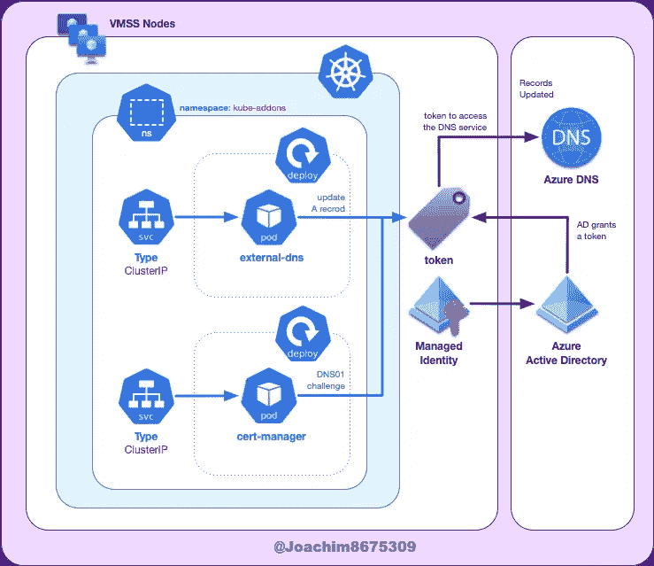****

******Managed Identity authorized to access Azure DNS******

****运行以下命令提取作用域和服务主体对象 id，并使用这些命令授予访问权限:****

```
****source** env.sh**export AZ_DNS_SCOPE**=$(
  **az** network dns zone list \
    **--query** "[?name=='**$AZ_DNS_DOMAIN**'].id" **\
    --output** tsv
)**export** **AZ_PRINCIPAL_ID**=$(
  az aks show **\
    --resource-group $AZ_RESOURCE_GROUP \
    --name $AZ_CLUSTER_NAME** \
    **--query** "identityProfile.kubeletidentity.objectId" \
    --output tsv
)**az** role assignment create \
  **--assignee** "**$AZ_PRINCIPAL_ID**" \
  **--role** "DNS Zone Contributor" \
  **--scope** "**$AZ_DNS_SCOPE**"**
```

# ****Kubernetes 组件****

****可以使用下面的脚本安装 [**Kubernetes**](https://kubernetes.io/) 附加组件。****

## ****安装证书管理器****

****复制以下脚本并另存为`helmfile.yaml`:****

****准备就绪后，只需运行:****

```
****source** env.sh**helmfile** apply**
```

## ****安装证书管理器群集颁发者****

****复制以下内容并另存为`issuers.yaml`:****

****在 [**证书管理器**](https://cert-manager.io) 容器准备就绪并上线之前，需要几秒钟时间。准备就绪后，运行以下命令:****

```
****export ACME_ISSUER_EMAIL**="<your-email-goes-here>" **source** env.sh
**helmfile** **--file** issuers.yaml apply**
```

# ****Kubernetes 示例:hello-kubernetes****

****[**hello-kubernetes**](https://github.com/paulbouwer/hello-kubernetes)是一个打印 pod 名称的简单应用程序。下面的 [**helmfile**](https://github.com/roboll/helmfile) 脚本，就是简单地将 raw[**Kubernetes**](https://kubernetes.io/)清单折叠成一个 helm 图表以便我们可以使用动态值，将执行以下操作:****

*   ****部署一个`Deployment`来管理 3 个吊舱****
*   ****部署一个指向吊舱的`Service`****
*   ****部署一个`Ingress`(使用[**inginx**](https://github.com/kubernetes/ingress-nginx)**)**，配置一条路由将流量定向到`Service`。使用一个 [**FQDN**](https://en.wikipedia.org/wiki/Fully_qualified_domain_name) 主机名，例如`hello.example.com`。****

****入口资源还将执行以下神奇的自动化操作:****

*   ****指示 [**外部 dns**](https://github.com/kubernetes-sigs/external-dns) 在 [**Azure DNS**](https://azure.microsoft.com/services/dns/) 区域建立记录，例如`hello.example.com`。****
*   ****使用通过 [**cert-manager**](https://cert-manager.io) 指定的颁发者颁发证书以保护流量。****

****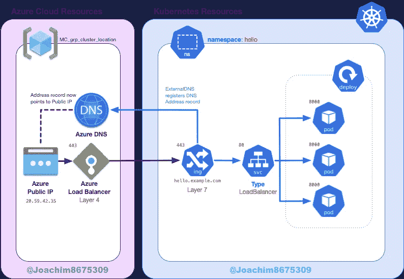****

******Example**: hello-kubernetes****

****复制下面的文件并另存为`examples/hello/helmfile.yaml`:****

## ****与临时发行者一起部署****

****要测试功能，请运行以下命令****

```
****source** env.sh
**export ACME_ISSUER**=letsencrypt-staging**helmfile** **--file**  ./examples/hello/helmfile.yaml apply**
```

****然后验证资源是否已部署:****

```
****kubectl** get all,ing,certificate **--namespace** hello**
```

****这应该是这样的:****

****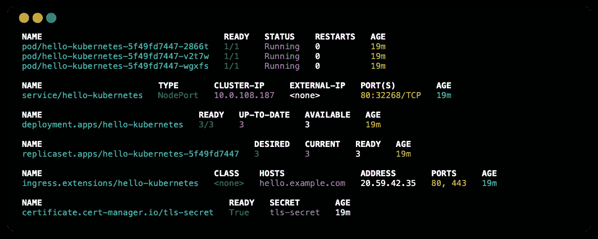****

****hello-kubernetes deploy****

****您可以查看事件以了解证书是否已成功颁发，或者是否发生了任何问题:****

```
****kubectl** describe ingress **--namespace** hello
**kubectl** describe certificate **--namespace** hello**
```

****当所有资源准备就绪时，使用(用`example.com`代替您的域)测试解决方案:****

```
****curl --insecure --silent --include** https://hello.**${AZ_DNS_DOMAIN}****
```

******注意**:对于 staging 环境，将使用来自不受信任的私有 CA 的证书，因此需要参数`--insecure`或`-k`。****

****完成后，删除现有解决方案:****

```
****helm** delete hello-kubernetes **--namespace** hello**
```

## ****与产品发行者一起部署****

****当满意的解决方案是可行的，我们可以尝试生产发行者。我们这样做的原因是分两个阶段，因为 ACME 服务器对请求有一个极限。****

****使用生产发行者部署以下内容:****

```
****source** env.sh
**export ACME_ISSUER**=letsencrypt-prod
**helmfile** **--file** ./examples/hello/helmfile.yaml apply**
```

****片刻之后，您可以检查结果`https://hello.example.com`(用`example.com`替换您的域)。****

****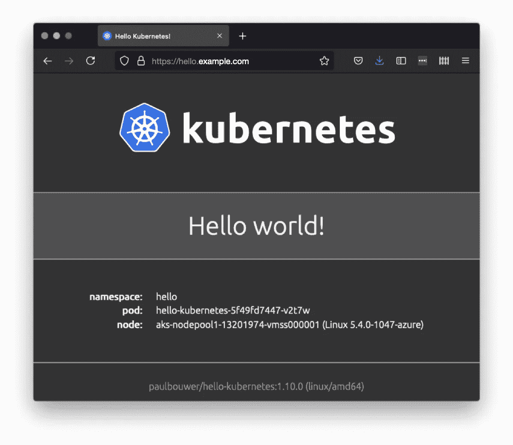****

# ****Kubernetes 示例:Dgraph****

****[**Dgraph**](https://dgraph.io/) 是一个分布式图形数据库，有一个掌舵图，可以用来将 [**Dgraph**](https://dgraph.io/) 安装到 [**Kubernetes**](https://kubernetes.io/) 集群中。您可以使用`helmfile`或`helm`两种方法安装 [**图**](https://dgraph.io/) 。****

****这个例子的好处在于它将通过一个入口部署两个端点:一个用于 Dgraph Ratel 图形用户界面客户端([](https://reactjs.org/)**)和数据库服务本身 Dgraph Alpha。******

******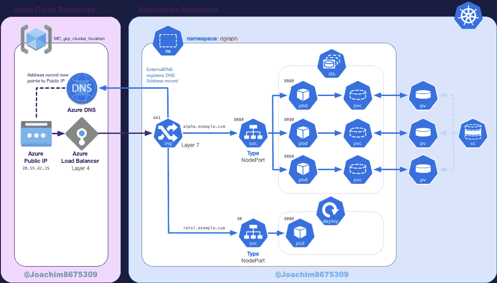******

********Example**: Dgraph Alpha + Dgraph Ratel******

## ******保护数据图表******

******在生产场景中，公共端点应该受到保护，尤其是后端数据库，但是为了演示简单起见，端点不会受到保护。******

******我们可以通过添加一个*允许列表*(也称为*白名单*)来为 [**图 Alpha**](https://github.com/dgraph-io/dgraph) 服务本身增加一些安全级别:******

```
***# get AKS pod and service IP addresses* **DG_ALLOW_LIST**=$(**az** aks show \
  **--name** **$AZ_CLUSTER_NAME** \
  **--resource-group** **$AZ_RESOURCE_GROUP** | \
  **jq** -r '.networkProfile.podCidr,.networkProfile.serviceCidr' | \
  tr '\n' ','
)*# append home office IP address* **MY_IP_ADDRESS**=$(**curl** --silent ifconfig.me)
**DG_ALLOW_LIST**="$**{DG_ALLOW_LIST**}${**MY_IP_ADDRESS**}/32"
**export** **DG_ALLOW_LIST****
```

## ****部署数据图表****

****复制下面的文件并另存为`examples/dgraph/helmfile.yaml`:****

****同样，我们可以先在试运行中测试解决方案，然后再尝试生产。****

## ****与临时发行者一起部署****

****要测试功能，请运行以下命令****

```
****source** env.sh
**export ACME_ISSUER**=letsencrypt-staging**helmfile --file** ./examples/dgraph/helmfile.yaml apply**
```

****验证数据图表服务是否都处于运行状态。这可能需要大约一分钟:****

```
****kubectl** get all,ing,certificate **--namespace** dgraph**
```

****这应该会显示如下内容:****

****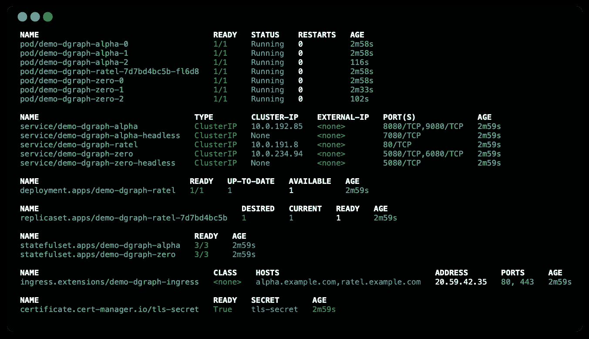****

****Dgraph Deployment with Certificate****

****验证域名可以访问[**d 字母**](https://github.com/dgraph-io/dgraph) (用`example.com`代替您的域):****

```
****curl --insecure --silent** https://alpha.**${AZ_DNS_DOMAIN}**/health | **jq****
```

## ****与产品发行者一起部署****

****为了让 prod 测试功能，运行以下命令。****

```
****source** env.sh
**export ACME_ISSUER**=letsencrypt-prod
**helmfile --file** ./examples/dgraph/helmfile.yaml apply**
```

****验证证书是否已更新为:****

```
****kubectl** describe ingress **--namespace** dgraph**
```

****您应该会看到一条`updated Certificate`消息:****

********

****Ingress resource events****

****您还可以查看带有以下内容的证书事件:****

```
****kubectl** describe certificate **--namespace** dgraph**
```

****这应该会显示类似如下的事件:****

****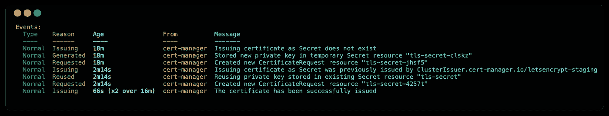****

****Certificate resource events****

****验证域名可以访问[**d 字母**](https://github.com/dgraph-io/dgraph) (用`example.com`代替您的域):****

```
****curl --silent** https://alpha.**${AZ_DNS_DOMAIN}**/health | **jq****
```

******注意**:现在我们使用的是公共可信证书，而不是暂存中的私有证书，因此不再需要`--insecure` (或`-k`)。****

# ****上传数据和模式****

****有一些改编自教程[**https://dgraph.io/docs/get-started/**](https://dgraph.io/docs/get-started/)**的脚本可以下载下来:******

```
******PREFIX**=gist.githubusercontent.com/darkn3rd
**RDF_GIST_ID**=398606fbe7c8c2a8ad4c0b12926e7774
**RDF_FILE**=e90e1e672c206c16e36ccfdaeb4bd55a84c15318/sw.rdf
**SCHEMA_GIST_ID**=b712bbc52f65c68a5303c74fd08a3214
**SCHEMA_FILE**=b4933d2b286aed6e9c32decae36f31c9205c45ba/sw.schema**curl** -sO https://**$PREFIX**/**$RDF_GIST_ID**/raw/**$RDF_FILE
curl** -sO https://**$PREFIX**/**$SCHEMA_GIST_ID**/raw/**$SCHEMA_FILE******
```

******下载完成后，您可以上传模式和数据:******

```
******curl** **-s** "https://alpha.**$AZ_DNS_DOMAIN**/mutate?commitNow=true" \
 **--request** POST \
 **--header** "Content-Type: application/rdf" \
 **--data-binary** @sw.rdf | jq**curl** **-s** "https://alpha.**$AZ_DNS_DOMAIN**/alter" \
  **--request** POST \
  **--data-binary** @sw.schema | jq****
```

# ******连接到 Ratel 用户界面******

******几分钟后，你可以检查结果`https://ratel.example.com`(用`example.com`代替你的域名)。******

******在`**Dgraph Server Connection**`对话框中，配置域名，例如`https://alpha.example.com`(用`example.com`代替您的域名)******

****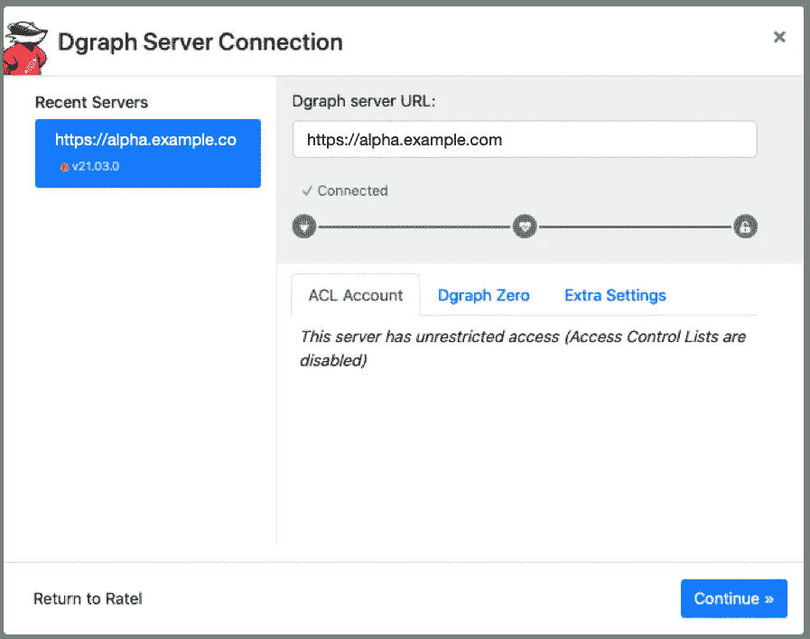****

## ****使用 Ratel UI 进行测试****

****在 Ratel UI 中，粘贴以下查询并单击 run:****

```
**{
  **me**(func: allofterms(**name**, "Star Wars"),
           orderasc: **release_date**) 
    @filter(ge(release_date, "1980")) {
      **name**
      **release_date**
      **revenue**
      running_time
      **director** {
        **name**
      }
      **starring** (orderasc: **name**) {
        **name**
      }
  }
}**
```

****您应该会看到类似这样的内容:****

****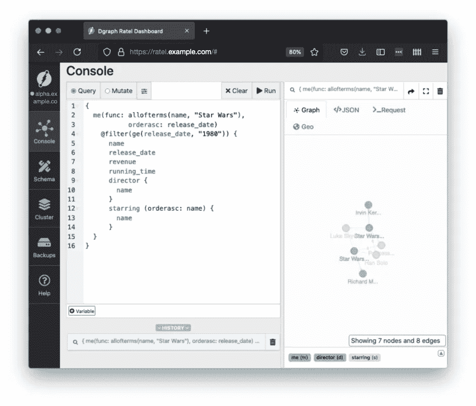****

# ****清理项目****

****您可以使用以下方法清理会产生成本的资源:****

## ****移除外部磁盘****

****在删除 [**AKS**](https://azure.microsoft.com/en-us/services/kubernetes-service/) 集群之前，请确保所有使用过的磁盘都已移除，否则，这些磁盘将会被留下并产生费用。****

```
***############ 
# Delete the Dgraph cluster 
############################################* **helm** delete demo **--namespace** dgraph*############ 
# Delete external storage used by the Dgraph cluster
############################################* **kubectl** delete pvc **--namespace** dgraph **--selector** release=demo**
```

******注意**:如果这些资源正在使用中，就不能删除。确保使用 PVC 资源的资源已被删除，即`**helm** delete demo **--namespace** dgraph`。****

## ****移除 Azure 资源****

****这将删除 Azure 资源:****

```
***############ 
# Delete the AKS cluster 
############################################* **az** aks delete \
  **--resource-group** **$AZ_RESOURCE_GROUP** \
  **--name** **$AZ_CLUSTER_NAME***############ 
# Delete the Azure DNS Zone 
############################################* **az** network dns zone delete \
  **--resource-group** **$AZ_RESOURCE_GROUP** \
  **--name** **$AZ_DNS_DOMAIN****
```

# ****资源****

****这里是我在这篇文章的开发过程中遇到的一些资源。****

## ****博客源代码****

*   ******博客源代码**:[https://github . com/darkn 3 rd/Blog _ tutorials/blob/master/kubernetes/aks/series _ 1 _ endpoint/part _ 3 _ cert _ manager/](https://github.com/darkn3rd/blog_tutorials/blob/master/kubernetes/aks/series_1_endpoint/part_3_cert_manager/)****

## ****文章****

*   ******如何在 DigitalOcean Kubernetes 上使用 Cert-Manager 设置 Nginx Ingress**:[https://www . digital ocean . com/community/tutorials/How-to-setup-an-Nginx-Ingress-with-Cert-Manager-on-digital ocean-Kubernetes](https://www.digitalocean.com/community/tutorials/how-to-set-up-an-nginx-ingress-with-cert-manager-on-digitalocean-kubernetes)****
*   ******保护 NGINX 入口**(教程):【https://cert-manager.io/docs/tutorials/acme/ingress/ ****
*   ****在 Azure Kubernetes 服务(AKS)上创建一个 HTTPS 入口控制器:[https://docs.microsoft.com/azure/aks/ingress-tls](https://docs.microsoft.com/azure/aks/ingress-tls)****
*   ******LetsEncrypt.org 证书颁发**:[https://azure . github . io/application-gateway-kubernetes-ingress/how-tos/lets-encrypt/](https://azure.github.io/application-gateway-kubernetes-ingress/how-tos/lets-encrypt/)****

## ****舵图(证书管理器)****

*   ******artifact hub**:[https://artifact hub . io/packages/helm/cert-manager/cert-manager](https://artifacthub.io/packages/helm/cert-manager/cert-manager)****
*   ******values . YAML**:[https://github . com/jet stack/cert-manager/blob/master/deploy/charts/cert-manager/values . YAML](https://github.com/jetstack/cert-manager/blob/master/deploy/charts/cert-manager/values.yaml)****

## ****文档(证书管理器)****

*   ******配置【https://cert-manager.io/docs/configuration/acme/】:******

## ****示例实现****

*   ******CloudPosse 的 cert-manager helm file**:[https://github . com/cloud posse/helm files/blob/master/releases/cert-manager/helm file . YAML](https://github.com/cloudposse/helmfiles/blob/master/releases/cert-manager/helmfile.yaml#L135-L156)****

# ****结论****

****这篇文章的重点是保护一个面向公众的网站或应用程序，它有一个使用 [**的 web 接口，让我们用一个**](https://letsencrypt.org/) **[**ACME 发行者**](https://cert-manager.io/docs/configuration/acme/) 来加密** 。这个旅程的一部分包括安装所需的带有[**ingress-nginx**](https://github.com/kubernetes/ingress-nginx)([**OpenResty**](https://openresty.org/en/))的 ingress 控制器和带有 [**external-dns**](https://github.com/kubernetes-sigs/external-dns) 的 DNS 记录更新自动化。****

**关于安全性的最后一个注意事项是，在集群上运行的所有 pods 将能够更新 [**Azure DNS**](https://azure.microsoft.com/services/dns/) 区域中的记录，并颁发证书，这也验证了使用 [**Azure DNS**](https://azure.microsoft.com/services/dns/) 区域(用于`DNS01`挑战)的有效性。您可以使用[**aad-pod-identity**](https://azure.github.io/aad-pod-identity/)进一步保护这些，以便只有 pod 具有适当的凭证，从而允许应用最小特权 原则。请注意，该功能目前是与 [**AKS**](https://azure.microsoft.com/services/kubernetes-service/) 集成的预览版。**

**有了 [**证书管理器**](https://cert-manager.io) ，就有了这么多的配置选项。与本文中使用的 [**极致** **发布者**](https://cert-manager.io/docs/configuration/acme/) 不同，本文中使用的 [**DNS01**](https://cert-manager.io/docs/configuration/acme/dns01/) 挑战 [**天蓝 DNS**](https://azure.microsoft.com/services/dns/) ，但你绝不限于此，如[**route 53**](https://cert-manager.io/docs/configuration/acme/dns01/route53/)[**云 DNS****和**](https://cert-manager.io/docs/configuration/acme/dns01/google/) **[**除了**](https://cert-manager.io/docs/configuration/acme/dns01/cloudflare/) **[**ACME**](https://cert-manager.io/docs/configuration/acme/) 之外，你还可以尝试其他 ca，比如 [**Vault**](https://cert-manager.io/docs/configuration/vault/) 、 [**Venafi**](https://cert-manager.io/docs/configuration/venafi/) 、cloud flare[**origin-ca-issuer**](https://github.com/cloudflare/origin-ca-issuer)、 [**FreeIPA**](https://www.freeipa.org) 等等。可能性是无限的。******

**出于上述和其他原因，毫不奇怪的是 [**cert-manager**](https://github.com/jetstack/cert-manager) 是迄今为止在 [**Kubernetes**](https://kubernetes.io/) 上最流行的证书管理解决方案。****