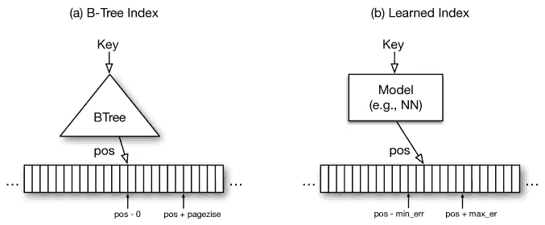

# 亚历克斯:一个可更新的自适应学习指数

> 原文：<https://medium.com/geekculture/alex-an-updatable-adaptive-learned-index-dab51c33879c?source=collection_archive---------15----------------------->

## 研究论文的收获

在本文中，我们总结了我们在 IIIT 德里的独立项目期间从题为“ [ALEX:一个可更新的自适应学习指数](https://arxiv.org/pdf/1905.08898.pdf)”的研究论文中获得的经验。

# 目录

1.  介绍
2.  背景
3.  Alex 概述