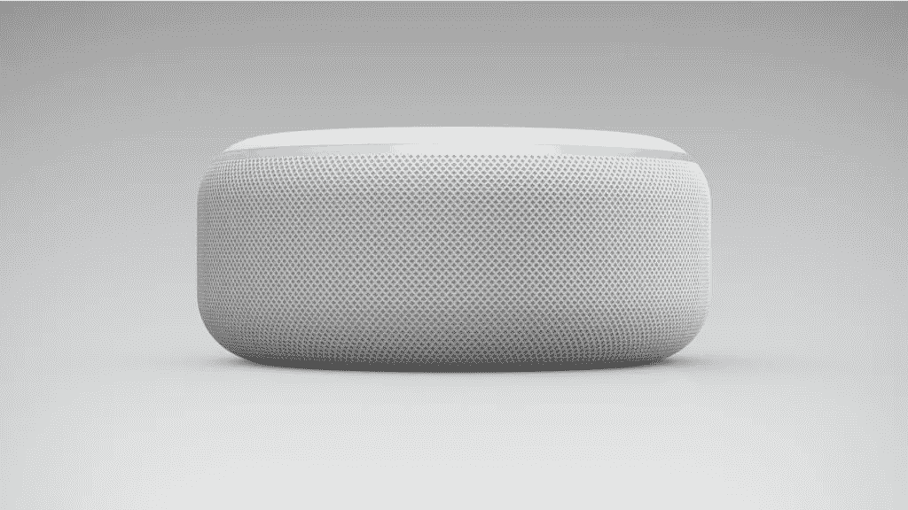

# Alexa，你在听我说吗？

> 原文：<https://medium.com/geekculture/alexa-are-you-listening-to-me-db289a6a1a4c?source=collection_archive---------19----------------------->

## 教育人们语音设备对他们的隐私意味着什么

“但是如果它总是听我的呢？”是一个关于语音技术的常见问题。对于语音行业的人来说，从对语音助手和智能设备持怀疑态度的消费者那里听到这些可能会令人筋疲力尽。

随着这种技术中视觉界面的增加(例如 Echo Show)，人们可以理解地关注他们产品中添加的每个新传感器、摄像头或麦克风。这种技术发展在多大程度上是对我们隐私的侵犯？

要回答这个问题，了解语音技术的限制很重要。还有，我们必须认识到消费者为什么关注。根据研究和个人经验，用户对语音设备最常见的问题是:

*   设备监听一个人的对话到什么程度？
*   数据是如何使用的？
*   我的数据会被窃取吗？
*   如何保护弱势个体？

# **你的设备在监听，有时**

没有人喜欢偷听者，尤其是你邀请到家里的人。[东北大学](https://news.northeastern.edu/2020/07/14/are-alexa-siri-and-cortana-recording-your-private-conversations/)进行的研究发现，智能音箱有在错误时间“醒来”的倾向。

在播放了 100 多个小时的热门电视节目音频来模拟持续的对话后，一个假阳性被触发，这意味着该设备会意外地“醒来”，几乎每小时一次。然而，激活通常不到 10 秒，并以设备要求用户重复确认而结束。

当[试图复制](https://www.consumerreports.org/smart-speakers/yes-your-smart-speaker-is-listening-when-it-should-not/)这些误报时，设备很少犯两次同样的错误。这表明，尽管该设备有其不完美之处(正如许多新兴技术一样)，但它有能力从错误中学习。

可以理解的是，机器学习的概念让消费者对设备学习我们行为的内容和方式保持警惕，但其核心是，机器学习旨在减少错误，并做出比人类手动更好的预测。

人们一致认为，是的，你的设备可能在不恰当的时候监听你。不过有几个[隐私设置](https://www.wired.com/story/alexa-google-assistant-echo-smart-speaker-privacy-controls/)可以用。类似于在网站中导航时，用户可以选择创建声音警报以了解语音记录何时开始、删除记录历史以及将设备完全静音。

Photo by [Franck](https://unsplash.com/@franckinjapan?utm_source=medium&utm_medium=referral) on [Unsplash](https://unsplash.com?utm_source=medium&utm_medium=referral)

# **选择加入安全性**

随着物联网(IOT)改变了消费者将技术融入日常生活的方式，用户必须了解智能设备是如何捕捉和使用他们的信息的。这种技术的扩散使人们对监控保持警惕，语音设备是人们感觉“被监控”的一种方式。

通常，这些设备收集的数据可能会出售给广告商，然后广告商将在用户访问的频道上显示有针对性的广告。根据经验，如果一个产品是免费的，有可能你[就是那个产品](https://montrealethics.ai/if-its-free-youre-the-product-the-new-normal-in-a-surveillance-economy/)。

围绕如何使用我们的在线数据的对话远远超出了智能设备上的隐私。它关系到控制你信息的公司。出于对大规模数据泄露和网络钓鱼攻击的担忧，[正在推动选择加入](https://www.nytimes.com/2021/03/06/opinion/data-tech-privacy-opt-in.html?action=click&module=Opinion&pgtype=Homepage)而不是选择退出默认设置。

访问网站时通常会自动收集个人数据，除非个人选择退出某些设置。选择退出的做法当然说起来容易做起来难，许多公司要求你仔细阅读条款和条件政策。

还有一个问题是，如何找到哪些公司已经掌握了你的数据，而你无法收回这些数据。虽然欧洲的 GDPR(T7)概述了如何选择用户同意的标准，但这种标准在美国尚未标准化。

# **创造你的安全环境**

对于那些担心语音助手被黑客攻击的人来说，有几种方法可以增加额外的安全层。诺顿推荐的许多策略类似于桌面或手机上的安全性。

这包括加强帐户密码，关闭购买选项(特别是如果你的设备在共享空间)，使用安全的 Wifi 网络和启用语音识别。

这些实践可以类似地应用于移动设备，由于其位置跟踪功能，可以说移动设备比智能扬声器更能融入人们的日常生活。

就健康信息而言，设备必须符合 HIPAA，这提供了额外的安全性。这些细微差别基于*这些设备使用的*位置。

许多平台还不符合 HIPAA 标准([，尽管亚马逊 Alexa 是](https://www.mobihealthnews.com/news/north-america/privacy-beyond-hipaa-voice-technology))，需要向提供商和患者提供关于其局限性的教育。

例如，如果一个医生在路上，想听一个关于病人状况的录音简报，他们需要一个私人空间。对于患者，当通过他们的家庭智能扬声器跟踪药物治疗时，系统应该验证患者是独自一人。

# **面向所有用户的设计**

随着数百万人使用智能扬声器和语音助手，“普通用户”的概念变得模糊不清。对于父母来说，在向孩子介绍新设备时，这是一个重要的讨论。儿童在线隐私保护法案 COPPA 禁止公司在没有父母同意的情况下收集 13 岁以下儿童的数据。

然而，举例来说，如果亚马逊 Echo 上没有单独的个人资料，孩子的互动仍然可以被跟踪。虽然公司仍在寻找增强儿童隐私的最佳方式，但许多保护任何人在线身份的相同策略[也可以用在儿童身上](https://www.commonsensemedia.org/blog/parents-ultimate-guide-to-smart-devices#)。

许多骗局历来以老年人为目标。拥有最新对话式人工智能技术的 Robocalls 对许多这些骗局负有责任，这些技术的使用可能会扩展到其他语音优先设备。

“Vishing”指的是使用语音通信进行诈骗，教育老年人如何识别这些策略是一个良好的开端。[金融机构](https://indiantts.com/blog/speech-voice-recognition-technology-banking-ivr-speaker-tools/)也在增加语音识别技术来验证敏感的电话交易，以增强安全性。

公司将需要教育具有语音技术的设备如何保护隐私和安全使用。Alexa 和其他设备可能正在监听，但这对消费者来说应该是好事，而不是坏事。

*喜欢这篇文章？让我们在* [*LinkedIn*](https://www.linkedin.com/in/julia-a-anderson/) *上连线或者在* [*上聊天虚拟咖啡*](https://calendly.com/julia_anderson/conversation)

*原载于*[*https://minutehack.com*](https://minutehack.com/opinions/alexa-are-you-listening-to-me)*。*