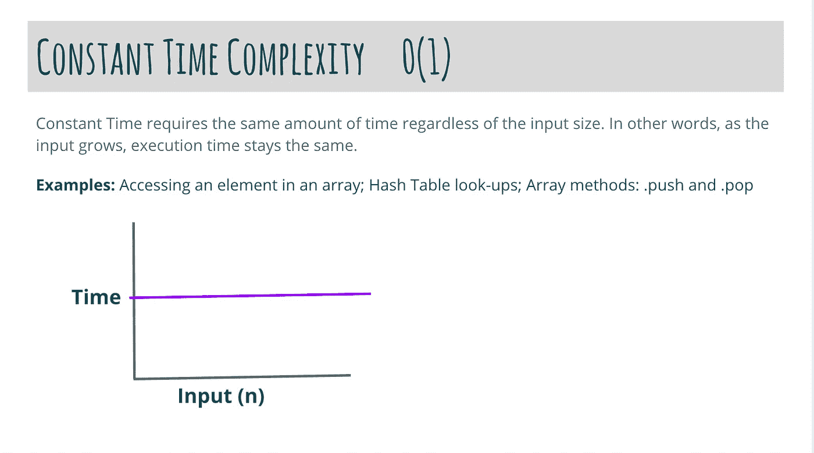

# 算法系列第一部分:大 O 符号

> 原文：<https://medium.com/geekculture/algorithm-series-part-i-big-o-notation-8d2076a484c7?source=collection_archive---------21----------------------->

当你试图理解算法时，计算机科学中的一个重要概念是大 O 符号。大 O 符号描述了一个程序执行多长时间与输入大小变化的关系。

大 O 是由德国数学家保罗·巴赫曼和埃德蒙·朗道创造的，是一种算法最坏情况下运行时间的渐近表示法。当考虑一个程序的运行时，我们可以把它分成三类:最好情况、最坏情况和一般情况。我们最感兴趣的是确定最坏的情况或一般的情况，以给我们程序的计算速度一个好的基线。这就是理解大 O 派上用场的方式。

计算机科学家使用一些大 O 符号来描述程序最坏情况下的运行时间。为了简洁起见，我们在这里只讨论其中的几个。

一、恒定时间复杂度

值得一提的第一个大 O 符号是 O(1 ),也称为常数时间复杂度。括号前面的 O 表示大 O，1 表示常数时间。



从这个图中，我们可以看到，随着输入大小的增加，执行时间保持不变。下面是一个常量时间算法的代码示例:

```
function evenOrOdd(number) { if (number % 2 === 0) { return "even"; } else { return "odd"; }}
```

为了确定这个算法的时间复杂度，我们必须看看每个表达式执行了多少次。算法又来了:

```
function evenOrOdd(number) { if (number % 2 === 0) {  // executed once return "even";  // executed once } else {    // executed once return "odd";  // executed once  }}evenOrOdd(4) // => evenevenOrOdd(7) // => odd
```

在这个例子中，我们可以看到，无论我们输入什么数字作为参数，表达式仍然只执行一次。因为表达式只执行一次，所以我们可以确定该算法的时间复杂度是 O(1)或常数时间复杂度。

以恒定时间运行的算法非常快，因为时间不受输入的影响。当我们讨论更多的大 O 符号时，你将开始看到一个算法的输入是如何真正降低程序速度的。

**二世。线性时间复杂度**

另一个值得一提的大 O 符号是 O(n)，也称为线性时间复杂度。我们已经讨论了 O 的含义，但是 n 定义了算法的输入大小。下面，我们可以看到一个运行时间为 O(n)的算法的例子。试着找出原因。

```
function repeatStr (n, s) {
 let string = '';
  for(let i = 0; i < n; i++) {
    string += s
  }
  return string
}
```

希望您能够计算每个表达式运行的次数。这是一个棘手的问题，因为我从未解释过当我们不知道一个表达式将运行多少次时会发生什么。让我们再看一看。

```
function repeatStr (n, s) {
 let string = '';       // executed once
  for(let i = 0; i < n; i++) {      // executed once 
    string += s       // executed n times
  }
  return string // executed once
}repeatStr(3, "hello") // => "hellohellohello"// 0(n)
```

在看这个算法的时候，我们可以看到和常数时间算法相比是有区别的。主要是引入了循环。循环运行的次数取决于 n 的大小。由于运行时间随输入大小成比例增加，因此该算法将以线性时间 O(n)运行。

**三世。二次时间复杂度**

二次时间复杂度或 O(n)是一种常见的时间复杂度，其中输入是平方的。这使得运行时不太理想，但值得一提，因为它相当普遍，尤其是在一些排序算法中。

```
function bubbleSort(array) {

 let isSorted = false;let counter = 0;while (!isSorted) { 
    isSorted = true; 
    for (let i = 0; i < array.length - 1 - counter; i++) 
      if (array[i] > array[i + 1]) { 
        swap(i, i + 1, array);  
        isSorted = false;
      }
    counter++;
  }return array;
}function swap(i, j, array) {
  let temp = array[j];
  array[j] = array[i];
  array[i] = temp;
}
```

上面的代码是一种叫做冒泡排序的排序算法。我们可以看到，它有一些以前显示的算法的共同特征，但有一个主要的变化。我们可以看到有两个循环正在执行，一个循环在另一个循环中。当我们回头计算每个表达式运行的次数时，我们可以看到 if 语句中表达式的最坏情况运行时间是 n，因为它嵌套在两个循环中。如果 If 语句仅在一个循环中，时间复杂度将仅为 O(n ),因为内部表达式将执行 n 次。存在嵌套循环的事实意味着表达式将执行 O(n)次。

然而，一个重要的注意事项是，如果一个算法有不止一个循环，但它们没有嵌套，算法的运行时间很可能是 O(n ),因为循环上的内部表达式只会执行 n 次。因此，如果我们有 1n + 1n = 2n，我们去掉系数，我们只剩下 n。

**总结**

我希望你已经学到了更多关于算法运行时的知识。我只涉及了基础知识，但是这应该给你一个坚实的基础，让你知道如何计算一个算法的时间复杂度。只要记住关注表达式执行的次数和快速识别大 O 的一些常见模式，比如是否有一个循环或嵌套循环。