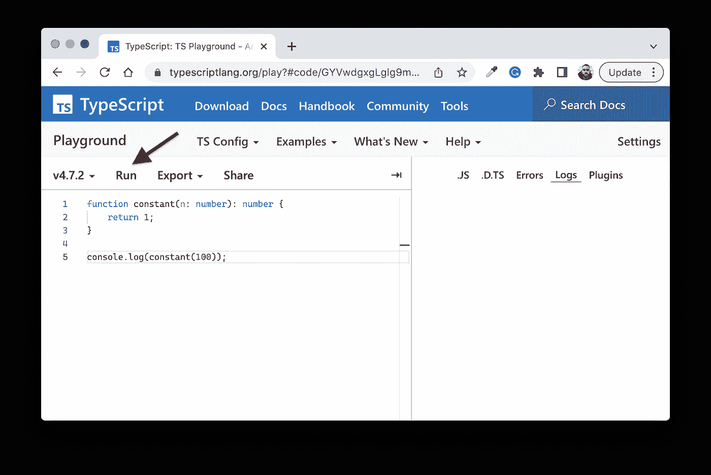
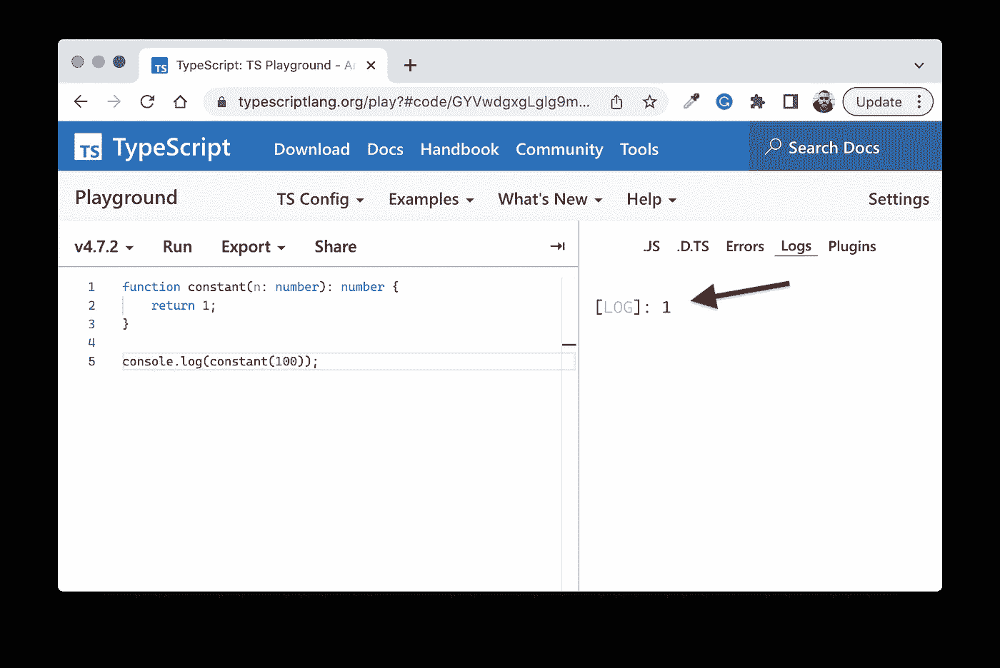

# 算法时间复杂度举例

> 原文：<https://medium.com/geekculture/algorithm-time-complexity-by-example-f09e9948e14a?source=collection_archive---------17----------------------->

## 一些关于 TypeScript Playground 的简单例子


Photo by [Steve Johnson](https://unsplash.com/@steve_j?utm_source=unsplash&utm_medium=referral&utm_content=creditCopyText) on [Unsplash](https://unsplash.com/s/photos/abstract-paint?utm_source=unsplash&utm_medium=referral&utm_content=creditCopyText)

# 介绍

本文使用 *TypeScript Playground* 来说明一些基本的算法时间复杂性。

到本文结束时，您应该熟悉 O(1)、O(n)、O(n)和 O(logN)时间复杂性。

# 背景

## 时间复杂度

*时间复杂度*是一个效率度量，一般来说，它描述了随着输入大小的增加，算法的速度。

这允许你比较解决一个问题的几个算法解决方案的性能(或成本)，独立于编程语言或数据集，允许你选择最有效的一个。

这里的要点是，时间复杂度试图描述随着输入大小的增加，算法的**增长**；而不是执行一次执行所需的精确时间。

另一个效率指标，*空间复杂度，*描述了随着输入大小的增加而使用的内存(或 RAM ),这超出了本文的范围。

## 大 O 符号

*大 O 符号*用于根据算法的运行时间需要如何随着输入大小的增长而扩展来对算法进行分类。

这用字母 *O* 表示，分类放在括号中:例如，*线性*时间复杂度是 *O(n)* ，这意味着操作的数量随着输入的大小逐步增加。

# 入门指南

访问[类型脚本运动场](https://www.typescriptlang.org/play)，切换到*日志*视图，如下图所示:


# 常数:O(1)

## 概观

恒定时间算法将总是在相同的时间内执行——输入与运行时间无关。

我们将使用这个小例子来习惯使用*类型脚本运动场*。

## 密码

将以下代码添加到左侧，并单击*运行*按钮。

```
function **constant**(n: number): number {
    return 1;
}console.log(**constant**(100));
```



## 结果

无论输入大小如何，结果始终为 1:

```
[LOG]: 1
```



## 例子

*   通过索引访问数组值
*   数组推送/弹出操作

# 线性:O(n)

## 概观

如果运行一个算法所花费的时间与输入的大小成正比，那么这个算法就具有线性时间复杂度。

## 密码

我建立了一个线性时间复杂度函数，其中输入和输出一对一地增加:

```
function **linear**(n: number): number {
  let count = 0;
  for (let a = 0; a < n; a++) {
    count++;
  } return count;
}console.log(**linear**(100));
```

## 结果

```
[LOG]: 100
```

## 例子

*   在数组中线性搜索给定值的平均情况

# 二次的:O(n)

## 概观

如果运行一个算法所花费的时间与输入大小的平方成正比，那么它就有*二次时间*复杂性。

## 密码

嵌套迭代中存在二次时间复杂度，为了模拟这个例子，我设置了以下代码来运行嵌套循环，其大小与外部循环相同。

```
function **quadratic**(n: number): number {
  let count = 0;
  for (let a = 0; a < n; a++) {
    for (let b = 0; b < n; b++) {
      count++;
    } 
  }

  return count;
}console.log(**quadratic**(100));
```

## 结果

```
[LOG]: 10000
```

即，对于 100 的输入，我们可以预期 100 = 10，000 次操作。

## 例子

*   许多排序算法(BubbleSort、InsertionSort、SelectionSort 等)在一个数组中所有元素顺序相反的最坏情况。

# 对数:O(LogN)

## 概观

如果运行一个算法所需的时间与输入大小 n 的对数成正比，则该算法具有*对数-时间*复杂性。

*对数*是指数运算的反函数。例如，我们可以计算 2 的各种幂的指数:

```
pow(2,1) = 2
pow(2,2) = 4
pow(2,3) = 8
```

另一方面，以 2 为底的对数计算 2 需要哪个指数来产生下面括号中所示的值:

```
log2(2) = 1
log2(4) = 2
log2(8) = 3
```

对于 O(logN)算法来说，这意味着随着输入值变大，运算次数以较慢的速度增长。

## 密码

为了说明缓慢的增长率，我修改了调用代码，以便打印输入大小以及循环中的操作数，其中输入在每次迭代中增加 2:

```
function **logn**(n: number): number {
  let count = 0;
  let a = 1;

  while (a < n) {
    count++;
    a *= 2;
  } return count;
}for (var i = 2; i < 18; i += 2) {
    console.log(`Input: ${i}. Operations: ${**logn**(i)}`);
}
```

## 结果

您可以看到，随着输入变大，操作数量以较慢的速度增长，即似乎逐渐“变平”。

```
[LOG]: "Input: 2\. Operations: 1" 
[LOG]: "Input: 4\. Operations: 2" 
[LOG]: "Input: 6\. Operations: 3" 
[LOG]: "Input: 8\. Operations: 3" 
[LOG]: "Input: 10\. Operations: 4" 
[LOG]: "Input: 12\. Operations: 4" 
[LOG]: "Input: 14\. Operations: 4" 
[LOG]: "Input: 16\. Operations: 4" 
```

## 例子

O(logN)行为出现在分治算法中:

*   访问、搜索、插入或删除二叉查找树时的一般情况。

感谢阅读！在下面的评论区让我知道你的想法，别忘了订阅。👍