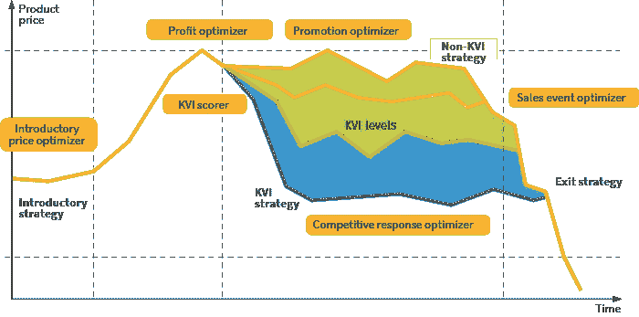

# 算法定价，第二部分:人工智能和定价策略

> 原文：<https://medium.com/geekculture/algorithmic-pricing-part-ii-ai-and-pricing-strategy-c46fc89af0cf?source=collection_archive---------28----------------------->

Article originally posted at [Grid Dynamics Blog](https://blog.griddynamics.com/?utm_source=medium&utm_medium=referral&utm_campaign=algorithmic_pricing_part_ii)

当许多决策必须接近实时做出，并且需要考虑各种信号时，基于人工智能的决策自动化尤其有益。此外，这些决策组件必须与定价策略保持一致，并集成到价格管理流程中。在本帖中，我们将描述一个定价策略如何映射到智能决策组件的例子。

# 策略示例:KVI 定价

在零售定价中，价格策略通常由两种相反的力量形成:公司的内部经济和消费者的价格感知。收入和利润目标等经济因素是定价决策的关键驱动因素和制约因素。与此同时，消费者的价格感知也是一个至关重要的考虑因素，与公司竞争力、客户忠诚度和销量直接相关。

解决利润和价格感知之间的权衡的最流行的技术之一是价值项目(KVI)定价。这种方法的基本思想是量化一种产品或产品类别是否会显著影响消费者的价值感知，然后基于这种洞察力区分定价策略。几乎所有的零售部门都有一些标准商品，它们的价格决定了消费者是否认为一家商店很贵。这些项目被称为 kvi，包括服装中的袜子和 t 恤衫、杂货店中的香蕉和电子产品中的电池。KVI 方法对 kvi 和非 kvi 采用不同的定价策略，这些策略通常基于以下考虑因素:

*   KVIs 的价格设定强调竞争力和需求。因此，竞争对手价格指数和消费者支付意愿估计等信号在 KVI 定价决策中起着至关重要的作用。
*   非 kvi 对价值感知的影响较小，这些产品的定价更加关注内部经济、利润和品类管理目标。

这两个类别之间没有明显的界限，而是在实践中有一个连续的价值认知范围。该范围从客户熟知其参考价格的产品(kvi)到客户了解其参考价格的产品，再到客户对其参考价格知之甚少或一无所知的产品(非 kvi)。因此，一个零售商可以有两个以上的 KVI 等级，可能按渠道或商店区域划分，甚至使用连续的 KVI 分数。

KVI 和非 KVI 定价决策的分离只是零售价格策略的一部分。其他部分包括介绍性定价、促销策略和清仓销售策略。图 1 展示了在一个特定的产品生命周期中，这些部分是如何组合在一起的:

*   介绍性定价方法决定了如何为进入市场的新产品定价。
*   一旦产品上市，零售商可以观察其性能，决定是否应该将该商品定位为 KVI，然后相应地管理其价格。
*   最后，退出战略有助于有效地结束生命周期。这种策略可以极大地影响产品生命周期短的行业的盈利能力，如时装零售。

# 决策组成部分

上述定价策略需要多种类型的定价决策。这些决策的质量至关重要，因为它们都直接关系到盈利能力和客户忠诚度。在 KVI 战略示例中，预测分析和高级自动化有助于改善几乎所有类型的定价决策，因为战略的每个元素都可以映射到一个软件组件，如图 1 所示:

*Figure 1\. The relationship between decision-making components and pricing strategies.*

*   **初级价格优化器**。新产品没有销售历史，但是通过估计它们与具有足够历史数据的产品的相似性，可以精确地设定它们的介绍价格。可以使用主要产品属性和文本描述以及可以使用自然语言处理和图像分类技术的产品图像来计算相似性得分。
*   **利润优化器**。给定产品的需求、收入或利润取决于许多因素，包括商店位置、季节、产品价格、特价、库存水平和竞争对手的价格。预测分析可以帮助量化这些依赖性，并确定最佳价格，以实现收入或利润最大化。
*   **KVI 得分手**。给定产品对消费者价值感知的影响可以通过使用产品购买模式和购买该产品的客户的简档的算法来估计。这种估计可以用来选择产品的最佳定价策略。
*   **推广优化器**。非 kvi 的价格设置可以使用利润优化组件来执行。根据所使用的策略，如每日低价或高/低方法，可以为基础价格、降价、促销日历和个性化报价创建专门的优化组件。
*   **竞争响应优化器**。KVIs 的价格设定强调价格感知，通常需要特殊的逻辑来监控和应对竞争对手的价格变化。
*   **销售事件优化器**。一些用例，比如清仓销售，由于时间和库存的限制，需要专门的逻辑来优化。

# 结论

这是 AI 对零售价格和促销管理的影响系列文章的第二篇。在[的第一篇文章](https://blog.griddynamics.com/algorithmic-pricing-part-i-the-risks-and-opportunities/)中，我们关注行业趋势，评估算法定价的风险和机遇。在这篇文章中，我们深入探讨了单个企业范围内的决策自动化和定价策略之间的关系。在本系列的最后一篇文章中，我们将讨论所有这些组件的技术策略。

如果你有兴趣了解这个系列的更多信息，请随时[联系我们](https://www.griddynamics.com/contact?utm_source=medium&utm_medium=referral&utm_campaign=algorithmic_pricing_part_ii)！