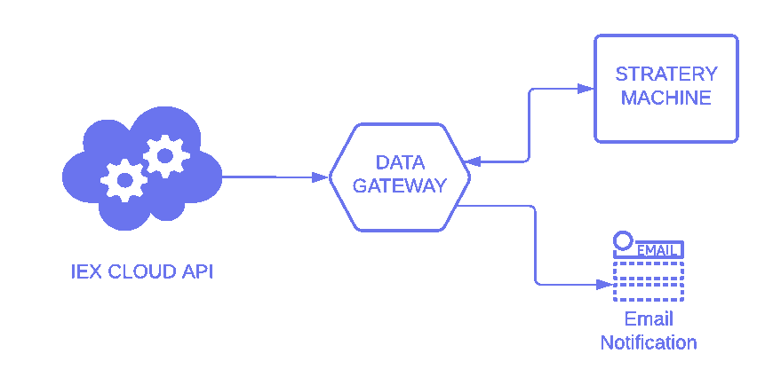

# 使用 Node.js 的算法股票交易

> 原文：<https://medium.com/geekculture/algorithmic-stock-trading-using-node-js-38afe83812ad?source=collection_archive---------0----------------------->

## 用你的策略建立一个算法交易机器人。


Photo by [Jamie Street](https://unsplash.com/@jamie452?utm_source=medium&utm_medium=referral) on [Unsplash](https://unsplash.com?utm_source=medium&utm_medium=referral)

# **简介**

本文的目的是为您提供使用 Node.js 构建算法交易机器人的重要信息，不要将这些信息视为财务建议。当我对算法交易做了很少的研究后，我发现它的成本很高，只有少数券商提供这些功能，并收取很高的佣金。算法交易有令人难以置信的好处，就像我们不需要浪费时间每天分析股票价格。它可以自动化我们对许多股票的手动分析，所以我决定以一种可扩展的方式建立一个具有简单策略的原型。

# 体系结构



建筑非常简单；它有三个模块。

*   数据网关
*   策略机器
*   电子邮件通知

数据网关从 IEX 云 API 获取股票信息。检索到的股票信息被发送到策略机，并在他们做一些计算，并根据其结果，选择一些股票购买。策略机会将那些选中的股票返回到数据网关。最后，选中的股票会通过邮件通知模块给我们发邮件。

在解释每个模块之前，最好先解释一下我们将要执行的示例策略。因此，你会了解系统是如何工作的，并可以根据你的喜好定制策略。

## 战略

> “你是在购买时赚钱，而不是在出售时赚钱。”~罗伯特·清崎

上面的引语激励我设计我们在这里作为例子使用的策略。我再次声明，这篇文章不是为了财务建议。策略就像每天一样；我们获取一家公司过去 30 天的股票价格，并检查当前价格是否低于前 30 天的价格。如果当前价格低于过去 30 天，我们就买入。

## **数据网关**

它是一个接口模块，与模块的其余部分进行通信。最初，数据网关从 IEX 云 API 获取股票信息。你也可以在 IEX 云创建一个账户，并获得一个访问 API 的令牌。收集到的股票信息会传送到策略机。策略机执行上面解释的策略，根据流程选择一些股票，返回给数据网关。然后电子邮件通知从数据网关收集选定的股票，并通过电子邮件发送给我们。数据网关将有一个 setInterval 函数，因为我们需要每天自动执行这个策略。

上面的代码片段描述了数据网关，在第 8 行，您可以从 IEX 云 API 放置您的令牌。第 21 行的 setInterval 函数每天重复调用 getStockData()函数，该函数执行从 API 获取数据、将数据发送到策略机以及通过电子邮件发送所选股票的任务。

## 策略机器

策略机计算选择优先购买的股票。在我们的策略中，这个模块需要分析公司 30 天的股价。如果当前价格低于前几天的价格，Strategy Machine 会将该股票添加到买入列表中。参考下面的代码来了解它是如何工作的。

策略机是一个独立的模块，假设只做选择优先股的计算。在这个模块中，您可以定义您的首选策略，并将选择的股票作为数组返回到数据网关。

## 电子邮件通知

电子邮件通知的职责很简单，就是用电子邮件把股票从策略机中返回给我们。电子邮件通知代码片段附后。

对于身份验证信息，请提供您的电子邮件凭据，并根据您的偏好在第 11 行自定义对象邮件选项。如果你打算使用类似上述参考代码的 Gmail 服务，不要忘记启用不太安全的应用程序来访问 Gmail；否则，它将阻止您的服务器的电子邮件。

# 基本用法

```
git clone [https://github.com/krishheii/AlgorithmStockTrading.git](https://github.com/krishheii/AlgorithmStockTrading.git)
npm i
node dataGateway.js
```

# 结论

我建立这个系统只是为了教育的目的，所以不要把它当成财务建议而失去你的投资，即使我描述的策略例子我自己也不会回头。如果你有一个优秀的策略，在这个系统中实现，用之前的数据回溯。像其他算法交易机器人一样，我们的系统本身不会进行交易；它只通过电子邮件向你发送精选的股票。最终的决定取决于你是否需要购买股票。该系统旨在提供一个额外的眼睛来观察市场，该项目的源代码已附后。

[](https://github.com/krishheii/AlgorithmStockTrading) [## krishheii/algorithm stocktrading

### 在 GitHub 上创建一个帐户，为 krish heii/algorithm stocktrading 开发做出贡献。

github.com](https://github.com/krishheii/AlgorithmStockTrading)