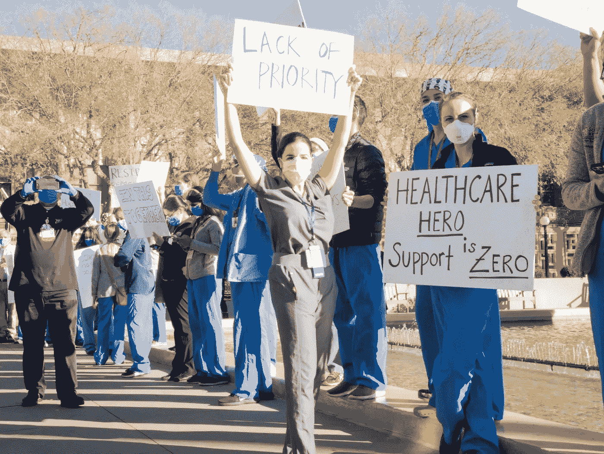
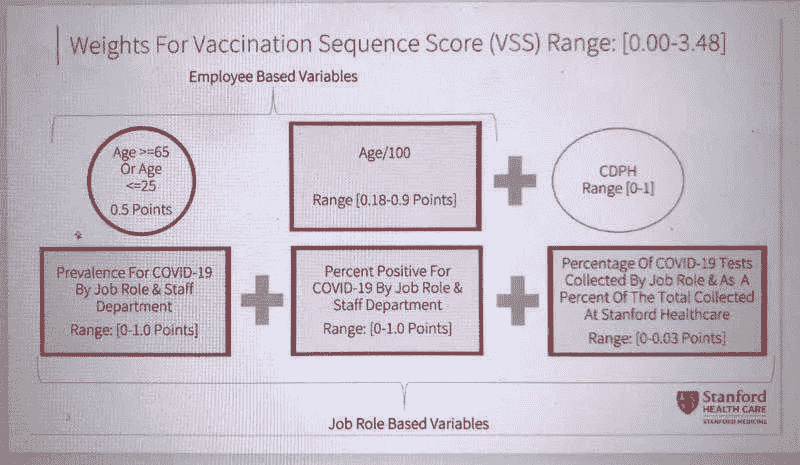

# 算法本身不应该决定谁接种疫苗

> 原文：<https://medium.com/geekculture/algorithms-alone-should-not-decide-who-gets-vaccines-ee9317221947?source=collection_archive---------28----------------------->

Image Credit: NPR

随着技术的不断进步，人类越来越依赖算法来做出困难的决定，比如如何分配 ICU 的病床，或者选择哪个候选人从事某项工作。然而，当它们利用的算法和数据都不考虑道德含义或表示时，它们就变得危险了，而且当软件做出决定时，没有经过真人的审查和审核。[机器学习算法](https://www.washingtonpost.com/technology/2020/12/23/covid-vaccine-algorithm-failure/)最初旨在公平有效地确定新冠肺炎疫苗接种的优先顺序，但正如斯坦福大学所展示的那样，它正在努力解决这个问题。

去年 12 月，斯坦福大学开发了一种复杂的[算法](https://www.technologyreview.com/2020/12/21/1015303/stanford-vaccine-algorithm/)，希望能有效地组织教职员工之间的新冠肺炎疫苗分配。然而，该算法确定，在斯坦福医疗中心的 1300 名住院医生中，只有 7 人将成为首批 5000 名疫苗接受者，其中许多人工作在治疗患者和抗击疫情的第一线。与此同时，那些成功进入第一波疫苗接种的人包括进行远程医疗或虚拟病人访问的管理人员和医生。

超过 100 名居民抗议斯坦福大学庆祝第一轮新冠肺炎疫苗接种的宣传活动。医院领导向抗议者道歉，含糊地将优先顺序错误归咎于“一个非常复杂的算法”。然而，许多人认为这是一个几乎不加掩饰的借口，因为领导小组早些时候就注意到了这个问题，并只是在最初的疫苗接种名单上增加了两名居民，允许 1000 多名医生中只有 7 名接受注射。

> “我们的算法，伦理学家和传染病专家花了几个星期的时间研究……显然是不正确的，”*流动医疗小组主任 Tim Morrison 承认道。*

Image Credit: MIT Technology Review

一张演示幻灯片展示了算法[如何决定疫苗优先顺序](https://www.technologyreview.com/2020/12/21/1015303/stanford-vaccine-algorithm/)显示了一个简单的基于规则的公式，而不是医院领导层通常称为“黑盒”的复杂机器学习算法该公式考虑了三个方面:“基于雇员的变量”，“基于工作的变量”，以及加州公共卫生部提供的指导方针。每个类别的工作人员都有一定的分数，最高总分为 3.48 分。分数越高，这个人在疫苗列表中的位置就越高。

人们的分数随着年龄线性增加，65 岁以上或 25 岁以下的人的分数会增加额外的分数。这使许多居民和一线工人处于不利地位，因为他们往往属于中年类别，年龄在 25 岁至 65 岁之间。基于工作的变量，而不是基于员工的变量，对个人的总分贡献最大——尽管这些变量是如何衡量和确定的极其模糊——斯坦福大学不愿提供进一步的评论。值得注意的是，该算法没有考虑与新冠肺炎患者的接触，也没有区分通过患者接触和其他方式感染的人。住院医师还会在不同的科室之间轮换，因此他们不一定会因为过去的任务而获得分数，比如说，在过去的任务中，他们可能会接触到新冠肺炎患者。

在加州公共卫生部的疫苗分配指南中，暴露风险是疫苗优先考虑的最高因素。然而，这个建议是针对县和地方政府，而不是医院或大学部门。这可能会给住院医生一个比他们从斯坦福大学自己的内部指标中获得的分数更高的分数，但这不足以克服雇员和基于工作的变量的权重。

算法通常用于医疗保健和许多医疗部门，以确定患者的风险水平，公平分配资源，确保每个人都能得到必要的护理。

> “算法的核心吸引力之一是，它们允许有权有势的人将政治上没有吸引力的结果归咎于黑盒，否则他们将对此负责，”*评论家罗杰·麦克纳米在* [*推特*](https://twitter.com/moonalice/status/1340133707831627776) *上发帖称。*“但人们决定了谁会得到疫苗，” [*续*](https://twitter.com/veenadubal/status/1340058318228709376) *加州大学黑斯廷斯分校法学教授维娜·杜巴尔*“算法只是执行了他们的意愿。”

斯坦福大学[发表了](https://www.sfchronicle.com/health/article/How-Stanford-s-vaccine-algorithm-caused-a-major-15824918.php.)正式道歉，准备修改最初的分配计划，并承诺让过程更加透明，但许多人主张完全取消算法的使用，让部门主管决定他们团队的优先次序，或者去与斯坦福大学无关的机构接种新冠肺炎疫苗。从那以后，[算法](https://s.hdnux.com/photos/01/15/71/11/20419186/29/1200x0.jpg)经历了重大的改变，以优先考虑前线的卫生保健工作者，但是损害已经造成了。这种疫苗分配算法的失败集中体现了对透明、道德和负责任的人工智能的需求，并强调了我们不能将关键的健康决策交给“黑盒”的裁决。