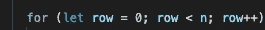
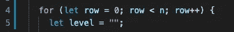
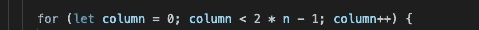
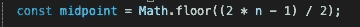
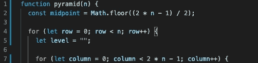
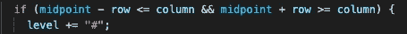
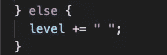
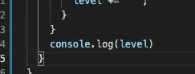
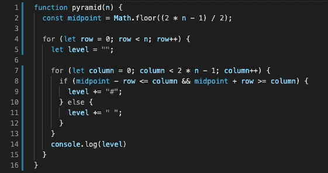

# 算法和数据结构第九部分

> 原文：<https://medium.com/geekculture/algorithms-and-data-structures-part-ix-cf3fd5f88f43?source=collection_archive---------27----------------------->

> 金字塔


Photo by [iorni.com](https://unsplash.com/@iorni?utm_source=medium&utm_medium=referral) on [Unsplash](https://unsplash.com?utm_source=medium&utm_medium=referral)

好的，上周我说过要注意，因为下一篇文章是相关的，所以如果你还没有阅读上一篇文章，现在就点击[这里](https://brianbutterly.medium.com/algorithms-and-data-structures-part-viii-d6785a534bbe)阅读。

完成了吗？太好了！让我们从阶梯升级到金字塔。正如你所猜测的，这看起来对步骤问题很熟悉，如果你想在看完步骤后试着做这道题，那就去做吧。

这是我们的问题，

我们被要求编写一个接受正数 N 的函数。该函数应该使用#字符控制台记录 N 层金字塔形状。 ***确保金字塔的左右两边都有空间。***

```
e.g. pyramid(1) -> '#'pyramid(2) -> ' # '
              '###'
pyramid(3) -> '  #  '
              ' ### '
              '#####'
```

随意跳进沙箱，试一试，下面我会解释…

像往常一样，我们从一个空函数开始，它接受 n 作为参数。


现在，这个解决方案的前半部分将看起来非常类似于步骤 1，所以我们想做一个 for 循环，它将迭代我们输出的每一行，非常类似于我们之前所做的。



对于我们创建的每一行，就像之前一样，我们在这里创建一个空字符串，之前我们将这些空字符串称为类似台阶之类的东西，这一次只是因为我们正在处理一个金字塔，所以我将字符串命名为“level ”,以表示金字塔的一个级别。



现在，在这里的内部，事情开始变得有点不同于我们最初的步骤解决方案，我们想要迭代我们的金字塔内部的所有不同的列。所以我们像这样开始我们的内部 for 循环…



这将保证我们正确的列数。我们的下一个大问题是比较我们的行和列，但是由于形状的原因，这比 steps 解决方案要困难得多。解决这个问题的最好方法是找到数组的中点。从那里我们可以说，取中心点两边的元素的行数，并把它们变成#的。

所以要得到中点…



这给出了我们的中点索引，我们将把它移到函数的顶部，因为它只依赖于 n，它不会改变。



这是我们目前掌握的情况。

现在，在我们的 for 循环中，我们只需要观察中点左边的元素的行数和中点右边的元素的行数。



这最后一点将处理空间…



最后，我们需要控制台记录我们的结果



就是这样！下面是完整的代码



所以希望如果你读了之前关于步骤的文章，这更有意义。如果没有，点击顶部的链接，阅读一下，然后回到这里。

感谢您的阅读！