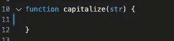
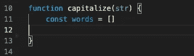
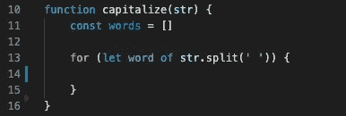
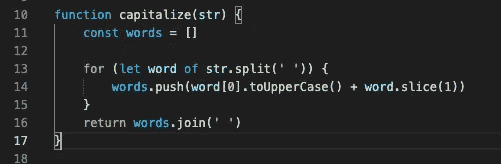

# 算法和数据结构第七部分

> 原文：<https://medium.com/geekculture/algorithms-and-data-structures-part-vii-d933f23d6c6?source=collection_archive---------28----------------------->

> 大写…


Photo by [Diomari Madulara](https://unsplash.com/@diomari?utm_source=medium&utm_medium=referral) on [Unsplash](https://unsplash.com?utm_source=medium&utm_medium=referral)

好了，这将是一个比前几个问题更短的问题，但是我会再次尽可能详细地介绍，希望能帮助你更好地理解。

对于这个问题，我们被要求编写一个接受字符串的函数。该函数应该将字符串中每个单词的首字母大写，然后返回大写的字符串。

例如，大写(“短篇小说”)→“短篇小说”

在我们开始解决这个问题之前，让我们先来看一个小提示。

首先，我们来看一下 ***。*** 法切()。Slice 用在字符串上，从该字符串中取出一些元素。

```
str.slice(beginIndex[, endIndex])
```

第一个参数是该字符串的起始索引，还有一个可选的第二个参数是结束索引，如果不提供第二个参数，字符串的其余部分将自动包含在内。

让我们开始吧…



我们有一个带字符串参数的空函数。现在我们将声明一个名为 words 的空数组。



然后我们想循环遍历我们的字符串，为此我们需要用空格把它分开。

str.split(“”)将拆分每个中间有空格的单词，例如

```
const sentence = 'well hello there'
sentence.split(' ') --> ["well","hello","there"]
```

现在我们有三个独立的单词。



现在，无论传入什么字符串，只要是单词间有空格的句子，都会被 split 语句拆分。

接下来让我们取每个单词的第一个字符，又名***【0】***，我们将它大写为 ***。toUpperCase()*** 然后使用 ***slice*** 函数将其连接回单词的其余部分。

```
word[0].toUpperCase() + word.slice(1) 
```

现在只需将结果推入 ***字*** 空数组。

```
words.push(word[0].toUpperCase() + word.slice(1))
```

最后，我们想把单词数组和一个空格字符连接在一起。

```
words.join(' ')
```

我们想返回结果…

```
return words.join(' ')
```

整个代码看起来像这样…



就像我说的，这里没有太多的代码，但是如果你不知道这几个技巧，还是有点棘手。

我希望你喜欢这个，并感谢阅读！