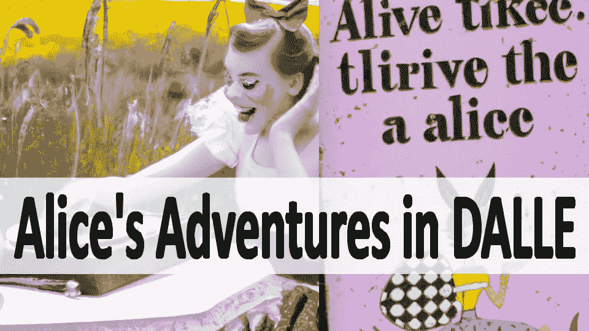
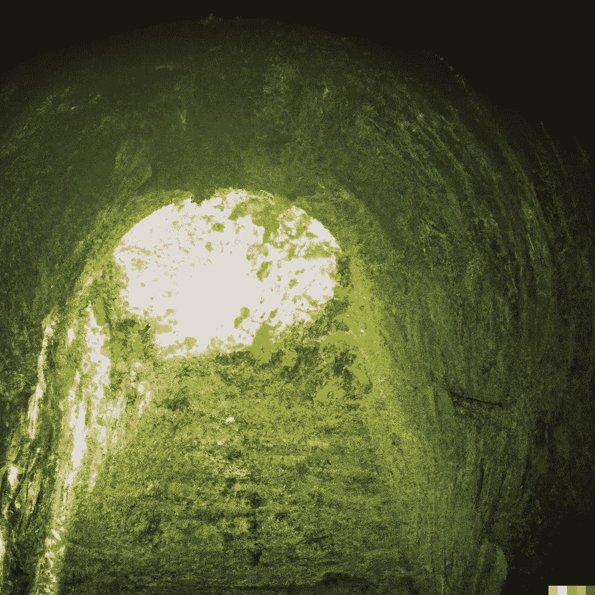

# 爱丽丝在达尔的冒险

> 原文：<https://medium.com/geekculture/alices-adventures-in-dalle-2e8d322aebbd?source=collection_archive---------11----------------------->

## 用 OpenAI 的 DALLE 重新想象爱丽丝梦游仙境

Image Created with OpenAI’s DALL-E — “Alice’s Adventures in Wonderland”

现在毫无疑问，人工智能可以产生艺术

以前被认为是只有人类创造力才有的受保护领域，现在我们有几个人工智能模型，它们产生的图像远远超过普通人的艺术能力。

这些图像可以匹配除了最有经验的艺术家。

现在，我不希望这篇文章是一篇关于 DALLE 如何工作以及一些精心挑选和策划的图片的回流。有许多文章已经解决了这个问题( [DALLE 博客](https://openai.com/blog/dall-e/)):

 [## DALL E 2 解释道:革命性人工智能的承诺和局限

### 有你很可能没见过的图片和视频。

towardsdatascience.com](https://towardsdatascience.com/dall-e-2-explained-the-promise-and-limitations-of-a-revolutionary-ai-3faf691be220) 

这篇文章是关于你可以通过简单的点击来构建什么。

使用 DALLE 或类似的文本到图像模型，你，我，任何人都可以创建个性化的图画书。每一次重新想象都是独一无二的，每一次重新想象都是美丽的描述。

虽然这里的重点是可视化的文本到图像的爱丽丝梦游仙境，当你在十年内看到文本到视频时，不要感到惊讶。

 [## GitHub - THUDM/CogVideo:文本到视频的生成。

### 这是该论文的官方报告:CogVideo:大规模文本到视频生成的预处理，通过…

github.com](https://github.com/THUDM/CogVideo) 

文本到图像从文本到视频只有几步之遥。而且要小心，因为虽然会有许多积极的应用程序，但邪恶的应用程序也一定会出现。

但是现在，让我们把重点放在我们能对文本到图像做些什么。

# 黛尔里的爱丽丝

刘易斯·卡罗尔的《爱丽丝梦游仙境》是一本无需介绍的书。这本书导致了许多改编，并激发了无数的改编。我最喜欢的是《黑客帝国》，这很适合一篇关于人工智能的文章

你可能已经看过很多帖子，关于人们用 DALLE 或类似的模型将详细的描述转换成令人惊叹的图像。但是，这些提示是经过精心选择和提炼的，并且会多次生成图像以获得想要的结果。

“Down the Rabbit Hole” — OpenAI’s DALL-E

这个项目不是要展示 DALLE 所能提供的最好的东西。这是一部关于任何人都可以在很少甚至没有剪辑的情况下，创作出像《爱丽丝梦游仙境》那样令人惊叹的作品的电影

爱丽丝在 DALLE 是一个真实文本的 DALLE 展示。直接取自《爱丽丝梦游仙境》中的段落。没有编辑，没有添加，唯一的干预是在文本中选择描述性的语言。

这是我做出的两个让步之一。我选择了更具描述性的语言提示，而不是对话和上下文段落。

选择这些段落后，它们被转换成带有 DALLE 的图像。DALLE 为每个提示生成四幅图像。我做的第二个也是最后一个让步是，我选择了四个图像中的一个。

在这两个特许经营区之外，图片照原样拍摄。我希望这能尽可能地减少选择偏差，并展示 DALLE 自己到底能做些什么。

“through the little door into that lovely garden” — OpenAI’s DALL-E

## 人工智能中的伦理

我关注 DALLE 本身可以做什么的原因是，这个过程显示了任何人都有能力生产什么。没有策展，只是玩玩。

幸运的是，DALLE 有一个相当严格的内容政策。一些看似无害的短语将被标记，您的帐户可能会被阻止。

我在直接从《爱丽丝梦游仙境》(顺便说一下，是一本儿童书籍)中选择文本时，不幸遇到了一个被屏蔽的短语。

有问题的短语？

> 一块非常小的蛋糕，上面用葡萄干漂亮地刻着“吃了我”几个字

可能这里的问题是“吃了我”这句话，这让我相信 OpenAI 在极端谨慎方面犯了错误。理应如此。这个模型非常危险。

有人试图记录一份被屏蔽短语的列表。《酷酷的超级英雄攻击》和《射击开始》中的“攻击”等内容因涉嫌分别涉及战争和枪击而被屏蔽。

# 人工智能生活

人工智能在不断进步，很容易迷失在茫茫人海中。

我发现对人工智能感兴趣的人分为两类。

深度技术科学家正在阅读论文，比较指标，并在完善的数据集上密切监控人工智能的进展。

而另一群人则对人工智能及其所有潜力着迷，但经常胡乱猜测人工智能能做什么。这第二组受技术记者的影响很大，他们挑选人工智能公告的片段，并将他们的理解与他们对流行文化中人工智能的想法结合起来。

如果你的人工智能参考是终结者和天网，我说的是你。

人工智能前沿的问题是，外行人通常无法获得它。我不知道你，但我没有计算资源来训练，更不用说甚至加载一个 10 亿+的参数模型。

但是有太多的人工智能可供每个人使用，你今天可以用它来改善你的生活。

介绍人工智能生活，我新创建的 YouTube 频道将探索人工智能在日常生活中的应用。

第一部分是《达勒的爱丽丝——第一章》。

 [## 人工智能生活

### 把 AI 带到现实世界，不再有理论！这就是你今天如何使用人工智能。构建实用项目以增加…

www.youtube.com](https://www.youtube.com/channel/UC_eIWPpslJ88eJ6EnqA61kQ) 

其他正在进行的项目是人工智能私人教练和语言沉浸式培训。所有这些都是给你每天使用的。

# 外卖食品

人工智能不属于世界上的上层富人或科技巨头。

人工智能是人类几千年知识的积累。从数字系统的发明，数学的进步，到计算机的发展。

第一个神经网络诞生于 20 世纪 40 年代，甚至在 OpenAI 和谷歌出现之前。

《爱丽丝漫游奇遇记》展示了你如何利用人类创造的东西，对你所喜爱的故事进行个性化的重新想象。

如果你有兴趣阅读关于新颖的数据科学工具和理解机器学习算法的文章，可以考虑在 Medium 上关注我。我在我的文章中包含了代码，您可以将其应用到您的工作中！

*如果你对我的写作感兴趣，想直接支持我，请通过以下链接订阅。这个链接确保我会收到你的会员费的一部分。*

 [## 通过我的推荐链接加入 Medium-Zachary Warnes

### 阅读扎卡里·沃恩斯(以及媒体上成千上万的其他作家)的每一个故事。您的会员费直接支持…

zjwarnes.medium.com](https://zjwarnes.medium.com/membership)