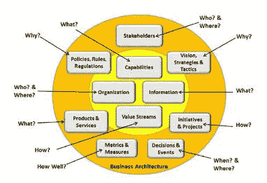
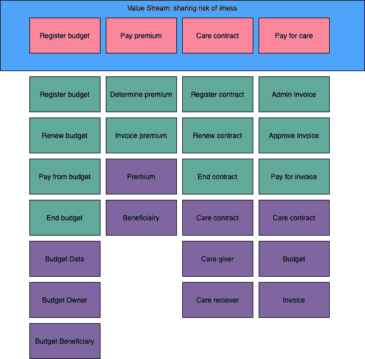
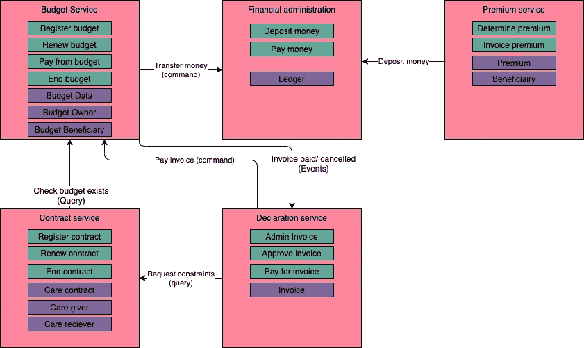
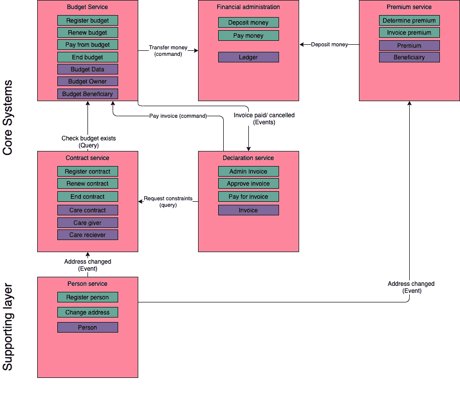

# 协调您的任务和 IT。制胜的业务能力架构

> 原文：<https://medium.com/geekculture/aligning-your-mission-and-your-it-business-capability-architectures-for-the-win-95ec2d1364f8?source=collection_archive---------2----------------------->

Photo by [Lok Yiu Cheung](https://unsplash.com/@yiucheung?utm_source=medium&utm_medium=referral) on [Unsplash](https://unsplash.com?utm_source=medium&utm_medium=referral)

由业务能力驱动的软件和应用程序架构推动了组织使命和 IT 环境之间的一致性。这并不难，不是吗？就像第一句说的那么简单。尽管听起来很简单，但这绝不是一件容易的事。一个人如何创造这种校准？这个指导方针如何能够提供架构边界来[允许组织内的团队尽可能自主地运行](/enterprise-software-architecture/without-boundaries-no-autonomy-an-architects-perspective-bbb16d8826)？正如你现在所知道的，我将从一个建筑师的角度来看待这个问题。

随着业务架构艺术的发展，我们对业务领域的结构化思考也在发展。以[商业模式画布](https://www.strategyzer.com/canvas/business-model-canvas)、[价值主张画布](https://www.strategyzer.com/canvas/value-proposition-canvas)和[商业架构](https://www.businessarchitectureguild.org/)公会为例。我将把后者的主要模型作为锚，因为在我看来，它使我们最接近数字组织的指导方针。

Image: [https://en.wikipedia.org/wiki/Business_architecture](https://en.wikipedia.org/wiki/Business_architecture)

在这个图表中有许多有趣的结构组件。以“价值流”为例。价值流决定了价值如何交付给组织的利益相关者。价值流由许多业务流程组成(通常是多对多的关系)。这些业务流程是组织能力的一部分。以行政部门、财务部门等为例。在我看来，这就是正确建筑的精髓所在。

从你的组织退一步。为你自己描述一下它给利益相关者带来了什么价值。是行政管理，抵押贷款，银行，送书？通过采用这种观点，您就为您的企业级软件架构开了一个好头。

现在让我们再深入一点。价值流中有哪些不同的步骤？他们是如何合作的？在提供价值的能力中，处理的信息是什么？哪些进程“保护”这些信息对象？现在，尝试找到具有高交互率(也称为耦合)的过程和信息对象，并在它们周围画一些圆圈，将您带到具有高内聚的架构区域。这是您未来状态 IT 前景的第一个设置:由业务战略和交付驱动的 IT。根据我多年的经验，我发现计算机科学的基本原则"[高内聚，低耦合](https://en.wikipedia.org/wiki/Coupling_(computer_programming))"同样适用于企业级。在以后的博客文章中，我将分享如何证明企业架构被划分为设计良好的架构区域的见解。

注意最后一个词。我说的是区域，而不是应用程序、系统或其他技术组件。因为我非常喜欢将软件行业的架构师比作城市规划师(灵感来自山姆·纽曼斯[构建微服务】](https://samnewman.io/books/building_microservices/))。在企业软件架构规程中，我们设计了区域([战略环境映射](https://www.infoq.com/articles/ddd-contextmapping/)有人知道吗？)的景观。这有助于创建一个敏捷的架构，同时也提供了一个面向任务的、可扩展的数字组织(参考。[https://svenvintges . medium . com/without-boundaries-no-autonomy-an-architects-perspective-BBB 16d 8826](https://svenvintges.medium.com/without-boundaries-no-autonomy-an-architects-perspective-bbb16d8826))。

## 那么这样的架构是什么样子的呢？

让我们介绍一个我们将在这一系列博客中使用的小案例。我不会使用过度和广泛使用的订单或网上商店类型的案例，但会引入一个新的案例，虚构，基于事实:)

想象一下，我们有一群人分担一些疾病风险。这群人决定通过设立基金来分担这一风险。基于某些与诊断有关的事实，人们可以从该基金中获得资金。这被称为他们的“护理预算”,其金额基于所需的护理。接下来，他们可以通过向组织发送发票进行申报来支付护理人员的费用。根据他们的预算和使用预算的限制，发票将得到支付。当然，必须有足够的资金。因此，从业务角度来看，什么是价值流，什么是流程、信息对象等？

Example business architecture of value stream, business processes, and information objects (in blue the value-stream, pink the high-level steps, green the processes and in purple the information objects)

从这个角度来看。理想的建筑会是什么样子？在这个阶段，不要陷入陷阱和技术问题。首先，从商业角度进行设计。架构必须有一些盒子和它们的关系(right [Gregor](https://www.amazon.de/dp/1492077542/ref=as_li_tl?ie=UTF8&linkCode=gs2&linkId=b743cdb232b038666e078965899c8624&creativeASIN=1492077542&tag=elevator-21&creative=9325&camp=1789) )。这将我们带到软件系统的初始图:

Enterprise Software Architecture based on the business architecture

这就是我们企业架构区的初稿。让我们花点时间去观察和学习。正如我们所看到的，我们在区域、流程、信息方面有着高度的耦合，它们似乎都可以自然地协同工作。当然，存在依赖关系，但它们似乎与业务架构内的依赖关系相同。在我看来，这再简单不过了。业务依赖和 IT 依赖是相同的。

有人可能会问，这有什么关系？如果我们采用更技术性的方法(我们需要 ESB、门户等)，业务流程和功能与技术材料之间将会出现错位。因此，如果您需要交付某些功能，您必须与 ESB 团队、门户团队、数据服务团队等合作。这将导致解决方案空间的意外复杂性:突然之间，我们不得不管理从业务角度看不相关的团队相互依赖。简而言之，这将是一种浪费:在我们数字组织的核心管理不必要的复杂性。

所提供的与业务一致的设置有许多优点。由于业务和数字资产的明确所有权，治理变得更加简单。业务所有者对(数字)业务愿景和 IT 前景拥有清晰的所有权，从业务的角度来看，架构内没有组件共享。业务功能的生命周期与技术心跳等保持一致。

正如引言中所述，流程之间存在多对多的关系，因此架构区域也是如此。在这里，我们将在我们的架构中引入层的概念([抽象难道不是计算机科学的美妙之处之一吗](https://en.wikipedia.org/wiki/Abstraction_laye)，现在我们可以将它提升到企业层面，一定会喜欢它！[但是要小心，它不是圣杯，应该小心使用](https://sandimetz.com/blog/2016/1/20/the-wrong-abstraction)。为了实现正确的抽象，我们必须分析区域间的信息流。从我自己的经历中得到启发，并且在来自[优步](https://eng.uber.com/microservice-architecture/)的一篇精彩文章中清晰地表达出来，我们将走向我们架构的下一次进化。假设一个人居住的区域决定了一个合同是否仍然有效(如果有人搬到一个新城市就无效了)，地址也决定了保费的高低。当然，这都是虚构的。

Introducing a supporting layer in the architecture

这幅图展示了一个新的层，一个支撑层。它只有出站事件流。没有来自上层的入站流。这是层间约束的一个例子。层间约束对于维护体系结构的长期弹性和整体解决方案的敏捷性至关重要。

现在，我们已经构建了从价值流到业务流程和面向架构区域的对象的架构。这就把我们带到了自治区域和团队。但是，在 IT 环境的不同领域中，存在着一些共同的问题。集成使用了技术平台、用户交互渠道、安全性和合规性准则。这推动我们进入下一个抽象层，平台区域为团队提供指导，指导他们如何开发、部署、保护软件，使软件符合规范，并符合架构的要求。我坚信应该尽可能地“对技术架构进行编码”。但这将是一个新帖子的主题。

在这篇文章的结尾，我希望我已经给了你，读者，具体的指导方针，以组织的可伸缩性、团队自治和架构的弹性和敏捷性为明确的目标来设计你的架构。哦，我有没有告诉过你，这听起来很简单，但并不容易。在过去的十年里，我一直致力于架构和组织转型。通常在拥有数百个业务流程、数十个业务领域和遗留系统的组织中，这些系统在过去几十年中表现出色，现在仍然如此！从 a 到 b 有许多有趣的挑战，我将在以后的博客中提供我的架构观点。

…