# 关于决策树的所有内容第 2 部分

> 原文：<https://medium.com/geekculture/all-about-decision-trees-part-2-99fa9bc23cf5?source=collection_archive---------52----------------------->

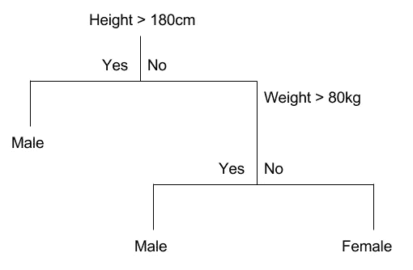

Credits- [ldapwiki.com](https://ldapwiki.com/wiki/Classification%20and%20Regression%20Trees)

在 [**的第一部分**的**中，我讨论了分类树和一些与决策树相关的术语。**](https://gaurav-kumar.medium.com/all-about-decision-trees-part-i-cfa148c75631)

我请求你在阅读这篇文章之前先浏览一下那篇文章。

在本文中，我们将了解**回归树**以及如何使用它们进行预测。

在**回归树**中，目标变量是连续的数值数据。

让我们用一个例子来理解回归树的**工作方式**:

假设我们得到了许多学生每天平均学习时间的数据以及他们在考试中得到的分数。

所以，Avg 之间的模式。学习时间和分数是这样的:

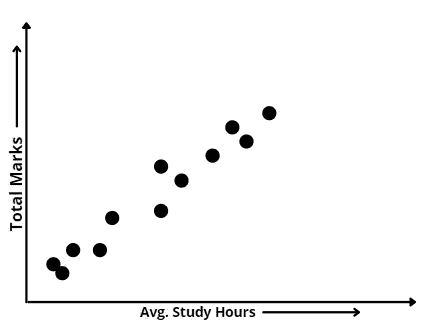

When trend is linear

因此，我们可以清楚地看到，每天学习很多的学生更有可能取得好成绩，所以如果我们得到一个新的学生数据(粉红色的点)，那么基于他的平均成绩。学习时间我们可以通过如下所示的数据点画一条直线来预测他/她在未来考试中可能获得的分数:

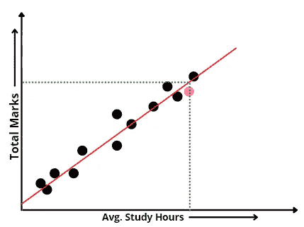

Prediction in case of Linear Trend

实际上，我们能够做到这一点是因为数据遵循线性趋势，即当学习时间增加时，总分数也增加。

但是，如果数据遵循非线性趋势呢？如下图所示:

When trend is non linear

上图显示了学生在考试前一周的学习时间的表现。所以，那些学习非常努力、夜以继日的学生也不能取得好成绩，可能是因为睡眠不足会导致记忆力丧失。此外，学习不多的学生表现不好，这是显而易见的。

所以，看着这个图，我们可以清楚地看到，如果我们试图拟合一条直线，我们将无法正确地预测许多新数据点的值。所以，在这种情况下**回归树**会变得很方便。

在回归树的情况下，我们试图找到最佳的阈值来区分各组，如下所示。

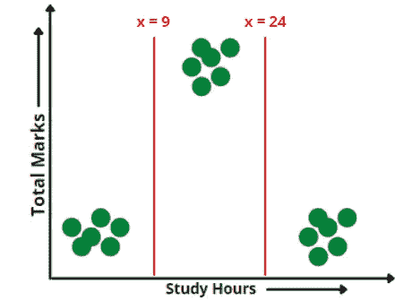

Regression Tree with Thresholds

因此，如果我们得到一个新的数据点，其学习时间超过 9 小时，但少于 24 小时，那么他将来可能得到的总分数将是该范围内所有数据点的平均值。

但现在问题来了，如何为我们的树决定这些完美的阈值？

为此，取每对数据点的平均值，然后以此作为阈值，为我们的阈值预测的平均值和数据点的实际值计算 **RSS(残差平方和)**。

现在，我将只以第一对为例，因为我不能显示所有对的图像及其阈值。

**注意:-我已经将上图的第一个数据点移至稍微靠左的位置，以便更容易显示平均线。**

因此，现在让我们考虑前两个值的平均值作为阈值，并根据它来分离数据点。

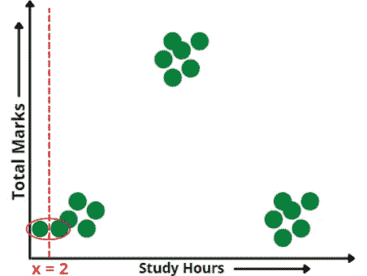

Taking Threshold of first pair of values.

根据该阈值，它正确预测第一个数据点的值，而它预测所有其他数据点的平均值，如下所示:

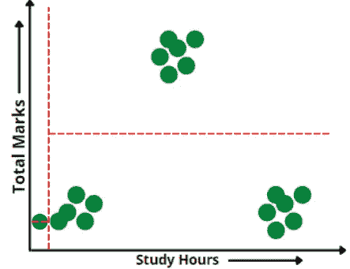

现在，为了测量我们的阈值预测到实际值的远近，我们需要一个度量来测量它的性能。

因此，在回归树的情况下，**【残差平方和】**用于计算每个阈值的性能，如下所示:

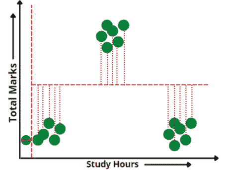

Calculating residual sum of squares

**RSS(残差平方和):-** 平均值与预测值之差的平方和。

以与上述相同的方式，计算所有其他对的阈值，然后比较它们的 RSS，选择具有最小 RSS 的阈值作为最佳阈值。

下图显示了如何选择最佳阈值:

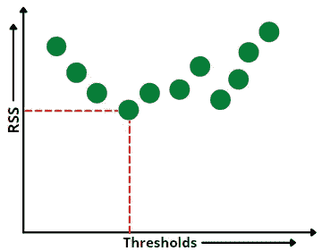

Visualization of how best threshold is chosen

现在，当我们得到第一个阈值时，再次取对的平均值，再次重复上述所有步骤以得到另一个阈值，但唯一的区别是第一个阈值划分了它之前和之后的所有数据点，因此两部分的阈值分别计算如下:

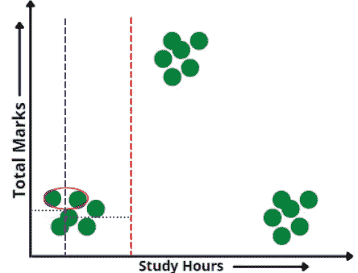

因此，以这种方式，计算阈值以对数据进行分类的过程继续进行，但是可能我们的决策树模型开始记忆训练数据(过度拟合),如下所示:

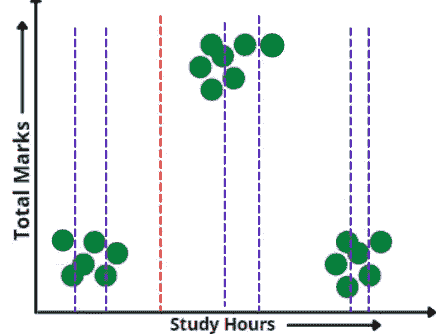

Overfitted Regression tree

因此，为了避免这种过度拟合的情况，可以设置一个标准，即只有在至少 4 或 5 个数据点出现之前和之后的那些阈值才有效(在我们的情况下，只有很少的数据，但实际上对于大数据，该值通常取为 20)。因此，根据这一条件，我们的最终阈值如下所示:

Final thresholds for study hour column

到目前为止，我们已经讨论了如何在列中找到最佳值来拆分树，如下所示:

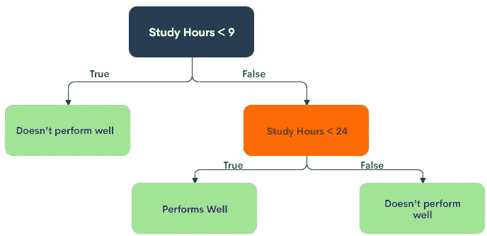

Final Regression tree

**注意:-如果我们使用“学习时间< 24”开始划分，结果将是相同的，您可以自己尝试。**

但是，如果我们有多个列呢？我们将如何决定哪一列最适合位于根节点？

假设我们有如下所示的数据:

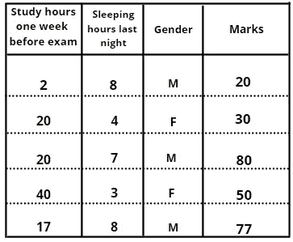

**注:-** 表中数据并非真实数据，仅供举例，由本人创建:)

在这种情况下，我们将考虑每一列，并且将针对我们的目标列(标记为**)计算每种情况的 RSS。**

**我们已经看到，当独立列是数字时，如'**学习时间**或'**睡眠时间**，阈值是如何计算的。**

**但是如果我们有一个像上面所示的' **Gender** '这样的分类列呢？**

**在这种情况下，阈值可以是' **M '或' F'** ,如下所示:**

**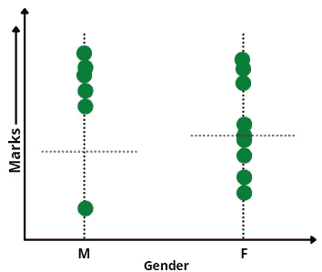**

**Choosing threshold for categorical column**

**因此，取所有' **M** 数据点和所有' **F** 数据点的平均值，相对于该平均值计算 RSS，并将选择' **M** 和' **F** 中具有较小 **RSS** 的一个。**

**因此，最终根节点将是具有最少 RSS 的列。**

**现在，对于分支节点，我已经在“**关于决策树**的第 1 部分中介绍过，通过比较 RSS 和考虑根节点的条件来执行相同的程序。**

**快乐学习！！！:)**

****参考文献:****

**[Josh Starmer 的 stat quest](https://www.youtube.com/channel/UCtYLUTtgS3k1Fg4y5tAhLbw)**