# 关于决策树的所有部分:- I

> 原文：<https://medium.com/geekculture/all-about-decision-trees-part-i-cfa148c75631?source=collection_archive---------12----------------------->

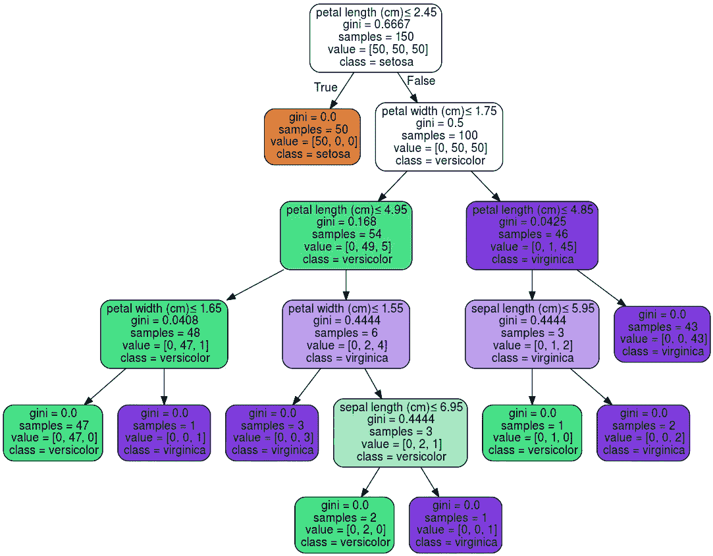

**Source:-** scikit-learn

决策树是一种著名的机器学习算法，在回归和分类问题中都有应用。

这种算法的工作原理是作出一个选择的陈述，并根据其结果提供不同的结论。

下图是一个非常基本的决策树。

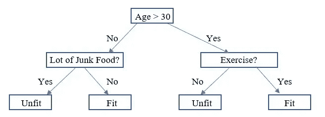

Basic Decision Tree([Source](https://www.educba.com/what-is-decision-tree/))

默认情况下，在决策树中，通常当条件为真时，子分支显示在左边，当条件为假时，子分支显示在右边。

所以，如果你被提供了正确/错误的图表，你可以考虑默认的方向。

# 与决策树相关的基本术语:

1.  **根节点:** -这是树的开始节点，在此之后，整个群体基于不同的特征而分裂。
2.  **分支节点** :-这是根节点下进一步分裂的节点。在流程图中，一个分支节点是一个箭头指向和远离的节点。
3.  **叶节点:** -不能再拆分决策的节点为叶节点。在流程图中，它是箭头指向的节点，但没有箭头指向远离它的方向。

下图可以帮助你了解树的这些部分。

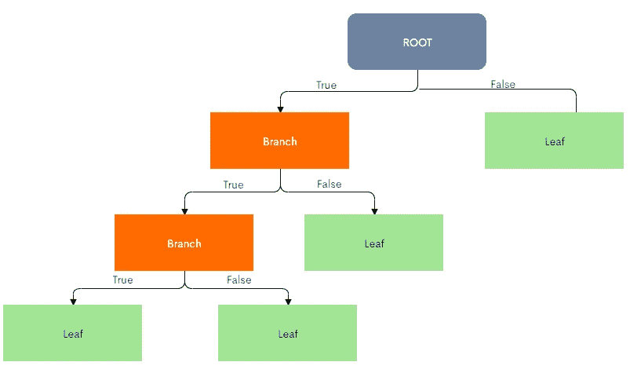

关于目标变量，有两种类型的决策树:

1.  **回归树**:当目标/因变量是一个连续的数值变量时，那么用来预测该数值特征的决策树称为回归树。
2.  **分类树**:当目标/因变量为离散分类变量时，用于预测目标特征的决策树称为分类树。

# 分类树:

现在，让我们试着做一个分类树。

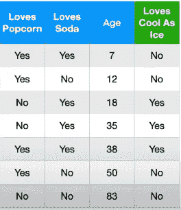

Credit:- Statquest

现在，让我们尝试使用这里提供的数据从头开始制作一个决策树。

在这个数据中，‘爱凉如冰’是目标变量，其他是自变量。

在这里，我们试图使用决策树，根据其他参数来预测一个人是否“喜欢冷若冰霜”变量。

因此，第一步是决定哪个变量最适合根节点，这是通过了解特定变量是否能够以最有效的方式预测目标变量来完成的。

让我们考虑爱爆米花作为根节点:

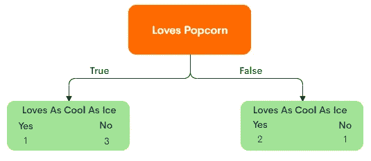

Classification tree made after considering Loves Popcorn as the root node.

正如你在这种情况下看到的,“喜欢爆米花”功能无法完全区分用户是否喜欢“像冰一样冷”。

所以，现在让我们尝试另一个特性作为根节点。

让我们试试爱汽水作为根节点。

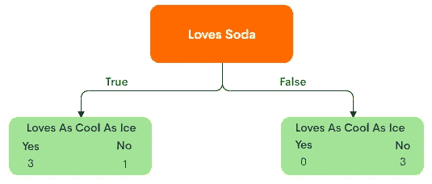

Classification tree made after considering Loves Soda as the root node.

虽然在这种情况下，不爱汽水的人也不爱冰爽，但在爱汽水的人的情况下，我们仍然不能完全区分爱冰爽或不爱冰爽的用户。

因为一个变量并不总是能够完全区分目标变量，所以我们应该从所有的从属特征中选择最能区分目标变量的变量。

为此，我们需要首先了解杂质这个术语:

在上面的两个决策树中，包含是和否的叶子是不纯的，而只包含是或否之一的叶子不是不纯的。

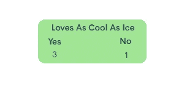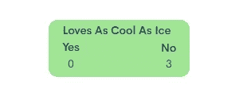

Left leaf is impure and Right Leaf is not impure

因此，只有该变量被用作根节点，这为目标特征提供了最少的杂质。

现在，有几个方法来量化一片叶子的 T2 杂质，熵，信息增益，基尼杂质，我将使用基尼杂质来解释分类树。

计算一片叶子的**基尼系数的公式是**:

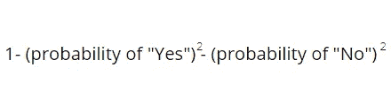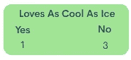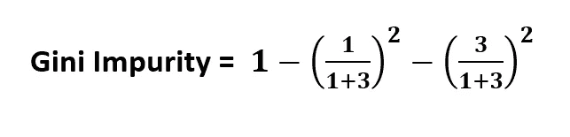

Calculation Gini Impurity of the Corresponding leaf

计算一片叶子的基尼系数是不够的，因为我们应该计算根节点完成的整个分裂的基尼系数。因此，最后通过计算叶子的**加权平均基尼系数**来计算树的**总基尼系数**，其由 **:** 给出

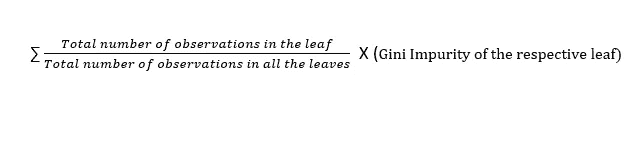

Formula to calculate total Gini impurity of a tree

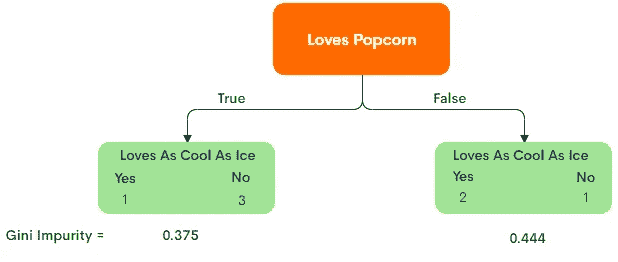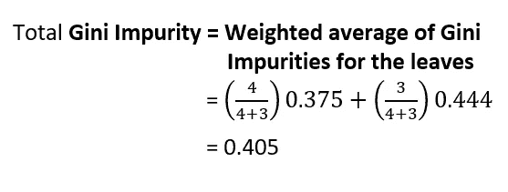

Total Gini Impurity

因此，具有不同根节点的每棵树的**总基尼系数杂质**被比较，并且负责最低基尼系数杂质的变量被认为是根节点。

现在，问题出现了，因为在上述数据中也有一个数字栏，在数字数据的情况下，如何计算基尼系数。

而在此之前又出现了一个问题:应该根据哪个数值来创建分支，是应该年龄< 12，年龄< 18，年龄< 38 还是别的！！。

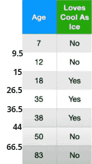

Mean of Each Pair

为了基于应该创建哪些分支来决定数值，应该首先计算每对年龄的平均值，然后将每个平均值视为阈值，需要计算基尼系数，然后具有最低基尼系数的平均值成为根节点。

因此，如下所示，计算并比较了每种情况下的总基尼系数。

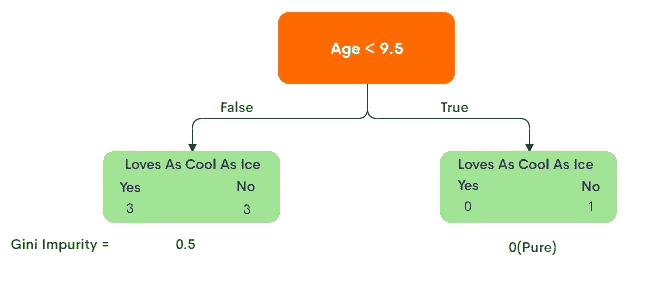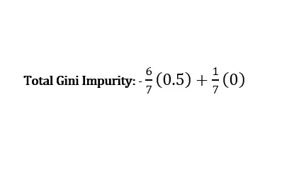

Gini Impurity in each case

因此，正如我们在这里看到的，基尼系数 0.343 是最小的，因此在这种情况下，可以选择 15 或 44 作为阈值。

因此，现在为了决定最终的根节点，比较所有独立特征的基尼系数。

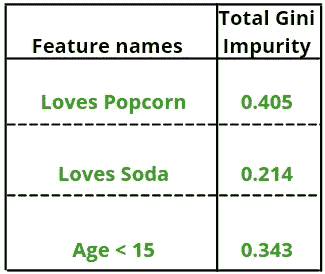

Total Gini Impurity of all columns

因此，在这种情况下,“爱喝汽水”成为决策树的根节点。

但是我们不能就此止步！！！！

我们刚刚找到了根节点，但是现在还没有完成整个树..

在决定了根节点之后，现在我们应该决定分支。

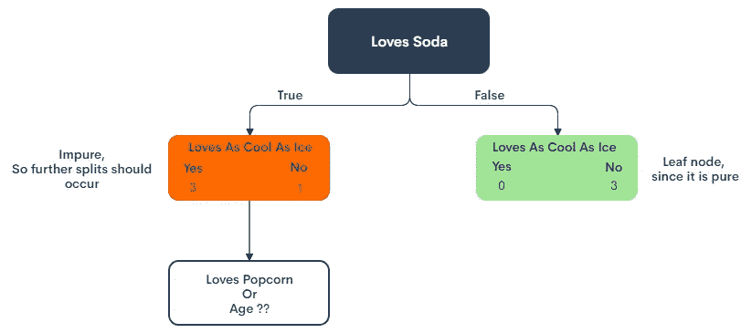

Deciding the parameter for branch node

现在，为了选择用于进一步分裂的参数，重复上述基尼系数杂质比较的整个过程，但是应该记住遵循根节点的条件，即，仅考虑遵循根节点条件的那些行。

例如，在上图中，为了确定是在分支节点中保留“Age”还是“Loves Popcorn ”,只需考虑“Loves Soda”的值为“Yes”的那些行。

因此，用于进一步处理的表格将如下所示

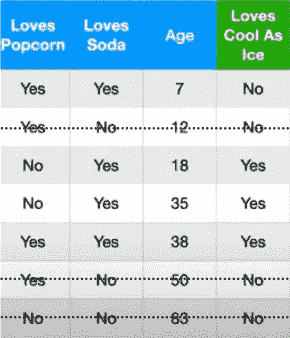

Those who don’t love soda are in the leaf node

因此，现在保持我们的目标变量不变，我们将只考虑那些**“爱喝汽水”=“是”**的项目，现在比较其他列相对于“爱喝冰爽”的基尼系数。

因此，在比较了其他列的基尼系数后，最终的树看起来会像这样，你也可以自己尝试一下

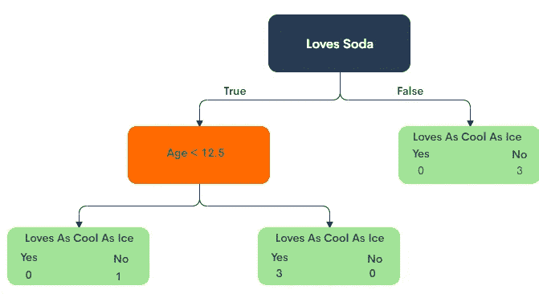

查看上面的结果，最终的树可以解释为:

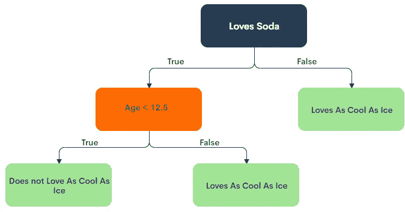

Decision Tree

现在，如果一个新的数据来了，我们可以沿着上面的树来预测目标变量，

正如你所看到的，在当前的情况下，一个记录到达了说不像冰一样冷的爱的叶子，所以它可能是我们的树正在记忆数据或过度拟合数据。

所以，防止这个问题有两种方法:

1.  修剪。
2.  设置一个阈值，即一个叶子只能包含 3 个或更多记录，否则将不会生成叶子。

**参考文献:**

[与乔希·斯塔默的 StatQuest】](https://www.youtube.com/user/joshstarmer)