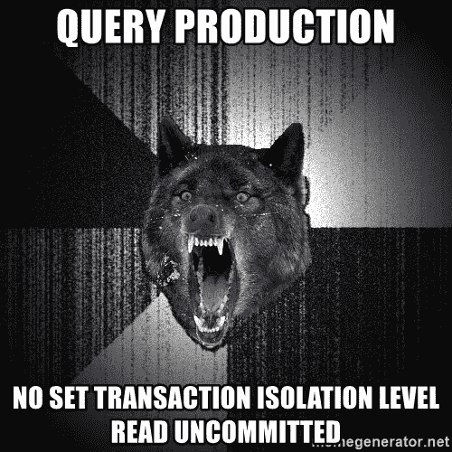

# 通过脏读和隔离级别变脏..！！

> 原文：<https://medium.com/geekculture/all-about-dirty-reads-and-isolation-levels-26d6e36a35bc?source=collection_archive---------7----------------------->

我们在使用 SQL 数据库时都见过并使用过以下语句"**SET****ISOLATION****TO****DIRTY****READ "。在这篇文章中，我想深入探讨为什么它是必需的，以及围绕它的其他细微差别是什么。此外，如果不使用隔离级别，会有什么后果**

在我们了解更多关于脏读的知识之前，我们应该了解一下 ACID 的属性