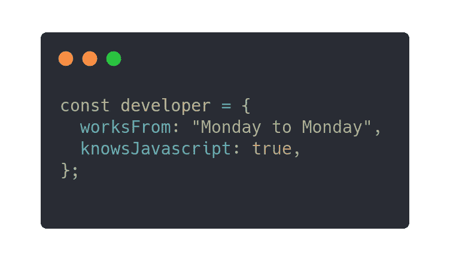
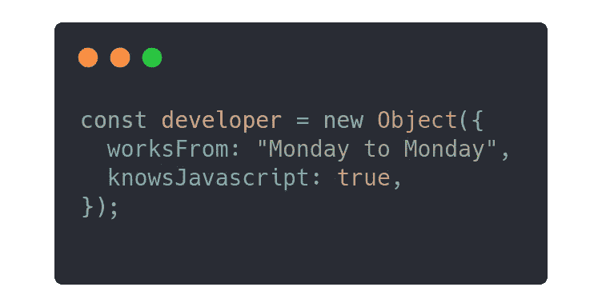
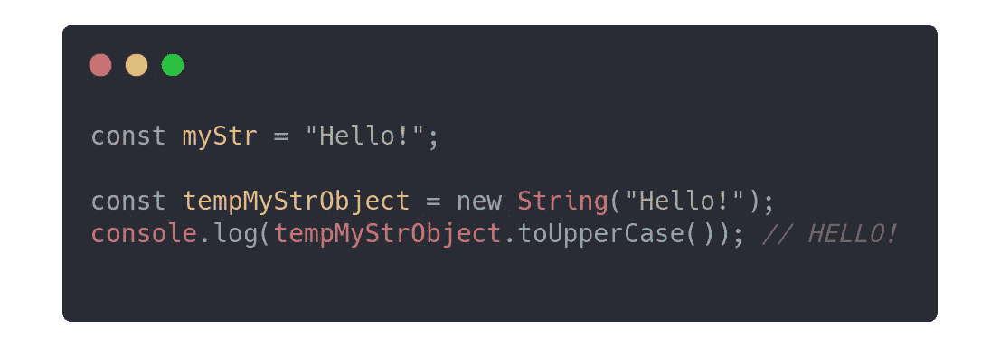
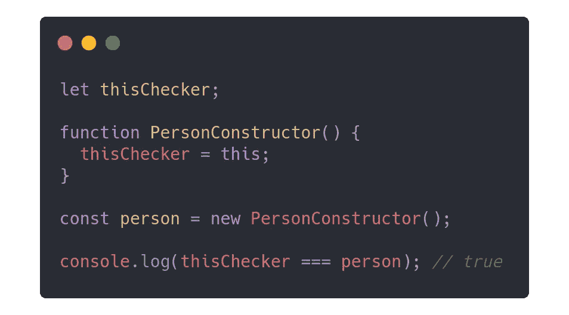
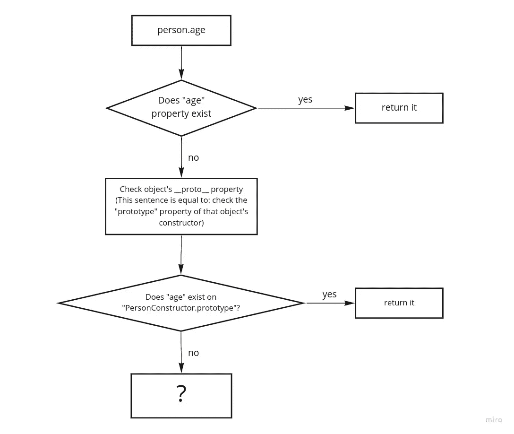
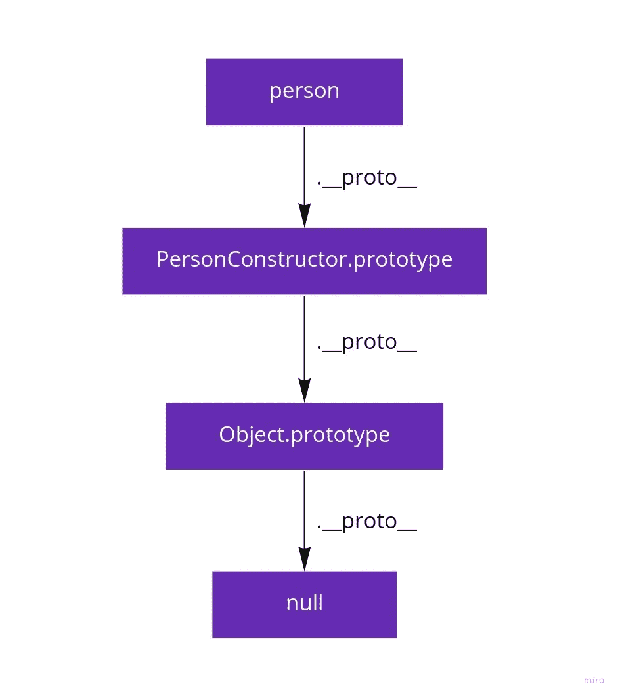
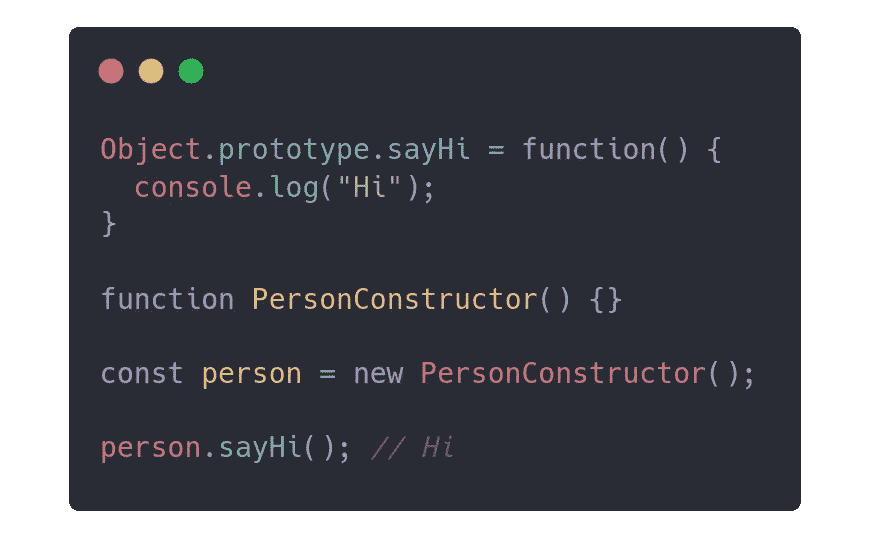

# 关于 javascript 中的继承

> 原文：<https://medium.com/geekculture/all-about-inheritance-in-javascript-c27a6a49a229?source=collection_archive---------21----------------------->


Apple objects get their water from the root object. Image by [Jen Theodore](https://unsplash.com/@jentheodore).

你可能听说过 Javascript 构造函数、原型、原型链和其他类似的可怕术语。在本文中，我们将了解它们是什么，它们为什么存在，以及我们如何使用它们。

先来看看什么是构造函数:构造函数或者“构造函数”简单来说就是函数，用`new`关键字调用！就这么简单😄


The keyword “new” calls a function as a constructor

那又怎样？为什么这个特征会存在？答案是:

> **Javascript 中的所有对象都是由构造函数创建的**

用`new`关键字调用函数总是会返回一个对象。Javascript 可能会令人困惑，尤其是对于初学者，因为每个人都知道这是创建对象的方法:



declaring a “regular” javascript object

是的，这就是创建一个对象的方式，**但是只能创建一个**类型的对象**对象**！

上面的代码是这样的简写:



Curly braces are shorthand for new Object({})

看到了吗？javascript 中没有一个对象不是在没有构造函数的情况下产生的。那么什么是`Object`？它是一个内置的 javascript 函数(构造函数)，负责创建“常规”对象。它是 Javascript 中所有其他对象的根(我们将在后面讨论)。

Javascript 中的所有数据类型都有相应的内置构造函数。

字符串、数字、布尔值、对象(也包括:数组、函数、…)、…

所以写`const myArray = [1, 2];`是写`const myArray = new Array(1, 2);`的简写。

**注意:**不要使用这些构造函数来创建变量，尤其是`Function`，因为[有安全和性能问题](https://developer.mozilla.org/en-US/docs/Web/JavaScript/Reference/Global_Objects/Function)。

**注意:** `const myStr = "Hello";`不是`const myStr = new String("Hello");`的简写。正如您所记得的，构造函数调用的结果总是一个对象。那么为什么这些构造函数是为原语而存在的呢？

```
const myStr = "Hello!";
console.log(myStr.toUpperCase()); // HELLO!
```

链接一个点只对“object”类型的变量有意义，因为它们有结构。但是为了方便起见，Javascript 标准允许我们像对待对象一样对待原语*。因此，当我们将一个点链接到一个原语时，Javascript 引擎会在内部临时创建一个对应构造函数的对象，并在这个临时对象上执行我们的属性/方法访问。后来被销毁了。*



Javascript wraps primitives in temporary objects when needed

上面的代码是一段伪代码，描述了当我们像对待一个对象一样对待一个原语时，在幕后发生了什么。

# 构造函数和函数有什么不同？

构造函数是函数。唯一的区别是，当我们用`new`关键字调用函数时，javascript 首先创建一个普通的空对象，然后将这个新创建的对象作为一个名为`this`的特殊变量传递给函数。

**注意:**将构造函数命名为 PascalCase 是一个很好的做法，以便在视觉上与常规函数区分开来。



proof that “this” variable inside the constructor points to the returned object by “new”

如你所见，我们的构造函数中的变量`this`是**与`person`变量完全相同的**。如果两个对象相等，这意味着它们都指向内存中完全相同的位置，对它们中的每一个进行变异都会影响到另一个。因此，向`PersonConstructor`内部的`this`添加属性就像向`person`添加相同的属性一样。

**注意:**如果构造函数不返回对象，它将隐式返回`this`(就像我们的例子一样，它不返回任何东西，即`undefined`)。

# 原型

所有的 Javascript 函数都有一个特殊的属性叫做`prototype`。只有当函数作为构造函数被调用时，它才是有用的，因为当`new`关键字创建空对象时，它会向它添加一个内部的`[[Prototype]]`属性，该属性指向构造函数的`prototype`属性。

默认情况下，`prototype`对象只包含一个名为`constructor`的属性，该属性指向构造函数本身。

```
person.__proto__.constructor === PersonConstructor; // true
```

**注意:**将属性名写在双括号中意味着它是该对象的内部属性，开发者不能使用它们。要访问对象的这个特定属性，我们可以使用`Object.getPrototypeOf(obj)`方法。虽然它不是标准的，但是大多数浏览器都允许开发者将它作为一个名为`__proto__`的属性来访问。为了方便起见，从现在起我们称它为`__proto__`。

## `__proto__`财产到底是什么？

所有面向对象的语言都实现了继承的方法。在 Javascript 中，继承是通过这个特殊的`__proto__`属性完成的。当你试图访问一个对象上的属性/方法时，Javascript 引擎首先检查对象自身的属性，如果找到它们，它们将被使用，如果没有，对象的`__proto__`将被检查。再次，记住`__proto__`和`prototype`之间的重要关系:

> 一个对象的`__proto__`属性指向该对象的构造函数的`prototype"`属性。



the usage of object’s __proto__ property

上图显示了 Javascript 如何寻找缺失的属性/方法。它检查该对象的`prototype`属性上的属性/方法。但是如果它也不在那里呢？记住，`PersonConstructor.prototype`只是另一个对象！因此，如果这里缺少一个属性/方法，那么这次在`Person.prototype`上执行上图。

当我们创建一个函数时，它的`prototype`属性是由内置的`Object`构造函数(即普通对象)创建的。那么你认为下面这个表达式的结果会是什么呢？

```
PersonConstructor.prototype.__proto__
```

是啊！是`Object.prototyope`。



prototype chain

这个图表显示了一个叫做“原型链”的东西。这是 Javascript 继承的一种机制，以及它如何找到丢失的属性/方法，直到它最终到达`null`并因此返回`undefined`。

为了测试上面的图表，我们可以编写以下代码:



proof of prototype chain

**注:**这是一个证明原型链如何工作的例子。修改 Javascript 内置构造函数的`prototype`属性通常是一种不好的做法。

在上面的代码中，`sayHi`在`person`对象上不存在。所以我们来看看它的构造函数的`prototype`属性。`sayHi`在`PersonConstructor.prototype`上也不存在。所以让我们检查一下`PersonConstructor.prototype`的构造者是`Object`。是的，它存在于`Object.prototype`中。

# 包扎

Javascript 继承一开始可能会令人困惑。但是理解它很重要。以下是您需要了解的内容:

*   构造函数是函数，用`new`关键字调用。
*   所有的 Javascript 对象都是由构造函数创建的。
*   关键字`new`创建一个空的普通对象，并将其作为变量`this`传递给构造函数。
*   如果构造函数不返回对象，`this`将被隐式返回。
*   “常规”或“普通”对象由内置的`Object`构造函数创建。
*   对象通过一个叫做`__proto__`的属性知道它们的构造函数。
*   属性`__proto__`指向其构造函数的`prototype`属性。
*   `prototype`属性存在于所有的 javascript 函数上。默认情况下，它是一个普通对象，只有一个名为`constructor`的属性，指向构造函数本身。
*   属性只是另一个对象，这意味着它也有一个属性。所以对于一个常规函数，其`prototype`属性的构造函数是`Object`。
*   如果我们想访问一个对象本身缺少的属性/方法，Javascript 会查看该对象的`__proto__`(它是其构造函数的`prototype`属性),如果它也不存在，那么会递归地对`prototype`对象的`__proto__`进行同样的查找，直到找到它或者到达`null`并返回`undefined`。这就是所谓的“原型链”。
*   由于构造函数所有实例上的属性`__proto__`指向其`prototype`属性，构造函数上的变异`prototype`属性在所有实例上立即可用。