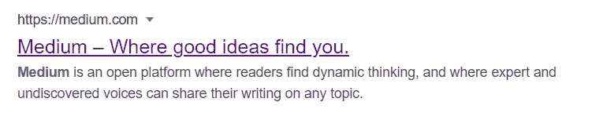

# 所有关于你的网站的元数据

> 原文：<https://medium.com/geekculture/all-about-metadata-of-your-website-4a259008b1a7?source=collection_archive---------49----------------------->

## 什么是元数据，为什么它很重要？让我们来了解一下！

这个博客将讨论元数据的关键方面，元标签，它如何帮助你在谷歌搜索上提升你的网站，等等…

# 什么是元数据？

元数据是提供网页摘要的文本和图像内容的简单片段。当有人通过 Whatsapp、Instagram、Twitter、Linkedin、messaging 等分享链接时，这些数据通常会显示出来。此外，元数据还包含信息，帮助不同的搜索引擎扫描您的网站，以找出它是什么或它是否合法。如果我用一句话来描述元数据，我会说—

> 它是你的网站在浏览器中打开之前提供的所有信息。



meta title and description


meta tag image

# 为什么元数据很重要？

你不希望你的网站第一眼看上去超级漂亮诱人吗？这正是你需要元标记的原因！将元标签整合到你的网站中，不仅能让它在社交媒体页面上看起来更好，还能提升它在谷歌上的排名。创建元数据时必须一丝不苟，因为你需要为它选择正确的词语。一个人不应该只是在元标签中不停地漫游。谷歌提供的限制是标题 60 个字符，描述 105 个字符。因此，我们必须确保有效地使用我们的语言。正确使用，你的网站元数据将大大提高你的网站在有机搜索结果中的可见性，并能为你的网站带来更大的流量。


# 元标记

我已经对元标记和元数据大谈特谈了很久了。但是，元数据实际上去了哪里？我该怎么定义？
元数据在网站代码中有其特殊的位置。它被放置在您的`**.html**`文件的`**<head> </head>**` 标签中。让我们看看我们能写的不同种类的标签。

## 标题标签

最重要的 meta 标签是 title 标签。无论你在哪里提到你的网站，它都会出现。无论是在搜索引擎上还是在任何社交媒体网站上，你都会随处看到标题标签的内容。它被定义为—

```
**<title>**Your Website Title**</title>
<meta name="**title" **content="**Your Website Title"**>**
```

## 描述标签

描述标签对于提高网站的参与度非常有价值。这是与你的目标受众沟通的最有效的方式之一。虽然 google 通过从您的网页中提取文本来自动生成描述，但建议您尽可能根据自己的需求进行定制。它被定义为—

```
**<meta name=**"description" **content=**"Your description here**">**
```

## 元图像或 OG:图像标签

这个标签非常重要，因为它关系到你网站的视觉效果。我希望人们知道我的网站看起来有多漂亮，或者我的品牌代表什么，这样他们就会很兴奋地打开我的链接。如果这是您想要的，那么您绝对应该使用 og:image 标记。在脸书、Twitter 和 Linkedin 这样的网站上，你的元图片比你的文本内容大 3 倍！它被定义为—

```
<**meta** **property="**og:image**" content="**your image path**">**
```

## Opengraph 和社交媒体标签

开放图形元标签是控制在社交媒体上共享 URL 时如何显示的代码片段。社交媒体网站上显示的所有关于您的网页的内容都包含在 og 或 open graph 标签中。一些社交媒体网站喜欢像 Twitter 一样有自己的标签。这些标签看起来像—

```
**<!-- Open Graph -->**
<**meta** property="og:type" content="website">
<**meta** property="og:url" content="Your site URL">
<**meta** property="og:title" content="Your site title">
<**meta** property="og:description" content="Your site description">
<**meta** property="og:image" content="your image path">

**<!-- Twitter -->**
<**meta** property="twitter:card" content="summary_large_image">
<**meta** property="twitter:url" content="Your site URL">
<**meta** property="twitter:title" content="Your site title">
<**meta** property="twitter:description" content="Your description">
<**meta** property="twitter:image" content="Your image path">
```

上面简单介绍了什么是元标签以及它们为什么重要。元数据是一个非常有用的工具，可以提高网站的参与度和活跃度。所以，下次你创建或编辑你的网站时，请记住这些标签！

我希望你喜欢这个博客。回头见！