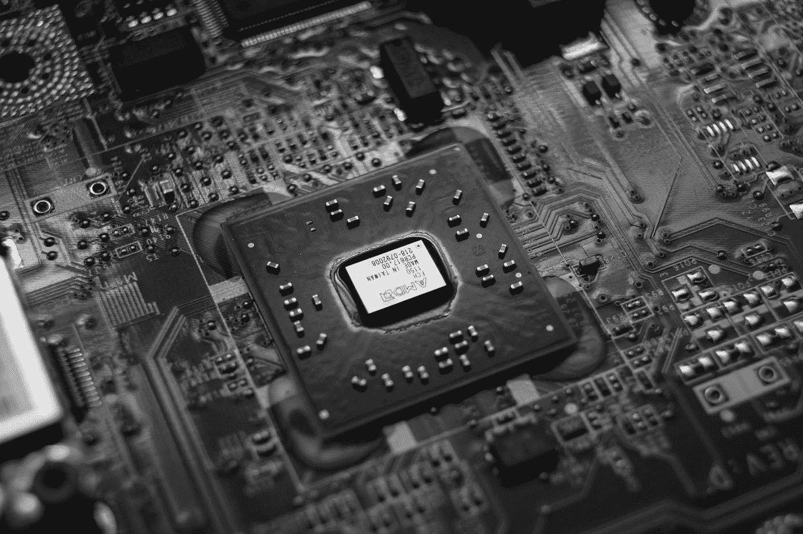

# 关于 YOLO V7 优化:使用模型缩放来权衡精度和计算

> 原文：<https://medium.com/geekculture/all-about-yolo-v7-optimization-using-model-scaling-to-trade-off-accuracy-and-computation-e80adfff9d62?source=collection_archive---------1----------------------->

Photo by [Jorge Salvador](https://unsplash.com/@jsshotz?utm_source=medium&utm_medium=referral) on [Unsplash](https://unsplash.com?utm_source=medium&utm_medium=referral)

部署是任何机器学习开发周期中最关键的一步，因为它决定了一个模型将在一个组织中获得多少价值。YOLO 是可用的最流行的对象检测之一。最近发布的 YOLO v7 是目前为止最先进的物体检测技术，它越来越受欢迎，因为它…