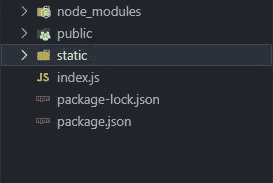
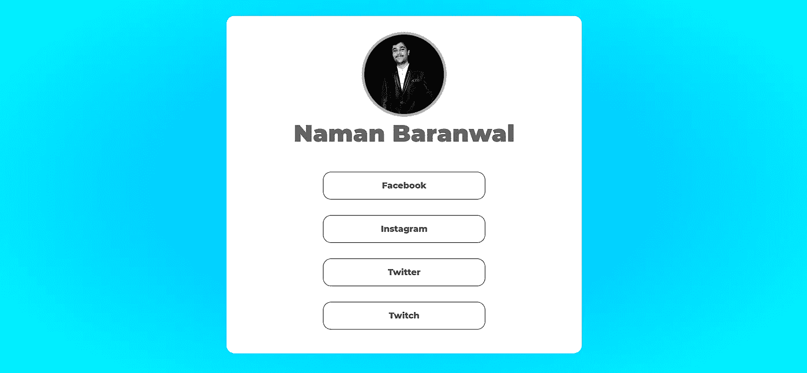

# 带有节点 JS 的一体化社交媒体页面

> 原文：<https://medium.com/geekculture/all-in-one-social-media-page-with-node-js-3bfc8e953653?source=collection_archive---------24----------------------->

在本教程中，我们将为您和您的朋友创建一个一体化的社交媒体页面，您可以将它放在 heroku 上。

[https://www.youtube.com/watch?v=kCfYysjpI2c](https://www.youtube.com/watch?v=kCfYysjpI2c)


## 我们需要什么

*   NodeJS 和 NPM 已安装
*   快递和 EJS
*   你的社交媒体账户

## 设置项目

首先创建一个名为`all_in_one_social_media`的文件夹，并在那里用`npm init`初始化节点项目。现在打开这个文件夹，用`npm i express ejs`安装`express`和`ejs`模块。



打开 Visual Studio 代码，让我们创建`index.js`文件并创建`views`和`public`目录。

*   目录将保存您的静态文件，如 html 文件所需的`css`和`js`文件
*   `views`目录将保存您想要在服务器上渲染的 ejs 文件。

打开`package.json`文件并创建两个脚本。

```
{
  "name": "social_media_all_in_one",
  "version": "1.0.0",
  "description": "",
  "main": "index.js",
  "scripts": {
    "start": "node .",
    "dev": "nodemon ."
  },
  "keywords": [],
  "author": "Naman Baranwal",
  "license": "ISC",
  "dependencies": {
    "ejs": "^3.1.6",
    "express": "^4.17.1"
  }
}
```

## 创建服务器

在代码编辑器或 IDE 中打开`index.js`文件，并键入以下代码。

```
const express = require('express');
const app = express();
const fs = require('fs');const PORT = process.env.PORT || 3000;app.set('view engine', 'ejs');
app.use(express.static('public')); app.get('*', (req, res) => {
    return res.status(404).send("<h1>404 Page not Found!</h1>");
});app.listen(PORT, () => {
    console.log(`Server is listening on http://localhost:${PORT}/`);
});
```

如果你一切都做对了。打开项目中的`powershell`或`Terminal`并输入`npm run dev`。现在打开浏览器，将它粘贴到 URL 中。`[http://localhost:3000](http://localhost:3000.)` [。](http://localhost:3000.)

## 创建视图

打开`views`目录，创建名为`index.ejs`的文件。这将包含所有的网站前端。键入以下代码。

```
<!DOCTYPE html>
<html lang="en">
	<head>
		<meta charset="UTF-8" />
		<meta http-equiv="X-UA-Compatible" content="IE=edge" />
		<meta name="viewport" content="width=device-width, initial-scale=1.0" />
		<title>Social Media</title>
		<link rel="stylesheet" href="/styles.css" />
	</head>
	<body>
		<div class="container">
			<div class="avatar">

			</div>
			<div class="name"></div>
			<div class="links">

			</div>
		</div>
	</body>
</html>
```

现在打开`public`目录，创建名为`styles.css`的文件，并输入以下代码。

```
@import url("https://fonts.googleapis.com/css2?family=Montserrat:wght@800;900&display=swap");body {
	margin: 0;
    padding: 0;
    background: radial-gradient(rgb(0, 174, 255), cyan);
	font-family: "Montserrat", sans-serif;
    user-select: none;
    height: 100%;
}.container {
    width: 40%;
	margin: 5% auto;
	display: grid;
	place-items: center;
    background: white;
    border-radius: 15px;
    padding: 2%;
}.avatar img {
	height: 150px;
	width: 150px;
	border-radius: 50%;
    border: 5px rgb(172, 172, 172) solid;
}.name {
	font-weight: 900;
	font-size: 45px;
	color: rgb(99, 99, 99);
    margin-bottom: 5%;
}.links {
	display: flex;
    flex-direction: column;
    align-items: center;
    justify-content: center;
    width: 100%;
}.links .link{
    width: 50%;
    height: 50px;
    background: white;
    color: rgb(71, 71, 71);
    border-radius: 15px;
    margin: 15px;
    display: grid;
    place-items: center;
    border: 1px solid black;
    transition-duration: 0.2s;
    cursor: pointer;
    text-decoration: none;
}.link:hover{
    background: blue;
    color: white;
    border: 1px solid blue;
}@media screen and (max-width: 768px) {
    .container{
        width: 75%;
    }
}
```

## 为用户建立链接

让我们再次打开`index.js`并创建两条路线。`/`和`/:username`如下图。

```
const express = require('express');
const app = express();
const fs = require('fs');const PORT = process.env.PORT || 3000;app.set('view engine', 'ejs');
app.use(express.static('public'));app.get('/', (req, res) => {
    let users = fs.readFileSync('./users.json').toString('utf-8');
    users = JSON.parse(users); return res.render('index', {
        "user": users["prgmaz"],
    });
});app.get('/:username', (req, res) => {
    let users = fs.readFileSync('./users.json').toString('utf-8');
    users = JSON.parse(users); return res.render('index', {
        "user": users[req.params.username],
    });
}); app.get('*', (req, res) => {
    return res.status(404).send("<h1>404 Page not Found!</h1>");
});app.listen(PORT, () => {
    console.log(`Server is listening on http://localhost:${PORT}/`);
});
```

现在打开`index.ejs`并显示你传递给你的用户视图。

```
<!DOCTYPE html>
<html lang="en">
	<head>
		<meta charset="UTF-8" />
		<meta http-equiv="X-UA-Compatible" content="IE=edge" />
		<meta name="viewport" content="width=device-width, initial-scale=1.0" />
		<title>Social Media</title>
		<link rel="stylesheet" href="/styles.css" />
	</head>
	<body>
		<div class="container">
			<div class="avatar">
                " alt="Avatar">
			</div>
			<div class="name"><%= user.name %></div>
			<div class="links">
                <% Object.keys(user.links).forEach((key) => { %>
                    <a class="link" target="_blank" href="<%= user.links[key] %>">
                        <%= key %>
                    </a>
                <% }) %>
			</div>
		</div>
	</body>
</html>
```

你的项目完成了。



[链接到项目](https://github.com/Programmer101N/all-in-one-social-media)

[在社交媒体上关注我](https://wlo.link/@prgmaz)