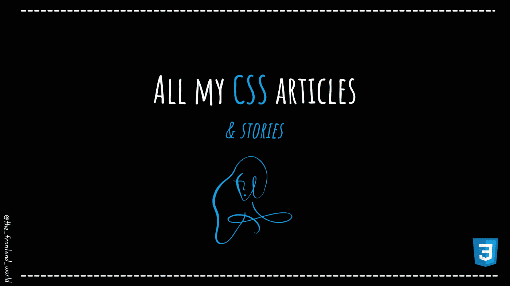

# 我的所有 CSS 文章

> 原文：<https://medium.com/geekculture/all-my-css-articles-d11765ce9ead?source=collection_archive---------19----------------------->

## 可视化学习 CSS

By FAM

嗨，

本文由[迈克尔·纳吉](https://medium.com/u/6f90e266311f?source=post_page-----d11765ce9ead--------------------------------)撰写。我收集了我所有的 CSS 文章。我希望你会喜欢它，如果你想让我在以后的文章中写关于 CSS 的话题，请给我一个评论。我很乐意把它加入我的待办事项清单。

# 这是我的 CSS 故事

## -提示和技巧