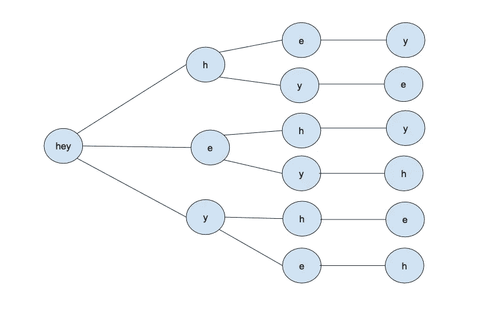

# 1.所有排列

> 原文：<https://medium.com/geekculture/all-permutations-ff6f4c1ba544?source=collection_archive---------12----------------------->

## 问:写一个递归函数，返回给定字符串的所有排列。

-比如给定""，y 应该返回[]，

——比如给定“ho”应该返回[“ho”、“oh”]，

——比如给定“hey”应该返回[“ehy”、“eyh”、“hey”、“hye”、“yeh”、“yhe”]。

## 提示: