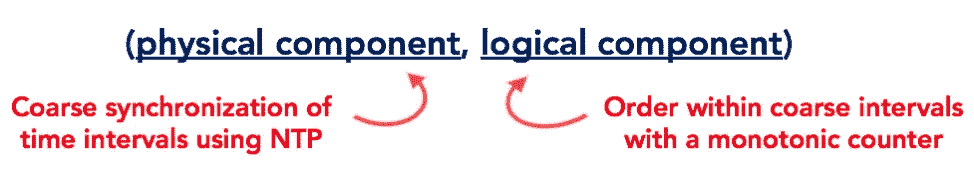
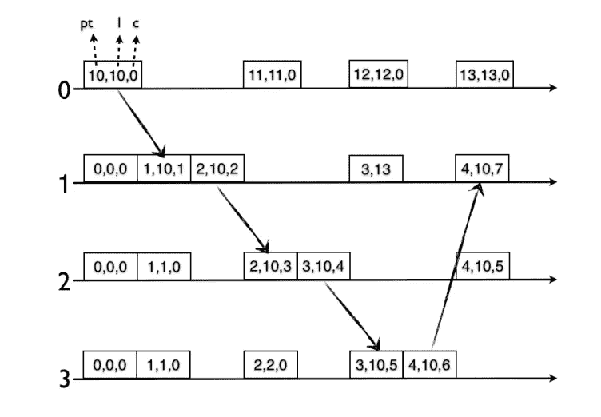

# 分布式系统中的所有事物时钟、时间和顺序:深度混合逻辑时钟

> 原文：<https://medium.com/geekculture/all-things-clock-time-and-order-in-distributed-systems-hybrid-logical-clock-in-depth-7c645eb03682?source=collection_archive---------2----------------------->

Photo by [Brandi Redd](https://unsplash.com/@brandi1?utm_source=medium&utm_medium=referral) on [Unsplash](https://unsplash.com?utm_source=medium&utm_medium=referral)

# 设置背景

本系列的[第一篇](/geekculture/all-things-clock-time-and-order-in-distributed-systems-physical-time-in-depth-3c0a4389a838)讨论了物理时间，[第二篇](/geekculture/all-things-clock-time-and-order-in-distributed-systems-logical-clocks-in-real-life-2-ad99aa64753)讨论了逻辑时间主要是矢量时钟和版本矢量，[第三篇](/geekculture/all-things-clock-time-and-order-in-distributed-systems-logical-clock-vs-google-true-time-dba552f2d842)主要详细讨论了 Google 真时和相关系统。

到目前为止，我们知道以下几点:

*   在分布式系统中使用集中式时钟是一种理想的解决方案，但是不可靠，因为它会成为单点故障。
*   物理时钟在以前所未有的规模**对事件和事务进行排序**时并不可靠，因为由于节点的**物理属性、地理位置、网络通信、闰秒、时钟倒退**等问题，节点之间的时钟差异很大。
*   逻辑时钟帮助我们定义跨节点的顺序，但代价是**最终一致性、** **实现复杂性、空间使用和系统性能**。此外，逻辑时间戳与物理时间没有关联。因此，在某个时间点，如果您想要找出某个物理时间内跨节点的数据快照，您无法做到这一点。
*   谷歌实时系统本质上是有严格上限的物理时钟，但不是每个公司都能像谷歌一样运行相同的基础设施或优化他们的网络。事实上，大多数依赖云提供商的现代公司，如 AWS、Azure、OCI 等，甚至没有自己的私有基础设施。此外，真实时间等待最大`7 ms`的不确定时间段，这可能导致**明显的性能问题**。

问题出现了，我们完成了吗？如果我们想创建一个新的数据库系统，我们有什么选项来定义排序？

*   最有可能的是，我们没有拥有真正的类时间基础设施的选择。
*   我们应该继续进行物理时间吗？
    我们如何确保我们的时钟同步得足够好，这样我们就不会在物理时钟中出现几十或几百毫秒的时差？
*   逻辑时钟是正确的选择吗？如果**系统需要比最终一致性更强的一致性保证会怎样？逻辑时钟没用。**
*   如果我们的数据库必须支持跨节点的事务，我们需要一种机制来找到相关数据在某个物理时间点的全局快照。

是否有任何合适的替代方案可以满足上述要求？

# 混合时间/混合逻辑时钟(HLC)

HLC 是一种通用分布式系统中物理时钟的 Lamport 逻辑时钟，它建立在系统中节点的物理时钟之上，并试图将其自身与物理时间紧密联系在一起。

HLC 是一个由两个组件组成的元组:物理组件**跟踪整个系统**的**物理时间，逻辑组件**跟踪在同一物理时间**内发生的事件(因果关系)**的顺序。**系统中的每个节点都有自己的 HLC 实例**。当 HLC 被实例化时，其物理组件被初始化为*unix 系统中的`**CLOCK_MONOTONIC**`或`**CLOCK_REALTIME**`值，逻辑组件被初始化为`0`。****

## HLC 假设

HLC 被设计用于节点粗略(不规则)同步到 NTP 或任何合适的时间协议的系统。因此有几个假设:

*   **NTP 同步:**第一个假设是——分布式系统中的每个节点都安装了 NTP 守护进程，它通过 NTP 将节点的时钟`T_node`与参考时钟(GPS 或原子钟)`T_ref`同步。这是对生产系统的合理期望。
    NTP 还为每个这样的同步提供了一个可能的错误界限`E`。因此，物理时间的误差是有界限的:
    `|T_ref - T_node| ≤ E`。请注意，对于一个时钟，`E`可能会因同步而异。正如您从第一篇文章中所记得的，时钟同步的地层编号越小，误差范围就越小。
    **注意:**如果误差无界，则算法会随着时间累积误差。然而，可以从数学上证明误差保持有界。
*   **单调物理时钟:** HLC 假设物理时钟是单调递增的。从技术上讲，物理时钟(在*unix 系统中为`**CLOCK_REALTIME**`)可以倒退，但是这种情况很少见。在大多数情况下，NTP 可以调整偏移量，使时钟在更长的时间内变慢或变快。在极端情况下，通过监控 NTP 守护进程，**如果发现时钟倒退，相关节点可以将其自身从集群中移除**。

## HLC 房产

HLC 拥有一些重要的资产:

*   HLC 总是单调递增的。正如刚刚描述的，它提供了具有有界误差的物理上有意义的时间戳的灵活性。
*   HLC 实例作为一个元组进行比较:首先比较优先级最高的物理组件，然后比较物理组件相同的逻辑组件。
*   物理组件并不专门附加到任何特定节点的物理时间上，而是在每次执行节点看到更高的物理时间时进行更新。它继续单调递增**。如果我们比较两个混合时间实例`ht1`和`ht2`以及
    和`ht1.physical > ht2.physical`，那么`ht1 > ht2`或与`ht2`相关联的事件发生在与`ht1`相关联的事件之前。**
*   **如果`ht1.physical = ht2.physical`，就不可能知道哪个事件发生在哪个之前。在这里，逻辑组件开始行动。它只不过是一个**单调递增的计数器**,为具有相同物理组件的混合时间实例保持递增。因此，如果`ht1.physical = ht2.physical`和
    与`ht1.logical > ht2.logical`，那么`ht1 > ht2`或与`ht2`关联的事件在与`ht1`关联的事件之前发生。**
*   ****HLC 是 NTP** 上的叠加，算法**不修改节点的物理时间**。这确保了在同一台机器上运行的其他进程在紧密依赖于节点的物理时间时不会被中断。**

**上述特性使 HLC 充当了**分布式全局时钟**。**

## **系统属性**

*   **系统中的节点通常通过 RPC 调用来交换 HLC。因此，如果节点 A 中的一个事件`e`先于节点 B 中的另一个事件`f`发生，A 对 B 进行 RPC 调用，包括它的 HLC。**

****

**Figure 1: HLC components**

## **算法和实现**

**如果一个事件`e`发生在另一个事件`f` ( e **→** f)和
`HLC(e) = [p_e, l_e]`，`HLC(f) = [p_f, l_f]`之前，其中`HLC(i)`是事件`i`发生的混合时间，则:**

*   **要么`p_e < p_f`**
*   **或者，`p_e = p_f`和`l_e < l_f`**
*   **因此`e`和`f`都是**在字典顺序上的可比性**。**

## **实施说明**

*   **下面的实现不是线程安全的。您需要使用读写锁，这超出了本讨论的范围。**
*   **实际的生产级实现可能会有所不同，并且在空间使用方面更加高效。然而，这里的目标只是理解算法。**

**以下算法摘自论文:*《技术报告:hybrid time——具有高时钟不确定性的可访问全球一致性》*发表于 2014 年。这是一个非常简单并且在现实生活系统中被广泛采用的算法。**

**Algorithm 1: The Hybrid Time**

## **逐步解释**

**第 10–17 行:定义包含物理和逻辑组件的`TimeStamp`类。**

**第 20–31 行:定义了一个节点上物理时钟的抽象。方法`PhysicalClock.now()`返回特定节点上的当前物理时间。该节点应该是 NTP 同步的，以保持输出尽可能准确。**

**第 34 行:定义了`lastPhysical`，它跟踪节点在集群中看到的最新物理时间。当集群中的节点相互通信时，`lastPhysical`会相应地更新。**

**第 35 行:变量`nextLogical`定义了与物理时间戳相关联的逻辑组件。**

**第 41–56 行:实现了返回节点中当前混合时间的`now()`。**

*   **第 43 行:我们首先获得节点上的当前物理时间。**
*   **第 45 行:检查当前物理时间是否大于看到的最新物理时间。**
*   **第 46 行:如果是，仅物理成分就足以定义因果关系，我们可以保留逻辑成分为`0`。**
*   **第 47 行:由于最近看到的物理时间`lastPhysical`落后于节点上的当前物理时间，我们更新了变量。**
*   **第 48 行:将`nextLogical`分配给`1`。如果节点在未来遇到相同的物理时间，`nextLogical`将帮助建立前面描述的因果关系。**

**第 58–67 行:定义当当前物理时间小于或等于`lastPhysical`时，如何更新混合时间。**

*   **第 59 行:用第 41–56 行描述的方法得到最新的混合时间`now`。**
*   **第 61–62 行:如果`now`的物理分量大于消息中包含的物理分量，忽略该消息，因为这里的更新违反了我们的时间单调递增的策略。**
*   **第 65 行:否则，传入的时间戳包含更高的物理部分，因此将`lastPhysical`更新为消息的物理部分。**
*   **第 66 行:将传入消息`+1`的`nextLogical`设置为`nextLogical`。递增逻辑组件确保来自某个节点`X`的事件发送发生在当前节点接收消息之前。由于两者的物理成分相同，逻辑成分显然有助于我们建立因果关系。**

# **HLC 的好**

*   **HLC 可以在恒定的空间中实现，它不像矢量时钟那样增长。所以没有空间开销。**
*   **更容易理解实现。**
*   **HLC 接近物理时间，因此更容易找到相对于物理时间的事件或事务快照。**

# **HLC 限制**

**HLC 的效率不如谷歌实时。虽然您不需要像真实时间一样等待不确定的时间段，但是您需要确定如何跨节点更新 HLC 的适当策略。有几种选择:**

*   **当一个读事务发生时，如果它跨越几个节点，跟踪看到的最大 HLC 并相应地更新时钟。实际上要复杂得多，说起来容易做起来难。**
*   **像 YugabyteDB 一样，在 raft 复制中传播 HLC 时钟来更新从时钟。**
*   **让每个节点在后台持续定期地将自己的 HLC 与群集中的其他节点同步。这种行为会对交易产生怎样的影响，我们需要清楚地思考。**

# **HLC 用例**

**一些主要的使用案例是:**

*   **HLC 有助于在某个时间点跨节点找到一致的数据快照，从而有助于定义数据库中的**全局一致性**。需要**强一致性**的新时代多云 NewSQL 系统利用了这一优势。**
*   **HLC 可以帮助管理多个版本的数据，因此支持多版本并发控制(MVCC ),这对于扩展事务非常重要。**

# **现实生活中的 HLC**

**HLC 的灵感来自谷歌的真实时间。因此，很少有新时代的分布式关系数据存储效仿并采用 HLC。**

## **南斯拉夫的 HLC b**

**yugabytdb 提供了所有传统的关系数据库特性(例如；具有强一致性的 ACID 事务)。通常，NoSQL 数据存储具有自动分片功能，但传统的 RDMS 系统缺乏该功能。类似于 Yugabyte 的系统试图弥合这一差距。**

**Yugabyte 依赖 HLC 进行可扩展的分布式操作，以下是一些值得注意的用例:**

*   **Yugabyte 将相关副本作为 raft 组进行管理，其中 raft 领导者接受写请求，并将单调的日志序列连同 HLC 一起传播给其所有追随者。因此，追随者可以更新他们的 HLC，以防领导者有更高的 HLC。顺便问一下，你知道什么是木筏吗？别担心，我们已经分三集播出了:[第一集](https://codeburst.io/making-sense-of-the-raft-distributed-consensus-algorithm-part-1-3ecf90b0b361)、[第二集](https://codeburst.io/making-sense-of-the-raft-distributed-consensus-algorithm-part-2-4f12057b019a)、[第三集](https://codeburst.io/making-sense-of-the-raft-distributed-consensus-algorithm-part-3-9f3a5cdba514)。**
*   **在节点中的读取操作期间，基于当前计算的 HLC，Yugabyte 确定哪些更新应该对客户端可见，因为所有更新都具有与之相关联的 HLC。**
*   **Yugabyte 基于 HLC 实现 MVCC。**
*   **对于跨越多个节点的分布式事务，节点在未决状态下用临时数据写入事务记录。当节点提交数据时，会相应地计算安全提交 HLC，并向最终用户或应用程序确认事务。**

## **蟑螂 DB 里的 HLC**

**蟑螂 DB 也使用类似的算法进行时间标记。然而，它在事务期间应用了一些技巧来确保不同节点上的提交被适当地排序。**

**如果你很好奇，CockroachDB 的实现可以在[这里](https://github.com/cockroachdb/cockroach/blob/master/pkg/util/hlc/hlc.go)找到。**

# **奖金(可选阅读)**

**如果你已经理解了上面的算法及其实现，看看下面的算法，在另一篇论文中有描述:“*全局分布式数据库中的逻辑物理时钟和一致快照*”。这是在 2014 年提出的，实现与上面的非常相似，只是更详细一点。**

****算法要点:** `LogicalTime`以下算法中的组件紧密跟踪集群中的整体单调物理时间。当逻辑时间不变时,`Causality`组件跟踪之前发生的关系，类似于算法 1 中`HybridTime`的`nextLogical`所做的。算法 2 确保物理和逻辑组件之间的差异，即:`|logical time — physical time|`不生长无界。**

**看下图，即使在节点 1，物理时间是`1`，逻辑时间是`10`，随着消息通过集群中的其他节点传播，`pt`和`l`之间的差距减小。该算法假设当消息从一个节点`i`传送到另一个节点`j`时，在`j`的物理时间至少增加了`1`。这是一个合理的假设。事实上，如果节点`j`处的物理时间增加一个间隔`d`，则系统中`pt`和`l`之间的差值会快速减小。如果逻辑时间高于物理时间，则物理时间会赶上，反之亦然。**

****

**Figure 2: Time propagation in HLC across nodes**

**困惑于上图？别担心，让我们看看下面的实现来理解它:**

**Algorithm 2: HLC**

## **逐步解释**

**第 9–15 行:定义了`PhysicalTime`，它只是一个节点中当前挂钟时间的表示。**

**第 17–49 行:定义了与同类型的另一个实例相当的`LogicalTime`。逻辑时间是**单调递增的**。**

*   **第 24–26 行:`copyOf`方法创建所提供的逻辑时间的克隆。我们将在一段时间内看到它的实际应用。**

**第 51–71 行:定义了`Causality`，它本质上是一个**单调递增的计数器，用于具有相同逻辑时间**的 HLC。这些实例可以相互比较。**

**第 73–77 行:定义了`Message` —系统中的节点通过传递消息来相互通信。当发送消息时，节点将其当前的`LogicalTime`和相关的`Causality`附加到它上面。**

**第 79–98 行:定义混合逻辑时间`Time`。它包含了一个`LogicalTime`和`Causality`的实例。`Time`实例相互可比。**

*   **第 89–97 行:我们展示了`Time`实例的词典比较。然而，由于`LogicalTime`和`Causality`本身具有可比性，我们也可以直接在它们之间进行比较。**
*   ****当事件存储在某个数据存储中时，字典序比较有助于以有序的方式检索事件**。**

**第 115–121 行:这是对当前节点上的物理时间是如何获取的抽象。Java 的`System.currentTimeMillis()`提供了 Linux 内核的`**CLOCK_REALTIME**`值或挂钟时间。**

**第 123–138 行:描述向其他节点发送事件或执行本地事件时如何计算混合时间:**

*   **第 125 行:在`logicalTimeCopy`中创建当前`logicalTime`的本地副本。**
*   **第 126–128 行:将逻辑时间设置为节点的当前逻辑时间和当前物理时间的最大值。**
*   **第 130–131 行:如果逻辑时间仍然相同，我们增加`causality`计数器，记录发生在关系之前。**
*   **第 133–134 行:如果逻辑时间更新为节点的当前物理时间，那么我们将`causality`重置为`0`。**
*   **第 137 行:向调用者返回一个混合时间`Time`的实例，它传播当前的逻辑时间和因果关系信息。**

**第 140–162 行:定义接收事件时如何更新混合时间:**

*   **第 144 行:创建当前逻辑时间的副本`logicalTimeCopy`。**
*   **第 145–146 行:将`logicalTime`设置为`logicalTimeCopy`的最大值，包括输入消息中的逻辑时间和节点上的当前物理时间。**
*   **第 148–149 行:如果所有这些组件都相同，则将`causality`设置为节点中的当前因果关系和消息`+1`中包含的因果关系的最大值。**
*   **第 151–152 行:如果消息中包含的逻辑时间落后于节点上的当前逻辑时间，则递增当前因果关系，指示消息的接收。**
*   **第 154–155 行:如果逻辑时间被更新为传入消息的逻辑时间，我们必须将`causality`更新为消息的因果关系`+1`。**
*   **第 157–158 行:如果逻辑时间更新为节点的当前物理时间，则将因果关系重置回`0`。**

**第 161 行:将`Time`实例返回给调用者。**

# **结论**

**通过这篇文章，我们完成了极其全面的系列“*分布式系统中所有事物的时钟、时间和顺序*”系列。哇！！！**

**我们已经一步一步地分析了物理时钟、逻辑时钟、谷歌真时间以及最终混合逻辑时钟的原因和时间。在每篇文章中，我们都看到了现实生活中的例子，例如:Riak 如何使用版本向量逻辑时钟，Cassandra 仍然依赖于物理时钟，Google Spanner 使用真实时间，像 YugaByte 这样的新时代系统使用混合时间。我们还研究了这些系统的一致性保证等基本参数如何影响选择哪种时钟方案的决策。我们在[第二部分](/geekculture/all-things-clock-time-and-order-in-distributed-systems-logical-clocks-in-real-life-2-ad99aa64753)中研究了伏地魔键值存储的向量时钟实现，以及本文中混合时间的两种不同实现。**

**本系列的意图非常明确:不仅将极其分散的时间和时钟理论汇集成一个易于理解的系列文章，而且更重要的是，作为一名工程师，查看真实生活中的用例及实现，这样，如果您将来有机会研究这样的系统和算法，您就可以参考本系列并获得一些校准的见解。**

**这是我写的深度系列文章之一，付出了很多努力。如果你已经达到这个程度，这意味着你发现这个系列是有益的。**

**请考虑多次击掌，并在 LinkedIn、Twitter 上分享，以便更好地传播。**

**如果你有任何反馈要分享，请告诉我。**

## **参考**

1.  **[https://cse.buffalo.edu/tech-reports/2014-04.pdf](https://cse.buffalo.edu/tech-reports/2014-04.pdf)**
2.  **[https://sergeiturukin . com/2017/06/26/hybrid-logical-clocks . html](https://sergeiturukin.com/2017/06/26/hybrid-logical-clocks.html)**
3.  **混动时间:[http://users . ECE . ute xas . edu/~ garg/PD slab/David/hybrid-Time-tech-report-01 . pdf](http://users.ece.utexas.edu/~garg/pdslab/david/hybrid-time-tech-report-01.pdf)**
4.  **[https://bartoszsypytkowski.com/hybrid-logical-clocks/](https://bartoszsypytkowski.com/hybrid-logical-clocks/)**
5.  **[http://muratbuffalo . blogspot . com/2014/07/hybrid-logical-clocks . html](http://muratbuffalo.blogspot.com/2014/07/hybrid-logical-clocks.html)**
6.  **[https://www . Alibaba cloud . com/blog/in-depth-analysis-on-HLC-based-distributed-transaction-processing _ 595027](https://www.alibabacloud.com/blog/in-depth-analysis-on-hlc-based-distributed-transaction-processing_595027)**
7.  **[https://docs . yugabyte . com/latest/architecture/transactions/transactions-overview/](https://docs.yugabyte.com/latest/architecture/transactions/transactions-overview/)**
8.  **[https://blog . yugabyte . com/distributed-PostgreSQL-on-a-Google-spanner-architecture-storage-layer/](https://blog.yugabyte.com/distributed-postgresql-on-a-google-spanner-architecture-storage-layer/)**
9.  **[https://www . cock roach labs . com/blog/living-without-atomic-clocks/](https://www.cockroachlabs.com/blog/living-without-atomic-clocks/)**