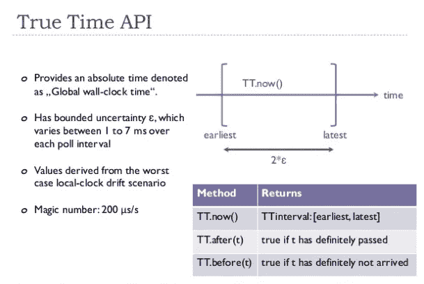
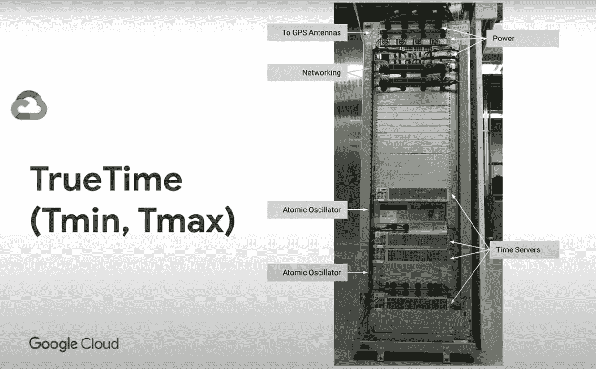
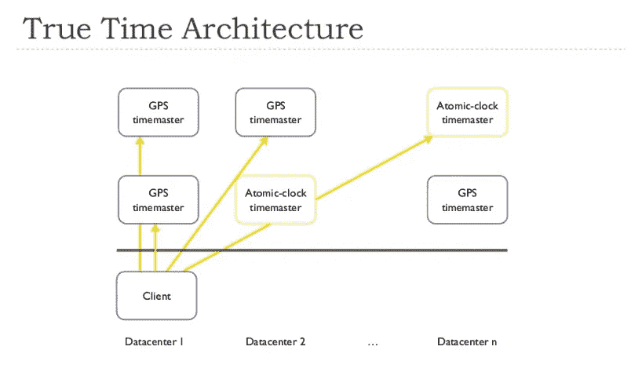

# 分布式系统中的所有事物时钟、时间和顺序:逻辑时钟 vs 谷歌真实时间

> 原文：<https://medium.com/geekculture/all-things-clock-time-and-order-in-distributed-systems-logical-clock-vs-google-true-time-dba552f2d842?source=collection_archive---------8----------------------->


Photo by [Swag Photography](https://unsplash.com/@arni_gill?utm_source=medium&utm_medium=referral) on [Unsplash](https://unsplash.com?utm_source=medium&utm_medium=referral)

在我们上一篇[文章](/geekculture/all-things-clock-time-and-order-in-distributed-systems-logical-clocks-in-real-life-2-ad99aa64753)中，我们深入研究了逻辑时钟，尤其是向量时钟和版本向量，并分析了它们在现实生活中如何非常有助于设计最终一致的系统，如 Riak 或 Amazon Dynamo DB。但并不是每个最终一致的系统都使用矢量时钟。

# 卡珊德拉如何处理订单

Cassandra 是一个基于 NoSQL 分布式宽列的存储系统，它最终也是一致的，但是它**不使用任何逻辑时钟来排序事件**。这是有原因的:

像 Riak、Dynamo DB 这样的键-值(KV)存储就像一个大哈希表——它们将一个不可变的键映射到一个值。Dynamo DB 以 JSON 序列化格式存储值，Riak 与内容类型无关，能够存储任何类型的值，但是客户端在存储数据时需要提供正确的内容类型。让我们考虑迪纳摩中的一个简单用例:

假设我们正在存储用户详细信息，对象在 Dynamo 中存储如下:

```
{
        "name": "kousik",
        "mobile": "9090909090",
        "email": "[knath@test.com](mailto:knath@test.com)",
        "address": "xyz abc"
    }
```

**问:如果你想更新字段** `**mobile**` **会发生什么？
A.** 为了更新存储数据中的任何属性，发生以下操作序列:

1.  首先读取**获取完整用户对象**的数据。
2.  对象属性`mobile`被更新。
3.  最后，整个对象被保存在存储中。

**问:如果你想更新** `**email**` **属性会发生什么？
A.** 发生与上述相同的操作顺序。

**问:如果两个不同的客户端想同时分别更新** `**mobile**` **和** `**email**` **该怎么办？
A.** 即使两者都单独更新单个属性，**整个对象被读-修改-写**，潜在地具有两个不同的冲突版本。虽然表面上看起来`mobile`和`email`是可以无冲突更新的独立属性，但是**冲突还是发生了，因为对象本身被客户端完全覆盖了。**

Cassandra 通过**启用独立的属性更新来绕过这种冲突，即使它们属于同一个对象**。当您在 Cassandra 中创建上述对象时，您发出以下命令:

```
CREATE TABLE user (
    name text PRIMARY KEY,
    mobile text,
    email text,
    address text
);
```

插入和更新请求按如下方式发生:

```
INSERT INTO user (name, mobile, email, address)
VALUES ('kousik', '9090909090', 'knath@test.com', 'xyz abc');

UPDATE users SET email = 'knath222@test.com' WHERE name = 'kousik';

UPDATE users SET phone = '7893839393' WHERE name = 'kousik';
```

Cassandra 被设计成**单独处理每一列**。您可以像在传统的关系数据库中一样发出单独的更新列。为每一列维护像上次更新时间这样的元数据。对某些匹配数据的特定列的更新只影响该列。因此**对列的更新是更细粒度的**。

**问:如果两个不同的客户端为同一个键更新同一个列，会发生什么情况？
A.** Cassandra 应用**最后写入获胜(LWW )** 策略来解决更新冲突。由于**细粒度的粒度更新是在单个列上进行的**，所以实际上不可能所有的客户机都同时更新同一个列——它们的更新将分布在不同的列上。因此，即使时钟粗略地与 NTP 同步，Cassandra 也能在冲突更新中幸存下来，尽管始终保持时钟尽可能高精度地与 NTP 同步是一个好习惯，但在这里可以找到一篇很好的文章。

**问:由于同一列中的更新冲突，Cassandra 仍有可能丢失数据，对吗？
答:**是的，从技术上来说这是可能的，但是，由于更新分散在各个列中，这种影响应该更小，如果您通过适当的守护程序将时钟同步到 NTP，效果会更好，这也会有所帮助。

**好的！我们已经在之前和当前的文章中看到了最终一致系统的不同变体。强一致性系统呢？他们还面临数据版本的挑战。他们是怎么解决的？**

# 谷歌实时时间

在分布式系统中获得强一致性是一个巨大的挑战。正如我们已经看到的，时间是变化无常的，一个特定的时刻并不是一个跨机器定义的常数。当我们在代码中使用时间戳时，我们习惯于使用特定于语言的库，在提交事务时可能会得到一个基于时间或时区的瞬间，这给我们一个错误的印象，即时间是恒定的。然而，**总有一些不确定性——跨越节点的时间是不一样的，参见** [**这篇文章**](/geekculture/all-things-clock-time-and-order-in-distributed-systems-physical-time-in-depth-3c0a4389a838) **以获得更多想法**。不确定性的产生是因为:

*   节点位于不同的地理位置，彼此相距很远，这导致网络上的通信延迟。
*   网络不均匀，导致可变延迟。
*   位于节点中的基于物理石英的时钟彼此差异很大。

**问:那么，如果我们设法优化通信和网络延迟，不确定性是否会降低？有可能，但是优化公共网络很困难。为什么不创建自己的专用网络，在那里网络通信可以得到控制。这正是谷歌所做的。**

谷歌创建了一个名为[扳手](https://cloud.google.com/spanner)的分布式 SQL 数据库，它依靠一个名为**实时**的东西来实现跨节点事务的非常强的一致性。Google 知道时间是不确定的，所以 True Time 定义了一个**有界的、小的不确定性的时间窗口**，在这个窗口中，事务不能被明确地排序。**真实时间是谷歌数据中心的全球时间**。

真实时间表示为时间间隔`**[earliest, latest]**`。它公开了一个名为`now()`的 API，其值在这个区间内。不确定度区间在`1 ms`到`7 ms`之间变化——注意**最大不确定度有一个严格的上限**。

API`TT.before(t) or TT.earliest()`和`TT.after(t) or TT.latest()` 将时间戳作为输入，并回答给定的时间戳是在当前不确定性区间之前还是之后。

`TT.earliest()`、`TT.latest()`与事件绝对时间的关系为:

```
TT.earliest ≤ Absolute Time of current event ≤ TT.latest
```



Figure 1, True Time API

真实时间保证如果一个事务`T1`在另一个事务`T2`开始之前提交，那么`T1`的提交时间戳小于`T2`的提交时间戳。事实上，这是 Google Spanner 给出的保证之一。

真正的时间只存在于谷歌数据中心内部，美妙之处在于**无论谷歌数据中心如何调用 API，不确定性的界限总是保持不变**。

最大的问题是谷歌如何保证如此严格的上限？

谷歌通过几个技巧实现了这一奇迹:

**优化的基础设施:** Google infra 运行在专门设计的私有网络上。随着时间的推移，他们对网络进行了优化，在数据中心之间建立了大量冗余连接，并内置了故障处理机制。这并不意味着网络分区不会发生或事情不会出错，但是这类事件和通信延迟的可能性会大大降低。

**使用自己的时钟:**真实时间不依赖于外部 NTP 池或服务器。相反，**谷歌数据中心配备了 GPS 接收器和原子钟**。请参见下图中的安装:



Figure 2, Time master

跨地域的每个数据中心**都有一个或多个**时间服务器或时间主机。**有两种时间大师:**

*   ****GPS 时间控制器:**大多数时间控制器都是基于 GPS 的。这些节点配备了 GPS 接收器，直接从卫星接收 GPS 信号，并从中解释当前时间。GPS 天线安装在这样的时间服务器中。 **GPS 时间主机分布在数据中心，以减少天线故障或信号干扰等问题的影响**。**
*   ****大决战主:**这些主装备了本地原子钟。原子钟被用作 GPS 时间主设备的补充，以防卫星连接变得不可用。**

> **所有主机的时间基准(原子钟和 GPS 时钟)会定期相互比较。每个主机还会对照自己的本地时钟交叉检查其参考的时间推进速率，如果存在实质性差异，则会将其自身逐出。—谷歌扳手[纸](http://static.googleusercontent.com/media/research.google.com/en/us/archive/spanner-osdi2012.pdf)**

**实际上需要真实时间时间戳的客户机(运行应用程序的服务器),它们运行守护进程来周期性地轮询不同的时间主机(例如；每 30 秒轮询一次)。**

****

**Figure 3\. Client Polling Architecture**

**为了减少任何时间主机出错的可能性，如图 3 所示，**客户端守护程序轮询来自附近和远处数据中心**的 GPS 和原子钟时间主机的时间信息。**

> **守护程序应用 Marzullo 算法的变体来检测和拒绝骗子，并将本地机器时钟与非骗子同步。—谷歌扳手[纸](http://static.googleusercontent.com/media/research.google.com/en/us/archive/spanner-osdi2012.pdf)**

****爽！我们现在知道了真正的时间服务器和客户端是如何相互作用的。然而，应用程序如何克服不确定性区间？****

**Google Spanner 应用了一个非常简单的策略:**在提交时间戳时，只需等待不确定时间段过去** —在提交事务时，再等待最大值`7 ms`。由于所有事务都在等待，这确保了从客户的角度来看可接受的错误水平(如果有的话)和非常强的一致性(谷歌称之为**外部一致性**——最强的一致性水平，比通常的强一致性更强)。**

****问:真时时间大师在这么高的规模下不会成为瓶颈吗？理论上是的。但是考虑到跨地域和内部通信系统中有足够多的冗余时间服务器，这在谷歌范围内是可靠的。****

**因此，在谷歌内部网络中，谷歌不需要依赖外部 NTP 服务器甚至逻辑时钟来进行部分排序，而是可以使用跨其服务的真实时间来正确排序事件和交易。**

# **与逻辑时钟的比较**

**我们在本系列的第二篇文章中看到，逻辑时钟识别并发更新，但代价是大量的冲突、兄弟或额外的元数据，这些元数据将兄弟映射到它们特定的版本。我们还看到，最后写入获胜策略可以帮助我们解决冲突，但代价是丢失信息，尽管 Cassandra 的方法更擅长处理这种情况。**

**谷歌实时时间解决了所有这些问题，然而代价是通信基础设施和时钟安装。无论如何，谷歌必须不断优化其网络，以服务于其运营的大规模，然而，并不是每个公司都可以对事件和交易排序采取相同的方法。**

**但是知道不同的公司解决问题的方式是非常不同和创新的，这是非常好的。**

# **真实时间的成功**

**谷歌依靠分布在各大洲、运行数万台服务器的数十个数据中心的实时数据。通过 Spanner，一些非常受欢迎且负载沉重的服务，如 AdWords(谷歌最重要的赚钱工具)、Gmail、谷歌照片和谷歌 Play 商店，都依赖于真实时间。**

# **亚马逊时间同步服务**

**受谷歌实时时间的启发，AWS 还管理着自己的原子钟和 GPS 时钟接收器。任何 EC2 服务器都可以使用 [Chrony](https://chrony.tuxfamily.org/) 守护程序通过 NTP 连接到这些时间参考，以获得更准确的时间，而不是通过 NTP 连接到外部 NTP 池或时间服务器。更多细节可以在[这里](https://aws.amazon.com/blogs/aws/keeping-time-with-amazon-time-sync-service/)找到。闰秒涂抹也由亚马逊时间同步服务处理。**

# **真实时间的问题**

**谷歌实时看起来像是逻辑时钟的替代品，因为本质上两者都试图以自己的方式解决**排序**问题。然而，正如我们所见，这不仅仅是安装原子钟和 GPS 时钟，而是通信基础设施优化是这里的游戏规则改变者。**

**虽然 GPS 接收器和原子钟可能是负担得起的，但并不是每个公司都有自己的私有网络——他们在公共网络上非常依赖 AWS，Azure，GCP，OCI，这基本上意味着通信开销会影响精确的时间计算。**

**即使公司运行他们自己的私有网络，他们也可能不会承担安装精确的原子钟和 GPS 时钟以及优化网络的成本和负担。另一方面，亚马逊时间同步是一项免费服务，但不清楚它有多准确，也不清楚它是否可以单独用于订购活动。**

**那么，除了逻辑时钟或者真正的时间系统之外，有没有其他的方法可以给我们一些强有力的一致性，而没有这些令人头疼的问题呢？**

**我们将在本系列的下一篇文章中探讨这个问题，敬请期待！**

## **参考**

1.  **[https://aphyr.com/posts/294-call-me-maybe-cassandra](https://aphyr.com/posts/294-call-me-maybe-cassandra)**
2.  **[https://stack overflow . com/questions/34898693/why-Cassandra-cluster-need-synchronized-clocks-between-nodes](https://stackoverflow.com/questions/34898693/why-cassandra-cluster-need-synchronized-clocks-between-nodes)**
3.  **[https://blog . rapid 7 . com/2014/03/17/synchronizing-clocks-in-a-Cassandra-cluster-pt-2-solutions/](https://blog.rapid7.com/2014/03/17/synchronizing-clocks-in-a-cassandra-cluster-pt-2-solutions/)**
4.  **[https://www.wired.com/2012/11/google-spanner-time/](https://www.wired.com/2012/11/google-spanner-time/)**
5.  **[https://news . softpedia . com/news/Google-Operates-a-Massive-world wide-Database-with GPS and-Atomic-Clocks-310093 . shtml](https://news.softpedia.com/news/Google-Operates-a-Massive-Worldwide-Database-with-GPS-and-Atomic-Clocks-310093.shtml)**
6.  **[https://amulya-bhat ia . medium . com/cloud-spanner-almost-all-you-need-to-know-f1 C1 fa 471 df](https://amulya-bhatia.medium.com/cloud-spanner-almost-all-you-need-to-know-f1c1fa471df)**