# 分布式系统中的所有事物时钟、时间和顺序:现实生活中的逻辑时钟

> 原文：<https://medium.com/geekculture/all-things-clock-time-and-order-in-distributed-systems-logical-clocks-in-real-life-2-ad99aa64753?source=collection_archive---------2----------------------->


Photo by [Brooke Lark](https://unsplash.com/@brookelark?utm_source=medium&utm_medium=referral) on [Unsplash](https://unsplash.com?utm_source=medium&utm_medium=referral)

# 设置背景

在[之前的文章](/geekculture/all-things-clock-time-and-order-in-distributed-systems-physical-time-in-depth-3c0a4389a838)中，我们详细讨论了物理时钟，我们讨论了在大多数用例中，对于大规模系统，使用物理时钟时间不是正确的选择，除非集群中节点之间的时间差受到非常严格的限制，这对于许多公司来说是不可行的。

我们在这里讨论另一种选择——逻辑时钟，简单来说就是**单调的基于计数器的时钟**。**这篇文章将会是非常全面和实用的系统设计重磅**。

不要着急，花足够的时间来消化内容，理解更重要，因为它非常核心。

# 逻辑时钟的兴起

NoSQL 系统在最近几年获得了巨大的吸引力，这主要是由于其内置的水平扩展能力。随着移动和物联网应用、数字业务、电子商务和支付解决方案在新兴市场的爆炸式增长，许多公司的数据流入量非常大，他们很难扩展传统的关系系统来容忍这样的规模(除非少数科技巨头，如谷歌、YouTube、脸书、Twitter 等，他们仍然使用许多基于 SQL 的系统，另一篇文章的材料:P)。

这些系统以**分散**和**集群**的方式设计，具有极高的规模。比起一致性，他们更喜欢可用性。大多数 NoSQL 存储总是可写的(AP 系统根据 CAP 定理)——在分区存在的情况下，它们能够接受写操作。它们不是 ACID 兼容的(一些 NoSQL 商店现在提供 ACID 功能，但非常有限，无法与关系系统相比)，而是**基本**系统— **基本可用，软状态，最终一致**。

出于高可用性目的，这些存储跨不同的物理节点维护多个数据副本，这意味着**多个节点被允许接受对相同数据的并发写入请求，并且它们最终在稍后的时间点汇聚到相同版本的数据**。

## 最终一致性的成本

在这样的系统中可能会出现几个问题:

*   如果存储相同数据的两个副本之间发生网络分区(节点故障也会产生类似的影响)，它们将失去同步。在非常大规模的环境中，副本节点在一段时间后会以相同键的不同值结束。
*   如果不同的并发客户端同时更新不同副本中的相同密钥，它们的值可能会不同。
*   如果一个节点丢失了一些数据或发生了数据损坏，它将与其他副本不同步。

以上所有场景**产生冲突和异常:**

*   由于并发的客户端更新，一个**单个节点**可能以同一个键的不同版本的值对象结束。
*   相同的键可以跨**不同的节点**存在，具有不同版本的值对象。

**出于高可用性目的，KV 数据存储允许这种差异，因此冲突是不可避免的。**

这个场景类似于 git 分支合并冲突，git 可能无法自动解决这些冲突，但是开发人员可以。只要有解决冲突的机制，允许系统中存在冲突是没问题的，否则可能会导致数据丢失，并且**客户会转向竞争对手**。

在这种情况下，逻辑时钟会帮助我们管理跨节点并发更新的顺序。**逻辑时钟是分布式集群系统中版本化数据管理的核心**。随着我们继续探索，我们将看到 NoSQL 的主要价值商店，如 Riak，Voldemort，Amazon Dynamo DB 等如何使用各种逻辑时钟来解决现实生活中的大规模问题。

# 逻辑时钟

**逻辑时钟并不重视事情发生的确切时间——它们不了解一个事件是发生在 2021 年 3 月 2 日晚上 10:52 还是 1967 年 12 月 31 日凌晨 04:00，而是事件发生的顺序才是关注的主要方面**。在分布式系统中，它有助于跨节点维护一致的事件顺序。同时，使用逻辑时间会导致许多边缘情况和难以管理的数据版本问题。

在我们深入探讨之前，让我们先熟悉以下几个重要概念:


Figure: 1, Left: Total Order, Right: Partial Order, Courtesy: [Quora](https://www.quora.com/How-can-you-explain-partial-order-and-total-order-in-simple-terms)

**因果关系:**分布式系统中的因果关系是指**依赖——两个事件之间的关系**。两个事件**有因果关系**表示一个事件的存在是由另一个事件引起的(*因果*)。如果仅仅因为`a`已经发生而导致`b`发生，那么一个事件`b`是另一个事件`a`的因果依赖。

**全序:**如果两个元素可以**确定性地比较**，那就叫全序。就像上面左边的图，一本小的书放在一本大的书上面。我们怎么知道最上面的书更小？这取决于我们的定义——我们不在乎厚度，但只要一本书的长度和宽度比另一本书小，我们就称之为小。顶本书满足这个条件。

类似地，数字可以被**确定性地比较**(两个数字可以相等或者一个比另一个小)，每次都有相同的结果，例如:`1 ≤ 2, 5 ≤ 8`总是为真。所以数字代表完整的顺序。

**偏序:**当两个元素**不能确定性比较**时，称为偏序。例如:在上面右侧的图中，最上面的书长度相等，但宽度比下面的书小。所以，我们没有任何明确的答案，顶部的比底部的小。

**动作:**任何节点都可以执行三种类型的动作:**发送消息、接收消息和执行本地动作**。

**逻辑时钟大多定义偏序。**

# 兰波特逻辑时钟

逻辑时钟的历史始于 1978 年，当时 Leslie Lamport 发表了一篇名为 [*时间、时钟和分布式系统中事件的排序*](https://lamport.azurewebsites.net/pubs/time-clocks.pdf) 的论文。Lamport 最初定义的**发生在**关系“ **→** ”之前，它本质上定义了分布式系统中的**偏序**，如下所示:

1.  如果在流程`P`中，一个事件`a`发生在另一个事件`b`之前，那么 a **→** b
2.  如果一个进程`P`发送一个事件给另一个进程`Q`，`a`代表`P`发送事件，而`b`代表`Q`，
    收到同一事件，那么 a **→** b
3.  如果 a **→** b 且 b → c 则 a → c 即:**发生之前是一种传递关系。**

## 算法

考虑在不同机器上运行的`n`进程`P1`、`P2`、`P3`、…、`Pn`。它们都管理自己的单调计数器，没有单一的全局计数器。所有计数器都被初始化为`0`。如图 2 所示，通过发送消息 **m** ，进程可以彼此同步。

这些进程可以按照自己的速度递增计数器:`P1`递增其计数器的值`6` , `P2`递增其计数器的值`8`,`P3`递增其计数器的值`10`。最终，不管它们如何递增，**它们本质上都应该是单调的**。

每一个进程在任何两个连续事件之间递增它自己的计数器。因此**在通过网络发送事件之前，该进程递增其计数器，类似地，在接收到消息之后，该进程递增其计数器，并将该消息传递给相关的应用**。

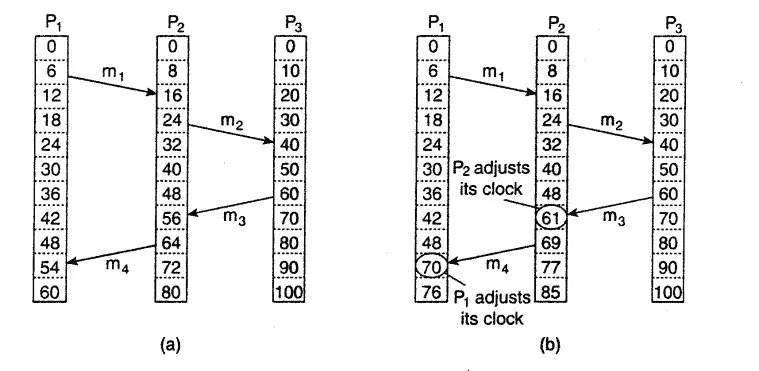

Figure: 2, Lamport Clock

Let，
，`C(a)` =发生`a`时的计数器值(逻辑时间)。
`C(b)` =发生`b`时的计数器值(逻辑时间)。

所以，

1.  如果在同一流程中`a`先于`b` ( a **→** b ) **，`C(a) < C(b)`成立。**
2.  如果`a`是一个进程`Pi`发送消息的事件，而`b`是另一个进程`Pj`接收消息的事件，那么显然`C(a) < C(b)`。
3.  如果`a`和`b`发生在两个不同的进程中，并且它们之间没有同步(没有消息传递)，则 a **→** b 不为真，b **→** a 也不为真。所以`C(a)`和`C(b)`不能关联，`a`和`b`被认为是**并发**。因此在这种情况下无法确定事件的确切顺序，因此这种顺序是**偏序**。

那么算法是如何工作的呢？让我们看看下面的步骤:

1.  在执行事件之前(例如；向另一个进程发送事件)，则`Pi`递增其计数器`C(i)`，即；`C(i) = C(i) + x (any non-zero positive value)`。在图 2(b)中，`P3`在将消息`m3`发送到`P2`之前，将其计数器从`50`递增到`60`。
2.  `Pi`然后将消息`m`的时间戳`t(m)`设置为递增的计数器值。在图 2(b)中，`m3`现在带有一个时间戳`60`。
3.  当消息`m`被另一个进程`Pj`接收时，`Pj`首先将其自己的计数器值设置为`max(Cj, t(m))`，其中`Cj`表示其当前计数器值。之后，`Cj`执行步骤 1 并将消息传递给应用程序。在图 2(b)的上下文中，当`P2`从`P3`接收到消息`m3`时，其计数器为`48`，但是`m3`的时间戳为`60`，因此`P2`将其计数器设置为`max(48, 60) = 60`，并在将其传递给相关应用之前将其递增至`61`。

**问:为什么要在向应用程序发送消息之前进行递增？
A.** 由于进程`P3`将带有时间戳`60`的`m3`发送给`P2`，`P2`逻辑上应该在稍后的时间戳接收到它。如果我们只是将`C(P2)`设置为`60`并且不增加它，看起来发送和接收事件是并发的。但是我们知道`P3`在`P2`收到消息之前发送了消息，所以`P3`处的事件发生在`P2`处的事件之前，因此将`C(P2)`再增加`1`会使事件相关，并满足**发生在** (→) 之前的关系。

## Lamport 时钟有问题

我们定义了如果一个事件`a`发生在另一个事件`b` ( a → b)之前，那么`C(a) < C(b)`。但反之不成立，即:`C(a) < C(b)`不代表`a`发生在`b`之前。因此，给定 Lamport 事件的时间戳 C(i ),不可能推导出它们之间的因果顺序。

在图 2(b)中，当`C(P2)`为`8`且`C(P3)`为`10`时，无法推导出`P2`处的事件是否发生在`P3`之前，反之亦然，或者这些事件是并发的，因为进程计数器尚未彼此同步。很有可能`P3`的事件发生在`P2`之前。

# 矢量时钟

矢量时钟是更一般化的 Lamport 时钟。与 Lamport 时钟不同，vector clock 中的每个进程也知道其他进程中的计数器值。如果有`n`个进程，每个进程维护**一个向量或者一个** `**n**` **计数器**的数组。当进程彼此同步时，计数器会相应地更新。

**注:**虽然我们提到过**进程**维护一个计数器，但为了通用，我们可以称它为**角色**。**参与者是对对象进行更改的实体**。因此**一个参与者可能意味着一个进程、一个服务器、一个虚拟节点、一个客户端或者一个线程等等**。多个参与者(例如；多个进程或线程等)也可以在同一节点中运行。
**演员 id** 代表相关演员的 id。

**注意:** *我们可以互换使用进程、服务器、虚拟节点和 actor。*

如果一个事件`a`先于另一个事件`b` (a → b)发生，`b`、`Vb`的向量时钟将大于`Va`。同样，反过来也是如此——不像 Lamport clock，对比`Va`和`Vb`，可以得出`a`发生在`b`之前的结论。

如果`Vi`的所有元素都小于或等于`Vj`的元素，则称一个矢量时钟`Vi`小于另一个矢量时钟`Vj`。

```
**Vector Clock Format: [C(Ai), C(Ai+1), C(Ai+2), ..., C(Aj)]** where,
**C(Ai) =** counter value of actor A**i**.**Note:** Vector clock does not necessarily need to be encoded in an array , you could store **[actor_id, counter]** pair in a **map** also. Array is used across examples just for better understanding.Let's say there are 3 actors, Vi and Vj represents the vector clock of any two of them:If,
    Vi = [1, 2, 1]
    Vj = [2, 3, 2]
    In this case, since for any k, Vi[k] <= Vj[k], Vi is less than Vj thus Vi **happened before** Vj.Similarly if,
    Vi = [2, 3, 1]
    Vj = [2, 3, 2]
    Vi is still less than Vj thus Vi **happened before** Vj.
```

同样，如果`Vi`中的所有元素都大于或等于`Vj`，则`Vi`大于`Vj`。

```
If,
    Vi = [2, 3, 4]
    Vj = [1, 2, 1]
    Since each of the elements of Vi is greater than that of Vj, Vi     is greater than Vj thus **Vj happened before Vi**.If,
    Vi = [2, 3, 4]
    Vj = [2, 3, 1]
    Still Vi is greater than Vj or thus **Vj happened before Vi** since the last element of Vi greater than that of Vj and others are same.
```

## 算法

考虑下面的表示，其中三个流程(参与者)`P1`、`P2`、`P3`具有不同版本的相同对象的副本。对于任意两个进程`Pi`和`Pj`，`VCi`是 Pi 的向量时钟，`VCj`代表`Pj`的向量时钟。

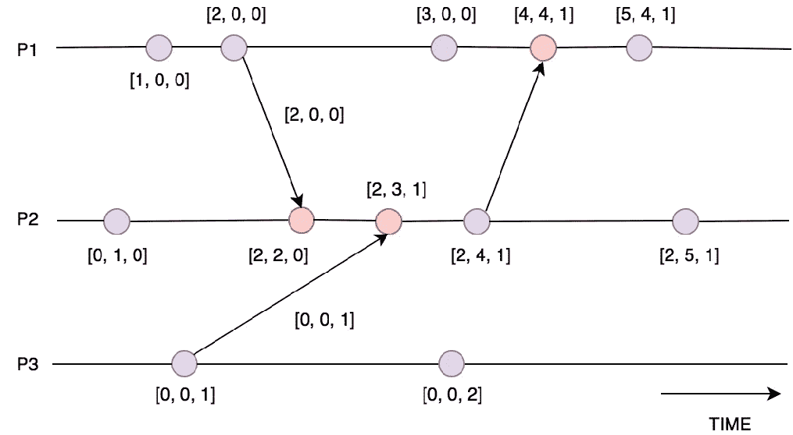

Figure 3: Vector Clock for a single object

1.  在执行任何事件(不包括从另一个进程接收消息的事件)之前，`Pi`通过执行
    `VCi[i] = VCi[i] + 1`增加自己的计数器。上图中，当`P1`在`[1, 0, 0]`时，它执行某个事件，它的向量时钟变成`[2, 0, 0]`。
2.  当`Pi`向`Pj`发送消息`m`时，该消息的时间戳`t(m)`在步骤 1 执行后被设置为`VCi`，即:消息时间戳只不过是`Pi`的向量时钟。在上图中，`P1`更新消息时间戳，并将消息发送给`P2`。
3.  接收到`m`后，`Pj`将其自身矢量时钟的各元素更新为当前值和接收值的最大值，即:
    `VCj[k] = max { VCj[k], t(m)[k] }`。
    然后执行第一步，并将消息发送给相关应用程序。上图中，就在收到`P1`发送的报文之前，`P2`的矢量时钟是`[0, 1, 0]`，收到时间戳为`[2, 0, 0]`的报文后，`P2`的矢量时钟变成了`[max(0, 2), max(1, 0), max(0, 0)] = [2, 1, 0]`，在传递报文的同时，`P2`增加了自己的计数器，所以最终的矢量时钟变成了`[2, 2, 0]`。

问:一个进程是管理它正在处理的所有对象的全局计数器，还是对象的局部计数器？
答:通常它们对物体来说是局部的。每个对象或键都存储有一些相关的逻辑时钟信息。所以时钟信息是对象的本地信息。

## 并行向量时钟

我们已经看到了如何比较两个矢量时钟。如果一个矢量时钟`Vi`中的某些元素`Vi[k]`大于另一个时钟`Vj`中的相应元素，而`Vi`中的其余元素小于`Vj`中的元素，那么`Vi`和`Vj`称为**并发矢量时钟**，因为无法确定时钟的确切顺序。下面是一个例子:

```
If,
    Vi = [2, 3, 2]
    Vj = [1, 2, 4]Since the first two elements of Vi are greater than Vj, but the         last one is lesser than that of Vj, neither Vi is lesser than Vj nor Vj is lesser than Vi. They are **concurrent**.Similarly if,
    Vi is exactly same as Vj, they are concurrent as well. Some people prefer to call them **identical vector clocks** also.
```

问:这里的并发性是什么意思，事件在完全相同的时间发生吗？不，这里的并发并不总是指事件在同一时刻发生，而是一个时间窗口。该窗口可以表示同一时刻，甚至几个小时或更长时间的时间段。经过一段时间后，**如果两个时钟不同步(可能是由于网络分区、电源故障、突然终止等原因)，它们就会失去彼此的联系，从而导致并发**。

**检查两个向量时钟，我们可以推导出它们的因果顺序——是一个发生在另一个之前，还是它们是并发的**,但是正如我们前面看到的，我们不能对 Lamport 时钟做同样的事情。因此矢量时钟是更广义的 Lamport 时钟。

# 版本向量

**版本向量不是向量时钟。**

通常，版本向量被用来指代向量时钟，因此造成了一些混乱。虽然它们并不完全相同，但让我们来看看可能的差异:

假设在一个双节点分布式数据库系统中，节点`2`在某个时间点从节点`1`接收到几个特定数据的更新，该节点中的事件以向量的形式如下所示:`[[1, 2], [2, 1]] -> [[1, 3], [2, 2]] -> [[1, 4], [2, 5]] -> [[1, 8], [2, 10]]`等。

*   如果你必须在你所有的事件中推导出**因果关系，可以使用**矢量时钟**。因此，如果您在分布式系统中的进程间发生潜在的不断增长的事件，**向量时钟也会相应地在大小和数量上增长**。在上面的例子
    `[[1, 2], [2, 1]] -> [[1, 3], [2, 2]] -> [[1, 4], [2, 5]] -> [[1, 8], [2, 10]]`中，我们可以通过比较矢量容易地推导出从节点`1`到节点`2`的所有更新事件是如何相互关联的，并且导致了节点`2`中复制数据的当前状态。**
*   **版本向量**用于导出节点中一条数据的最终状态，而不考虑导致最终状态的事件序列。
    在上面的例子中，顺序的四个事件:`[[1, 2], [2, 1]] -> [[1, 3], [2, 2]] -> [[1, 4], [2, 5]] -> [[1, 8], [2, 10]]`被节点`2`识别，节点`2`中数据的最终状态由链中的最后一个事件决定。在节点`2`中`[2, 1] -> [2, 2] -> [2, 5] -> [2, 10]`的演变中，我们知道`[2, 2] > [2, 1]`、`[2, 5] > [2, 2]`、`[2, 10]`大于所有的前辈。知道`[2, 10]`是最终事件就足以确定节点`2`中数据的最终状态。因此，如果节点`2`现在想要将相关数据传递给另一个
    节点`x`，它只能将`[2, 10]`附加到版本信息，而不是传递整个前趋链。

所以，简而言之，我们可以说**版本向量只不过是向量时钟的总结，它们有相似的结构但不同的语义**。当机器`X`遇到类似`[[1, 3], [2, 4]]`的版本向量时，它知道节点`1`已经执行了三个事件:`1, 2, 3`，而节点`2`已经对给定的数据执行了另一组四个事件:`1, 2, 3, 4`。因此**计数器确实代表了对发生的事件**的一个很好的总结。

本质上，向量时钟和版本向量是以相同的方式计算的，但是**版本向量主要用于复制系统的网络中，该网络仅关注数据在某个时间点的最终状态，而向量时钟对于在分布式系统中任何节点上不断增长的事件池中导出偏序是有用的**。

## 图形化版本矢量

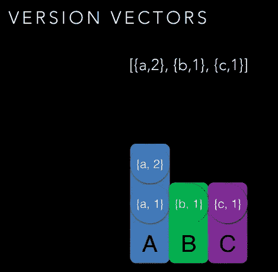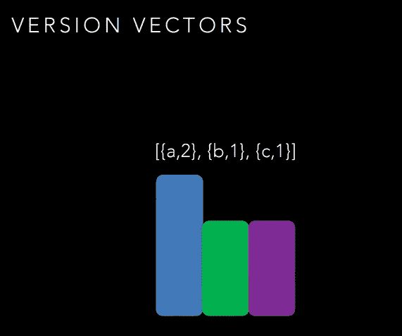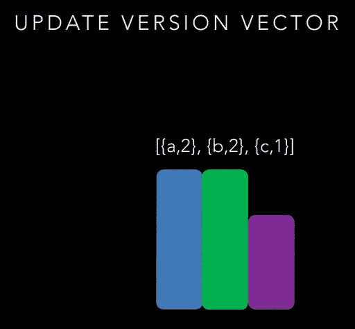

Figure 4: Left: We have a version vector where the initial vector is V1 = [{a, 1}, {b, 1}, {c, 1}], then ‘a’ gets incremented in the same process, hence the vector becomes: V2 = [{a, 2}, {b, 1}, {c, 1}]. As discussed, we don’t need to preserve {a, 1} part any more because V2 descends from V1, the centre figure shows this appropriately. In the right side, the version vector is updated where ‘b’ gets incremented — note that update operation works as same as vector clock. Courtesy: [A Brief History of Time in Riak](https://speakerdeck.com/seancribbs/a-brief-history-of-time-in-riak?slide=18)

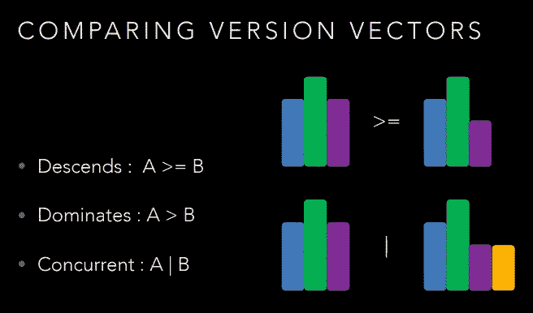

Figure 5: Version Vector comparison, Courtesy: [A Brief History of Time in Riak](https://speakerdeck.com/seancribbs/a-brief-history-of-time-in-riak?slide=24)

版本向量也遵循与向量时钟相同的比较原则。以下定义也适用于矢量时钟。

对于两个版本向量`A`和`B`，**进行逐元素比较**。

**下降版本向量:**对于两个版本向量`A`和`B`，如果`A`中的零个或多个元素与`B`中的**相同(等于)**，而至少有一个元素**严格大于`B`或不存在于`B`中，但`B`中的所有元素都存在于`A`中，则`B`发生在`A`之前，`A` **下降到** `B`**

示例:

```
If A = [2, 3, 4],    B = [1, 2, 4], then **A Descends B** since 
A[0] > B[0], A[1] > B[1], A[2] = B[2] and all elements in B exist in A.If A = [2, 3, 4, 5], B = [1, 2, 4] then **A Descends B** since 
A[0] > B[0], A[1] > B[1], A[2] = B[2], A[3] does not exist in B and all elements in B exist in A.
```

**支配版本向量:**对于两个版本向量`A`和`B`，如果**`A`中的所有元素**严格大于`B`中的或者`A`中的某些元素在`B`中不存在，而`B`中的所有元素在`A`中存在，那么`B`发生在`A`之前，`A`支配 `B`。

示例:

```
If A = [2, 3, 4],    B = [1, 1, 2], then **A Dominates B** since 
A[0] > B[0], A[1] > B[1], A[2] > B[2] and all elements in B exist in A.If A = [2, 3, 4, 5], B = [1, 2, 1] then **A Dominates B** since 
A[0] > B[0], A[1] > B[1], A[2] > B[2], A[3] does not exist in B and all the elements in B exist in A.
```

`**A Dominates B**` **是** `**A Descends B**` **的特殊用例。**

**并发版本向量:**我们已经看到了并发向量时钟的定义，这个和那个一样。

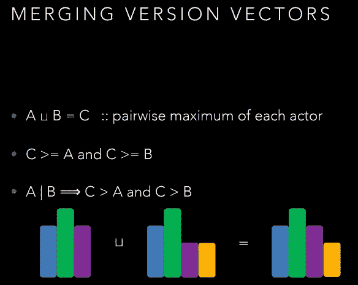

Figure 6: In merging, we take pairwise maximum of elements in the version vectors. In case, some elements are uncommon between two version vectors, they also become part of the union. Hence the union is always greater than or equal to the participating version vectors. In the figure, the yellow part is available only in B, however after union, it becomes part of the union C. Also if two version vectors are concurrent, their union is greater than individual version vectors. Vector clock merging process is same as version vector. Courtesy: [A Brief History of Time in Riak](https://speakerdeck.com/seancribbs/a-brief-history-of-time-in-riak?slide=25)

***注:*** *在我们进一步的讨论中，我们大多谈论版本向量，然而，操作或多或少与向量时钟相同。*

# 在版本向量中选择参与者 id

我们现在知道一个向量时钟本质上代表了一个
`**[actor_id, counter]**`对的列表。但是您应该在哪里生成 id 呢？是在客户端还是服务器端完成的？这是一个很重要的问题，要用**取舍**来分析。

Riak 在版本向量的不同变化中有着很好的发展历史。让我们看看它是如何为他们工作的，即使我们前面的大量讨论是受 Riak 的启发，学习，采取的不同方法和它们的权衡也适用于其他现实生活中的系统。

任何 KV 存储系统都有两个主要功能:`PUT`创建、更新甚至删除键-值对，以及`GET`获取它们。为了跟踪客户端的更新，KV stores 将每个键与向量时钟或版本向量或类似的东西相关联。正如我们已经看到的，**一个键的每个副本可以跨节点具有不同版本的值对象，并且上述 API 本质上是无状态的，这意味着客户端可以在任何时刻与任何节点对话**，因此应该有某种方法来导出客户端修改了哪个版本的数据。这种相关性被称为**因果上下文**，它必须包含在每个 API 调用中客户端和服务器之间的请求和响应中。

**因果上下文:**这是一个**不可变的**元数据，它以非人类可读的编码字符串格式携带相关键的版本信息。版本可以被表示为向量时钟或版本向量，或者以某种其他合适的形式。因果关系看起来是这样的:

```
a85hYGBgzGDKBVIcR4M2cgczH7HPYEpkzGNlsP/VfYYvCwA=
```

在发出`PUT`请求时，客户机必须提供它在请求头中看到的最新上下文。当 KV store 收到请求时，它从客户端上下文中提取版本信息，然后**将该版本与当前存储在存储器中的版本进行比较**。这种比较有助于辨别商店客户提供的数据是否是较新的、与现有数据不相关的或并发的。

## 客户端 Id

在`0.X`版本中(基本上是最初的 Riak 版本)，Riak 使用客户端 id 作为参与者 id。在这种情况下，每个客户端**唯一地**为自己选择一个 id。

*   **获取 API:** 当客户端获取数据时，Riak 会在名为
    `**X-Riak-Vclock**`的响应头中传递编码在上下文中的相关版本信息。

```
curl -i [http://localhost:8098/raw/plans/dinner](http://localhost:8098/raw/plans/dinner)
HTTP/1.1 200 OK
**X-Riak-Vclock: a85hYGBgzGDKBVIsrLnh3BlMiYx5rAzLJpw7wpcFAA==**
Content-Type: text/plain
Content-Length: 9**Wednesday**
```

*   **Put API:** `PUT`用于插入和更新数据。让我们看看这两个用例。

**插入请求:**客户端使用`PUT` API 插入新数据，并通过一个名为`**X-Riak-ClientId**`的头传递它的唯一 id。客户端不需要在这里传递任何上下文信息，因为数据对系统来说是新的。

```
curl -X PUT -H "**X-Riak-ClientId: Alice**" -H "content-type: text/plain"
http://localhost:8098/raw/plans/dinner --data "**Wednesday**"
```

在上面的请求中，一个客户端发送一些数据`“Wednesday”`并在报头中传递它的客户端 id `“Alice”`来标识它自己。Riak 识别客户端，并相应地为数据创建向量时钟。

**更新请求:** Riak，事实上所有的数据存储 API 大多是无状态的，客户端可以与任何节点对话。因此，如果客户端想要修改数据，它必须**传回它在最近的** `**GET**` **API 调用中获得的上下文信息以及它自己唯一的客户端 id** ，这样 Riak 就可以根据提供的信息在内部计算版本。

```
curl -X PUT -H "**X-Riak-ClientId: Ben**" -H "content-type: text/plain"
-H "**X-Riak-Vclock: a85hYGBgzGDKBVIsrLnh3BlMiYx5rAzLJpw7wpcFAA==**"
http://localhost:8098/raw/plans/dinner --data "**Tuesday**"
```

这里，另一个客户端 Ben 希望用新值`**Tuesday**`修改数据，在之前的 GET 调用中收到的向量时钟是:`a85hYGBgzGDKBVIsrLnh3BlMiYx5rAzLJpw7wpcFAA==`，所以 Ben 在`**X-Riak-Vclock**` 请求头中传递这个向量时钟，同时在
`**X-Riak-ClientId**` 请求头**中传递它自己的 actor id。**利用这些报头，Riak 识别哪个版本的数据已经被 Ben 修改，并且它**在内部创建另一个版本(向量时钟),该版本从反映 Ben 的更新的传递的向量时钟**下降。

现在，如果另一个客户机为相同的数据调用 GET API，新的向量时钟将由 Riak 传输。

## 说明

Riak 在其博客中很好地解释了这个概念。让我们用同样的例子。

本例中有四个演员:A = >爱丽丝，B = >鲍勃，C = >凯茜，D = >戴夫，他们计划在长时间后会面，在本例中，他们互相建议合适的时间。所有参与者都通过上面讨论的 API 与系统通信。

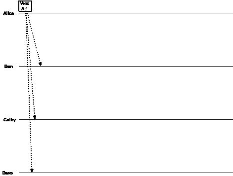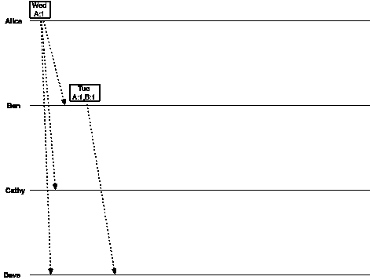

Figure 7

Alice 通过建议`“Wednesday”`开始这个过程，因此数据的版本是:`[{A, 1}]`。该消息也被发送给其他参与者。

本收到爱丽丝的信息，建议`“Tuesday”`，将信息发送给其他演员。由于 Ben 覆盖了 Alice 的消息，数据的新版本是`[{A, 1}, {B, 1}]`。请注意，只有戴夫收到了本的消息，不知何故，凯茜没有收到消息。

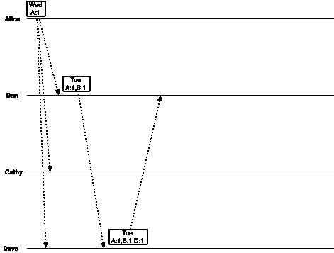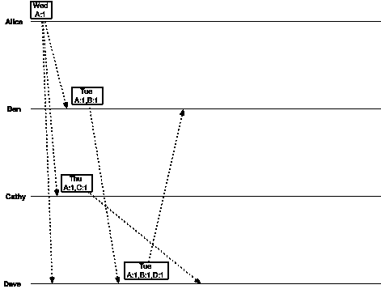

Figure 8

收到 Ben 的消息后，Dave 确认了`“Tuesday”`以及新版本的数据:`[{A, 1}, {B, 1}, {D, 1}]`，这个版本是 Ben 版本的后代。

凯茜只看到了爱丽丝的信息，她的版本来自爱丽丝的版本。她建议`“Thursday”`并传递信息。

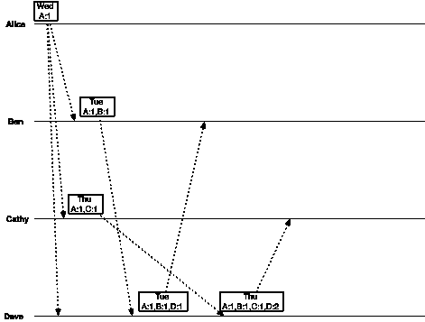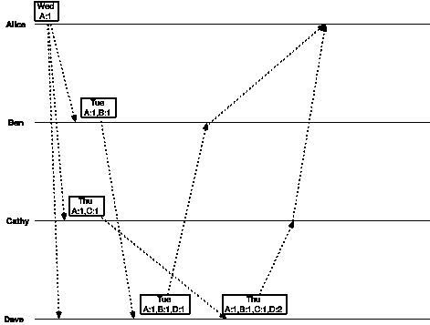

Figure 9

Dave 收到 Cathy 的消息，现在 Dave 有一个冲突(并发向量时钟，因为 Cathy 和 Ben 不知道彼此的版本):他早些时候从 Ben 收到了相同请求的消息，并存储了版本为`[{A, 1}, {B, 1}, {D, 1}]`的消息，现在他从 Cathy 收到了相同请求的另一个消息，所以 Dave 必须将新消息的版本设定为`[{A, 1}, {C, 1}, {D, 1}]`。但是戴夫是个聪明人，他发现了冲突，赛尔夫解决了冲突，在他的版本中容纳了本和凯西，并发回了最新的数据`“Thursday”`。于是戴夫发出的版本是:`[{A, 1}, {B, 1}, {C, 1}, {D, 2}]`。

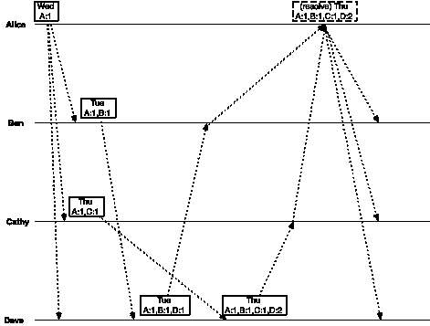

Figure 10

一段时间后，爱丽丝收到了所有其他演员发送的所有消息，因此爱丽丝可以决定最终的会面日期。由于 Dave 的最终版本`[{A, 1}, {B, 1}, {C, 1}, {D, 2}]`比所有其他版本都大，它支配着所有版本，因此最终会议日期被确定为`“Thursday”`。

**问:如果 Dave 没有收到版本为** `**[{A, 1}, {C, 1}]**` **的 Cathy 的消息怎么办？
A.** 这样 Dave 就不会有冲突，而是 Alice 在收到所有其他参与者的消息时必须解决冲突。

**问:Riak 如何处理向量时钟冲突？
A.** 如果两个不同的客户端最终修改了同一版本的数据，则会发生冲突，并且会创建两个向量时钟，这两个向量时钟从同一个父节点开始下降，但彼此是兄弟节点。Riak 通过`**X-Riak-Vclock**` 响应头以编码格式移交两个时钟，并期望客户端解决冲突。
如果 Riak 能够识别一个版本/时钟下降到另一个版本/时钟，那么旧的版本/时钟将被自动删除。

## 简而言之，带客户端 Id 的算法

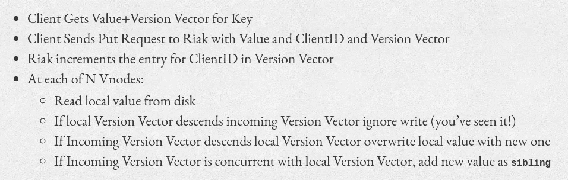

Figure 11

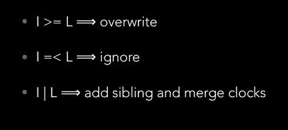

Figure 12: Client Id based easy to remember algorithm. I = Incoming Version Vector, L = vNode’s Local Version Vector

一个**兄弟**只不过是一个并发值，它存储在系统中用于以后的冲突解决，因为系统可能不擅长自动冲突解决。稍后再谈解决冲突。

**问:那么，根据上述算法，如何处理冲突写入呢？让我们考虑下面的例子来理解这个冲突:**

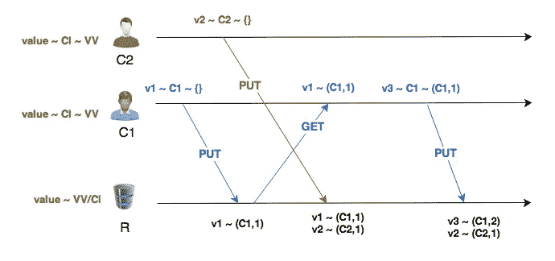

Figure 13, Courtesy: [https://github.com/ricardobcl](https://github.com/ricardobcl/Dotted-Version-Vectors)

有两个客户端`C1`和`C2`在与系统`R`(假设 Riak)对话，他们操作同一个键，但是这个键在上面的图中是不可见的，因为我们只关心客户端更新的值。

1.  `C1`首先将一个值`v1`放入系统`R`的空上下文`{}`的关键字中。
2.  r 没有与键相关联的条目，所以键的本地上下文也是空的`{}`。根据图 11 中算法的步骤 3，`R`首先递增传入版本向量中的客户端 id 计数器。
    `{C1, 1}`逻辑上是**从本地空版本**、`{}`下降的传入版本向量。因此，新值 v1 被存储在关键字中，并且`R`将其本地上下文更新为`{C1, 1}`。
3.  `C2`不知道`C1`的更新，它用空的上下文`{}`为同一个键赋予不同的值`v2`。
4.  `R`首先递增传入版本向量中`C2`的客户端 id 计数器，因此传入上下文在逻辑上是`{C2, 1}`。`R`的**本地上下文** `**{C1, 1}**` **既不从传入上下文** `**{C2, 1}**` **继承，传入上下文也不从本地上下文**继承。他们是**并发**。因此，根据图 11 中的算法，`v2`被添加为现有值`v1`的兄弟，`[“v1”, “v2”]`被存储在`R`中，并且本地上下文被更新为`{{C1, 1}, {C2, 1}}`。
5.  现在，`C1`想要放一个新值`v3`。`C1`在`R`的响应中获得了其在步骤 2 中第一次更新的确认，其上下文为`{C1, 1}`。因此，为了更新其先前的值，`C1`将相同的上下文连同新值一起传递回`R`。因此`C1`认为它正在将旧值`v1`更新为`v3`。
6.  `R`递增传入上下文中的客户端计数器，因此传入上下文变为`{C1, 2}`，**它不从本地上下文** `**{{C1, 1}, {C2, 1}}**` **中继承，本地上下文也不从传入上下文**中继承。然而，`R`识别出更新来自于`C1`，并且在合并时，它可以用新值`v3`替换`C1`的旧值`v1`。因此，兄弟值现在变成了`[“v2”, “v3”]`，并且系统的上下文被更新为`{{C1, 2}, {C2, 1}}`。

**客户端 id** 的优点:在步骤 6 中，即使`v3`被添加为兄弟，系统也能够识别出更新来自客户端`C1`，因此它能够替换先前由`C1`放置的旧值`v1`。**它们是因果相关的更新，并且由于版本向量**中客户端 id 的存在，识别是可能的。因此，`v3`不可能作为错误的并发值与`v1`共存。

**我们通过这种方法获得了什么:**

*   由于客户端 id 是适当的并发单元，这种方法**恰当地捕捉了版本向量之间的因果关系，即；捕获并发更新时没有问题**。

**使用这种方法我们会失去什么:**

*   **这种方法不能很好地扩展**。由于客户端是这里的参与者，**参与者爆炸**(假设您在一个数据中心有`100`个节点，每个节点在某个时间点为`10_000`个用户请求提供服务，因此该时刻的总请求是`1_000_000`，这是一个参与者爆炸，其中参与者是客户端或使用系统的应用程序，这可能会变得更糟)可能会导致向量时钟的宽度无限增长——如果许多参与者修改了相同的数据，则他们每个人都会在版本向量中有一个条目。**存储在每个复制品中的每个密钥也将具有与其相关联的版本向量**。它需要更多的空间来存储这样的信息，也需要更多的 CPU 周期来比较向量。
*   客户端应用程序管理 id，有错误的代码最终会为每个`PUT`调用生成新的 id，或者跨客户端生成重复的 id，这可能会导致数据丢失。因此，由客户端维护唯一 id 的不变式看起来非常危险。
*   客户端必须**读取其自己的写操作**。**矢量时钟算法的正确性取决于客户端从 Riak** 中获取的最新矢量时钟值。请看图 11 中的算法。客户端首先在`GET` API 调用中获取最新的向量时钟信息，然后在更新相关数据时将相同的时钟传递回 Riak。问题是 Riak 和许多其他基于关键价值的存储系统更喜欢最终的一致性以获得更好的可用性。因此，不能保证`GET` API 会根据请求到达的节点从 Riak 存储层获取最新的写入数据。在这种情况下，如果客户端获取旧的值，新的更新可能会丢失或成为冲突的更新。

## 服务器端(虚拟节点或虚拟节点)Id

导致更多时间和空间消耗的演员爆炸看起来是客户端 id 方法的最大缺点。

我们能做得更好吗？我们能以某种方式得到有限宽度的向量吗？

我们有什么选择？
**选项 1:** **客户端 id** 毫无疑问，由于 actor 爆炸，这不是一个可扩展的解决方案。
**选项 2:** **服务器 id:** 我们可以拥有地理上分布的数千台服务器，甚至数百台服务器位于同一个数据中心。这个选项比使用客户端 id 要好，但是，如果我们的系统允许在所有这些服务器上存储相同的数据，这个解决方案将不会扩展太多，因为添加更多的服务器可能会增加我们的向量时钟/版本向量大小。
**选项三:** **副本 id:** 副本只是服务器(换句话说，一堆复制的数据托管在一个服务器上)。一段数据(键值对)只存在于几个指定的副本中。因此，只能在这些复制品中修改数据，从而将版本向量中的条目大小限制为所配置的复制品的最大数量。在许多云计算系统中，默认的典型副本大小是`3`,然而通常副本的数量非常少。

因此，最好在我们的向量时钟中使用副本 id，因为它的大小是有限的。

**注意:**
——因为副本只是服务器，为了使事情通用，我们在进一步的讨论中称它们为服务器，但是记住我们只是指副本。
-许多键值存储系统使用称为**虚拟节点(vNode )** 的一致的节点散列环，这些节点在内部映射到物理服务器。一组 vNode 充当给定数据集的副本。取决于实现，也可以使用 vNode id 来代替副本 id。

Riak 在`1.X`版本中使用了 vNode 矢量时钟。让我们考虑一下我们刚刚看到的使用客户端 id 的完全相同的示例，但是这次使用服务器(副本)id。

有两个服务器`X`和`Y`。爱丽丝和戴夫连接到`X`，而本和凯茜连接到`Y`。为了简单起见，假设在`X`中有两个专用线程运行，分别为 Alice 和 Dave 服务，同样的情况也发生在服务器`Y`中，分别为 Ben 和 Cathy 服务。

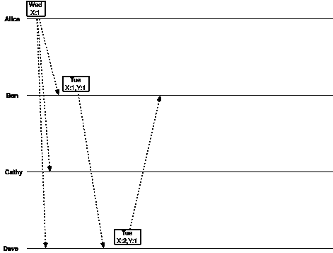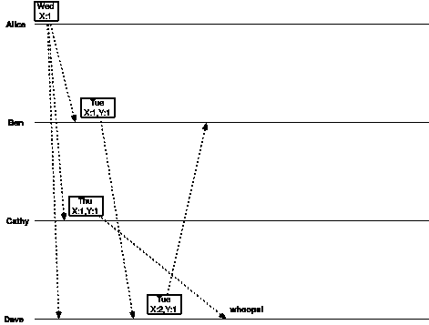

Figure 14

爱丽丝建议`“Wednesday”`，服务器`X`得到请求，因此版本是`[{X, 1}]`。消息在内部被复制到服务器`Y`。

本建议`“Tuesday”`，服务器`Y`得到请求，因为`Y`知道了爱丽丝的消息，新版本变成了`[{X, 1}, {Y, 1}]`。

戴夫现在意识到了本的信息，并建议“星期二”。戴夫的消息由`X`提供，因此新版本的数据是`[{X, 2}, {Y, 1}]`。

到目前为止一切都很好。

如果凯茜提出建议怎么办？

凯茜与本同时出现，当本正在建议合适的日期时，凯茜已经在服务器上看到了爱丽丝的信息。因此，凯茜对爱丽丝的信息进行处理，建议“星期四”使用版本`[{X, 1}, {Y, 1}]`。消息被复制到`X`，但是在复制过程中有一些延迟，Cathy 的消息在 Ben 的消息到达之后到达`X`。

当 Dave 收到 Cathy 的更新时，Dave 不对数据执行任何操作，因为 Cathy 的数据版本是`[{X, 1}, {Y, 1}]`，而 Dave 之前已经看到了来自 Ben 的相同请求的版本`[{X, 2}, {Y, 1}]`，该版本高于 Cathy 的版本。因此戴夫忽略了凯茜的更新，使得**更新无声无息地丢失了**。

让我们考虑下面的一个经典例子，其中多个客户端在同一个服务器中同时更新同一个密钥:

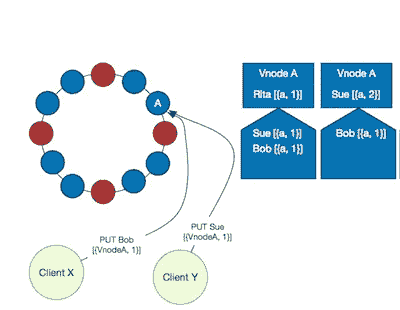

Figure 15, Courtesy: [Riak docs](https://riak.com/posts/technical/vector-clocks-revisited/index.html?p=9545.html)

*   有两个客户端`X`和`Y`正在与同一个虚拟节点`A`对话。两者都从`A`读取了版本为`[{a, 1}]`的相同数据“Rita”。
*   他们都打算更新数据，但是他们不知道他们是**并发**。
*   客户端`X`使用数据“Bob”发出`PUT`请求，并传递看到的最新版本向量:`[{a, 1}]`。
*   类似地，`Y`用数据“Sue”和最新版本向量`[{a, 1}]`发出另一个并发的`PUT`请求。
*   客户`Y`的请求首先由`A`处理。`A`观察到客户端的版本向量 ***下降到*** 与数据
    关联的 it 本地版本向量(传入和本地上下文相同)。因此，它将本地版本向量增加到`[{a, 2}]`，并接受写请求。
*   在服务客户端`X`的请求时，`A`观察到`X`的版本向量(传入版本向量)`[{a, 1}]` ***没有下传*** 其本地版本向量`[{a, 2}]`即:本地版本向量已经高于`X`所提供的。因此`A`忽略写请求，并且`X`的更新被**无声地丢失**。

问:没有一个系统会故意丢失数据，如何解决这个悄悄丢失更新的问题？
A. Riak 解决了这个问题，当**本地版本向量下降传入向量**时，添加新数据作为**兄弟(并发)**。这样，Riak 不会无声无息地丢失数据。通过存储兄弟，我们为**兄弟爆炸**创造了机会。这无非是制造**假并发**以后再修复数据。

**问:如果某个客户端在** `**PUT**` **请求中传递旧版本向量会发生什么？
一个**。使用上面的技巧，数据将作为现有数据的兄弟添加。

**问:如果一个系统不支持存储兄弟怎么办？
答:**如果任何系统不存储兄弟，在这种情况下，它会通过忽略新数据或序列化并发更新从而用新数据覆盖以前的数据来默默处理丢失的数据，这种策略称为 ***【最后写入赢(LWW)*** 。稍后详细介绍`LWW`。

## 具有服务器端 id 的算法

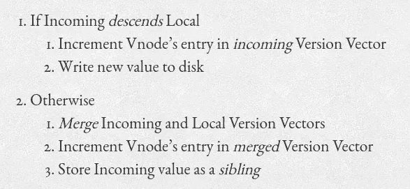

Figure 16, Courtesy: [Riak docs](https://riak.com/posts/technical/vector-clocks-revisited-part-2-dotted-version-vectors/index.html?p=9929.html)

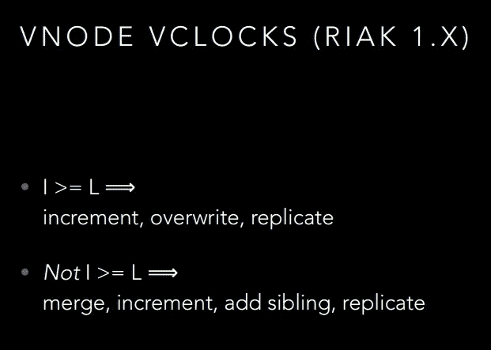

Figure 17: Server Id based easy to remember algorithm. I = Incoming Version Vector, L = vNode’s Local Version Vector, Courtesy: [A Brief History of Time in Riak](https://speakerdeck.com/seancribbs/a-brief-history-of-time-in-riak?slide=41)

让我们考虑与图 17 中相同的例子，以理解我们如何能够承受使用兄弟节点而不丢失数据:

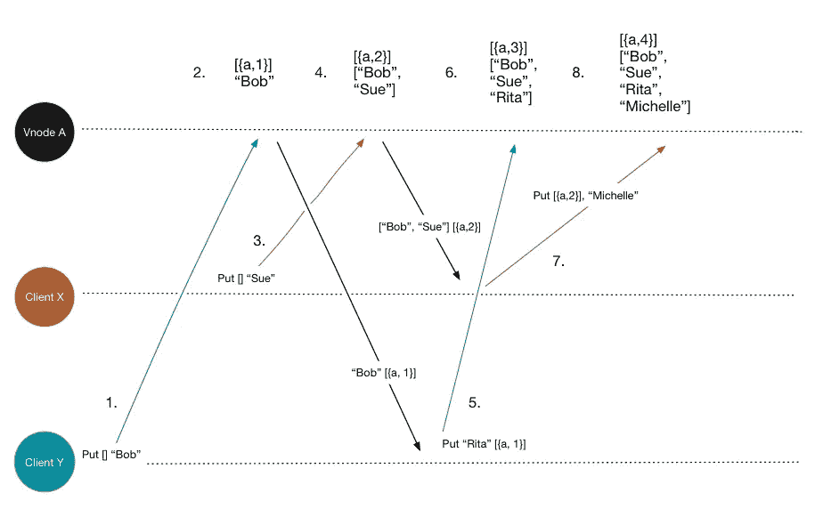

Figure 18, Courtesy: [Riak docs](https://riak.com/posts/technical/vector-clocks-revisited-part-2-dotted-version-vectors/index.html?p=9929.html)

客户端`X`和`Y`正在与一个 Riak vNode `A`对话，他们想要同时用一些值更新同一个密钥。

1.  客户端`Y`请求更新`“Bob”`的值。由于这是`Y`的第一个请求，它在`PUT` API 调用中传递了一个空上下文`[]`。
2.  系统还没有存储密钥，因此其本地上下文也是空的(`[]`)。根据图 18 中的算法，**传入上下文(** `**[]**` **)下降到本地上下文(** `**[]**` **)** ，因此对于传入请求，vNode `A`处的计数器递增，并且数据`[“Bob”]`与因果上下文(版本向量)`[{a, 1}]`一起存储。响应于`Y`，更新的数据`[“Bob”]`和上下文`[{a, 1}]`被传回。
3.  客户端`X`现在想要为同一个键放置`“Sue”`。`X`是否**不知道`Y`的更新**。`X`认为它是第一个放置键值对的客户端。因此，它将空上下文`[]`连同值`“Sue”`一起传递给系统。
4.  此时，系统知道它已经为同一个键存储了上下文`[{a, 1}]`。根据图 18 中的算法，系统识别出**传入请求上下文** `**[]**` **没有下降本地上下文** `**[{a, 1}]**`，因此它将传入请求视为**并发**。它将本地版本向量增加到`[{a, 2}]`，将传入值存储为现有值的**兄弟**。响应于`X`，新值`[“Bob”, “Sue”]`连同上下文`[{a, 2}]`被传回。
5.  客户端`Y`不知道`X`的更新，`Y`只知道它自己在步骤 1 中进行的更新。它现在想要将值更新为`“Rita”`。因此，从`Y`的角度来看，它将先前的值`“Bob”`更新为`“Rita”`。它将上下文`[{a, 1}]`和`PUT`请求中的新值一起传递给系统。
6.  系统知道在 vNode `A`发生的密钥的所有更新。它识别出**本地上下文** `**[{a, 2}]**` **没有下降传入上下文[{a，1}]，请求是并发的**。因此，它将本地版本向量增加到`[{a, 3}]`，将值`“Rita”`存储为兄弟，将上下文`[{a, 3}]`和新值
    `[“Bob”, “Sue”, “Rita”]`传递给 API 响应中的`Y`。
7.  循环继续，`X`想要将先前的值`“Sue”`更新为`“Michelle”`，它知道它在步骤 3 中进行的最后一次更新。因此`X`将上下文`[{a, 2}]`连同新值一起传递给系统。
8.  系统识别它是并发的，将本地版本向量增加到`[{a, 4}]`，将新值作为兄弟添加到现有值，作为响应将新上下文`[{a, 4}]`和更新值
    传递回`X`。

正如您所观察到的，在这种方法中，我们不会丢失并发数据，因为它们是作为兄弟存储的。然而，这里有一些问题。你能认出来吗？

**最差的基于服务器 id 的方法:**在步骤 1 中，当`Y`发出`PUT`请求时，系统存储`“Bob”`和上下文`[{a, 1}]`。在步骤 3 中，当`X`用`“Sue”`发出`PUT`请求时，系统假定它们是如上所述的**并发更新**，并且它**创建新的因果上下文** `[{a, 2}]`，将`“Sue”`添加为`“Bob”`的兄弟。此时，**系统完全忘记了** `**“Bob”**` **来自一个旧的因果上下文** `**[{a, 1}]**` **，当新的上下文** `**[{a, 2}]**` **被创建**时，没有元数据跟踪该信息。系统只能看到上下文`[{a, 2}]`保存值`[“Bob”, “Sue”]`。
在步骤 5 中，当客户端`Y`实际上想要**将先前的值** `“Bob”`(在步骤 1 中发送)更新为`“Rita”`时，系统未能识别`Y`的意图，它现在没有线索知道`“Bob”`先前存储在系统中，并且具有上下文`[{a, 1}]`，逻辑上正确的事情是将`“Bob”`更新为`“Rita”`。相反，它观察到当前上下文是`[{a, 2}]`，并将新值作为兄弟添加到`[“Bob”, “Sue”]`，从而使`“Bob”`和`“Rita”` **都为假并发更新**。

因此**这种方法不能恰当地跟踪更新之间的因果关系。**

**我们通过这种方法获得了什么:**

*   由于服务器(副本)数量有限，因此不会出现角色爆炸。因此，向量更小，这种方法**比基于客户端 id 的方法**伸缩性更好。
*   由于传递编码版本向量是可选的，因此客户端实现更简单，不再需要客户端强制读取您自己的写入。为了更好的行为和更少的冲突，最好仍然提供客户端已经看到的最新版本向量。

**使用这种方法我们会失去什么:**

*   正如我们刚刚看到的，如果兄弟节点没有被存储，有可能会丢失数据，因为**服务器或副本 id 充当多个客户端的代理，而不是真正的并发单元**。
*   如果存储了同级，可能会发生**同级爆炸**。在峰值规模下，**一个节点甚至可能爆发出**大量的兄弟节点。
*   增加同级可能会导致节点中的**性能问题**，因为必须读取、写入或协调大量同级以确保正确性。
*   这种方法使用**单一版本向量来表示合并的兄弟节点，**因此**不提供适当的因果关系跟踪**，也不支持精确冲突值的识别。

**问:使用客户端 id 会导致更大的向量，而使用服务器端 id 会导致同级爆炸——两者都会增加空间消耗。我们如何解决这个问题？**

## 向量时钟修剪

我们可以基于一些启发来修剪版本向量/向量时钟:
- **基于时间丢弃:**从现在开始修剪在某个阈值之前创建或修改的版本向量，例如:`150 ms`(只是一个例子)。如何决定这个阈值取决于规模，也可能取决于业务用例。
- **基于最大条目数丢弃:**当条目数在`20`到`50`之间时，开始剪枝版本向量。必须删除带有`size ≥ 50`的版本向量。

这些只是一些例子。

为了实现这些想法，我们需要在创建或修改版本向量时存储物理时间戳。**该时间戳不会用于矢量比较**，唯一的目的是删除比阈值矢量旧的矢量。

**修剪问题:**版本向量修剪可能是**不安全的**，因为您可能会删除合法的条目，这会在修剪前后对相同的数据产生不同的版本向量比较结果，因此可能会更改某个键的值，甚至丢失有效数据。你可能会以**假并发**告终。

是否有任何解决方案，其大小是有限的，因此可以很好地扩展，适当地跟踪因果关系而不会丢失数据，并且不需要激进的修剪？

## 点版本矢量(DVV)

Riak `2.X`版本使用更现代的版本向量，称为 DVV。

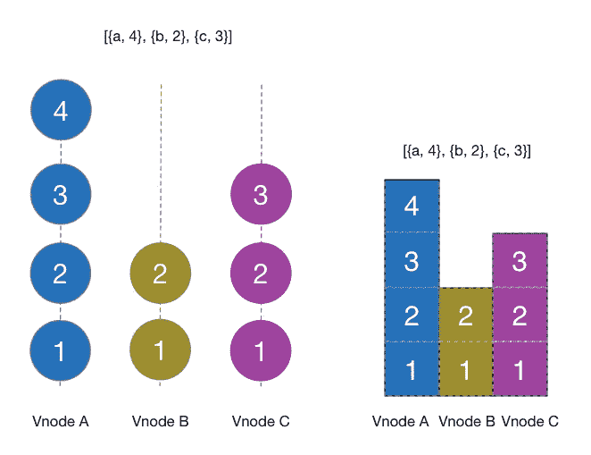

Figure 19, Courtesy: [Riak docs](https://riak.com/posts/technical/vector-clocks-revisited-part-2-dotted-version-vectors/index.html?p=9929.html)

考虑上图。它显示了与一些数据相关联的版本向量`[{a, 4}, {b, 2}, {c, 3}]`。表示数据上的 vNode A 执行了`4`事件，vNode B 执行了`2`事件，vNode C 执行了`3`事件。**版本向量无非是这些离散事件的集合**。对于基于 vNode 或服务器 id 的版本向量，上下文表示兄弟的完整集合。Like `[{a, 4}, {b, 2}, {c, 3}]`可以映射到一组 sibling like
`[“Bob”, “Sue”, “Rita”]`，但是，我们不知道任何 sibling 的原始版本，即；观察这个上下文，我们不知道`“Bob”`是源于`{a, 1}`还是`{c, 3}`等等。这就是兄弟姐妹名单不断增长的原因。

但是，如果我们不存储一组兄弟，而是将上下文和他们一起存储，会怎么样呢？我的意思是，如果我们将`**(id, counter)**`映射与类似于:`{a, 1} => “Bob”`或`{b, 4} => “Sue”`等的兄弟元素一起存储，那么下次当一个请求到达并且在头中带有因果上下文`{a, 1}`时，我们可以很容易地识别出请求想要更新`“Bob”`并采取适当的行动。像`{a, 3}`一样的这个`**(id, counter)**`对表示当 a 的计数器是`3`时发生的事件，它不与任何其他先前的计数器相关联，像`{a, 1}`或`{a, 2}`。这一对`**(id, counter)**`被称为**点**，它代表在那个确切的时刻发生的事件。

因此，**我们不仅存储一个键的整体版本向量，还存储最近的兄弟以及适当的上下文**。

当我们收到请求时，我们可以将传入版本向量的每个条目与这些点中的每一个进行比较，以确定传入版本向量是否在这些点的下方，如果是，则客户端已经知道了较早的事件，并且我们可以更新/替换旧事件。这样，我们就不需要存储不必要的错误并发兄弟。

考虑与下面的图 18 相同的例子，但是这次是 DVV:

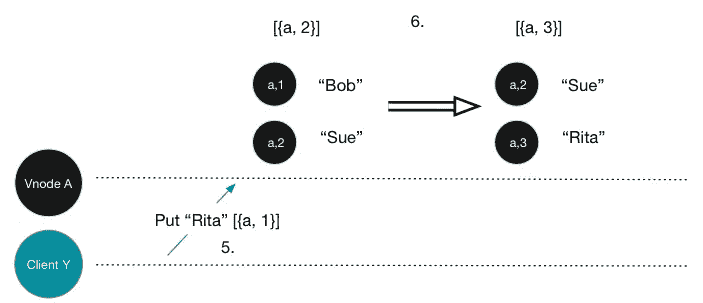

Figure 20, Courtesy: [Riak docs](https://riak.com/posts/technical/vector-clocks-revisited-part-2-dotted-version-vectors/index.html?p=9929.html)

*   当客户端`Y`更新`“Bob”`时，在 DVV，我们存储点和值，例如；`[{a, 1}] => “Bob”`(这种符号不一定意味着映射，只是为了更好地理解)这样我们就可以跟踪数据的源版本。
*   类似地，当客户端`X`更新`“Sue”`时，我们存储点`[{a, 2}] => “Sue”`。客户端`Y`并不打算更新`X`的更新，因为无论如何请求是带着空上下文`[]`进来的，因此**它们是有效的并发更新(兄弟)**。
*   在图 18 中，在步骤 5 中，当`Y`发送带有上下文
    `[{a, 1}]`和值`“Rita”`的更新请求以更新其先前值`“Bob”`时，系统无法理解`Y`的意图，最终将`“Rita”`存储为`[“Bob”, “Sue”]`的假兄弟。但是，这一次，我们知道系统已经用`“Bob”`存储了一个点`[{a, 1}]`。因此，当系统接收到`Y`的请求，读取传入上下文时，它观察到传入上下文`[{a, 1}]`下降了用`“Bob”`保存的点。因此它去掉了旧的点`[{a, 1}]`，用`“Rita”`代替了`“Bob”`。当前点`[{a, 3}] => “Rita”`也被存储。在保存`“Rita”`时，`“Sue”`不会受到影响，因为它与另一个点相关联，并且仍然是合法的兄弟。
*   同样，其他更新也在继续。

## 简而言之，DVV 算法


Figure 21, Courtesy: [A Brief History of Time in Riak](https://speakerdeck.com/seancribbs/a-brief-history-of-time-in-riak?slide=55)

## 与 DVV 的复制品合并

**当两个副本对于同一个键有不同的值时，如何解决冲突？**

在这种情况下，两个副本都存储了自己的点。在解决冲突时，我们可以取点的成对最大值，如果任何点只存在于一个副本中，则当前没有该点的副本可以存储该点。

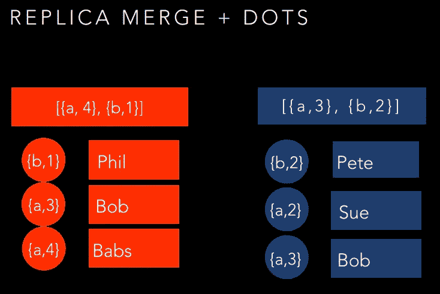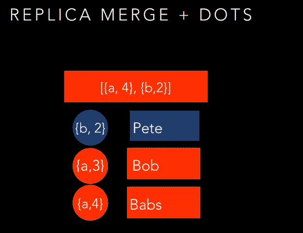

Figure 22, Courtesy: [A Brief History of Time in Riak](https://speakerdeck.com/seancribbs/a-brief-history-of-time-in-riak?slide=56)

在上面的例子中，我们试图合并来自两个不同副本的两个上下文:`[{a, 4}, {b, 1}]`和 `[{a, 4}, {b, 2}]`。在成对点比较中，我们观察到:

*   `{a, 4}`低于`{a, 3}`，因此`“Babs”`优先于`“Bob”`。
*   `{a, 3}`下降`{a, 2}`，因此`“Bob”`优先于`“Sue”`。
*   类似地`{b, 2}`下降`{b, 1}`，因此`“Pete”`优先于`“Phil”`。

因此最终的上下文变成了带点的`[{a, 4}, {b, 2}]`:`{a, 4}, {a, 3}, {b, 2}`。

以上只是一个简单的例子，当开发一个真正的系统时，可能会遇到更多的边缘情况，变得更加困难。

**DVV 的优势**

*   DVV 有助于识别版本之间的有效冲突。最大的收获是**没有同胞爆炸，具有适当的因果关系跟踪**，这有助于在高峰时段快速解决冲突。
*   可以有效地检索最新和最准确的数据。因此，它改善了客户体验，并可能提供更好的用户体验。
*   不需要修剪，因为在某一点点的最大数量**受到系统中配置的复制节点**的最大数量的限制。

**DVV 的缺点**

*   在复制过程中，当节点在本地执行更新、存储点然后复制到其他副本时，由于点也需要被复制，所以整体数据传输大小可能会很高。

## DVV 集

还有一个点版本向量的实现，它更加节省空间，并且达到了相同的目标。现在，我们不打算在这里讨论这个解决方案，因为它更复杂。这里可以找到[。](https://github.com/ricardobcl/Dotted-Version-Vectors)

# 版本向量中的冲突解决技术

无论我们使用什么样的版本向量，大规模的冲突都是不可避免的。因此，这种系统为我们提供了冲突解决机制，可以在服务器端和客户端完成。

简单重述一下:无论一个键的冲突发生在单个节点中导致兄弟节点，还是发生在不同的节点上，**所有冲突的版本都保留在系统中，直到它们被解决**。

## 服务器端分辨率

**最后一次写入获胜(LWW)策略:**每个数据对象都可以与一个指示最后修改时间的时间戳相关联。如果系统被配置为支持`LWW`，根据时间戳，除了最近的更新之外，并发更新(兄弟)被删除。这可能导致丢弃任意数据，在副本之间产生**不一致和意外的行为**。在存在分区的情况下，如果两个客户端将父版本相同的同一数据的两个不同版本写入不同的副本，系统将丢弃较旧的写入，即使它是创建数据竞争条件的有效竞争者。

**数据不准确**成为这种方法的一个大问题。因此，许多现实生活中的应用程序可能不会发现`LWW`策略有用。

简而言之， **LWW 对于不可变数据是一种不安全的策略，在这种情况下，客户端可以在从系统中读取数据后更新数据**。

**问:有什么合适的用例可以容忍** `**LWW**` **策略吗？**

**答:**有些用例非常适合`LWW`:

*   如果系统规模非常小，并且您不希望发生太多并发写入。
*   您的业务使用案例对从副本中删除不一致数据的影响没有问题。
*   如果您的数据是**不可变的**，那么无论如何都不允许您更新它，这意味着所有的写入都被存储为同一数据的不同版本。因此`LWW`在那里是一个安全的策略。

**Q .哼！任何事情都有好的一面。LWW 的优点是什么？
答:**最大的优点:`LWW`对客户来说是一个简单易懂的策略，因为他们不需要关心冲突解决或兄弟姐妹等问题。服务器会自动处理它。

**读取修复:**这是一种机制，在读取数据的时候**版本向量冲突解决开始生效**。协调读取请求的节点从包含数据的适当副本中获取可能不同版本的数据，然后识别冲突，尝试合并版本向量。如果有冲突的版本，它们被呈现给客户端。

由于读取修复只针对当前正在读取的数据，因此它是一个 **CPU 友好的进程**，但是，它只能修复那些被客户端读取的数据。任何长时间未被读取的数据不受影响并且**冷却**。

**主动修复/主动反熵(AAE):** 这也是一种读取修复机制，但它不是只在读取时才开始动作，而是在后台持续运行，并尝试解决所有副本之间的冲突。**比较适合冷数据**。

## 客户端解析

**回调机制:**通常，依赖逻辑时间的系统将冲突解决的自由给予客户端应用程序，因为有时系统很难决定最近的值，并且根据`LWW`或一些其他自动策略进行解决可能会导致错误的结果。

这些系统提供了可以实现回调的客户端库。应用程序可以在这些回调中提供它们自己的**用例特定的冲突解决策略，以便当更新的数据被发送到系统时，适当的版本信息也被一起发送。**

## 最小化冲突和兄弟姐妹

当客户端在`PUT`请求中提供一个**陈旧的**因果上下文时，系统会感到困惑，并将该数据存储为兄弟数据。为了缓解这些问题，一种方法是在一个`read-modify-write`周期中更新数据。

*   为密钥调用`GET` API。客户端接收相关联的最新值和版本向量。
*   在本地修改该值。
*   调用`PUT` API 更新密钥，并将最新版本向量作为上下文传回。

上述步骤确保客户已经尽最大努力减少冲突和可能的兄弟姐妹。

## Amazon Dynamo 论文如何描述矢量时钟的使用

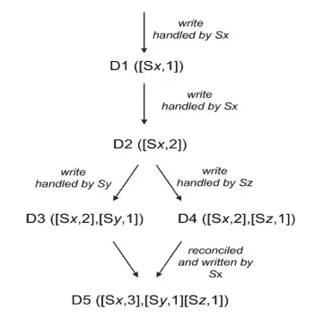

Figure 23: Amazon Dynamo vector clock usage, Courtesy: [Dynamo paper](https://www.allthingsdistributed.com/files/amazon-dynamo-sosp2007.pdf)

[迪纳摩论文](https://www.allthingsdistributed.com/files/amazon-dynamo-sosp2007.pdf)描述了使用带有服务器端 id 的矢量时钟的版本管理，这容易受到前面已经提到的问题的影响。论文挺老了，不清楚 AWS 迪纳摩 DB 现在用的是矢量时钟还是别的。

让我们分析图 23，以便更好地理解这个场景:

对于每一次交互(请求和响应),客户机和服务器之间共享一个上下文编码版本信息。

*   一个客户端将一些数据(一个键值对)写入 Dynamo 集群，其中一个节点 *Sx* 处理该请求。 *Sx* 增加计数器，版本(矢量时钟)变为 *D1* = `([*Sx*, 1])`。
*   该节点对数据执行另一次更新，并且同一节点 *Sx* 处理该请求。我们称之为，因此版本在节点处递增到 *D2* = `([*Sx*, 2])`。这里我们说 *D2* 从 *D1* 下降， *D1* 在 *Sx* 被覆盖。
*   客户端再次更新相同的数据，但是这一次，写请求由另一个节点 *Sy* 处理。 *Sy* 第一次看到数据，因此将计数器增加到`1`。因此在 *Sy* 的数据版本变成了 *D3* = `([*Sx*, 2], [*Sy*, 1])`。 *D3* 下降 *D2* 。
*   现在，另一个客户端从 Sx 读取 D2，更新数据，写请求由另一个名为 *Sz* 的节点处理。由于 *Sz* 也是第一次看到数据，它将其计数器增加到`1`。在 *Sz* 的数据版本变成 *D4* = `([*Sx*, 2], [*Sz*, 1])`。 *D4* 下降 *D2* 也下降。
*   注意，虽然 *Sy* 处的 *D3* 和 *Sz* 处的 *D4* 从*D2*Sx 处分支，但是 *D3* 和 *D4* 互不知晓，即: *Sy* 和 *Sz* 节点甚至不知道对于同一个键，它们保存的值可能是不同的。所以 *D3* 和 *D4* 彼此并不因果一致——它们只是不能彼此相关，因为它们的版本信息不匹配。这些事件本质上是同时发生的。
*   知道 *D1、D2* 和 *D3* 或 *D1* 、 *D2* 、 *D4* 的节点可以推导出 *D3* 或 *D4* 由 *D2* 派生出来的因果关系。因此 *D1* 和 *D2* 可以被清除或垃圾收集。
*   如果任何知道 *D3* 的节点从客户端接收到 *D4* ，该节点不能解决冲突，因为它识别出 *D3* 和 *D4* 是不相关的。所以客户端必须解决冲突并更新数据。类似地，如果客户端同时读取 *D3* 和 *D4* ，上下文将反映两个版本的存在，因此冲突必须由客户端解决，解决的数据必须写回到 Dynamo。假设这个写请求再次由 *Sx* 处理，因此 *Sx* 将它自己的计数器增加到`3`，并且一个新版本 *D5* = `([*Sx*, 3], [*Sy*, 1], [*Sz*, 1])`被创建。

## 好奇者:伏地魔中矢量时钟的实现

下面的实现摘自 [Voldemort](https://github.com/voldemort/voldemort/tree/master/src/java/voldemort/versioning) ，是一个开源的键值分布式存储系统，很像 Amazon Dynamo DB，以便更好地理解向量时钟。

伏地魔内部使用哈希映射在内存中存储向量时钟。伏地魔服务器接收客户端输入，如`put`或`get`请求，以及字节流形式的版本信息。因此，向量时钟有时在代码库中被编码到字节数组表示或从字节数组表示解码。

```
**Voldemort Vector Clock Encoding
===============================**Internal vector clock hash map stores **one on one mapping of *Node Id -> Version***. That hash map data is encoded in a byte array in the following format:--------------------------------------------------------------------
| 2 bytes | 1 byte | consecutive [node_id,version] pairs | 8 bytes |
--------------------------------------------------------------------
```

基本上，字节数组需要存储一些连续的`[node_id, version]`对。为了实现这一点，我们需要知道有多少这样的节点，我们如何表示版本信息。因此，我们需要在字节数组中存储一些额外的元数据。

第 3–21 行:这是一个单元测试，在一些场景中测试伏地魔矢量时钟的实现。我们不太需要关心这个测试，但是，看看第 10–11 行就知道这样的字节数组是什么样子了。

第 46 行: **numEntries** :第一个`2`字节代表给定向量时钟中有多少个条目。 **numEntries** 的最大值就是集群中的节点数。Java 的 **Short** 数据类型用于表示该字段，将集群中的最大节点数限制为 **Short。最大值**。

第 48 行: **versionSize** :下一个`1`字节，表示字节数组编码中表示版本信息所需的数据大小。伏地魔将版本号作为**长**类型数据(`8`字节)存储在内部哈希映射中。因此我们需要最大`8`字节的空间来表示一个版本。所需的最小空间是`1`字节。因此，变量 **versionSize** 的范围是从`1`到`8`，并且单个字节足以表示这样的信息。

第 50 行: **entrySize** :一个条目是一对节点 id 和版本号。我们需要`2`字节来表示节点 id，需要**版本大小的**字节数据来表示相关的版本。因此`entrySize = 2 + versionSize`字节。显然，**版本越小**，字节数组的内存占用就越有效。

第 51–52 行:
**numEntries * entry size:**所有条目的总大小。
字节数组中的最后`8`字节是为相关`get`或`put`操作发生时的时间戳保留的。
所以字节数组的总大小是:`2`字节存储 **numEntries** + `1`字节存储版本信息+ **numEntries * entrySize** 字节用于实际向量时钟对+ `8`字节用于时间戳。此外，还添加了一个额外的**偏移量**，因为字节数组可能会以客户端传递给服务器的额外数据信息为前缀，但我们现在可以忽略这一部分。

第 60–65 行:连续的条目被一个接一个地读取，并放入向量时钟散列图。
第 61 行:读取大小为`2`字节的节点 id。
第 62 行:将下一个**版本大小**的字节数读入到与上述节点 id 对应的`version`中。
第 63 行:将节点 id 和版本对放到向量时钟哈希映射中。

第 69–100 行:这个方法获取一些输入数据流，并将其转换为向量时钟的字节数组编码，然后将数据发送给向量时钟构造器，就像我们上面讨论的那样。

第 102–117 行:向量时钟合并发生在这里。合并意味着通过从两个给定的向量时钟中获取条目的联合来创建新的向量时钟。如果它们之间有一个共同的元素，则取最大值。如果一个条目存在于一个时钟中，但不存在于另一个时钟中，只需将其放入合并的向量时钟中。

以下是矢量时钟比较和冲突解决的代码:

上面的代码不言自明，并且也有很好的文档记录。正如我们之前已经讨论过的一些例子，向量时钟可以是另一个向量时钟的前身、后继或并行。伏地魔定义了一个名为`**Occurred**`的枚举，并将这些关系分别表示为`**Occurred.BEFORE**`、`**Occurred.AFTER**`和`**Occurred.CONCURRENT**`。

上述代码的要点是:

*   两个矢量时钟可以有零个或多个公共节点。如果一个矢量时钟比普通时钟有更多的节点，那么这个时钟就会发散，因为另一个时钟不包含这些额外的节点。上面代码片段中的第 44–61 行确定是否有时钟更大。请注意，两个向量时钟都可以有彼此不共用的额外节点，在这种情况下，时钟会彼此偏离。在这个场景中，向量时钟是**并发的**。
*   如果两个向量时钟具有完全相同的节点，则比较相应节点的版本，以确定是否有任何时钟**从另一个时钟**下降，或者两个时钟是不同的，从而**并发**。第 63–75 行完成了这项工作。
*   第 82–92 行比较了散度并确定了最终结果。第 82 行看起来像一个特例，我们可以忽略这一部分。

# 结论

我希望，通过本文中描述的所有详细方法和利弊，它将帮助我们更好地理解最终一致的系统背后发生的事情，如何管理数据版本，如何解决它们。**同样的技术可以用于分布式缓存和消息传递系统，也可以用于分布式文件存储系统。**我们还分析了伏地魔的矢量时钟的代码片段，这让我们了解了在真实系统中事情是如何实现的。

本文的所有学习对于设计真正的分布式、高可伸缩性和并发系统是至关重要的。希望你喜欢它，并且在你职业生涯的某个时候，你会有机会在这样的系统上工作。

请给予**多次掌声**并在 Twitter、LinkedIn 等社交媒体上与更广泛的受众分享，以帮助他们。

## 参考

1.  [http://people.cs.aau.dk/~bnielsen/DS-E08/material/clock.pdf](http://people.cs.aau.dk/~bnielsen/DS-E08/material/clock.pdf)
2.  [https://www . quora . com/How-can-you-explain-partial-order-and-total-order-in-simple-terms](https://www.quora.com/How-can-you-explain-partial-order-and-total-order-in-simple-terms)
3.  [https://8 thlight . com/blog/rylan-dirksen/2013/10/04/synchron ization-in-a-distributed-system . html](https://8thlight.com/blog/rylan-dirksen/2013/10/04/synchronization-in-a-distributed-system.html)
4.  [https://lamport.azurewebsites.net/pubs/time-clocks.pdf](https://lamport.azurewebsites.net/pubs/time-clocks.pdf)
5.  [https://level up . git connected . com/distributed-systems-physical-logical-and-vector-clocks-7ca 989 F5 f 780](https://levelup.gitconnected.com/distributed-systems-physical-logical-and-vector-clocks-7ca989f5f780)
6.  [https://haslab . WordPress . com/2011/07/08/version-vectors-are-not-vector-clocks/](https://haslab.wordpress.com/2011/07/08/version-vectors-are-not-vector-clocks/)
7.  [https://stack overflow . com/questions/58544442/what-the-use-cases for-a-vector-clock vs . a-version-vector](https://stackoverflow.com/questions/58544442/what-are-the-use-cases-for-a-vector-clock-versus-a-version-vector)
8.  版本向量相关图像:[https://speaker deck . com/seancribbs/a-brief-history-of-time-in-riak](https://speakerdeck.com/seancribbs/a-brief-history-of-time-in-riak)
9.  [https://riak.com/why-vector-clocks-are-easy/](https://riak.com/why-vector-clocks-are-easy/)
10.  [https://riak . com/posts/technical/why-vector-clocks-are-hard/](https://riak.com/posts/technical/why-vector-clocks-are-hard/)
11.  [https://riak . com/posts/technical/vector-clocks-revisited/index . html？p=9545.html](https://riak.com/posts/technical/vector-clocks-revisited/index.html?p=9545.html)
12.  [https://riak . com/posts/technical/vector-clocks-revisited-part-2-dotted-version-vectors/index . html？p=9929.html](https://riak.com/posts/technical/vector-clocks-revisited-part-2-dotted-version-vectors/index.html?p=9929.html)
13.  [https://GSD . di . umi nho . pt/members/vff/dotted-version-vectors-2012 . pdf](https://gsd.di.uminho.pt/members/vff/dotted-version-vectors-2012.pdf)
14.  [https://riak . com/products/riak-kv/dotted-version-vectors/index . html？p=10941.html](https://riak.com/products/riak-kv/dotted-version-vectors/index.html?p=10941.html)
15.  [https://docs . riak . com/riak/kv/2 . 2 . 3/learn/concepts/causal-context/index . html](https://docs.riak.com/riak/kv/2.2.3/learn/concepts/causal-context/index.html)
16.  【https://www.cs.rutgers.edu/~pxk/417/notes/clocks/index.html 
17.  [https://github . com/Voldemort/Voldemort/blob/master/src/Java/Voldemort/versioning/vector lock . Java](https://github.com/voldemort/voldemort/blob/master/src/java/voldemort/versioning/VectorClock.java)
18.  [https://www.youtube.com/watch?v=b_swtL5bxJg](https://www.youtube.com/watch?v=b_swtL5bxJg)
19.  [https://github . com/gha skins/riak _ wiki/blob/master/pages/Vector-clocks . MD](https://github.com/ghaskins/riak_wiki/blob/master/pages/Vector-Clocks.md)
20.  [http://www . CSE . chalmers . se/edu/year/2015/course/PFP/lecture-riak _ clocks . pdf](http://www.cse.chalmers.se/edu/year/2015/course/pfp/lecture-riak_clocks.pdf)
21.  [https://cs . stack exchange . com/questions/29947/how-are-lamport-clocks-implemented-in-real-world-distributed-systems](https://cs.stackexchange.com/questions/29947/how-are-lamport-clocks-implemented-in-real-world-distributed-systems)
22.  [http://guy Harrison . squarespace . com/blog/2015/10/12/vector-clocks . html](http://guyharrison.squarespace.com/blog/2015/10/12/vector-clocks.html)
23.  [http://book.mixu.net/distsys/time.html](http://book.mixu.net/distsys/time.html)
24.  [https://www . quora . com/Why-do-distributed-databases-as-Dynamo-and-Voldemort-choose-the-Vector-Clock-to-control-ordering-of-multi-version-records-What % E2 % 80% 99s-the-advantage-Why-not-choose-the-direct-timestamp-of-each-records](https://www.quora.com/Why-do-distributed-databases-such-as-Dynamo-and-Voldemort-choose-the-Vector-Clock-to-control-the-ordering-of-multi-version-records-What%E2%80%99s-the-advantage-Why-not-choose-the-direct-timestamp-of-each-record)
25.  [https://github.com/ricardobcl/Dotted-Version-Vectors](https://github.com/ricardobcl/Dotted-Version-Vectors)
26.  [https://GSD . di . umi nho . pt/members/vff/dotted-version-vectors-2012 . pdf](https://gsd.di.uminho.pt/members/vff/dotted-version-vectors-2012.pdf)
27.  https://aphyr.com/posts/285-call-me-maybe-riak
28.  [https://docs . riak . com/riak/kv/latest/learn/concepts/active-anti-entropy/index . html](https://docs.riak.com/riak/kv/latest/learn/concepts/active-anti-entropy/index.html)
29.  [http://www . bailis . org/blog/causality-is-this-and-what-to-do-about-it/](http://www.bailis.org/blog/causality-is-expensive-and-what-to-do-about-it/)