# 史上最佳 IPL XI

> 原文：<https://medium.com/geekculture/all-time-best-ipl-xi-8a3c8272a3e?source=collection_archive---------16----------------------->


Photo by [Yogendra Singh](https://unsplash.com/@yogendras31?utm_source=medium&utm_medium=referral) on [Unsplash](https://unsplash.com?utm_source=medium&utm_medium=referral)

印度超级联赛(IPL)是世界上最著名、参与人数最多的板球联赛之一。它是由印度(BCCI)板球管理委员会于 2007 年发起的，这个现金充裕的联盟的第一届比赛于 2008 年举行。在这个 T20 形式的联赛中，每支球队最多可以包括 4 名外籍球员。

在这篇文章中，我将尝试使用探索性数据分析挑选出 IPL 的 11 名最佳球员。我打算考虑到 2020 年的所有版本。我将使用的数据集可以在这里找到。

该队由 12 名队员(1 名替补队员)组成，包括:

1.  **4 名击球手**
2.  **1 名守门员击球手**
3.  **2 全才**
4.  **4 个投球手**
5.  **多一名球员(最好是多面手)**

导入所有需要的库并加载数据集。

```
**import** **pandas** **as** **pd**
**import** **numpy** **as** **np**

df = pd.read_csv('IPL Ball-by-Ball 2008-2020.csv')
df.columns
```

输出:

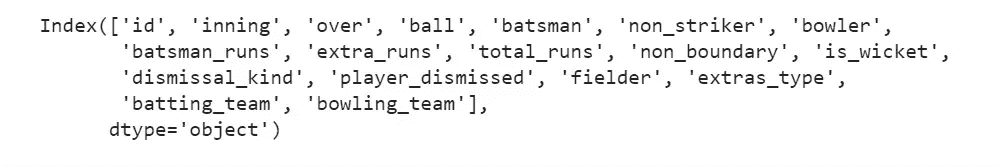

Image by author

# 击球手的选择:

击球手的选择将基于以下标准:

1.  击球率
2.  击球命中率
3.  第 16 名到第 20 名的击球率和好球率(死亡结束)

击球率和击球命中率通过以下公式计算:

*   **击球率=(总得分)/(出局数)**
*   **击球命中率=(总得分)/(击球总数)**

首先，计算每个击球手的总得分。

```
df_total_run = df.groupby('batsman').sum().sort_values(by='batsman_runs', ascending=False)['batsman_runs']
```

基于总得分的前 10 名击球手:

```
df_total_run.head(10)
```

输出:

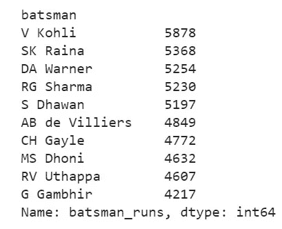

Image by author

然后计算每个击球手面对的球的总数。在此计算中，不考虑宽球。

```
df_total_ball_faced = df[df['extras_type']!='wides'].groupby('batsman').count().sort_values(by='batsman_runs', ascending=False)['batsman_runs']
```

接下来计算每个击球手出局的总次数。

```
total_out = df[df['is_wicket']==1].groupby('batsman').count().sort_values(by='is_wicket', ascending=False)['is_wicket']
```

创建一个名为 df_batsman 的数据帧，其中包括总跑垒数、击球总数和出局数列。

```
df_batsman = pd.concat([df_total_run,total_out], axis=1)
df_batsman['Total balls faced'] = df_total_ball_faced
df_batsman.rename(columns={'batsman_run':'Total Run', 'is_wicket':'Total No.OUT', 'Toatal balls faced':'Total balls faced' }, inplace=True)
```

现在计算每个击球手的平均击球率和击球命中率。

```
df_batsman['Batting Average'] = round(df_batsman['batsman_runs']/df_batsman['Total No.OUT'], 2)df_batsman['Batting Strike Rate'] = round((df_batsman['batsman_runs']/df_batsman['Total balls faced'])* 100 , 2)
```

我们将根据击球率和打击率为击球手创建一个积分系统。

> ***击球点数=(击球平均数。)x 0.8 +(击球命中率)x 0.2***

```
df_batsman['Batting Points'] = (df_batsman['Batting Average']*0.8)+(df_batsman['Batting Strike Rate']*0.2)df_batsman.head()
```

输出:

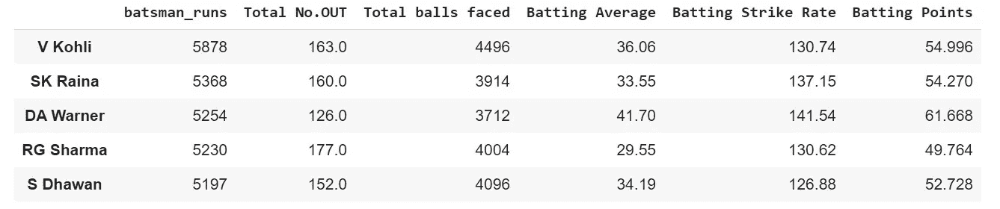

Image by author

我们将只考虑那些得分超过 1000 分的击球手。

```
df_batsman = df_batsman[df_batsman['batsman_runs']>1000]
```

击球率排名前十的击球手:

```
df_batsman.sort_values(by='Batting Average', ascending=False).head(10)['Batting Average']
```

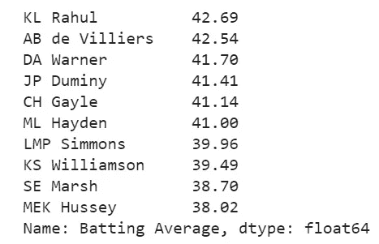

image by author

**击球命中率排名前十的击球手:**

```
df_batsman.sort_values(by='Batting Strike Rate', ascending=False).head(10)['Batting Strike Rate']
```

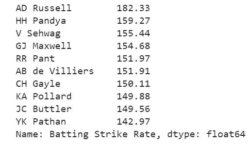

Image by author

**根据击球得分排名的前 10 名击球手:**

```
df_batsman.sort_values(by='Batting Points', ascending=False).head(10)['Batting Points']
```

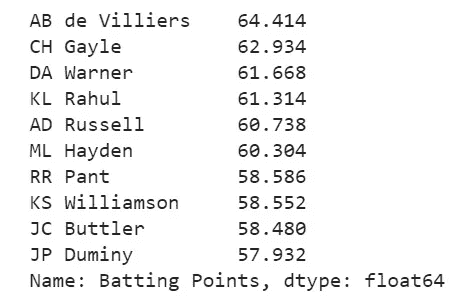

Image by author

我们将根据击球得分选出前 4 名击球手。4 名击球手是:

1.  AB de Villiers
2.  达华纳
3.  CH 盖尔
4.  KL Rahul

## 接下来计算击球手在第 16 到第 20 次击球时的击球率和击球率(死亡结束)。

```
df_death = df[df['over']>15]
```

就像上面的计算一样，我们将再次计算每个击球手在死亡回合中的平均击球率和命中率。再次计算击球手在死亡回合中的击球点数将根据先前的击球点数公式计算。

```
df_batsman_run_death = df_death.groupby('batsman').sum().sort_values(by='batsman_runs', ascending=False)['batsman_runs']df_balls_faced_death  = df_death[df_death['extras_type']!='wides'].groupby('batsman').count().sort_values(by='batsman_runs', ascending=False)['batsman_runs']df_number_of_out_death = df_death[df_death['is_wicket']==1].groupby('batsman').count().sort_values(by='is_wicket', ascending=False)['is_wicket']df_death_stat = pd.concat([df_batsman_run_death, df_number_of_out_death], axis=1)df_death_stat['Total balls faced'] = df_balls_faced_deathdf_death_stat['Average'] = round(df_death_stat['batsman_runs']/df_death_stat['is_wicket'], 2)df_death_stat['Strike Rate'] = round((df_death_stat['batsman_runs']/df_death_stat['Total balls faced'])*100, 2)df_death_stat['Points'] = (df_death_stat['Average']*0.8)+(df_death_stat['Strike Rate']*0.2)
```

这里只有那些在死亡回合中得分超过 500 分的击球手才会被计算在内。

```
df_death_stat = df_death_stat[df_death_stat['batsman_runs']>500]
```

根据击球点数排名的死亡回合前 10 名击球手:

```
df_death_stat.sort_values(by='Points', ascending=False).head(10)
```

输出:

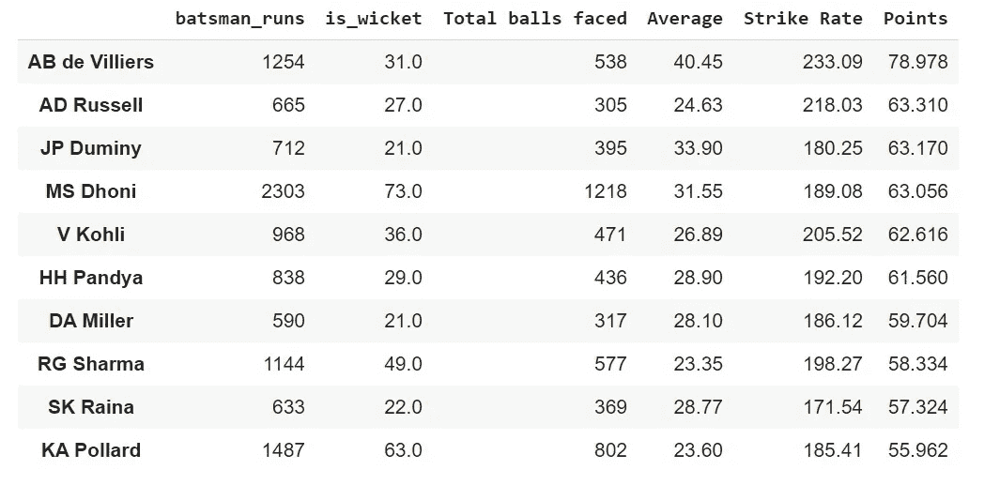

Image by author

Dhoni 女士将被选为守门员击球手，因为他在死亡线上有着惊人的记录。

# 保龄球手的选择:

投球手的选择将基于以下标准:

1.  投球手得分率
2.  保龄球经济
3.  死亡游戏中的保龄球平均和经济

*   **保龄球平均得分=(给定的得分次数)/(击球次数)**
*   **保龄球经济=(得分次数)/(投球次数)**

首先，计算每个玩家的三柱门数量。在这种情况下，以下解雇类型将不被计算在内:

1.  **用完**
2.  **退役受伤**
3.  **妨碍场地**

```
df1 = df.copy()df1 = df1[df1['dismissal_kind'].notnull()]df1 = df1[df1['dismissal_kind']!='run out']df1 = df1[df1['dismissal_kind']!='retired hurt']df1 = df1[df1['dismissal_kind']!='obstructing the field']df1_wickets = df1.groupby('bowler').count().sort_values(by='is_wicket', ascending=False)['is_wicket']
```

根据三柱门总数排名的前 10 名投球手:

```
df1_wickets.head(10)
```

输出:

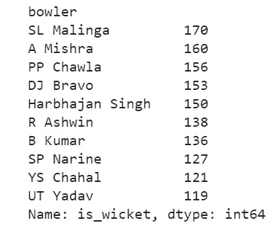

Image by author

接下来，计算每个投球手的总得分。此计算将不考虑以下额外类型:

1.  **是**
2.  **告别**

```
df2= df.copy()df2 = df2[df2['extras_type']!='byes']df2 = df2[df2['extras_type']!='legbyes']df2_total_runs_given = df2.groupby('bowler').sum().sort_values(by='total_runs', ascending=False)['total_runs']
```

然后，计算每个投球手投球的次数。在此计算中，将不考虑以下额外类型:

1.  **宽**
2.  **无球**

```
df3= df.copy()df3 = df3[df3['extras_type']!='wides']df3 = df3[df3['extras_type']!='noballs']df3_total_overs = (df3.groupby('bowler').count().sort_values(by='is_wicket', ascending=False)['non_boundary'])/6
```

创建一个名为 df_bowler 的数据框架，其中包括三柱门总数、总跑垒次数和投球总数。

```
df_bowler = pd.concat([df1_wickets, df2_total_runs_given, df3_total_overs], axis=1)df_bowler.rename(columns={'is_wicket':'No. of Wickets', 'total_runs':'Total runs given', 'non_boundary':'Total overs bowled'}, inplace=True)
```

然后我们会计算保龄球平均和保龄球经济。

```
df_bowler['Bowling Average'] = df_bowler['Total runs given']/df_bowler['No. of Wickets']df_bowler['Bowling Economy'] = df_bowler['Total runs given']/df_bowler['Total overs bowled']
```

保龄球员的积分系统将基于保龄球平均水平和保龄球经济性，如下所示:

> ***总积分=保龄球场均 x 0.2 +保龄球经济 x 0.8***

```
df_bowler['Points'] = (df_bowler.loc[:,'Bowling Average'])*0.2 + (df_bowler1.loc[:,'Bowling Economy'])*0.8
```

对于这种计算，我们将只考虑那些超过 70 个三柱门的投球手。

```
df_bowler1 = df_bowler[df_bowler['No. of Wickets']>70]
```

**保龄球平均成绩前 10 名:**

```
df_bowler1.sort_values(by='Bowling Average', ascending=True).head(10)['Bowling Average']
```

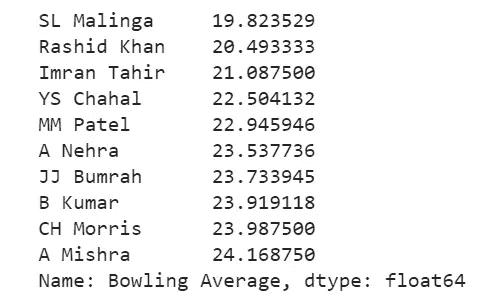

Image by author

**保龄球经济排名前十的保龄球手:**

```
df_bowler1.sort_values(by='Bowling Economy', ascending=True).head(10)['Bowling Economy']
```

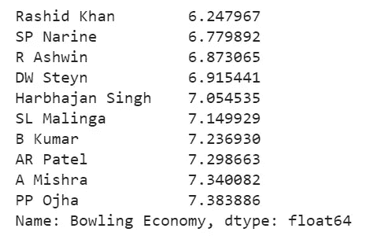

Image by author

**根据保龄球积分排名的前 10 名保龄球手:**

```
df_bowler1.sort_values(by='Points', ascending=True).head(10)['Points']
```

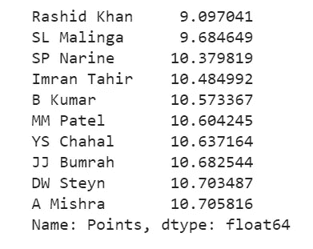

Image by author

## 当投球手在第 16 至 20 杆以上投球时(死亡结束)，保龄球平均水平和经济的计算。

*   死亡回合中三柱门数量的计算:

```
df4 = df_death.copy()df4 = df4[df4['dismissal_kind'].notnull()]df4 = df4[df4['dismissal_kind']!='run out']df4 = df4[df4['dismissal_kind']!='retired hurt']df4 = df4[df4['dismissal_kind']!='obstructing the field']df_wickets_death = df4.groupby('bowler').count().sort_values(by='is_wicket', ascending=False)['is_wicket']
```

*   死亡人数中给出的总运行次数的计算:

```
df5 = df_death.copy()df5 = df5[df5['extras_type']!='byes']df5 = df5[df5['extras_type']!='legbyes']df_total_runs_given_death = df5.groupby('bowler').sum().sort_values(by='total_runs', ascending=False)['total_runs']
```

*   死亡回合中投球总次数的计算:

```
df6 = df_death.copy()df6 = df6[df6['extras_type']!='wides']df6 = df6[df6['extras_type']!='noballs']df_total_overs_death = (df6.groupby('bowler').count().sort_values(by='is_wicket', ascending=False)['non_boundary'])/6
```

创建一个名为 df_bowler_death 的数据帧，该数据帧由三柱门的数量、给定的跑垒次数和让出的跑垒次数组成，列为:

```
df_bowler_death = pd.concat([df_wickets_death, df_total_runs_given_death, df_total_overs_death], axis=1)df_bowler_death.rename(columns={'is_wicket':'No. of Wickets', 'total_runs':'Total runs given', 'non_boundary':'Total overs bowled'}, inplace=True)
```

*   死亡回合中保龄球平均和经济的计算；

```
df_bowler_death['Bowling Average at death'] = df_bowler_death['Total runs given']/df_bowler_death['No. of Wickets']df_bowler_death['Bowling Economy at death'] = df_bowler_death['Total runs given']/df_bowler_death['Total overs bowled']
```

积分系统公式将与保龄球积分公式相同。

```
df_bowler_death['Points'] = (df_bowler_death.loc[:,'Bowling Average at death'])*0.2 + (df_bowler_death.loc[:,'Bowling Economy at death'])*0.8
```

只有那些在死亡回合中超过 50 次的投球手才会被考虑。

```
df_bowler_death = df_bowler_death[df_bowler_death['No. of Wickets']>50]
```

**死亡回合中投球手的最终数据框架:**

```
df_bowler_death.sort_values(by='Points', ascending=True).head()
```

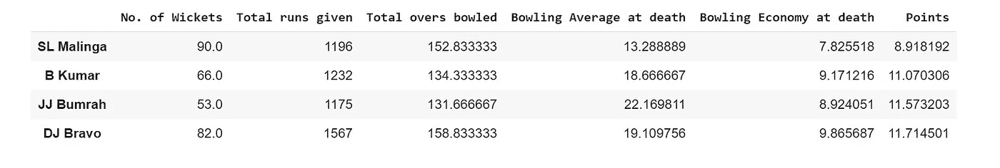

Image by author

因此，根据保龄球积分和死亡回合积分，将选择以下保龄球手:

1.  **拉什德·卡汉**
2.  **SL 马林加**
3.  **SP Narine**
4.  **B·库马尔(基于死亡回合的保龄球积分)**

# 全能型选择:

所有选手的选拔将基于以下基础:

1.  击球得分
2.  保龄球积分

通过连接击球手和投球手的数据帧来创建数据帧。

```
df_all_rounder = pd.concat([df_batsman, df_bowler], axis=1)df_all_rounder['Bowling Points'] = (df_all_rounder['Bowling Average'])*0.2 + (df_all_rounder['Bowling Economy'])*0.8
```

我们将只考虑那些得分超过 1000 分和超过 50 次击球的球员。

```
df_all_rounder = df_all_rounder[df_all_rounder['batsman_runs']>1000]df_all_rounder = df_all_rounder[df_all_rounder['No. of Wickets']>50]
```

基于击球点数的顶级全能选手:

```
df_all_rounder.sort_values(by='Batting Points', ascending=False)['Batting Points']
```

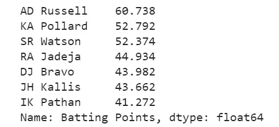

Image by author

基于保龄球积分的顶级全能选手:

```
df_all_rounder['Bowling Points'] = (df_all_rounder['Bowling Average'])*0.2 + (df_all_rounder['Bowling Economy'])*0.8
```

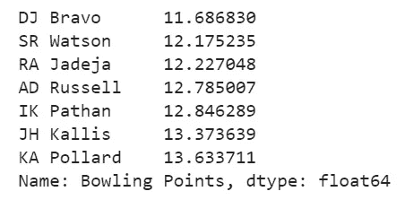

Image by author

所有圆场选手的积分系统公式如下:

> ***击球分——保龄球分***

```
df_all_rounder['Total'] = df_all_rounder['Batting Points']-df_all_rounder['Bowling Points']
```

根据总积分排名所有全能选手前几名:

```
df_all_rounder.sort_values(by='Total', ascending=False)['Total']
```

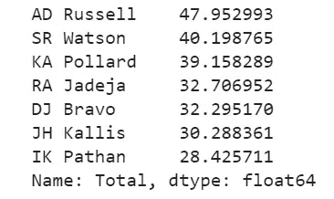

Image by author

因此，根据以下几点，将选出所有选手:

1.  **公元罗素**
2.  **高级沃森**

基于全能总点数的额外玩家将是:

**卡波拉德**

# 最终的团队如下:

1.  达华纳
2.  CH 盖尔
3.  KL Rahul
4.  老沃森
5.  AB de Villiers
6.  多尼女士(wk)
7.  广告罗素
8.  拉什德·卡汉
9.  SP Narine
10.  b·库马尔
11.  SL 马林加
12.  卡·波拉德(临时队员)

[我的 GitHub 链接到 Jupyter 笔记本](https://github.com/dhrubjun/All-time-best-IPL-team)

链接到数据集— [Kaggle](https://www.kaggle.com/patrickb1912/ipl-complete-dataset-20082020)