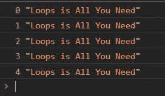
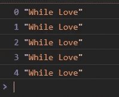
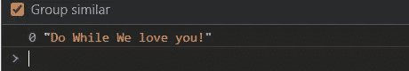
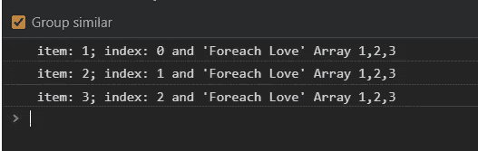
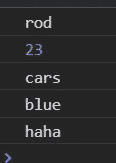
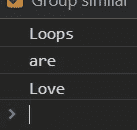
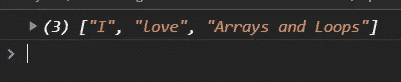
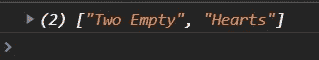
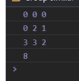

# 你所需要的是循环

> 原文：<https://medium.com/geekculture/all-you-need-is-loops-161dadb2816f?source=collection_archive---------2----------------------->


我使用一些循环，但是有许多 for 循环或迭代，在这篇文章中，我们将看到每个 For 循环或迭代以及他的例子来阐明一切。

# 首先什么是循环？

循环可以多次执行一个代码块。

# 为

是最广为人知的循环，我真的经常用到它，只需要变量，然后是极限，同样的变量也会增加。我们可以中断、继续或返回停止

```
for(let a = 0; a < 5; a++){
  console.log(a,'Loops is All You Need')
}
```



Example For Loop

# 在…期间

Do while 是另一个常见的循环，但只在条件满足时停止。我们可以中断、继续或返回停止

```
let v = 0
while( v > 5){
  console.log(v, 'While Love')
 v++
}
```

在这个例子中，条件没有完成，这就是为什么循环没有被执行，但是如果我们改变条件会发生什么

```
let v = 0
 while( v < 5){
  console.log(v, 'While Love')
 v++
}
```



While Example JavaScript

有用！！！

# 做什么

在 do while 中，工作方式与 while 相似，但它首先执行，然后检查条件。我们可以中断、继续或返回停止

```
let v = 0
 do{
  console.log(v, 'Do While We love you!')
  v++
}while( v > 10 )
```



Example Do while JavaScript

# 为每一个

Foreach 的工作方式与 For 循环完全相同，但不同的是，我们不能中断 continue 或 stop with return，我们可以使用 with arrow 函数或常规函数，它可以设置一些参数项、索引和数组

```
let arrayNumbers = ['1','2','3'];
    arrayNumbers.forEach( ( *item* , *index, arr* ) => {
  console.log(` item: ${*item*}; index: ${*index*} and 'Foreach Love' Array ${arr}`)
});
```



Example how ForEach Works

# 因为在

因为 in 对于对象非常有用我们可以迭代一个对象我们只需要属性和对象的名字

```
let object1 = {
name: 'rod',age: 23,hobby: 'cars',eyes: 'blue',humor: 'haha'}for( let property in object1 ){
  console.log(object1[property])
}
```



Example how For in loop Works

# 对于...来说

与 in 中的相似，但它有自己的技巧，比如我们可以使用 const，这没有问题，因为它在每次迭代中都创建了一个新的范围，我们也可以使用 entries()来获取索引，您将会看到

```
for( const values of loops){
  console.log(values)
}
```



Example For of

对于条目()，我们需要将索引和值放在括号中

```
for( const [ index, values ] of loops.entries() ){
   console.log(index ,values)
}
```


Example For of with entries()

迭代一个数组并返回一个新的

# 地图

map 迭代一个数组并构建一个新数组，可以使用两个参数 item 和 index

```
let loving = ['I', 'love', 'Arrays']console.log(loving.map( ( *item*, *index* ) => {return *item* === 'Arrays' ? *item* + ' and Loops' : *item* } ) )
```



Example map

# 过滤器

Filter 用我们想要的新过滤器构建一个新数组

```
let filterExample = ['', '', 'Two Empty', 'Hearts']console.log( filterExample.filter( *item*  => {if( *item* !== '' ){  return *item* } } ) )
```



# 减少

Reduce 对数组中的所有项执行回调并给出最终结果。你可以使用累加器、项和索引等参数

```
let exampleReduce = [0, 2 , 3]console.log(exampleReduce.reduce( ( *accumulator*, *item*, *index* ) => {console.log( *accumulator* , *item* , *index*)
return *accumulator* + *item* + *index* // index, 0 , 1 , 2
// Array, 0, 2, 3
// accumulator, 0 + 0 + 0 then 0 + 2 + 1 then 3 + 3 + 2}, 0) )
```



Example Reduce

# 结论

在某些情况下，我们需要循环，它们是创建动态代码的一部分，此外，它会帮助你进行一些用户交互，它们真的很有用，我真的经常使用它们，它们是我代码的一部分，请欣赏。

# 来源

[https://flaviocopes.com/page/javascript-handbook/](https://flaviocopes.com/page/javascript-handbook/)